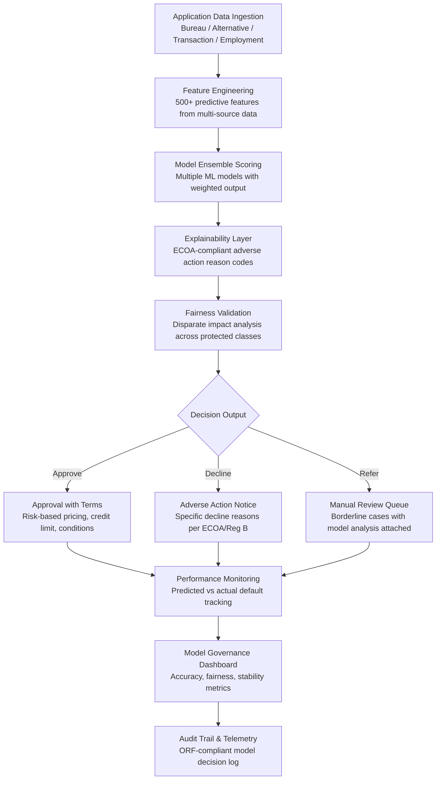

# Credit Risk Modeler

Frankmax

NAICS 522110-524298

> **Banks, Insurers, Financial Foundations** — Credit Risk Modeler

## Objective & Purpose

Credit decisioning is the core function of lending institutions, and the models that power it are simultaneously mission-critical and dangerously stale. Most banks rely on credit scoring models built 5-15 years ago using logistic regression on bureau data. These models were calibrated on pre-pandemic economic conditions, exclude the 45 million Americans who are credit-invisible (no bureau file) or credit-unscorable (thin file), and cannot incorporate alternative data sources that predict repayment behavior more accurately than traditional bureau attributes. The result is a dual failure: qualified borrowers are rejected (lost revenue and fair lending risk), while unqualified borrowers are approved (credit losses). US banks charged off $55B in consumer loans in 2023 alone, and the OCC estimates that 15-25% of these losses were predictable with better models.

The Credit Risk Modeler builds dynamic, multi-factor credit models that incorporate traditional bureau data alongside alternative data sources: bank account transaction patterns (cash flow regularity, expense management, savings behavior), utility and rent payment history, employment verification signals, education and professional credential data, and behavioral indicators from the application process itself. Machine learning models capture non-linear relationships and interaction effects that logistic regression misses: a borrower with a 650 FICO score but strong cash flow patterns and 5 years of on-time rent payments is a fundamentally different risk than a 650-score borrower with volatile income and recent utility delinquencies.

Critically, the system is built for regulatory compliance from the ground up. Every model produces explainable outputs: the specific factors that influenced the decision, compliant with ECOA adverse action notice requirements. Fairness testing runs continuously: disparate impact analysis across protected classes, with automatic bias detection and remediation recommendations. Model risk management documentation is generated automatically, meeting OCC 2011-12 (SR 11-7) requirements for model validation, ongoing monitoring, and governance. The result is credit models that are more accurate (20-35% improvement in default prediction), more inclusive (15-25% expansion of approvable population), and more compliant (pre-built regulatory documentation) than traditional approaches.

## Business Context

| Attribute | Value |
|---|---|
| **Business Process** | Credit decisioning |
| **Business Function** | Risk Management |
| **Category** | Finance |
| **Target Audience** | 9. Banks, Insurers, Financial Foundations |
| **Bundle** | Financial Services Compliance Pack ($8,500/mo) |
| **Monthly Cost of Inaction** | $50K-$1M (excess charge-offs, lost revenue from false declines, fair lending risk) |

## BPMN Workflow

## Features

1. **Multi-Source Data Integration** — Ingests and normalizes data from 15+ sources: traditional credit bureaus (Experian, TransUnion, Equifax), alternative credit data (PRISM, Clarity, LexisNexis), bank transaction data (Plaid, Finicity, MX), employment verification (Equifax Workforce Solutions, Argyle), rent payment history (RentTrack, PaymentReporting), and application-level behavioral data. Unified feature space enables models to find predictive signals across sources.

2. **Advanced ML Model Framework** — Supports gradient boosting machines (XGBoost, LightGBM), neural networks, and ensemble methods that capture non-linear relationships and interaction effects invisible to logistic regression. Model performance typically shows 20-35% improvement in KS statistic and Gini coefficient compared to traditional scorecard approaches.

3. **Built-In Explainability** — Every credit decision produces human-readable explanations compliant with ECOA and Regulation B adverse action notice requirements. Uses SHAP (SHapley Additive exPlanations) values to attribute the decision to specific input factors, generating reason codes that are both legally compliant and intuitively understandable to applicants and loan officers.

4. **Continuous Fairness Monitoring** — Tests every model and every decisioning cohort for disparate impact across protected classes: race, ethnicity, sex, age, national origin, and marital status. When statistical disparities exceed regulatory thresholds (typically 80% of the majority group rate), the system flags the issue and recommends model adjustments that reduce bias while maintaining predictive accuracy.

5. **Model Risk Management Automation** — Generates OCC 2011-12 (SR 11-7) compliant documentation automatically: model development documentation, validation reports, ongoing performance monitoring, and annual review materials. Reduces model risk management effort from 3-6 months of analyst time to days of review and sign-off.

6. **Champion-Challenger Framework** — Runs new model versions alongside production models in a controlled experiment: identical applicant population, split decisioning, with performance tracking. Enables data-driven model promotion when the challenger outperforms the champion, with full audit trail of the transition.

7. **Segment-Specific Models** — Builds specialized models for different lending products (mortgage, auto, personal, small business, credit card) and borrower segments (prime, near-prime, subprime, thin-file, new-to-country). Segment models capture product-specific risk factors that generic models miss.

8. **Economic Scenario Sensitivity** — Stress-tests credit models against macroeconomic scenarios: recession, interest rate shock, unemployment spike, housing market correction. Quantifies portfolio-level impact under each scenario for CCAR/DFAST regulatory stress testing.

## Workflow & Automation

**Step 1: Data Source Configuration** — Connect to credit bureau APIs, alternative data providers, core banking system, and loan origination platform. Configure data extraction, normalization, and feature generation pipelines. Validate data quality and coverage.

**Step 2: Historical Model Training** — Train models on historical loan performance data: application characteristics paired with subsequent repayment outcomes (performing, delinquent, charged-off). Apply proper temporal validation: train on older data, validate on newer data, ensuring the model is tested on "unseen" outcomes.

**Step 3: Explainability and Fairness Testing** — Generate SHAP-based explanations for all training decisions. Run disparate impact analysis across protected classes. Iterate on model architecture and feature selection to achieve the target balance between accuracy, explainability, and fairness.

**Step 4: Model Documentation and Validation** — Generate OCC 2011-12 compliant model documentation: development methodology, data dictionary, performance metrics, validation results, limitations, and ongoing monitoring plan. Independent model validation review confirms model fitness for deployment.

**Step 5: Production Deployment** — Deploy the validated model into the loan origination workflow. Every application receives a model score, risk-based pricing recommendation, and ECOA-compliant reason codes. Borderline applications route to manual review with full model analysis attached.

**Step 6: Performance Monitoring and Governance** — Track model performance in production: approval rate, default rate by score band, fairness metrics, and stability indices (PSI, CSI). Monthly model governance reports feed the model risk management committee. When performance degrades below thresholds, automatic alerts trigger model review.

## Input/Output Specifications

| Direction | Data | Format | Description |
|---|---|---|---|
| Input | Credit bureau data | XML / JSON (bureau APIs) | Traditional credit scores and attributes |
| Input | Alternative credit data | API (Plaid, Finicity) | Bank transactions, rent history, utility payments |
| Input | Application data | JSON (LOS integration) | Applicant demographics, income, employment, assets |
| Input | Economic indicators | API (FRED, BLS) | Unemployment, GDP, housing prices for scenario testing |
| Input | Historical loan performance | CSV / database | Origination and performance data for model training |
| Output | Credit decision | JSON (LOS integration) | Approve/decline/refer with score, terms, and reason codes |
| Output | Model governance report | PDF + JSON | OCC 2011-12 compliant documentation |
| Output | Fairness analysis | JSON + PDF | Disparate impact results across protected classes |
| Output | Audit trail | JSON (immutable log) | ORF-compliant decision log with full explainability |

## Integration Points

| System | Integration Type | Data Flow |
|---|---|---|
| **Loan Origination Optimizer** | Bidirectional | Risk scores feed origination; origination data feeds model training |
| **Fraud Detection Neural Network** | Inbound fraud signals | Fraud risk scores factor into credit decisioning |
| **AML/KYC Automation Platform** | Inbound identity verification | KYC results confirm applicant identity for credit decisions |
| **Regulatory Reporting Automator** | Outbound data | HMDA, CRA, and stress testing data feeds regulatory submissions |
| **Trade Surveillance Engine** | Cross-reference | Institutional credit exposure monitoring for capital markets |
| **Multi-Model AI Orchestrator** | Infrastructure | Model routing and compute allocation for scoring |
| **Audit Trail and Traceability Engine** | Outbound log stream | All credit decisions logged immutably |
| **Failure Intelligence Library** | Outbound anonymized patterns | Credit model failure patterns feed cross-industry intelligence |

## Pricing & Revenue Model

| Component | Pricing | Notes |
|---|---|---|
| **Financial Services Compliance Pack** | $8,500/month | Credit Risk Modeler + AML/KYC + Regulatory Reporting + 2M AI tokens |
| **Standalone -- Subscription** | $5,500/month | Single lending product, up to 50,000 decisions/month |
| **Multi-product tier** | $8,000/month | All lending products, up to 200,000 decisions/month |
| **Per-decision pricing** | $0.50-$2.00 per decision | Volume-based for high-throughput lenders |
| **Fairness monitoring add-on** | +$1,200/month | Continuous disparate impact testing and reporting |
| **AI token consumption** | Included at 80% discount | 2M tokens/month in bundle; overage at marketplace rates |

**Revenue model**: Credit Risk Modeler sells on improved decisioning -- 20-35% better default prediction reduces charge-offs while expanding the approvable population. A mid-size bank with $2B in consumer loans losing 2.5% to charge-offs ($50M) that reduces losses by 20% saves $10M annually. The "burger" is AI-powered credit modeling at a fraction of building an internal model development team ($500K-$1M/year). The "fries" attach naturally: fairness monitoring (regulatory requirement), model governance documentation (OCC requirement), and stress testing at 75-90% margin.

## NAICS/SIC Mapping

| NAICS Code | SIC Code | Industry | Relevance |
|---|---|---|---|
| 522110 | 6021 | Commercial Banking | Consumer and commercial credit decisioning |
| 522120 | 6022 | Savings Institutions | Mortgage and consumer lending risk |
| 522130 | 6061 | Credit Unions | Member lending credit risk assessment |
| 522210 | 6141 | Credit Card Issuing | Credit card underwriting and limit setting |
| 522291 | 6153 | Consumer Lending | Personal and installment loan risk modeling |
| 522292 | 6159 | Real Estate Credit | Mortgage credit risk and pricing |
| 522390 | 6199 | Other Activities Related to Credit | Fintech lending and marketplace lending |
