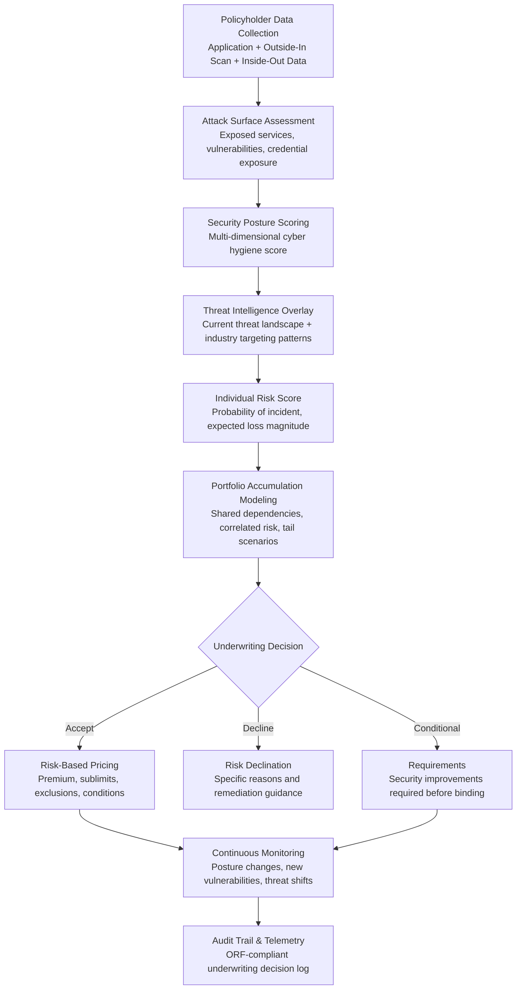

# Cyber Insurance Risk Modeler

Frankmax

NAICS 522110-524298

> **Banks, Insurers, Financial Foundations** — Cyber Insurance Risk Modeler

## Objective & Purpose

Cyber insurance is the fastest-growing and most poorly understood line of insurance. The global cyber insurance market reached $14B in premiums in 2023 and is projected to exceed $30B by 2028. Yet insurers are pricing policies with inadequate tools: loss data is sparse (the line is only 15-20 years old), attack methodologies evolve faster than actuarial models update, and accumulation risk (a single vulnerability in widely-used software can trigger thousands of claims simultaneously) is nearly impossible to model with traditional actuarial approaches. The result is painful: combined ratios in cyber insurance swung from 65% (highly profitable) in 2019 to 115% (significant losses) in 2021 as ransomware claims surged, then back to 80% in 2023 after massive rate corrections. This volatility indicates that the industry fundamentally does not understand the risk it is underwriting.

The Cyber Insurance Risk Modeler applies AI and cybersecurity intelligence to build dynamic, evidence-based cyber risk models at both the individual policyholder level and the portfolio level. At the policyholder level, the system assesses an insured's cybersecurity posture using outside-in scanning (exposed attack surface, known vulnerabilities, email security configuration, DNS health, dark web credential exposure), supplemented by inside-out data where available (security stack configuration, incident history, employee training metrics). At the portfolio level, the system models accumulation risk: which policyholders share the same cloud provider, the same software vendor, the same managed security service, and what is the portfolio-level loss if that shared dependency is compromised?

The model produces three critical outputs: individual risk scores for underwriting and pricing, portfolio-level accumulation exposure for reinsurance planning and capital management, and real-time risk monitoring that updates scores as the threat landscape evolves. When a new critical vulnerability is disclosed (like Log4Shell), the system immediately identifies which policyholders are likely affected and estimates the portfolio-level claims exposure -- within hours rather than the weeks it takes traditional approaches. Insurers using AI-powered cyber risk modeling report 30-40% improvements in loss ratio accuracy and 20-30% reductions in underwriting cycle time.

## Business Context

| Attribute | Value |
|---|---|
| **Business Process** | Cyber risk assessment |
| **Business Function** | Underwriting |
| **Category** | Risk |
| **Target Audience** | 9. Banks, Insurers, Financial Foundations |
| **Bundle** | Financial Services Compliance Pack ($8,500/mo) |
| **Monthly Cost of Inaction** | $50K-$500K (mispriced policies, accumulation losses, inadequate reserves) |

## BPMN Workflow

## Features

1. **Outside-In Attack Surface Scanning** — Non-intrusive scanning of policyholder's external cyber posture: open ports and services, known vulnerability exposure (CVE matching), SSL/TLS configuration, email security (SPF, DKIM, DMARC), DNS health, web application security headers, dark web credential exposure, and domain reputation. Scans run at application and continuously post-bind.

2. **Accumulation Risk Engine** — Maps technology dependencies across the entire portfolio: which policyholders use the same cloud provider (AWS, Azure, GCP), the same SaaS platforms (Microsoft 365, Salesforce), the same security vendors (CrowdStrike, SentinelOne), and the same managed service providers. Models portfolio-level loss under single-point-of-failure scenarios and correlated attack campaigns.

3. **Threat Intelligence Integration** — Ingests real-time threat intelligence feeds: active exploitation alerts (CISA KEV catalog), ransomware group targeting patterns (by industry, geography, company size), zero-day vulnerability disclosures, and emerging attack methodologies. Adjusts policyholder risk scores as the threat landscape evolves.

4. **Dynamic Risk Scoring** — Produces a multi-dimensional risk score per policyholder covering: likelihood of incident (based on posture and targeting), expected frequency (incidents per year), expected severity (loss magnitude distribution), and recommended policy terms (premium range, sublimits, exclusions, waiting periods). Scores update continuously rather than only at renewal.

5. **Loss Estimation Engine** — Models expected cyber loss distributions using historical claims data, industry benchmarks, and policyholder-specific factors: company size, industry, data types held (PII, PHI, financial), regulatory environment (GDPR jurisdictions carry higher notification costs), and business interruption profile. Produces expected loss, probable maximum loss (PML), and tail-risk scenarios.

6. **Underwriting Workbench** — Provides underwriters with a complete risk dashboard per submission: risk score breakdown, peer comparison (how this applicant compares to similar companies), red flags (specific security weaknesses), recommended terms, and historical claims data for similar risk profiles. Reduces underwriting cycle time from days to hours.

7. **Portfolio Stress Testing** — Runs scenario-based stress tests against the portfolio: "What if AWS experiences a 4-hour outage?", "What if a zero-day in Microsoft Exchange is exploited industry-wide?", "What if ransomware groups shift targeting to healthcare?" Quantifies portfolio-level loss under each scenario for capital planning and reinsurance strategy.

## Workflow & Automation

**Step 1: Submission Data Collection** — When a new cyber insurance application arrives, the system collects data from the application form, runs outside-in scanning on the applicant's domains and IP ranges, and queries threat intelligence sources for industry-specific risk context. Inside-out data is integrated where the applicant provides it (security questionnaire responses, SOC 2 reports, penetration test results).

**Step 2: Risk Score Generation** — The risk model processes all collected data to produce a multi-dimensional score. Each score component is transparent: the underwriter can see exactly which factors contributed to each dimension (e.g., "Email security score: 45/100 due to missing DMARC enforcement and SPF misconfiguration").

**Step 3: Portfolio Context Analysis** — The applicant's risk is evaluated in portfolio context: does accepting this risk increase accumulation exposure? Does the applicant share critical dependencies with existing policyholders? What is the marginal capital impact of adding this risk to the portfolio?

**Step 4: Underwriting Decision Support** — The underwriting workbench presents the complete risk picture with recommended terms: premium range, sublimits (ransomware, business interruption, data breach), exclusions (war, infrastructure failure), and conditions (MFA required, backup verification, incident response plan). Underwriters make the final decision with full data support.

**Step 5: Continuous Monitoring** — Post-bind, the system continuously monitors policyholders: attack surface changes, new vulnerability exposures, threat landscape shifts. When a policyholder's risk score deteriorates significantly, the system alerts the underwriting team for mid-term review or renewal action.

**Step 6: Claims Intelligence Feedback** — When claims occur, the system analyzes the pre-claim risk profile against the actual incident to refine the model. Which risk factors were predictive? Which were not? Claims data feeds model improvement and industry-level loss benchmarking.

## Input/Output Specifications

| Direction | Data | Format | Description |
|---|---|---|---|
| Input | Application data | JSON / PDF (extracted) | Company details, revenue, industry, security questionnaire |
| Input | Outside-in scan results | JSON (scanner APIs) | Attack surface, vulnerabilities, email security, credentials |
| Input | Threat intelligence | API (CISA, MITRE, commercial feeds) | Active threats, targeting patterns, vulnerability exploits |
| Input | Inside-out data | JSON / PDF (SOC 2, pen test) | Security stack, incident history, controls evidence |
| Input | Historical claims data | CSV / database | Prior cyber claims by industry, size, and incident type |
| Output | Risk scores | JSON + underwriting dashboard | Multi-dimensional scores with factor attribution |
| Output | Portfolio accumulation report | JSON + PDF | Shared dependency maps and concentration analysis |
| Output | Stress test results | JSON + interactive dashboard | Scenario-based portfolio loss modeling |
| Output | Audit trail | JSON (immutable log) | ORF-compliant underwriting decision log |

## Integration Points

| System | Integration Type | Data Flow |
|---|---|---|
| **Underwriting Intelligence Engine** | Bidirectional | Cyber risk scores feed underwriting; underwriting data feeds model training |
| **Reinsurance Optimization Engine** | Outbound accumulation data | Portfolio accumulation analysis feeds reinsurance cession strategy |
| **Actuarial Model Accelerator** | Outbound loss data | Cyber loss distributions feed actuarial reserving models |
| **Regulatory Reporting Automator** | Outbound data | Cyber risk portfolio data feeds regulatory capital submissions |
| **Claims Processing Accelerator** | Cross-reference | Claims data feeds model refinement; risk scores inform claims triage |
| **Multi-Model AI Orchestrator** | Infrastructure | AI model routing for scanning, scoring, and simulation |
| **Audit Trail and Traceability Engine** | Outbound log stream | All risk assessments logged immutably |
| **Failure Intelligence Library** | Outbound anonymized patterns | Cyber loss patterns feed cross-industry intelligence |

## Pricing & Revenue Model

| Component | Pricing | Notes |
|---|---|---|
| **Financial Services Compliance Pack** | $8,500/month | Cyber Risk Modeler + AML/KYC + Regulatory Reporting + 2M AI tokens |
| **Standalone -- Subscription** | $5,000/month | Up to 5,000 policyholders scored |
| **Enterprise tier (over 5K policies)** | $1.50 per policy/month | Volume pricing for large portfolios |
| **Portfolio accumulation module** | +$2,000/month | Full dependency mapping and stress testing |
| **Continuous monitoring** | +$1,200/month | Post-bind posture tracking and alert system |
| **AI token consumption** | Included at 80% discount | 2M tokens/month in bundle; overage at marketplace rates |

**Revenue model**: Cyber Insurance Risk Modeler sells on loss ratio improvement -- a 10-point improvement in combined ratio on a $100M cyber book saves $10M annually. The "burger" is AI-powered risk assessment at 50-70% of the cost of building an internal cyber risk team ($500K-$1M/year). The "fries" attach naturally: accumulation modeling (reinsurance treaty requirement), continuous monitoring (mid-term risk management), and regulatory capital at 75-90% margin.

## NAICS/SIC Mapping

| NAICS Code | SIC Code | Industry | Relevance |
|---|---|---|---|
| 524126 | 6321 | Direct Property and Casualty Insurance | Cyber liability underwriting |
| 524128 | 6399 | Other Direct Insurance | Specialty cyber insurance lines |
| 524130 | 6321 | Reinsurance Carriers | Cyber reinsurance portfolio modeling |
| 524210 | 6411 | Insurance Agencies and Brokerages | Cyber risk advisory for clients |
| 524298 | 6411 | All Other Insurance Activities | Cyber risk consulting and MGA operations |
| 522110 | 6021 | Commercial Banking | Bank-owned cyber risk assessment |
| 541512 | 7372 | Computer Systems Design Services | Technology E&O and cyber risk evaluation |
