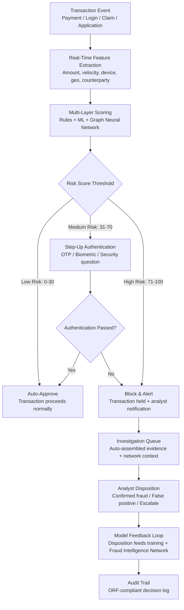

# Fraud Detection Neural Network

Frankmax

NAICS 522110-524298

> **Banks, Insurers, Financial Foundations** — Financial Services AI Operations

## Objective & Purpose

Financial fraud costs the global economy over $32 billion annually in direct losses, with banks, insurers, and payment processors absorbing the majority. The fraud landscape has shifted decisively toward speed and sophistication: real-time payment systems (Zelle, FedNow, Faster Payments) settle in seconds, eliminating the recall window that legacy fraud detection relied upon. Account takeover attacks increased 131% year-over-year in 2024. Synthetic identity fraud -- where criminals fabricate identities using a mix of real and fictitious data -- now accounts for 80-85% of all identity fraud losses at banks. Traditional rules-based fraud detection systems, built on static thresholds and known patterns, catch only 40-60% of fraud while generating false positive rates that block legitimate customers and create operational drag.

The Fraud Detection Neural Network operates in real-time across the full transaction lifecycle: payment authorization (score every transaction in under 50ms before approval), account activity monitoring (detect takeover and manipulation patterns across sessions), claims fraud detection (identify staged, exaggerated, or fabricated insurance claims), and application fraud screening (flag synthetic identities and fraudulent applications at onboarding). The system uses graph neural networks to model transaction relationships across the entire customer network, detecting fraud rings and coordinated attacks that transaction-level analysis misses.

The system's competitive advantage compounds over time. Every fraud pattern detected -- across all marketplace customers -- feeds an anonymized Fraud Intelligence Network. An insurer in Toronto detecting a new staged-accident pattern immediately benefits a bank in Singapore screening similar identity patterns. This cross-institutional, cross-geography intelligence layer is the "kitchen" -- it cannot be replicated by any single institution and becomes more valuable with each deployment. Monthly cost of delayed detection at Tier 1 Chokepoint #25: $50K-$1M per institution.

## Business Context

| Attribute | Value |
|---|---|
| **Business Process** | Real-time transaction monitoring and fraud prevention |
| **Business Function** | Fraud Prevention / Financial Crime |
| **Category** | Security |
| **Target Audience** | 9. Banks, Insurers, Financial Foundations |
| **Bundle** | Financial Services Compliance Pack ($8,500/mo) |
| **Monthly Cost of Inaction** | $50K-$1M (Tier 1 Chokepoint #25) |
| **Latency Requirement** | Sub-50ms for payment authorization scoring |
| **Detection Improvement** | 85-95% true positive rate vs. 40-60% for rules-based systems |

## BPMN Workflow

## Features

1. **Sub-50ms Transaction Scoring** — Every payment transaction is scored before authorization using a lightweight inference model optimized for latency. The scoring model evaluates 150+ features in real-time: transaction amount, merchant category, geographic location, device fingerprint, time-of-day patterns, velocity (transactions per hour/day), counterparty risk, and historical behavior deviation. Scores return in under 50ms to avoid payment processing delays.

2. **Graph Neural Network Analysis** — Models the entire transaction network as a graph: customers as nodes, transactions as edges. Graph neural networks detect fraud rings, money mule networks, and coordinated account takeover attacks by analyzing relationship patterns that are invisible at the individual transaction level. Identifies clusters of accounts exhibiting correlated suspicious behavior.

3. **Synthetic Identity Detection** — Specifically trained to detect synthetic identities: fabricated persons created from a combination of real SSNs (often from minors, elderly, or deceased), fake names, and manufactured credit histories. Analyzes identity element consistency, credit behavior patterns, and network connections to flag synthetic identities at onboarding and during account lifecycle.

4. **Account Takeover Prevention** — Monitors account access patterns for takeover indicators: new device access, unusual login times, rapid credential changes, simultaneous sessions from different geographies, and behavioral biometric anomalies (typing patterns, mouse movements, session interaction patterns). Triggers step-up authentication before the attacker can execute fraudulent transactions.

5. **Insurance Claims Fraud Detection** — Specialized models for insurance fraud: staged accidents (correlated claims from connected parties), inflated damages (repair estimates exceeding damage indicators), phantom injuries (medical billing patterns inconsistent with injury type), and policyholder collusion (application-to-claim timing patterns). Integrates with the Claims Processing Accelerator's triage engine.

6. **Adaptive Threshold Management** — Fraud detection thresholds automatically adjust based on threat intelligence: during known fraud campaigns, thresholds tighten; during seasonal patterns (holiday shopping, tax season), thresholds account for expected behavioral changes. Eliminates the manual threshold management that causes most false positive spikes in legacy systems.

7. **Cross-Channel Correlation** — Correlates fraud signals across channels: online banking, mobile app, call center, ATM, point-of-sale, and wire transfer. An account takeover attempt detected in online banking triggers heightened monitoring across all channels for that customer, preventing attackers from switching channels to evade detection.

8. **Fraud Intelligence Network** — Anonymized fraud patterns from all marketplace customers feed a shared intelligence layer. New fraud typologies detected at one institution are immediately available as detection features across the network. The network effect strengthens detection for all participants without exposing any institution's proprietary data.

## Workflow & Automation

**Step 1: Event Ingestion** — Transaction events arrive in real-time from payment processing systems (card networks, wire transfer systems, ACH processors, real-time payment rails), online banking sessions, mobile app activity, and insurance claims systems. Each event is enriched with contextual data: device fingerprint, geolocation, session history, and customer profile.

**Step 2: Feature Extraction** — For each event, the system extracts 150+ features in under 10ms. Features include: transaction-level (amount, currency, merchant, channel), velocity-based (transactions in last hour/day/week, unique merchants, unique geographies), behavioral (deviation from customer baseline, time-of-day pattern), device-based (known device, device age, OS version, IP reputation), and network-based (counterparty risk score, shared device indicators).

**Step 3: Multi-Layer Scoring** — Three scoring layers execute in parallel: (a) rules engine for known fraud patterns and regulatory requirements (e.g., transactions to sanctioned countries), (b) machine learning models trained on the institution's historical fraud data, (c) graph neural network analyzing the transaction's position in the broader network. Scores are combined into a composite risk score (0-100).

**Step 4: Decision & Action** — Based on the composite risk score and configurable thresholds: low-risk transactions (0-30) are auto-approved; medium-risk transactions (31-70) trigger step-up authentication (one-time password, biometric verification, security question); high-risk transactions (71-100) are blocked and generate an analyst alert. Thresholds are configurable by transaction type, channel, and customer segment.

**Step 5: Step-Up Authentication** — For medium-risk events, the system initiates additional authentication through the customer's preferred channel. If the customer successfully authenticates, the transaction proceeds and the event is logged as a verified transaction (reducing future false positives for similar patterns). If authentication fails, the event escalates to the high-risk queue.

**Step 6: Investigation & Disposition** — High-risk alerts enter the investigation queue with auto-assembled evidence packages: the triggering event, customer profile, transaction history (with anomalous transactions highlighted), network visualization (connected accounts and transaction flows), and similar historical cases with outcomes. Analysts review and disposition each alert: confirmed fraud, false positive, or escalation to law enforcement.

**Step 7: Model Training & Intelligence Sharing** — Analyst dispositions feed the model training pipeline. Confirmed fraud cases strengthen detection patterns; false positives train the model to avoid similar future errors. Anonymized fraud typologies are shared with the Fraud Intelligence Network, strengthening detection across all marketplace participants.

## Input/Output Specifications

| Direction | Data | Format | Description |
|---|---|---|---|
| Input | Transaction events | ISO 8583 / ISO 20022 / JSON | Real-time payment and account activity events |
| Input | Session data | JSON / SDK | Device fingerprint, geolocation, behavioral biometrics |
| Input | Customer profiles | Core banking API | Account history, risk classification, authentication preferences |
| Input | External threat intelligence | STIX/TAXII / API | Known fraud campaigns, compromised credentials, IP reputation |
| Input | Claims data | ACORD / JSON | Insurance claims for fraud pattern analysis |
| Output | Transaction risk score | JSON (real-time, sub-50ms) | Score (0-100), contributing factors, recommended action |
| Output | Investigation packages | JSON + UI | Evidence assembly, network visualization, historical context |
| Output | Fraud analytics | REST API / UI | Detection rates, false positive rates, fraud loss trends |
| Output | Regulatory reports | PDF / structured format | Fraud loss reporting, SAR referrals |
| Output | Audit trail | JSON (immutable log) | ORF-compliant scoring and decision history |

## Integration Points

| System | Integration Type | Data Flow |
|---|---|---|
| **AML/KYC Automation Platform** | Bidirectional | AML network analysis feeds fraud detection; fraud patterns inform AML monitoring |
| **Claims Processing Accelerator** | Bidirectional | Claims fraud scores feed triage; claims patterns feed fraud models |
| **Underwriting Intelligence Engine** | Outbound analytics | Fraud trends inform underwriting risk models |
| **Regulatory Reporting Automator** | Outbound data | Fraud metrics and SAR referrals feed regulatory submissions |
| **Multi-Model AI Orchestrator** | Infrastructure | AI model routing for scoring, graph analysis, and pattern detection |
| **Card Network / Payment Processor** | Bidirectional real-time | Transaction events in; authorization decisions out |
| **Core Banking System** | Bidirectional API | Customer data in; fraud alerts and account restrictions out |
| **Failure Intelligence Library** | Outbound anonymized patterns | Fraud typologies feed cross-industry intelligence |

## Pricing & Revenue Model

| Component | Pricing | Notes |
|---|---|---|
| **Financial Services Compliance Pack** | $8,500/month | Fraud Detection included with AML/KYC + Claims + Regulatory |
| **Standalone — Transaction monitoring** | $4,800/month | Up to 10M transactions/month scored |
| **Per-transaction scoring fee** | $0.002-$0.005 per transaction | Above included allocation |
| **Enterprise tier (>100M transactions/mo)** | Custom pricing | Dedicated scoring instance, sub-30ms SLA |
| **Claims fraud module** | +$1,500/month | Insurance-specific fraud detection models |
| **Graph neural network module** | +$2,200/month | Network analysis, fraud ring detection |
| **Fraud Intelligence Network access** | +$800/month | Cross-institutional anonymized fraud patterns |

**Revenue model**: Fraud detection is a security-critical, always-on service -- high switching costs once deployed. Base subscription provides transaction scoring; premium modules add claims fraud, network analysis, and cross-institutional intelligence. The Fraud Intelligence Network is a pure "kitchen" product: each new institution joining improves detection for all, creating a network effect that compounds the marketplace's competitive moat. Margin: 70-80% on software; 85-95% on intelligence feeds.

## NAICS/SIC Mapping

| NAICS Code | SIC Code | Industry | Relevance |
|---|---|---|---|
| 522110 | 6021 | Commercial Banking | Transaction fraud, account takeover, wire fraud |
| 522210 | 6141 | Credit Card Issuing | Card-not-present fraud, counterfeit detection |
| 522320 | 6159 | Financial Transaction Processing | Payment processor fraud detection |
| 524126 | 6321 | Direct Property and Casualty Insurance | Claims fraud (property, auto, liability) |
| 524114 | 6311 | Direct Health and Medical Insurance | Healthcare claims fraud |
| 524113 | 6311 | Direct Life Insurance | Life insurance application fraud |
| 522130 | 6029 | Credit Unions | Member account fraud protection |
| 523110 | 6211 | Investment Banking | Securities fraud detection |
