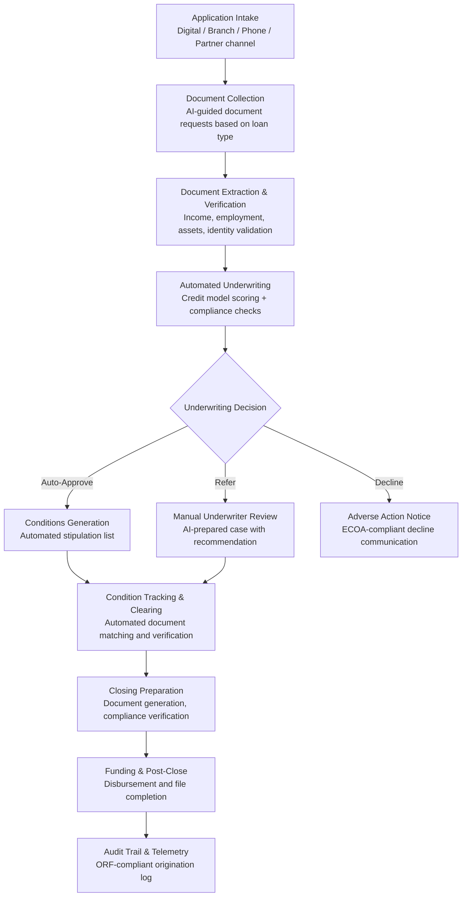

# Loan Origination Optimizer

Frankmax

NAICS 522110-524298

> **Banks, Insurers, Financial Foundations** — Loan Origination Optimizer

## Objective & Purpose

Loan origination is one of banking's most expensive and friction-filled processes. A mortgage origination takes an average of 45-55 days from application to closing, involves 400+ pages of documentation, requires 10-15 manual touchpoints, and costs the lender $8,000-$12,000 per loan to originate. Small business loans average 25-35 days. Even personal loans and credit cards, which should be simpler, average 3-7 days for decisions that could take minutes. This slowness is not just an operational cost -- it is a competitive liability. Fintech lenders that can approve and fund a personal loan in hours are capturing market share from traditional banks that take days. Borrowers who wait 50 days for a mortgage decision are vulnerable to competing offers at every stage of the process.

The Loan Origination Optimizer applies AI across the entire origination pipeline: application intake (intelligent forms that pre-populate data and request only what is needed), document collection and verification (AI extraction and cross-validation of income, employment, asset, and identity documents), underwriting decision (risk model scoring with explainable outputs), conditions and exceptions management (automated stipulation tracking and clearing), and closing preparation (document generation and compliance verification). For each loan type, the system identifies and eliminates the specific bottlenecks that drive cycle time: missing documents (30% of delays), underwriter queue time (25% of delays), condition clearing (20% of delays), and compliance review (15% of delays).

The result is dramatic cycle time compression: mortgage origination from 45+ days to 15-25 days, small business loans from 25+ days to 7-15 days, and personal loans from 3-7 days to same-day decisions. Faster origination directly impacts revenue: each day of cycle time reduction increases pull-through rate (applications that close) by 1-2%. For a bank originating $5B in mortgages annually with a 75% pull-through rate, a 10-day cycle time reduction increases closed volume by $500M-$1B. The cost reduction is equally significant: AI-assisted origination reduces per-loan cost from $8,000-$12,000 to $3,000-$5,000.

## Business Context

| Attribute | Value |
|---|---|
| **Business Process** | Lending operations |
| **Business Function** | Credit |
| **Category** | Operations |
| **Target Audience** | 9. Banks, Insurers, Financial Foundations |
| **Bundle** | Financial Services Compliance Pack ($8,500/mo) |
| **Monthly Cost of Inaction** | $50K-$500K (lost applications, origination costs, competitive disadvantage) |

## BPMN Workflow

## Features

1. **Intelligent Application Intake** — Adaptive application forms that adjust fields based on loan type, borrower profile, and data already available. Pre-populates data from connected sources (credit bureau, bank account aggregation, employment verification) to reduce borrower burden. Identifies missing information in real time and guides applicants to provide complete applications on the first submission.

2. **AI Document Processing** — Extracts and validates information from borrower documents using computer vision and NLP: pay stubs (employer, pay period, gross/net income, YTD), W-2s and tax returns (annual income, employer, filing status), bank statements (balances, deposits, average daily balance, large transaction flagging), and identity documents (name matching, expiration, authenticity indicators). Cross-validates extracted data against application statements for consistency.

3. **Automated Underwriting Engine** — Integrates with the Credit Risk Modeler for risk scoring and adds origination-specific decision logic: loan-to-value ratios, debt-to-income calculations, collateral valuation, and product eligibility rules. Produces approve/decline/refer decisions with ECOA-compliant reason codes. Target auto-approval rate: 50-70% for mortgage, 60-80% for consumer, 40-60% for small business.

4. **Condition Management Automation** — Generates loan conditions (stipulations) based on the specific risk factors and documentation gaps for each application. Tracks condition fulfillment status in real time. Automatically clears conditions when satisfying documents are received and validated (e.g., a requested pay stub arrives and the extracted income matches the application).

5. **Pipeline Management Dashboard** — Real-time visibility into the origination pipeline: applications by stage, average time per stage, bottleneck identification, loan officer productivity, and pull-through projections. Enables operations managers to allocate resources to bottleneck stages and identify process improvements.

6. **Compliance Verification Engine** — Automatically validates compliance at every stage: TILA (Truth in Lending Act) disclosure accuracy, RESPA (Real Estate Settlement Procedures Act) timing requirements, HMDA (Home Mortgage Disclosure Act) data collection, fair lending testing, and state-specific licensing and disclosure requirements. Catches compliance violations before closing rather than in post-close QC.

7. **Multi-Channel Origination** — Supports origination through all channels: direct digital (online and mobile applications), branch-originated (in-person with loan officer), phone (call center with screen-share), and partner/correspondent (wholesale and broker channels). All channels feed into the same automated workflow with consistent underwriting and compliance.

## Workflow & Automation

**Step 1: Application Submission** — Borrower submits application through any channel. The system pre-populates available data, validates completeness, and generates the initial document request list based on loan type, borrower profile, and product requirements. A unique loan processing ID is assigned.

**Step 2: Document Collection and Extraction** — Borrower uploads documents (or they are retrieved electronically from connected sources). AI extraction pulls structured data from each document. Cross-validation checks extracted data against application statements. Discrepancies generate targeted follow-up requests.

**Step 3: Underwriting Evaluation** — The automated underwriting engine evaluates the complete application: credit risk score, collateral valuation, income verification, DTI calculation, LTV calculation, and product eligibility. Applications meeting auto-approval criteria proceed without human intervention. Borderline applications are referred to underwriters with full AI analysis attached.

**Step 4: Condition Generation and Tracking** — For approved loans (auto and manual), the system generates the condition list: additional documents needed, verifications to complete, and compliance requirements to satisfy. Conditions are tracked in real time with automated reminders to borrowers and automated clearing when satisfying documents arrive.

**Step 5: Closing Preparation** — When all conditions are cleared, the system generates closing documents: loan estimate, closing disclosure, note, mortgage/deed of trust, and state-specific required documents. Compliance verification confirms all regulatory timing requirements are met (e.g., 3-day waiting period after closing disclosure delivery).

**Step 6: Funding and Post-Close** — After closing, the system initiates funding disbursement, generates post-close QC audit packages, and archives the complete loan file with immutable audit trail. Post-close analytics track loan performance against underwriting predictions for model improvement.

## Input/Output Specifications

| Direction | Data | Format | Description |
|---|---|---|---|
| Input | Loan application | JSON / PDF / web form | Borrower information, loan request, property details |
| Input | Borrower documents | PDF, JPEG, PNG | Pay stubs, tax returns, bank statements, ID |
| Input | Credit data | XML / JSON (bureau APIs) | Credit reports and scores |
| Input | Property data | API (appraisal, AVM, flood, title) | Collateral valuation and property information |
| Input | Regulatory requirements | JSON (compliance rules engine) | TILA, RESPA, HMDA, state-specific rules |
| Output | Underwriting decision | JSON (LOS integration) | Approve/decline/refer with conditions and reason codes |
| Output | Closing documents | PDF (generated) | Loan estimate, closing disclosure, note, mortgage |
| Output | Pipeline dashboard | REST API / UI | Application status, stage timing, bottleneck analysis |
| Output | Audit trail | JSON (immutable log) | ORF-compliant origination decision and compliance log |

## Integration Points

| System | Integration Type | Data Flow |
|---|---|---|
| **Credit Risk Modeler** | Bidirectional | Risk scores feed underwriting; origination data feeds model training |
| **AML/KYC Automation Platform** | Inbound verification | Identity verification and sanctions screening during origination |
| **Fraud Detection Neural Network** | Inbound fraud signals | Application fraud detection during intake and underwriting |
| **Regulatory Reporting Automator** | Outbound data | HMDA, CRA, and fair lending data feeds regulatory submissions |
| **DocuFlow -- Document Intelligence** | Infrastructure | Document extraction models power borrower document processing |
| **Multi-Model AI Orchestrator** | Infrastructure | AI model routing for document processing and underwriting |
| **Audit Trail and Traceability Engine** | Outbound log stream | All origination decisions logged immutably |
| **Failure Intelligence Library** | Outbound anonymized patterns | Origination process failure patterns feed cross-industry intelligence |

## Pricing & Revenue Model

| Component | Pricing | Notes |
|---|---|---|
| **Financial Services Compliance Pack** | $8,500/month | Loan Origination + AML/KYC + Regulatory Reporting + 2M AI tokens |
| **Standalone -- Subscription** | $5,000/month | Single loan product, up to 500 applications/month |
| **Multi-product tier** | $8,000/month | All loan products, up to 2,000 applications/month |
| **Per-application pricing** | $15-$50 per application | Volume-based for high-throughput lenders |
| **Document AI module** | +$1,500/month | Advanced document extraction and verification |
| **AI token consumption** | Included at 80% discount | 2M tokens/month in bundle; overage at marketplace rates |

**Revenue model**: Loan Origination Optimizer sells on cycle time compression and cost reduction. A bank originating 10,000 mortgages/year at $10,000 origination cost ($100M total) that reduces cost by 40% saves $40M annually. Cycle time reduction increases pull-through, generating additional closed loan volume. The "fries" attach through compliance verification, document AI, and regulatory reporting at 75-90% margin.

## NAICS/SIC Mapping

| NAICS Code | SIC Code | Industry | Relevance |
|---|---|---|---|
| 522110 | 6021 | Commercial Banking | Consumer and commercial loan origination |
| 522120 | 6022 | Savings Institutions | Mortgage origination optimization |
| 522130 | 6061 | Credit Unions | Member loan origination |
| 522292 | 6159 | Real Estate Credit | Mortgage-specific origination |
| 522291 | 6153 | Consumer Lending | Personal loan origination |
| 522310 | 6141 | Mortgage and Non-mortgage Loan Brokers | Broker channel origination |
| 522390 | 6199 | Other Activities Related to Credit | Fintech lending origination |
