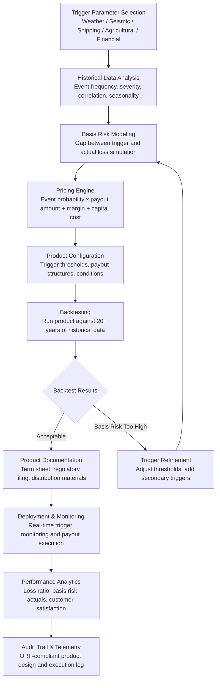

# Parametric Insurance Designer

Frankmax

NAICS 522110-524298

> **Banks, Insurers, Financial Foundations** — Parametric Insurance Designer

## Objective & Purpose

Traditional insurance has a fundamental problem: the claims process. A policyholder suffers a loss, files a claim, provides documentation, waits for investigation, negotiates the settlement, and eventually receives payment -- a cycle that averages 30-90 days and often leaves both parties dissatisfied. Parametric insurance eliminates this friction entirely by replacing subjective claims assessment with objective trigger-based payouts. Instead of "if you suffer a covered loss, we will investigate and pay," parametric insurance says "if this measurable event occurs (earthquake over 6.0 magnitude within 50km of your location), you receive this payment ($500,000) automatically." No claims adjuster, no documentation, no negotiation, no delay.

The parametric insurance market is growing at 12-15% annually but remains under-developed because product design is exceptionally complex. Each parametric product requires: identifying a measurable trigger (what event, measured by whom, at what threshold), modeling basis risk (the gap between the trigger firing and the policyholder's actual loss), pricing the contract (actuarial pricing for event probability and payout amounts), selecting reliable data sources (weather stations, seismological networks, satellite imagery, IoT sensors), and structuring the legal framework (index-based contracts differ from traditional indemnity contracts in regulatory treatment).

The Parametric Insurance Designer provides an end-to-end platform for designing, testing, pricing, and deploying parametric insurance products. The system ingests historical data for any measurable parameter (weather, seismic, shipping, agricultural, financial), applies statistical modeling to compute trigger probabilities and payout distributions, simulates basis risk under thousands of scenarios, and produces actuarially-sound pricing with confidence intervals. Product designers use a visual interface to configure triggers, attach conditions, set payout structures (binary, tiered, proportional), and test products against historical events. The system reduces parametric product design from 6-12 months to 4-8 weeks and enables rapid iteration on trigger parameters and pricing.

## Business Context

| Attribute | Value |
|---|---|
| **Business Process** | Product development |
| **Business Function** | Product Management |
| **Category** | Innovation |
| **Target Audience** | 9. Banks, Insurers, Financial Foundations |
| **Bundle** | Financial Services Compliance Pack ($8,500/mo) |
| **Monthly Cost of Inaction** | $30K-$200K (missed market opportunity, competitive disadvantage, slow product development) |

## BPMN Workflow

## Features

1. **Multi-Peril Data Library** — Pre-integrated historical data for 25+ parametric trigger categories: weather (temperature, precipitation, wind speed, hurricane category), seismic (earthquake magnitude, depth, distance), hydrological (river level, flood extent, drought indices), agricultural (NDVI crop health, growing degree days, soil moisture), shipping (port delay, vessel tracking, trade disruption), and financial (market index levels, interest rates, commodity prices).

2. **Statistical Trigger Modeling** — Models trigger event distributions using extreme value theory (GEV, GPD), copula models for correlated triggers, and machine learning for complex, non-linear event patterns. Produces probability curves for any trigger parameter at any location, enabling precise pricing of event likelihood.

3. **Basis Risk Simulator** — Quantifies basis risk (the possibility that the trigger fires but the policyholder did not suffer a loss, or the policyholder suffers a loss but the trigger does not fire) under thousands of scenarios. Uses spatial correlation modeling, temporal lag analysis, and Monte Carlo simulation to estimate basis risk at every trigger threshold level.

4. **Visual Product Designer** — Drag-and-drop interface for configuring parametric products: select trigger parameters, set threshold levels, choose payout structures (binary fixed-amount, tiered multi-level, proportional to trigger severity), add qualifying conditions (waiting periods, measurement windows, geographic boundaries), and attach multiple triggers for compound products.

5. **Actuarial Pricing Engine** — Computes premium pricing based on trigger probability, expected loss distribution, basis risk loading, expense loading, capital cost, and target loss ratio. Produces pricing with confidence intervals and sensitivity analysis (how much does the price change if the trigger threshold moves 5%?).

6. **Historical Backtesting** — Runs configured products against 20+ years of historical data to simulate performance: how many times would the product have paid out, what would the aggregate payout have been, what was the simulated loss ratio, and what was the actual basis risk experience? Backtesting provides confidence that pricing is calibrated to real-world event patterns.

7. **Real-Time Trigger Monitoring** — After product deployment, monitors trigger data sources in real time. When a trigger condition is approaching or has been met, the system automatically initiates the payout process. Reduces payout from weeks (traditional claims) to hours or days (automated trigger confirmation and payment).

## Workflow & Automation

**Step 1: Opportunity Identification** — Identify the peril, geography, and customer segment for the parametric product. The system provides market sizing data: how many potential policyholders, what is the addressable premium pool, and what competitor products exist.

**Step 2: Trigger Design** — Select trigger parameters from the data library or configure custom triggers. Set initial threshold levels based on the desired payout frequency (e.g., "pay out once every 5 years on average" implies a 20% annual trigger probability). Configure measurement parameters: data source, geographic reference point, measurement window, and verification methodology.

**Step 3: Basis Risk Analysis** — Run basis risk simulations to quantify the gap between trigger activation and actual policyholder loss. Iterate on trigger parameters to minimize basis risk: adding secondary triggers, adjusting geographic reference points, or refining measurement windows.

**Step 4: Pricing and Profitability** — The pricing engine calculates the actuarially fair premium, adds risk and expense loadings, and produces a target retail price. Sensitivity analysis shows how price changes with trigger threshold adjustments, enabling product managers to find the optimal balance between customer value and profitability.

**Step 5: Regulatory and Documentation** — The system generates product documentation: term sheets, regulatory filing materials (state DOI filings for parametric products require specific disclosures about basis risk and trigger mechanisms), distribution training materials, and policyholder-facing product explanations.

**Step 6: Launch and Monitor** — Deploy the product with real-time trigger monitoring. Track sales volume, trigger events, payout execution, and customer feedback. Post-payout analysis confirms basis risk experience matches modeling predictions. Performance data feeds product refinement for the next iteration.

## Input/Output Specifications

| Direction | Data | Format | Description |
|---|---|---|---|
| Input | Historical event data | API / CSV (NOAA, USGS, satellite) | 20+ years of trigger parameter history |
| Input | Geospatial data | GeoJSON / shapefile | Location boundaries, measurement station coordinates |
| Input | Actuarial assumptions | JSON / UI configuration | Target loss ratio, expense ratio, capital cost |
| Input | Product configuration | JSON / visual designer | Triggers, thresholds, payouts, conditions |
| Output | Product pricing | JSON + PDF | Premium with confidence intervals and sensitivity analysis |
| Output | Basis risk analysis | JSON + PDF | Quantified basis risk with scenario details |
| Output | Backtest results | JSON + interactive dashboard | Historical simulated performance |
| Output | Audit trail | JSON (immutable log) | ORF-compliant product design and execution log |

## Integration Points

| System | Integration Type | Data Flow |
|---|---|---|
| **Actuarial Model Accelerator** | Bidirectional | Parametric pricing feeds actuarial reserves; actuarial models validate pricing |
| **Reinsurance Optimization Engine** | Outbound product data | Parametric product exposure feeds reinsurance cession strategy |
| **Underwriting Intelligence Engine** | Cross-reference | Parametric risk data enriches traditional underwriting models |
| **Regulatory Reporting Automator** | Outbound data | Product data feeds regulatory filings and capital reporting |
| **Claims Processing Accelerator** | Outbound trigger events | Trigger confirmations initiate automated payout processing |
| **Multi-Model AI Orchestrator** | Infrastructure | AI model routing for trigger analysis and simulation |
| **Audit Trail and Traceability Engine** | Outbound log stream | All product design decisions and trigger events logged |
| **Failure Intelligence Library** | Outbound anonymized patterns | Parametric product performance patterns feed cross-industry intelligence |

## Pricing & Revenue Model

| Component | Pricing | Notes |
|---|---|---|
| **Financial Services Compliance Pack** | $8,500/month | Parametric Designer + AML/KYC + Regulatory Reporting + 2M AI tokens |
| **Standalone -- Subscription** | $5,500/month | Up to 10 active product designs |
| **Enterprise tier** | $8,500/month | Unlimited products, full historical data library |
| **Per-product launch fee** | $3,000-$10,000 one-time | Regulatory documentation and deployment support |
| **Real-time monitoring** | +$1,500/month | Continuous trigger monitoring and automated payout execution |
| **AI token consumption** | Included at 80% discount | 2M tokens/month in bundle; overage at marketplace rates |

**Revenue model**: Parametric Insurance Designer enables insurers to launch products that were previously too complex to design. Each successful parametric product generates premium volume that would not exist otherwise -- a new market rather than a competitive replacement. The "burger" is product design capability at 60-80% less time and cost than consulting-led parametric product development ($200K-$500K per product). The "fries" attach through monitoring, regulatory compliance, and reinsurance analytics at 75-90% margin.

## NAICS/SIC Mapping

| NAICS Code | SIC Code | Industry | Relevance |
|---|---|---|---|
| 524126 | 6321 | Direct Property and Casualty Insurance | Weather and natural catastrophe parametric products |
| 524128 | 6399 | Other Direct Insurance | Specialty parametric lines (travel, event, crop) |
| 524130 | 6321 | Reinsurance Carriers | Parametric reinsurance products (cat bonds, ILS) |
| 524114 | 6311 | Direct Health and Medical Insurance | Parametric health products (pandemic, epidemic) |
| 524298 | 6411 | All Other Insurance Activities | Parametric product design and distribution |
| 523130 | 6211 | Commodity Contracts Dealing | Weather derivatives and commodity price parametrics |
| 111-115 | 0100-0999 | Agriculture, Forestry, Fishing | Parametric crop and livestock insurance |
