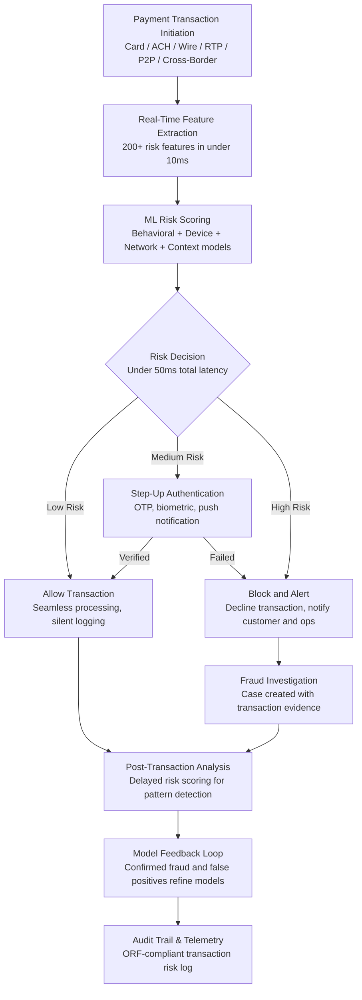

# Payment Fraud Shield

Frankmax

NAICS 522110-524298

> **Banks, Insurers, Financial Foundations** — Payment Fraud Shield

## Objective & Purpose

Payment fraud is growing at 30%+ annually, driven by the proliferation of real-time payment systems, digital wallets, and cross-border instant transfers that execute in seconds -- far faster than traditional fraud detection can respond. Global payment fraud losses exceeded $40B in 2023, and the shift to real-time payments (FedNow, SEPA Instant, UPI) is accelerating the problem because payments settle in seconds rather than days, eliminating the window for manual review. Authorized push payment (APP) fraud -- where victims are socially engineered into sending payments to fraudsters -- has become the fastest-growing fraud type, accounting for 40% of payment fraud losses in the UK and growing rapidly in other markets. Traditional rules-based fraud systems are overwhelmed: they either block too many legitimate transactions (false positives running 10-20%, creating customer friction and operational cost) or miss too many fraudulent transactions (false negatives allowing fraud to slip through).

The Payment Fraud Shield applies real-time AI scoring to every payment transaction: card-present, card-not-present, ACH, wire, real-time payments, peer-to-peer, and cross-border transfers. The system evaluates each transaction in under 50 milliseconds against 200+ risk features: customer behavioral patterns (typical transaction amounts, merchants, geographies, timing), device fingerprinting (known device, new device, device characteristics), network intelligence (recipient risk scoring, payment pathway analysis, velocity patterns), and contextual signals (time since last transaction, distance from last location, account activity patterns). For real-time payments where the decision must be made before settlement, the system produces a risk score that determines: allow (low risk), challenge (medium risk -- step-up authentication), or block (high risk -- decline and alert).

The Shield specifically addresses APP fraud through behavioral biometrics and session analysis: detecting when a customer's interaction pattern suggests they are being coached through a transaction (unusual pauses, out-of-character amounts, typing patterns consistent with dictation), and triggering intervention before the payment is sent. This capability is increasingly important as regulators (UK PSR, EU PSD3) move toward mandatory reimbursement for APP fraud victims, making fraud prevention a direct financial imperative for payment providers.

## Business Context

| Attribute | Value |
|---|---|
| **Business Process** | Payment processing |
| **Business Function** | Payments |
| **Category** | Security |
| **Target Audience** | 9. Banks, Insurers, Financial Foundations |
| **Bundle** | Financial Services Compliance Pack ($8,500/mo) |
| **Monthly Cost of Inaction** | $50K-$1M (fraud losses, customer friction, regulatory penalties, reimbursement liability) |

## BPMN Workflow

## Features

1. **Sub-50ms Real-Time Scoring** — Every payment transaction is scored in under 50 milliseconds, meeting the latency requirements of real-time payment systems (FedNow, SEPA Instant, Faster Payments). The scoring engine processes 200+ risk features derived from customer behavior, device attributes, network intelligence, and transaction context without adding perceptible delay to the payment experience.

2. **Multi-Channel Payment Coverage** — Scores transactions across all payment channels from a unified risk engine: card-present (EMV chip, contactless, magstripe fallback), card-not-present (e-commerce, MOTO), ACH (credits and debits), wire transfers (domestic and international), real-time payments (FedNow, RTP Network), peer-to-peer (Zelle, Venmo integration), and cross-border transfers (SWIFT, correspondent banking).

3. **Behavioral Biometrics for APP Fraud** — Detects authorized push payment fraud by analyzing customer session behavior: typing cadence (is the customer typing their own transaction details or being dictated to?), navigation patterns (familiar vs. coached), hesitation indicators (unusual pauses before confirmation), and transaction characteristics (amounts and recipients inconsistent with the customer's history). Triggers intervention when behavioral signals suggest social engineering.

4. **Device Intelligence and Fingerprinting** — Maintains a device reputation database: known good devices (the customer's phone and computer), new devices (first-time use requiring enhanced scrutiny), compromised devices (associated with prior fraud), and spoofed devices (emulators, rooted phones, VPN masking). Device intelligence contributes to the risk score alongside behavioral and transactional features.

5. **Network-Level Recipient Risk Scoring** — Evaluates the payment recipient using network intelligence: is this a known-good merchant or payee, a new recipient, or a recipient associated with prior fraud? For P2P and wire transfers, analyzes the receiving account's transaction patterns to identify mule accounts (high-velocity pass-through accounts used to launder fraud proceeds).

6. **Adaptive Risk Thresholds** — Risk thresholds (allow/challenge/block) adapt based on payment channel, customer segment, and current threat level. During elevated fraud campaigns (holiday season, new attack vector), thresholds tighten automatically. For high-value customers with established behavioral patterns, thresholds relax to minimize friction while maintaining protection.

7. **Fraud Case Management** — When transactions are blocked or challenged, the system creates investigation cases with complete evidence: the transaction details, risk score breakdown, contributing features, customer behavioral history, and similar fraud patterns. Cases are routed to fraud operations teams with recommended actions (confirm fraud, release legitimate transaction, contact customer).

8. **Consortium Intelligence** — Participates in anonymized fraud intelligence sharing across marketplace participants: confirmed fraud patterns, mule account identifiers, and emerging attack methodologies are shared (anonymized) to improve detection for all participants. A fraud pattern detected at one institution improves defense at all institutions.

## Workflow & Automation

**Step 1: Payment System Integration** — Connect to the institution's payment processing infrastructure: card networks (Visa, Mastercard, Amex), ACH processor (Federal Reserve, EPN), wire system (Fedwire, CHIPS), real-time payment network (FedNow, RTP), and P2P platforms. Configure the scoring engine inline in the payment authorization flow.

**Step 2: Behavioral Baseline Construction** — Analyze 6-12 months of historical transaction data per customer to build behavioral baselines: typical transaction patterns (amounts, merchants, geographies, timing), device usage patterns, and channel preferences. Baselines adapt continuously as customer behavior evolves.

**Step 3: Real-Time Scoring Deployment** — Deploy the scoring engine into the payment authorization path. Every transaction is scored against the customer's behavioral baseline, device intelligence, recipient risk, and contextual features. Risk scores and decisions are returned within the latency requirement (under 50ms for real-time payments, under 200ms for card transactions).

**Step 4: Step-Up Authentication Management** — For medium-risk transactions, the system triggers step-up authentication through the appropriate channel: push notification for mobile-equipped customers, OTP for others, biometric confirmation for high-value transactions. Authentication results feed back into the risk model.

**Step 5: Fraud Operations and Case Management** — Blocked transactions and failed authentications generate fraud cases with complete evidence packages. Fraud analysts investigate, disposition cases (confirmed fraud, false positive, inconclusive), and initiate appropriate actions (account restriction, customer notification, law enforcement referral).

**Step 6: Model Refinement and Threat Response** — Confirmed fraud cases and false positives feed model improvement. When new fraud patterns emerge, the system adapts detection models within hours rather than weeks. Consortium intelligence from other marketplace participants provides early warning of emerging attack vectors.

## Input/Output Specifications

| Direction | Data | Format | Description |
|---|---|---|---|
| Input | Payment transaction data | ISO 8583 / ISO 20022 / JSON | Transaction details, amounts, parties, channels |
| Input | Customer behavioral data | API (core banking) | Transaction history, device history, session data |
| Input | Device fingerprint data | SDK / API (device intelligence) | Device attributes, reputation, anomaly indicators |
| Input | Network intelligence | API (consortium, threat feeds) | Recipient risk, mule account indicators, attack patterns |
| Input | Authentication results | API (authentication platform) | OTP, biometric, push notification outcomes |
| Output | Risk decision | JSON (inline, under 50ms) | Allow / challenge / block with risk score |
| Output | Fraud cases | JSON + investigation dashboard | Evidence packages for fraud operations |
| Output | Analytics dashboard | REST API / UI | Fraud rates, false positive rates, loss metrics |
| Output | Audit trail | JSON (immutable log) | ORF-compliant transaction risk decision log |

## Integration Points

| System | Integration Type | Data Flow |
|---|---|---|
| **AML/KYC Automation Platform** | Bidirectional | Customer risk profiles inform fraud scoring; fraud patterns feed AML suspicious activity |
| **Fraud Detection Neural Network** | Bidirectional | Payment fraud patterns shared with broader fraud detection; account-level fraud context informs payment scoring |
| **Credit Risk Modeler** | Cross-reference | Credit risk signals contextualize payment fraud (overleveraged customers more susceptible to fraud) |
| **Regulatory Reporting Automator** | Outbound data | Fraud metrics and SAR data feed regulatory submissions |
| **Loan Origination Optimizer** | Cross-reference | Application fraud signals inform payment fraud monitoring for new accounts |
| **Multi-Model AI Orchestrator** | Infrastructure | Model routing and real-time scoring compute allocation |
| **Audit Trail and Traceability Engine** | Outbound log stream | All payment risk decisions logged immutably |
| **Failure Intelligence Library** | Outbound anonymized patterns | Payment fraud patterns feed cross-industry intelligence |

## Pricing & Revenue Model

| Component | Pricing | Notes |
|---|---|---|
| **Financial Services Compliance Pack** | $8,500/month | Payment Fraud Shield + AML/KYC + Regulatory Reporting + 2M AI tokens |
| **Standalone -- per transaction** | $0.005-$0.02 per transaction | Volume-based pricing decreasing with scale |
| **Monthly minimum** | $3,000/month | Floor pricing for low-volume institutions |
| **Enterprise tier (over 50M txns/mo)** | Custom pricing | Dedicated instance, custom models, SLA guarantees |
| **APP fraud detection module** | +$1,500/month | Behavioral biometrics for authorized push payment fraud |
| **AI token consumption** | Included at 80% discount | 2M tokens/month in bundle; overage at marketplace rates |

**Revenue model**: Payment Fraud Shield sells on loss prevention and customer experience. A bank processing 10M transactions/month with $2M in monthly fraud losses that reduces fraud by 40% saves $800K/month at a cost of $50K-$200K/month. False positive reduction (from 10-20% to 2-5%) simultaneously reduces customer friction and operational cost. The "fries" attach through APP fraud detection, consortium intelligence, regulatory reporting, and case management at 75-90% margin. Per-transaction pricing scales directly with payment volume growth.

## NAICS/SIC Mapping

| NAICS Code | SIC Code | Industry | Relevance |
|---|---|---|---|
| 522110 | 6021 | Commercial Banking | Bank payment fraud prevention |
| 522120 | 6022 | Savings Institutions | Payment processing fraud detection |
| 522130 | 6061 | Credit Unions | Credit union payment protection |
| 522210 | 6141 | Credit Card Issuing | Card transaction fraud scoring |
| 522320 | 6153 | Financial Transactions Processing | Payment processor fraud detection |
| 522390 | 6199 | Other Activities Related to Credit | Fintech payment fraud prevention |
| 523920 | 6282 | Portfolio Management | Investment account payment fraud |
