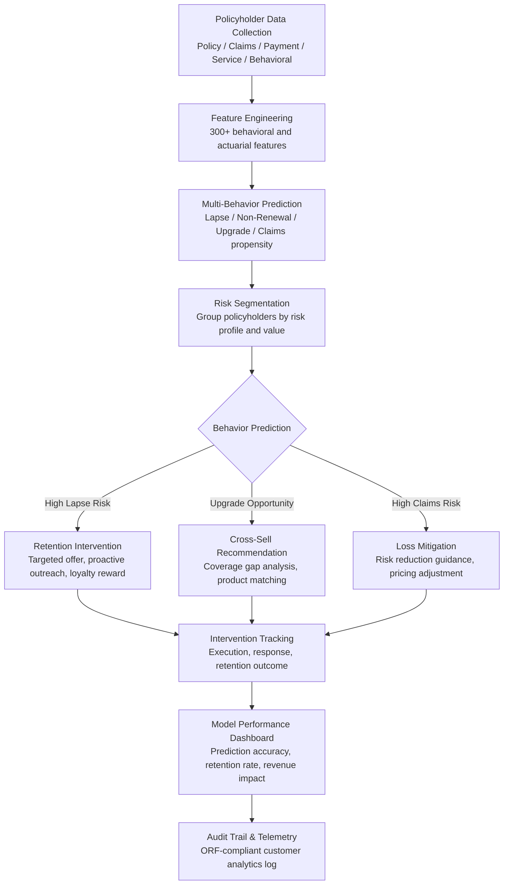

# Policyholder Behavior Predictor

Frankmax

NAICS 522110-524298

> **Banks, Insurers, Financial Foundations** — Policyholder Behavior Predictor

## Objective & Purpose

Insurance companies lose 10-15% of their policyholder base annually to lapse and non-renewal. Acquiring a new policyholder costs 5-8x more than retaining an existing one, and the first year of any policy is typically unprofitable (acquisition costs exceed first-year premium). This means that every lapsed policy represents both lost premium and unrecovered acquisition investment. For a mid-size insurer with $500M in premium and a 12% annual lapse rate, $60M in premium walks out the door every year, and replacing those policies costs $30M-$50M in marketing and distribution expenses. Yet most insurers use rudimentary lapse prediction: tenure-based rules ("flag all policies approaching their 3-year anniversary") or simple demographic models that miss the behavioral signals that actually predict departure.

The Policyholder Behavior Predictor applies machine learning to multi-dimensional policyholder data to predict four critical behaviors: lapse probability (will this policyholder allow their policy to expire?), non-renewal probability (will they actively choose not to renew?), upgrade probability (are they likely to purchase additional coverage?), and claims propensity (how likely are they to file a claim in the next period?). The model ingests traditional actuarial data (policy terms, premium level, claims history, demographics) alongside behavioral signals that traditional models ignore: payment pattern changes (switching from annual to monthly payments, late payment frequency), service interaction patterns (call center contacts, web portal usage, complaint frequency), life event indicators (address changes, vehicle additions, coverage inquiry types), and competitive pricing signals (rate-shopping behavior detected through quote requests).

The prediction engine produces actionable outputs, not just risk scores. For high-lapse-risk policyholders, the system generates specific retention interventions: targeted discount offers calibrated to the policyholder's price sensitivity, proactive service outreach for policyholders showing dissatisfaction signals, coverage review offers for under-insured policyholders who may not understand their coverage value, and loyalty acknowledgment for long-tenure policyholders approaching common departure points. Each intervention includes an expected retention probability and cost-benefit analysis, enabling the insurer to allocate retention budget to the highest-ROI opportunities.

## Business Context

| Attribute | Value |
|---|---|
| **Business Process** | Retention management |
| **Business Function** | Customer Management |
| **Category** | Analytics |
| **Target Audience** | 9. Banks, Insurers, Financial Foundations |
| **Bundle** | Financial Services Compliance Pack ($8,500/mo) |
| **Monthly Cost of Inaction** | $30K-$300K (premium attrition, replacement acquisition costs, adverse selection) |

## BPMN Workflow

## Features

1. **Multi-Behavior Prediction Models** — Separate specialized models for each policyholder behavior: lapse prediction (passive departure), non-renewal prediction (active departure), upgrade propensity (cross-sell/upsell readiness), and claims propensity (next-period claim likelihood). Each model is trained on product-specific data, since auto policyholders behave differently from homeowners or life policyholders.

2. **Behavioral Signal Detection** — Identifies subtle behavioral changes that precede policyholder actions: payment frequency changes (annual to monthly often precedes lapse), service interaction surges (multiple calls indicate dissatisfaction), quote request patterns (rate-shopping behavior), coverage reduction requests (scaling back before departure), and digital engagement decline (decreasing portal and app usage).

3. **Policyholder Lifetime Value (LTV) Scoring** — Calculates the expected lifetime value of each policyholder considering: premium trajectory (likely growth or reduction), expected claims cost (actuarial prediction), policy tenure probability (survival curve), cross-sell potential (propensity for additional products), and referral value. LTV scores prioritize retention efforts on high-value policyholders.

4. **Personalized Retention Interventions** — Generates specific, personalized retention actions for at-risk policyholders: discount offers calibrated to price sensitivity (not one-size-fits-all), proactive service outreach for dissatisfied customers, coverage review sessions for policyholders who may not understand their coverage value, and loyalty milestone recognition. Each intervention includes expected effectiveness and cost.

5. **Competitive Intelligence Integration** — Incorporates market pricing data to identify policyholders at competitive pricing risk: those paying rates significantly above market for their risk profile are higher lapse risk. Enables preemptive pricing adjustments for valuable policyholders before they receive competitor quotes.

6. **Adverse Selection Detection** — Identifies patterns suggesting adverse selection: policyholders who increase coverage just before filing claims, policyholders who lapse healthy policies while retaining unprofitable ones, and new policyholders with unusually high early-term claims frequency. Feeds risk selection into underwriting models.

7. **Retention Campaign Optimization** — Orchestrates retention campaigns across channels: email, phone, mail, agent outreach, and digital. A/B tests intervention strategies to learn which approaches work for which policyholder segments. Tracks campaign ROI: retention cost vs. retained premium value.

## Workflow & Automation

**Step 1: Data Integration** — Connect to the policy administration system (policy details, premium, coverage), claims system (claims history, severity, frequency), billing system (payment patterns, methods, latency), CRM (service interactions, complaints, inquiries), and digital analytics (portal usage, app engagement, email opens).

**Step 2: Feature Engineering** — Transform raw data into 300+ predictive features: tenure, premium change trajectory, claims frequency trend, payment behavior indicators, service interaction patterns, coverage complexity, multi-policy status, and life event signals. Features are computed per policyholder with rolling time windows.

**Step 3: Model Training and Validation** — Train behavior prediction models on historical data: which policyholders actually lapsed, renewed, upgraded, or filed claims. Validate using time-based holdout: train on older periods, test on recent periods. Model accuracy targets: 70% or higher AUC for lapse prediction, 65% or higher for upgrade propensity.

**Step 4: Prediction Generation** — Score the entire active policyholder base monthly (or more frequently for high-velocity products). Produce ranked risk lists: top 10% highest lapse risk, top 5% highest upgrade potential, and top 15% highest claims propensity. Combine behavior predictions with LTV scores to prioritize actions.

**Step 5: Intervention Design and Execution** — Generate personalized retention and cross-sell interventions based on prediction scores and policyholder characteristics. Route interventions to the appropriate channel: agent-led outreach for high-LTV policyholders, automated digital campaigns for high-volume segments, and service-initiated actions for policyholders showing dissatisfaction.

**Step 6: Performance Tracking and Model Refinement** — Track intervention outcomes: did the policyholder retain, upgrade, or lapse despite intervention? Calculate retention campaign ROI. Feed outcomes back into models to improve prediction accuracy and intervention effectiveness over time.

## Input/Output Specifications

| Direction | Data | Format | Description |
|---|---|---|---|
| Input | Policy data | API (policy admin system) | Coverage details, premium, endorsements, renewal dates |
| Input | Claims data | API (claims system) | Claims history, severity, frequency, open claims |
| Input | Billing data | API (billing system) | Payment patterns, methods, late payments, dunning |
| Input | Service interaction data | API (CRM) | Calls, emails, complaints, inquiries |
| Input | Digital engagement data | API (analytics platform) | Portal logins, app usage, email engagement |
| Output | Behavior predictions | JSON + dashboard UI | Lapse, renewal, upgrade, claims probability scores |
| Output | Retention interventions | JSON + CRM integration | Personalized actions with expected effectiveness |
| Output | Campaign analytics | REST API / dashboard | Retention campaign ROI and performance metrics |
| Output | Audit trail | JSON (immutable log) | ORF-compliant customer analytics and decision log |

## Integration Points

| System | Integration Type | Data Flow |
|---|---|---|
| **Claims Processing Accelerator** | Inbound claims data | Claims experience feeds behavior prediction models |
| **Underwriting Intelligence Engine** | Bidirectional | Behavior predictions inform renewal underwriting; underwriting data feeds models |
| **Actuarial Model Accelerator** | Outbound lapse data | Lapse predictions feed actuarial persistency assumptions |
| **Regulatory Reporting Automator** | Outbound data | Retention and lapse metrics feed regulatory submissions |
| **Fraud Detection Neural Network** | Cross-reference | Adverse selection patterns cross-referenced with fraud indicators |
| **Multi-Model AI Orchestrator** | Infrastructure | Model routing and scoring compute allocation |
| **Audit Trail and Traceability Engine** | Outbound log stream | All predictions and interventions logged immutably |
| **Failure Intelligence Library** | Outbound anonymized patterns | Retention failure patterns feed cross-industry intelligence |

## Pricing & Revenue Model

| Component | Pricing | Notes |
|---|---|---|
| **Financial Services Compliance Pack** | $8,500/month | Behavior Predictor + AML/KYC + Regulatory Reporting + 2M AI tokens |
| **Standalone -- Subscription** | $4,500/month | Up to 500,000 policyholders scored |
| **Enterprise tier (over 500K)** | $0.02 per policy/month | Volume pricing for large portfolios |
| **Retention campaign orchestration** | +$1,200/month | Multi-channel intervention management and A/B testing |
| **Competitive intelligence module** | +$800/month | Market pricing integration for competitive risk detection |
| **AI token consumption** | Included at 80% discount | 2M tokens/month in bundle; overage at marketplace rates |

**Revenue model**: Policyholder Behavior Predictor sells on retention economics -- reducing lapse rate by 2 percentage points on a $500M book saves $10M in premium plus $5M-$8M in avoided acquisition costs. The "burger" is AI-powered retention analytics at a fraction of building an internal data science team. The "fries" attach through campaign orchestration, competitive intelligence, and adverse selection detection at 75-90% margin.

## NAICS/SIC Mapping

| NAICS Code | SIC Code | Industry | Relevance |
|---|---|---|---|
| 524126 | 6321 | Direct Property and Casualty Insurance | Auto and home policyholder retention |
| 524113 | 6311 | Direct Life Insurance | Life and annuity persistency prediction |
| 524114 | 6311 | Direct Health and Medical Insurance | Health plan member retention |
| 524210 | 6411 | Insurance Agencies and Brokerages | Agency book of business retention analytics |
| 524298 | 6411 | All Other Insurance Activities | Specialty insurance retention |
| 522110 | 6021 | Commercial Banking | Deposit and loan customer retention |
| 523920 | 6282 | Portfolio Management | Wealth management client retention |
