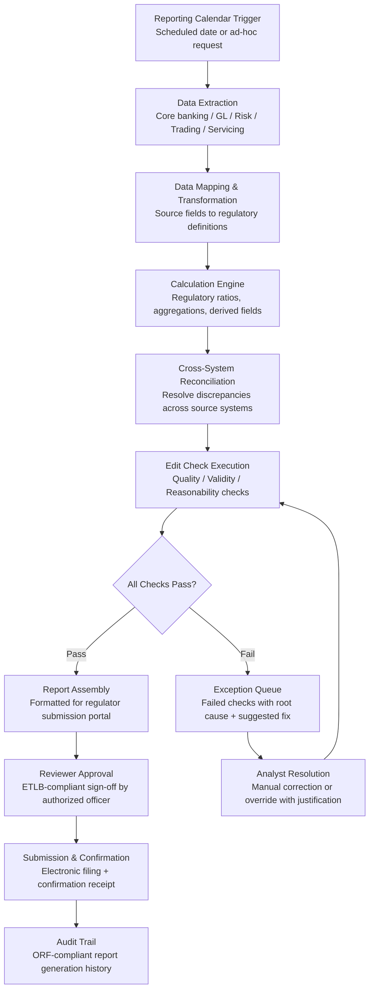

# Regulatory Reporting Automator

Frankmax

NAICS 522110-524298

> **Banks, Insurers, Financial Foundations** — Banking Operations Intelligence

## Objective & Purpose

Financial institutions operate under a regulatory reporting burden that has grown relentlessly since the 2008 financial crisis. Banks in the US submit over 70 recurring regulatory reports to federal and state regulators (Call Reports, FR Y-9C, FFIEC 031/041, CCAR/DFAST stress tests, HMDA, CRA, BSA/AML filings). European banks face equivalent volume under the EBA, ECB, and national regulators (COREP, FINREP, AnaCredit, IRRBB, LCR/NSFR). Insurers submit statutory filings to each state insurance department (NAIC Annual Statement, Risk-Based Capital reports, ORSA narratives). Collectively, the global financial services industry spends over $270 billion annually on compliance, with regulatory reporting consuming 25-40% of that budget.

The problem is not just cost -- it is accuracy, timeliness, and consistency. A single Call Report contains 4,000+ data fields sourced from dozens of internal systems. Populating those fields requires finance, risk, compliance, and IT teams to extract data from core banking, general ledger, loan servicing, trading, and custody systems; reconcile cross-system discrepancies; apply regulatory definitions that differ from accounting definitions; and validate submissions against hundreds of edit checks. Errors result in restatements (which trigger examiner scrutiny), late filings (which carry penalties of $10K-$100K per day), and in severe cases, enforcement actions.

The Regulatory Reporting Automator connects directly to the institution's source systems, maps data fields to regulatory report requirements, applies regulatory definitions and calculations, executes edit checks, and generates submission-ready reports. For recurring reports, the system learns the institution's data mappings and manual adjustments, automating 80-95% of the reporting cycle. Human reviewers focus on judgment-dependent items (narrative disclosures, management commentary, forward-looking statements) rather than data extraction and calculation. Revenue priority #8, with a 90-120 day build-to-revenue timeline and natural expansion into every regulatory report the institution files.

## Business Context

| Attribute | Value |
|---|---|
| **Business Process** | Regulatory report preparation and submission |
| **Business Function** | Compliance / Finance / Regulatory Affairs |
| **Category** | Regulatory |
| **Target Audience** | 9. Banks, Insurers, Financial Foundations |
| **Revenue Priority** | #8 (90-120 day revenue stream) |
| **Bundle** | Financial Services Compliance Pack ($8,500/mo) |
| **Monthly Cost of Inaction** | $25K-$250K (Tier 1 Chokepoint #10) |
| **Regulatory Drivers** | FFIEC, Federal Reserve, OCC, FDIC, SEC, EBA, ECB, NAIC, State DOIs |

## BPMN Workflow

## Features

1. **Pre-Built Regulatory Report Templates** — Covers the most common US and EU regulatory reports out of the box: FFIEC Call Reports (031/041/051), FR Y-9C, FR Y-14A/Q (CCAR), HMDA LAR, CRA data collection, BSA CTRs/SARs, NAIC Annual Statement (Life, P&C, Health), RBC reports, ORSA narrative templates, COREP, FINREP, and LCR/NSFR. Each template includes field definitions, calculation rules, and edit checks aligned to current regulatory specifications.

2. **Automated Data Extraction & Mapping** — Connects to the institution's source systems (core banking, general ledger, loan servicing, trading, custody, risk) via pre-built connectors and API integration. Maintains persistent data mappings from source fields to regulatory report fields. Initial mapping requires 2-4 weeks of configuration; subsequent reporting cycles execute automatically.

3. **Regulatory Calculation Engine** — Performs regulatory-specific calculations that differ from GAAP/IFRS accounting: risk-weighted asset calculations for capital ratios, present value of future cash flows for interest rate risk, expected credit loss calculations for CECL/IFRS 9, and statutory reserve calculations for insurance. Calculations are version-controlled with full auditability of formulas and parameters.

4. **Multi-System Reconciliation** — Automatically identifies and resolves data discrepancies between source systems before they propagate into regulatory reports. Common reconciliation points: general ledger to sub-ledger, trading system to risk system, loan servicing to core banking. Unresolvable discrepancies are escalated to analysts with both data values and suggested resolution.

5. **Intelligent Edit Check Engine** — Executes three tiers of validation: (a) quality checks (data completeness, format compliance, referential integrity), (b) validity checks (values within acceptable ranges, cross-field consistency, temporal consistency with prior periods), (c) reasonability checks (significant period-over-period changes flagged with explanations required). Edit check results produce a detailed exception report with specific failed items and suggested corrections.

6. **Variance Analysis & Narrative Generation** — Automatically generates period-over-period variance explanations for material changes in reported figures. For narrative disclosure sections (MD&A, ORSA, stress test results), the system generates draft text based on underlying data trends, which reviewers can edit and approve.

7. **Regulatory Calendar Management** — Maintains an institutional reporting calendar with all filing deadlines across federal, state, and international regulators. Automated workflows trigger data extraction at T-minus configurable lead times. Deadline tracking with escalation alerts ensures no filing is late.

8. **Submission Portal Integration** — Direct electronic filing to major regulatory portals: FFIEC CDR (Central Data Repository), Federal Reserve's RegSys, FinCEN BSA E-Filing, NAIC SERFF, EBA's EUCLID. Handles portal-specific formatting requirements, file-size limitations, and submission confirmations. Maintains filing receipts as part of the audit trail.

## Workflow & Automation

**Step 1: Calendar-Triggered Initiation** — The reporting calendar identifies upcoming filing deadlines and triggers the reporting workflow at the configured lead time (typically T-15 to T-30 days before filing deadline). The system notifies responsible teams, locks the reporting period cutoff, and initiates data extraction from source systems.

**Step 2: Automated Data Extraction** — Pre-configured data connectors extract relevant data from source systems: general ledger trial balance, loan-level detail, trading positions, deposit account data, investment portfolio, off-balance-sheet items, and customer demographic data. Extraction queries are version-controlled and aligned to the specific reporting period.

**Step 3: Data Transformation & Mapping** — Extracted data is transformed from source system formats to regulatory report field definitions. This step applies regulatory-specific definitions that may differ from accounting: "total assets" for regulatory capital vs. GAAP total assets, "past due" using regulatory definitions vs. internal delinquency definitions, and "related party" using regulatory scope vs. accounting scope. Mapping configurations are maintained by the system and updated when regulatory definitions change.

**Step 4: Calculation & Aggregation** — The calculation engine processes regulatory formulas: capital ratios (CET1, Tier 1, Total Capital), liquidity ratios (LCR, NSFR), leverage ratios, risk-weighted assets by category, insurance statutory reserves, and risk-based capital factors. All calculations are logged with input values, formula version, and output values for full auditability.

**Step 5: Edit Check Execution & Exception Resolution** — The edit check engine runs all applicable validation rules against the populated report. Failed checks produce an exception report with: the specific field(s) that failed, the validation rule that was violated, the current value vs. expected range, and a suggested correction. Analysts resolve exceptions by correcting source data, adjusting mappings, or providing an override justification.

**Step 6: Review, Approval & Submission** — The completed report is routed to the authorized reviewer (typically a senior officer: CFO, CRO, or designated reporting officer). The reviewer examines the report, variance explanations, edit check results, and exception resolutions. Approval is logged with ETLB-compliant accountability binding (the specific officer who approved, at the specific timestamp, for the specific report version). Upon approval, the report is submitted electronically to the applicable regulator.

**Step 7: Post-Submission & Archival** — Filing confirmation is recorded. The complete report package -- data extracts, calculations, edit check results, exception resolutions, approval records, and submission confirmation -- is archived in the immutable audit trail. When regulators request supporting documentation during examinations, the system produces the complete evidence package.

## Input/Output Specifications

| Direction | Data | Format | Description |
|---|---|---|---|
| Input | General ledger data | SAP BAPI / Oracle GL / CSV | Trial balance, account-level detail |
| Input | Loan-level data | LOS API / CSV | Individual loan records for HMDA, CRA, CCAR |
| Input | Trading positions | FIX / API | Securities, derivatives, off-balance-sheet items |
| Input | Customer data | Core banking API | Demographic, geographic, product data |
| Input | Regulatory specifications | XML / PDF (parsed) | Report field definitions, edit checks, calculation rules |
| Output | Regulatory reports | XBRL, XML, CSV (regulator-specific) | Submission-ready formatted reports |
| Output | Edit check results | JSON + PDF | Exception report with failed checks and resolutions |
| Output | Variance analysis | PDF / JSON | Period-over-period explanations for material changes |
| Output | Filing confirmation | JSON (immutable) | Submission receipt and acknowledgment |
| Output | Audit trail | JSON (immutable log) | ORF-compliant complete reporting history |

## Integration Points

| System | Integration Type | Data Flow |
|---|---|---|
| **AML/KYC Automation Platform** | Inbound data | BSA filing metrics, SAR volumes feed regulatory reports |
| **Claims Processing Accelerator** | Inbound data | Claims metrics feed statutory insurance filings |
| **Fraud Detection Neural Network** | Inbound data | Fraud loss data feeds required regulatory disclosures |
| **Underwriting Intelligence Engine** | Inbound data | Underwriting and reserving data feed actuarial filings |
| **Multi-Model AI Orchestrator** | Infrastructure | AI model routing for narrative generation and variance analysis |
| **Core Banking / GL System** | Inbound extraction | Primary source of financial data |
| **Audit Trail & Traceability Engine** | Outbound log stream | Complete reporting history logged immutably |
| **Board Decision Intelligence** | Outbound summary | Regulatory filing status and compliance metrics feed board briefings |

## Pricing & Revenue Model

| Component | Pricing | Notes |
|---|---|---|
| **Financial Services Compliance Pack** | $8,500/month | Regulatory Reporting + AML/KYC + Claims Accelerator + 2M AI tokens |
| **Standalone — Community bank (under $10B assets)** | $3,500/month | Call Reports + BSA + HMDA + CRA |
| **Standalone — Regional bank ($10B-$100B)** | $7,500/month | All federal reports + CCAR/DFAST + state filings |
| **Standalone — Large bank (over $100B)** | Custom pricing | Dedicated instance, custom reports, SLA guarantees |
| **Insurance statutory filing module** | $4,500/month | NAIC Annual Statement + RBC + ORSA + state filings |
| **EU regulatory module** | +$3,000/month | COREP, FINREP, AnaCredit, LCR/NSFR |
| **Narrative generation add-on** | +$1,200/month | AI-generated variance explanations and disclosure drafts |

**Revenue model**: Regulatory reporting is a compliance obligation with zero discretionary spend flexibility -- institutions must file or face penalties. The platform replaces 25-40% of the institution's compliance reporting costs with an automated solution. Pricing is structured by institution size (community bank, regional, large) because reporting complexity scales with asset size and number of charters. The "fries" attach through audit trail compliance (ORF), examination readiness documentation, and narrative disclosure generation at 75-85% margin.

## NAICS/SIC Mapping

| NAICS Code | SIC Code | Industry | Relevance |
|---|---|---|---|
| 522110 | 6021 | Commercial Banking | Call Reports, FR Y-9C, CCAR/DFAST, BSA, HMDA, CRA |
| 522120 | 6022 | Savings Institutions | OTS reports, TFR, converted to OCC reporting |
| 522130 | 6029 | Credit Unions | NCUA Call Reports, 5300 |
| 524113 | 6311 | Direct Life Insurance | NAIC Life Annual Statement, RBC Life formula |
| 524126 | 6321 | Direct Property and Casualty Insurance | NAIC P&C Annual Statement, RBC P&C formula |
| 524114 | 6311 | Direct Health and Medical Insurance | NAIC Health Annual Statement, MLR reporting |
| 523110 | 6211 | Investment Banking | SEC filings, FINRA reports, FOCUS reports |
| 525110 | 6722 | Pension Funds | DOL 5500 filings, PBGC premium filings |
