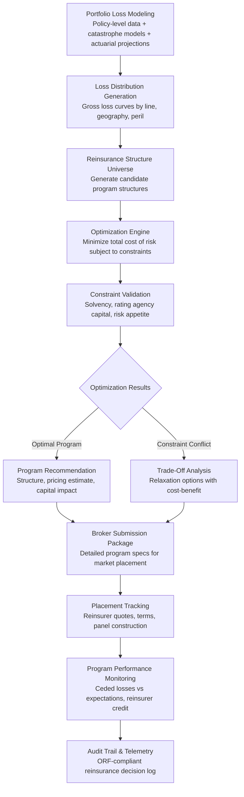

# Reinsurance Optimization Engine

Frankmax

NAICS 522110-524298

> **Banks, Insurers, Financial Foundations** — Reinsurance Optimization Engine

## Objective & Purpose

Reinsurance is the financial architecture behind every insurance company -- the mechanism through which insurers transfer portions of their risk to reinsurers in exchange for premium cessions. For a mid-size insurer, reinsurance spend represents 20-40% of gross written premium, making it one of the largest expense categories. Yet reinsurance placement is one of the least analytically optimized decisions in the industry. Most insurers set their reinsurance programs using a combination of broker recommendations, historical program structures, and management judgment. The result is suboptimal cession strategies: buying too much reinsurance (excessive cost that erodes underwriting profit), buying too little (retaining tail risk that threatens solvency), or structuring layers and attachment points that do not align with the actual loss distribution.

The Reinsurance Optimization Engine applies mathematical optimization to design the most capital-efficient reinsurance program for a given portfolio. The system models the insurer's loss distribution across all lines of business using granular policy-level data, catastrophe models, and actuarial projections. It then evaluates thousands of potential reinsurance structures -- varying treaty types (quota share, surplus, excess of loss, aggregate stop loss), attachment points, limits, co-participation percentages, and multi-year vs. annual terms -- to identify the program that minimizes total cost of risk (retained losses + reinsurance premium + capital cost) subject to constraints (solvency requirements, rating agency capital adequacy, risk appetite limits).

The optimization accounts for factors that manual analysis cannot tractably model: correlation between lines of business under stress scenarios, credit risk of reinsurers (a reinsurer that fails to pay under a catastrophe scenario increases retained loss), multi-year cost implications of program changes, and the interaction between reinsurance structure and rating agency capital models (AM Best, S&P, Moody's). Insurers using optimization-driven reinsurance placement report 10-20% reductions in total cost of risk while maintaining or improving their regulatory and rating agency capital positions.

## Business Context

| Attribute | Value |
|---|---|
| **Business Process** | Reinsurance strategy |
| **Business Function** | Risk Transfer |
| **Category** | Finance |
| **Target Audience** | 9. Banks, Insurers, Financial Foundations |
| **Bundle** | Financial Services Compliance Pack ($8,500/mo) |
| **Monthly Cost of Inaction** | $50K-$500K (suboptimal cessions, excess reinsurance cost, capital inefficiency) |

## BPMN Workflow

## Features

1. **Granular Loss Distribution Modeling** — Builds loss distributions from policy-level exposure data rather than aggregate historical triangles. Incorporates catastrophe model outputs (AIR, RMS, CoreLogic), attritional loss models, and large loss distributions by line, geography, and peril. Produces gross loss curves at the portfolio level and by any segmentation dimension.

2. **Program Structure Exploration** — Generates and evaluates thousands of candidate reinsurance structures: quota share treaties (varying cession percentages), surplus treaties (varying retention and limits), per-occurrence excess of loss (varying attachment and limits), aggregate stop loss (varying deductible and limit), and hybrid structures combining multiple treaty types across lines.

3. **Total Cost of Risk Optimization** — Minimizes total cost of risk (TCR) = retained expected losses + retained catastrophe load + reinsurance premium + cost of capital for retained volatility. The optimization finds the reinsurance structure that delivers the lowest TCR while satisfying all constraints. Results are presented as efficient frontiers showing the trade-off between cost and risk.

4. **Capital Model Integration** — Integrates with regulatory and rating agency capital models: NAIC RBC, Solvency II SCR, AM Best BCAR, S&P Capital Adequacy. Ensures that the optimized reinsurance program meets all capital requirements. Quantifies the capital relief provided by each reinsurance element, enabling capital efficiency comparisons.

5. **Reinsurer Credit Risk Assessment** — Evaluates the credit quality of reinsurers on the proposed panel: financial strength ratings, market reputation, claims payment history, and concentration risk (too much cession to a single reinsurer). Adjusts the effective cost of reinsurance for reinsurer credit risk -- a cheaper quote from a weaker reinsurer may not be the best value.

6. **Scenario and Stress Testing** — Tests the optimized program against extreme scenarios: 1-in-100 and 1-in-250 year catastrophe events, multi-peril accumulation scenarios, pandemic losses, and economic recession scenarios. Validates that the program provides adequate protection under tail conditions, not just expected conditions.

7. **Renewal Optimization** — At program renewal, compares the expiring program against the newly optimized program, quantifying improvement opportunity: premium savings, improved coverage, better capital efficiency, and reduced tail risk. Produces a broker submission package with detailed specifications for market placement.

## Workflow & Automation

**Step 1: Portfolio Data Preparation** — Assemble portfolio data: policy-level exposures (sum insured, location, coverage), historical loss experience (paid, reserved, incurred by line and year), catastrophe model outputs, and actuarial loss projections. Validate data completeness and quality.

**Step 2: Loss Distribution Generation** — Build gross loss distributions by aggregating policy-level risk through catastrophe models and actuarial frequency-severity models. Produce loss curves at the total portfolio level and segmented by line, geography, and peril to support line-specific treaty optimization.

**Step 3: Constraint Definition** — Define the optimization constraints: minimum capital adequacy ratios (regulatory and rating agency), maximum retained loss at various return periods, risk appetite limits by line and peril, and budget constraints on total reinsurance spend.

**Step 4: Optimization Execution** — The engine explores the program structure space, evaluating each candidate against the objective function (minimize TCR) and constraints. The optimization uses mixed-integer programming and genetic algorithms to handle the combinatorial complexity of multi-treaty, multi-line programs.

**Step 5: Results Analysis and Selection** — Present the efficient frontier of optimal programs: cost-risk trade-offs, constraint binding analysis (which constraints are limiting the solution), and sensitivity analysis (how much does the optimal program change if assumptions shift). Management selects the preferred program based on risk appetite and strategic priorities.

**Step 6: Market Placement and Monitoring** — Generate the broker submission package with detailed program specifications. Track placement progress: reinsurer quotes, terms negotiations, and final panel construction. Post-placement, monitor program performance: ceded losses vs. expectations, reinsurer claims payment, and actual capital impact.

## Input/Output Specifications

| Direction | Data | Format | Description |
|---|---|---|---|
| Input | Policy-level exposure data | CSV / API (policy admin) | Insured values, locations, coverages, limits |
| Input | Historical loss data | CSV / database | Paid, reserved, and incurred losses by line and year |
| Input | Catastrophe model outputs | CSV / API (AIR, RMS) | Event loss tables, annual exceedance probability curves |
| Input | Actuarial projections | CSV / JSON | Expected loss ratios, frequency-severity parameters |
| Input | Capital model parameters | JSON / manual | RBC factors, BCAR weights, Solvency II parameters |
| Output | Optimized program structure | JSON + PDF | Treaty specifications, attachment, limits, pricing |
| Output | Efficient frontier analysis | JSON + interactive dashboard | Cost-risk trade-off visualization |
| Output | Broker submission package | PDF / XLSX | Market-ready program specifications |
| Output | Audit trail | JSON (immutable log) | ORF-compliant reinsurance decision log |

## Integration Points

| System | Integration Type | Data Flow |
|---|---|---|
| **Actuarial Model Accelerator** | Bidirectional | Actuarial loss projections feed optimization; reinsurance structure feeds net loss modeling |
| **Cyber Insurance Risk Modeler** | Inbound accumulation data | Cyber portfolio accumulation exposure informs reinsurance cyber treaty design |
| **Underwriting Intelligence Engine** | Inbound portfolio data | Underwriting mix and trends inform loss distribution modeling |
| **Regulatory Reporting Automator** | Outbound data | Reinsurance program details feed Schedule F and regulatory capital reporting |
| **Claims Processing Accelerator** | Inbound loss data | Claims experience feeds loss distribution calibration |
| **Multi-Model AI Orchestrator** | Infrastructure | Optimization compute allocation |
| **Audit Trail and Traceability Engine** | Outbound log stream | All reinsurance decisions logged immutably |
| **Failure Intelligence Library** | Outbound anonymized patterns | Reinsurance program performance patterns feed cross-industry intelligence |

## Pricing & Revenue Model

| Component | Pricing | Notes |
|---|---|---|
| **Financial Services Compliance Pack** | $8,500/month | Reinsurance Optimizer + AML/KYC + Regulatory Reporting + 2M AI tokens |
| **Standalone -- Subscription** | $6,000/month | Single-line optimization, annual renewal cycle |
| **Enterprise tier** | $9,500/month | Multi-line, multi-peril, continuous optimization |
| **Per-renewal optimization fee** | $15,000-$50,000 one-time | Full program optimization at renewal with broker package |
| **Stress testing module** | +$1,500/month | Scenario-based program stress testing |
| **AI token consumption** | Included at 80% discount | 2M tokens/month in bundle; overage at marketplace rates |

**Revenue model**: Reinsurance Optimization delivers measurable ROI -- a 10% improvement in total cost of risk for an insurer with $50M in reinsurance spend saves $5M annually. The "burger" is optimization capability at 50-70% of the cost of consulting-led reinsurance advisory ($200K-$500K per engagement). The "fries" attach through capital model integration, regulatory reporting, and stress testing at 75-90% margin. Annual renewal cycles create natural recurring revenue.

## NAICS/SIC Mapping

| NAICS Code | SIC Code | Industry | Relevance |
|---|---|---|---|
| 524130 | 6321 | Reinsurance Carriers | Direct reinsurance program optimization |
| 524126 | 6321 | Direct Property and Casualty Insurance | P&C reinsurance cession strategy |
| 524114 | 6311 | Direct Health and Medical Insurance | Health reinsurance optimization |
| 524113 | 6311 | Direct Life Insurance | Life reinsurance program design |
| 524210 | 6411 | Insurance Agencies and Brokerages | Reinsurance brokerage advisory |
| 524298 | 6411 | All Other Insurance Activities | Reinsurance analytics and advisory |
| 523920 | 6282 | Portfolio Management | ILS and cat bond portfolio optimization |
