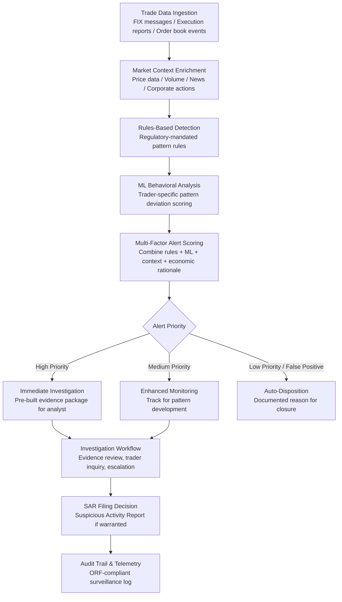

# Trade Surveillance Engine

Frankmax

NAICS 522110-524298

> **Banks, Insurers, Financial Foundations** — Trade Surveillance Engine

## Objective & Purpose

Regulators worldwide mandate that financial institutions monitor trading activity for market abuse: insider trading, market manipulation, spoofing, layering, front-running, and wash trading. FINRA, the SEC, FCA (UK), BaFin (Germany), MAS (Singapore), and ASIC (Australia) all require documented surveillance programs with demonstrable detection capabilities. The volume challenge is staggering: a mid-size broker-dealer processes 5-50 million order and trade messages per day. A global bank with capital markets operations processes 100M+ messages daily across equities, fixed income, FX, commodities, and derivatives. Traditional rules-based surveillance systems generate massive false positive rates -- typically 95-99% of alerts are false positives -- creating an analyst workforce that spends nearly all its time dismissing benign alerts rather than investigating genuine suspicious activity.

The Trade Surveillance Engine applies AI to dramatically reduce false positive rates while improving detection of genuine market abuse. The system ingests real-time order and trade data (FIX messages, execution reports, order book events), enriches it with market context (price movements, volume patterns, news events, corporate actions), and applies both rules-based detection (required by regulators as a baseline) and machine learning models that learn the normal trading patterns of each trader, desk, and strategy. Anomalies are scored by a multi-factor model that considers: deviation from the trader's historical pattern, market context at the time of the activity, economic rationale (or lack thereof) for the observed behavior, and similarity to known manipulation patterns.

The result is a 60-80% reduction in false positive alerts while improving detection of genuine suspicious activity. Analysts focus on the 20-40% of alerts that represent real investigative leads rather than wading through 95% noise. Each investigation is supported by a pre-built evidence package: the suspicious activity, the trader's historical context, market conditions at the time, economic analysis, and comparison to known manipulation patterns. This evidence package reduces investigation time from hours to minutes per alert, enabling compliance teams to handle higher alert volumes with smaller teams while meeting regulatory expectations for surveillance program effectiveness.

## Business Context

| Attribute | Value |
|---|---|
| **Business Process** | Market abuse detection |
| **Business Function** | Compliance |
| **Category** | Regulatory |
| **Target Audience** | 9. Banks, Insurers, Financial Foundations |
| **Bundle** | Financial Services Compliance Pack ($8,500/mo) |
| **Monthly Cost of Inaction** | $50K-$1M (regulatory fines, enforcement actions, reputational damage) |

## BPMN Workflow

## Features

1. **High-Volume Trade Data Processing** — Ingests and processes 50M-500M+ order and trade messages per day across asset classes: equities, fixed income, FX, commodities, listed derivatives, and OTC instruments. Supports FIX protocol, proprietary exchange formats, and internal order management system feeds. Sub-second processing latency for real-time surveillance.

2. **Multi-Asset Manipulation Detection** — Pre-built detection models for 25+ market abuse patterns: spoofing (placing orders with intent to cancel), layering (building order book depth to create false impressions), wash trading (self-dealing to inflate volume), front-running (trading ahead of client orders), insider trading (unusual activity before material announcements), marking the close (manipulating closing prices), and cross-market manipulation (activity across correlated instruments).

3. **Trader Behavioral Profiling** — Builds behavioral baselines for each trader covering: typical order sizes, preferred execution venues, cancellation rates, order-to-trade ratios, time-of-day patterns, instrument preferences, and holding periods. Anomalies are scored relative to the individual's baseline, reducing false positives from traders who naturally exhibit high-activity patterns.

4. **Economic Rationale Engine** — For flagged activity, evaluates whether a legitimate economic rationale exists: portfolio rebalancing, hedging existing positions, market-making obligations, or response to news events. Activity with clear economic justification receives reduced alert priority. Activity without apparent rationale receives elevated priority.

5. **Cross-Market Surveillance** — Detects manipulation that spans multiple markets or instruments: trading in one instrument to benefit a position in a correlated instrument, cross-venue arbitrage manipulation, and cross-asset manipulation (e.g., trading equities based on advance knowledge of pending bond issuance). Particularly important for institutions with multi-asset trading operations.

6. **Investigation Workbench** — When an alert requires investigation, the system provides a complete evidence package: the flagged activity with timeline visualization, the trader's historical context, market conditions at the time, economic analysis, comparison to known manipulation patterns, and communication records (where available). Analysts investigate rather than assemble evidence.

7. **Regulatory Reporting Integration** — When investigations confirm suspicious activity, the system supports SAR (Suspicious Activity Report) filing with pre-populated narrative, supporting evidence, and regulatory-specific formatting. Tracks filing deadlines and maintains a complete record of surveillance program activity for regulatory examination.

## Workflow & Automation

**Step 1: Data Integration** — Connect to order management systems, execution management systems, market data feeds, and trade repositories. Configure data feeds for all asset classes and trading venues. Validate data quality: message sequencing, timestamp accuracy, and reference data completeness.

**Step 2: Baseline Establishment** — Analyze 6-12 months of historical trading data to build behavioral baselines for each trader and desk. Calibrate rules-based detection thresholds against historical alert volumes and investigation outcomes. Train ML models on labeled data (confirmed manipulation vs. benign activity).

**Step 3: Real-Time Surveillance** — Deploy surveillance models to production. Order and trade messages are processed in real time, enriched with market context, and evaluated by both rules engines and ML models. Alerts are generated, scored, and prioritized for analyst review.

**Step 4: Alert Triage and Investigation** — Analysts review prioritized alerts through the investigation workbench. High-priority alerts receive immediate investigation with pre-assembled evidence packages. Medium-priority alerts enter enhanced monitoring. Low-priority alerts are auto-dispositioned with documented rationale.

**Step 5: Escalation and Reporting** — Confirmed suspicious activity is escalated through the compliance governance framework: senior compliance officer review, legal consultation, and SAR filing decision. The system generates SAR narrative and supporting exhibits, tracks filing deadlines, and logs all actions.

**Step 6: Model Governance and Improvement** — Monthly surveillance program reviews evaluate: alert volumes and trends, false positive rates by detection model, investigation outcomes, and model performance metrics. Investigation outcomes feed model improvement: confirmed manipulations strengthen detection; confirmed false positives refine thresholds.

## Input/Output Specifications

| Direction | Data | Format | Description |
|---|---|---|---|
| Input | Order and trade data | FIX / proprietary / CSV | Orders, executions, cancellations, modifications |
| Input | Market data | API (exchanges, data vendors) | Prices, volumes, order book depth, corporate actions |
| Input | Reference data | API / CSV | Instrument master, trader IDs, desk assignments |
| Input | News and announcements | API (news feeds) | Material events for insider trading context |
| Input | Communication metadata | API (compliance recording systems) | Voice and electronic communication timestamps |
| Output | Prioritized alert queue | JSON + investigation dashboard | Scored alerts with evidence packages |
| Output | Investigation records | JSON + PDF | Complete investigation documentation |
| Output | SAR filings | JSON + regulatory format | Suspicious Activity Report with supporting evidence |
| Output | Audit trail | JSON (immutable log) | ORF-compliant surveillance program log |

## Integration Points

| System | Integration Type | Data Flow |
|---|---|---|
| **AML/KYC Automation Platform** | Bidirectional | Trader KYC data enriches surveillance; suspicious activity feeds AML |
| **Fraud Detection Neural Network** | Cross-reference | Trade fraud patterns cross-referenced with broader fraud detection |
| **Regulatory Reporting Automator** | Outbound data | Surveillance metrics and SAR data feed regulatory submissions |
| **Credit Risk Modeler** | Cross-reference | Trading counterparty credit exposure monitoring |
| **Board Decision Intelligence** | Outbound summary | Surveillance program metrics in compliance board reporting |
| **Multi-Model AI Orchestrator** | Infrastructure | Model routing and real-time scoring compute allocation |
| **Audit Trail and Traceability Engine** | Outbound log stream | All surveillance activities logged immutably |
| **Failure Intelligence Library** | Outbound anonymized patterns | Market abuse patterns feed cross-industry intelligence |

## Pricing & Revenue Model

| Component | Pricing | Notes |
|---|---|---|
| **Financial Services Compliance Pack** | $8,500/month | Trade Surveillance + AML/KYC + Regulatory Reporting + 2M AI tokens |
| **Standalone -- Subscription** | $6,500/month | Single asset class, up to 10M messages/day |
| **Multi-asset tier** | $10,000/month | All asset classes, up to 100M messages/day |
| **Enterprise tier (over 100M/day)** | Custom pricing | Dedicated instance, custom models, SLA guarantees |
| **Cross-market surveillance** | +$2,000/month | Multi-venue and cross-asset manipulation detection |
| **AI token consumption** | Included at 80% discount | 2M tokens/month in bundle; overage at marketplace rates |

**Revenue model**: Trade Surveillance Engine sells on regulatory compliance -- market abuse surveillance is not optional. The value proposition is efficiency: 60-80% false positive reduction means 60-80% less analyst time wasted. A compliance team of 10 analysts at $120K average cost ($1.2M/year) that recovers 60% of their time effectively saves $720K annually. The "fries" attach through cross-market detection, regulatory reporting, and investigation management at 75-90% margin.

## NAICS/SIC Mapping

| NAICS Code | SIC Code | Industry | Relevance |
|---|---|---|---|
| 523110 | 6211 | Investment Banking | Trading desk surveillance |
| 523120 | 6211 | Securities Brokerage | Broker-dealer trade monitoring |
| 523130 | 6211 | Commodity Contracts | Commodity trading surveillance |
| 523140 | 6211 | Commodity Contracts Brokerage | Commodity broker compliance |
| 522110 | 6021 | Commercial Banking | Bank trading operations surveillance |
| 523920 | 6282 | Portfolio Management | Investment manager trading compliance |
| 523991 | 6289 | Trust, Fiduciary, and Custody | Trust trading surveillance |
