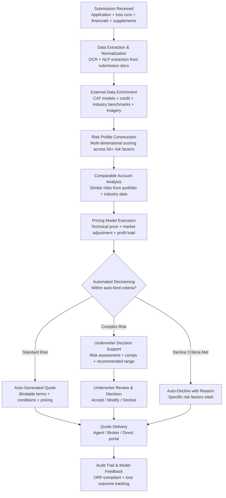

# Underwriting Intelligence Engine

Frankmax

NAICS 524113-524298

> **Banks, Insurers, Financial Foundations** — Financial Services AI Operations

## Objective & Purpose

Insurance underwriting -- the process of evaluating risk, setting terms, and pricing coverage -- remains one of the most manually intensive functions in financial services. A commercial lines underwriter processes 20-40 submissions per week, spending 4-8 hours per submission reviewing applications, loss history, financial statements, inspection reports, and third-party data before making a risk selection and pricing decision. For complex risks (large commercial, specialty, reinsurance), the process stretches to 2-4 weeks per submission. Industry-wide, manual underwriting creates three compounding problems: inconsistency (two underwriters pricing the same risk can produce quotes that differ by 30-50%), speed (slow turnaround loses business to faster competitors -- 60% of commercial submissions are declined or non-renewed due to slow response), and adverse selection (without comprehensive data analysis, underwriters inadvertently select higher-risk accounts while losing lower-risk business to competitors with better analytics).

The Underwriting Intelligence Engine automates 70-80% of the underwriting workflow for standard commercial lines and personal lines, while providing AI-augmented decision support for complex and specialty risks. The system ingests submission data (applications, loss runs, financial statements, inspection reports), enriches it with 50+ external data sources (catastrophe models, credit data, industry loss benchmarks, satellite imagery, social media sentiment), builds a multi-dimensional risk profile, and generates a pricing recommendation with confidence intervals. For standard risks, the system produces a bindable quote in under 15 minutes. For complex risks, it pre-analyzes the submission and presents the underwriter with a structured risk assessment, comparable accounts, and a recommended pricing range -- reducing analysis time from 8 hours to 45 minutes.

The strategic value extends beyond operational efficiency. Every underwriting decision generates telemetry that improves the marketplace's risk models. Loss experience data from claims (fed by the Claims Processing Accelerator) flows back into underwriting models, creating a closed-loop learning system where claims outcomes continuously refine risk selection and pricing accuracy. This flywheel -- underwriting data improving claims models, claims data improving underwriting models -- is the core insurance industry moat.

## Business Context

| Attribute | Value |
|---|---|
| **Business Process** | Risk assessment, selection, and pricing |
| **Business Function** | Underwriting |
| **Category** | Analytics |
| **Target Audience** | 9. Banks, Insurers, Financial Foundations |
| **Bundle** | Financial Services Compliance Pack ($8,500/mo) or Insurance Operations Pack (custom) |
| **Decision Maker** | Chief Underwriting Officer, VP Underwriting, Line of Business Heads |
| **Impact Metric** | Loss ratio improvement of 3-8 points; quote turnaround from days to minutes |
| **Build Complexity** | 7/10 (requires actuarial validation and regulatory approval for rate filings) |

## BPMN Workflow

## Features

1. **Automated Submission Intake** — Processes insurance submissions in any format: ACORD applications (125, 126, 130, 131, 140), supplemental questionnaires, loss run PDFs, financial statements, inspection reports, and broker cover notes. AI extraction converts unstructured documents into structured risk data in under 5 minutes per submission.

2. **50+ External Data Source Enrichment** — Supplements application data with external intelligence: catastrophe models (RMS, AIR, CoreLogic for property; NatCat for liability), credit bureau data (D&B for commercial, consumer credit for personal lines), industry loss benchmarks (ISO, NCCI, A.M. Best), satellite and aerial imagery (roof condition, property exposure, flood zone), weather history, building code databases, OSHA violation records, litigation history, and social media/review sentiment.

3. **Multi-Dimensional Risk Scoring** — Evaluates each submission across 50+ risk factors organized in five domains: (a) hazard characteristics (property construction, occupancy, protection, exposure; liability operations and products), (b) loss history (frequency, severity, trend, development), (c) financial stability (revenue, profitability, leverage, credit), (d) management quality (claims management, safety programs, contractual risk transfer), (e) external factors (catastrophe exposure, industry trends, regulatory environment).

4. **Comparable Account Analysis** — Matches each submission against similar accounts in the insurer's portfolio and industry benchmarks. Comparable selection uses multi-factor matching: industry class, revenue band, geographic region, coverage structure, and risk profile. Provides pricing, terms, and loss experience of comparable accounts to inform the underwriting decision.

5. **Technical Pricing Engine** — Calculates technical price (the actuarially indicated premium) using loss cost models calibrated to the specific risk: expected loss frequency x expected loss severity + loss adjustment expense + underwriting expense + profit/contingency load. Adjusts for specific risk characteristics, trend factors, catastrophe loading, and reinsurance costs. Outputs a recommended premium with 90% confidence interval.

6. **Automated Decisioning for Standard Risks** — Submissions meeting auto-bind criteria (within defined risk appetite, below complexity threshold, clean loss history, adequate information) are processed end-to-end without human intervention. Target auto-bind rate: 40-60% for personal lines, 15-30% for standard commercial lines. Each auto-bound policy reduces underwriting cost from $150-$400 per submission to under $5.

7. **Underwriter Decision Support Dashboard** — For complex risks requiring human judgment, the system presents a structured analysis: risk profile with factor-level scores, comparable accounts with outcomes, recommended pricing range with confidence intervals, specific risk concerns flagged, suggested terms and conditions, and portfolio impact analysis (how this account affects the book's overall risk profile).

8. **Closed-Loop Learning from Claims** — Loss experience data from the Claims Processing Accelerator flows back into underwriting models on a monthly cycle. Accounts that performed worse than expected are analyzed for the risk factors that the model underweighted; accounts that performed better than expected identify factors the model overweighted. Continuous recalibration improves pricing accuracy by 1-2 loss ratio points annually.

## Workflow & Automation

**Step 1: Submission Intake & Extraction** — A new submission arrives from a broker, agent, or direct channel. The system processes all attached documents using AI extraction: ACORD applications yield structured risk data fields; loss runs yield claims history; financial statements yield revenue, assets, and profitability metrics; inspection reports yield property condition and hazard details. All extracted data populates a unified risk record.

**Step 2: Data Enrichment** — The system queries external data sources to supplement the submission: catastrophe model scores for property locations, credit scores for the insured entity, industry loss benchmarks for the classification code, satellite imagery for property condition assessment, OSHA records for workplace safety, and litigation database searches for claims history. Enrichment completes within 2-5 minutes.

**Step 3: Risk Profile Construction** — The multi-dimensional risk scoring model evaluates the enriched data across all risk factors. Each factor receives a score (1-10) with a confidence level and weighting. Factors are aggregated into domain-level scores (hazard, loss history, financial, management, external) and an overall risk score. The risk profile is compared against the insurer's defined risk appetite parameters.

**Step 4: Comparable Account Matching** — The system identifies the most similar accounts in the insurer's historical portfolio using multi-factor matching. For each comparable account: original pricing, actual loss experience, current renewal pricing, and any underwriting notes. If insufficient portfolio comparables exist, industry benchmarks are used. Comparables provide context for pricing and terms decisions.

**Step 5: Pricing Calculation** — The technical pricing engine calculates the indicated premium using applicable loss cost data, adjusted for the specific risk's characteristics. The calculation layer applies: base rate x schedule modifications x experience modifications x catastrophe load x expense load x profit load. The output is a recommended premium with a confidence range. Market competitiveness adjustments can be applied within defined guardrails.

**Step 6: Decision & Quote Generation** — For auto-eligible submissions: the system generates a complete quote package (declarations page, coverage terms, conditions, exclusions, premium, and payment options) and delivers it to the agent/broker portal. For complex submissions: the underwriter reviews the structured analysis on the decision support dashboard and makes the selection, pricing, and terms decision. The underwriter's decision is captured with reasoning for audit and model improvement.

**Step 7: Feedback Loop & Model Improvement** — All underwriting decisions are logged with the complete risk analysis that supported them. As policies earn and claims develop, actual loss experience is matched back to the original underwriting assessment. Variance between expected and actual loss drives model recalibration. The closed-loop learning cycle executes monthly, with major model updates quarterly.

## Input/Output Specifications

| Direction | Data | Format | Description |
|---|---|---|---|
| Input | Insurance submissions | ACORD XML / PDF / DOCX | Applications, supplementals, loss runs, financials |
| Input | Policy data | ACORD AL3 / API | In-force coverage, terms, premium, endorsements |
| Input | External data sources | APIs (50+ providers) | CAT models, credit, imagery, weather, OSHA, litigation |
| Input | Portfolio data | Database / API | Historical book of business, loss triangles, pricing history |
| Input | Rate filings | ISO / NCCI / proprietary | Loss costs, class codes, rate factors |
| Output | Risk assessment | JSON + PDF | Multi-dimensional risk profile with factor-level scoring |
| Output | Pricing recommendation | JSON | Technical price, confidence interval, comparable benchmarks |
| Output | Quote package | PDF / API (portal integration) | Declarations, terms, conditions, premium, payment options |
| Output | Underwriter dashboard | REST API / UI | Structured analysis, comparables, portfolio impact |
| Output | Audit trail | JSON (immutable log) | ORF-compliant underwriting decision history |

## Integration Points

| System | Integration Type | Data Flow |
|---|---|---|
| **Claims Processing Accelerator** | Bidirectional | Claims experience feeds underwriting models; underwriting data contextualizes claims |
| **Fraud Detection Neural Network** | Inbound signals | Application fraud scores inform underwriting risk assessment |
| **AML/KYC Automation Platform** | Inbound verification | Applicant identity and risk data for large/complex accounts |
| **Regulatory Reporting Automator** | Outbound data | Underwriting and reserving data feed statutory filings |
| **Actuarial Model Accelerator** | Bidirectional | Actuarial loss cost models feed pricing; underwriting data feeds reserving |
| **Multi-Model AI Orchestrator** | Infrastructure | AI model routing for document extraction, risk scoring, and pricing |
| **Policy Administration System** | Bidirectional API | Submission data in; bound policy data out |
| **Audit Trail & Traceability Engine** | Outbound log stream | All underwriting decisions logged immutably |

## Pricing & Revenue Model

| Component | Pricing | Notes |
|---|---|---|
| **Financial Services Compliance Pack** | $8,500/month | Includes core underwriting intelligence with compliance stack |
| **Standalone — Personal lines** | $3,200/month | Auto, home, umbrella; up to 50,000 quotes/month |
| **Standalone — Commercial lines** | $6,500/month | Standard commercial (BOP, GL, property, WC); up to 10,000 submissions/month |
| **Specialty lines module** | +$3,500/month | E&O, D&O, cyber, environmental, marine, aviation |
| **Enterprise (multi-line carrier)** | Custom pricing | All lines, dedicated models, SLA guarantees |
| **Catastrophe modeling integration** | +$2,000/month | RMS, AIR, CoreLogic model connectivity and scoring |
| **Auto-bind module** | +$1,200/month | Straight-through processing for auto-eligible submissions |

**Revenue model**: Underwriting Intelligence drives insurer profitability directly -- a 3-8 point loss ratio improvement on a $500M premium book translates to $15M-$40M in annual underwriting profit improvement. The platform's pricing ($80K-$200K annually) delivers 100-200x ROI when measured against loss ratio improvement. The "fries" attach through audit trail compliance (every underwriting decision must be explainable to regulators), regulatory reporting (rate filing support), and claims integration. The closed-loop learning system between underwriting and claims creates deep platform lock-in: historical model calibration is lost if the insurer switches.

## NAICS/SIC Mapping

| NAICS Code | SIC Code | Industry | Relevance |
|---|---|---|---|
| 524126 | 6321 | Direct Property and Casualty Insurance | P&C underwriting automation |
| 524114 | 6311 | Direct Health and Medical Insurance | Health insurance underwriting |
| 524113 | 6311 | Direct Life Insurance | Life and annuity underwriting |
| 524127 | 6331 | Direct Title Insurance | Title underwriting risk assessment |
| 524128 | 6399 | Other Direct Insurance | Specialty lines underwriting |
| 524130 | 6321 | Reinsurance Carriers | Reinsurance underwriting and treaty pricing |
| 524210 | 6411 | Insurance Agencies and Brokerages | Delegated underwriting authority (MGA/MGU) |
| 524291 | 6399 | Claims Adjusting | Claims-informed underwriting feedback |
