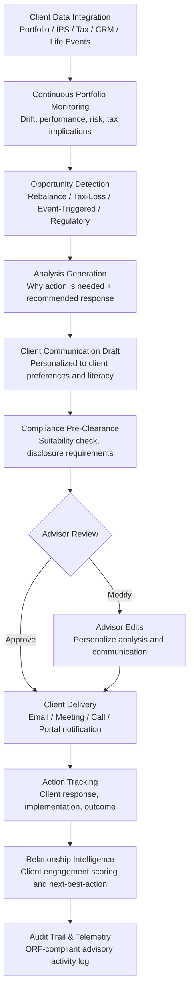

# Wealth Management Copilot

Frankmax

NAICS 522110-524298

> **Banks, Insurers, Financial Foundations** — Wealth Management Copilot

## Objective & Purpose

Financial advisors at wealth management firms serve 100-300+ client households each. Each client has unique investment objectives, risk tolerance, tax circumstances, estate planning needs, and life events that require portfolio adjustments. The advisor's challenge is maintaining deep, personalized knowledge of every client while simultaneously monitoring markets, managing compliance, and prospecting for new business. The reality is that most advisors default to periodic reviews (quarterly or annually) rather than proactive, event-driven client engagement. A client experiences a major life event -- retirement, divorce, inheritance, business sale -- and the advisor may not learn about it until the next scheduled review, weeks or months after optimal action should have been taken.

The Wealth Management Copilot acts as an AI-powered research, analysis, and communication assistant for financial advisors. The system monitors each client's portfolio in real time against their investment policy statement (IPS), tax situation, and life circumstances. It identifies rebalancing needs (drift from target allocation), tax-loss harvesting opportunities (positions with harvestable losses paired with economically similar replacement securities), and event-triggered advice needs (market events that disproportionately affect specific client portfolios, regulatory changes affecting estate plans, or economic developments relevant to client-held concentrated positions).

For each identified opportunity, the Copilot generates advisor-ready materials: a brief analysis explaining why action is needed, the recommended action with expected impact, a draft client communication (email, meeting agenda, or presentation slide) personalized to the client's communication preferences and financial literacy level, and compliance pre-clearance documentation. The advisor reviews, modifies if needed, and delivers -- transforming from a reactive, periodic service model to a proactive, event-driven advisory relationship. Firms deploying AI copilots for advisors report 25-40% increases in client meeting frequency, 15-25% improvements in client retention, and 10-20% growth in wallet share (AUM per client) through more timely advice delivery.

## Business Context

| Attribute | Value |
|---|---|
| **Business Process** | Client advisory |
| **Business Function** | Wealth Management |
| **Category** | Client Service |
| **Target Audience** | 9. Banks, Insurers, Financial Foundations |
| **Bundle** | Financial Services Compliance Pack ($8,500/mo) |
| **Monthly Cost of Inaction** | $30K-$200K (client attrition, missed wallet share, compliance gaps) |

## BPMN Workflow

## Features

1. **Real-Time Portfolio Monitoring** — Monitors every client portfolio against their IPS parameters: asset allocation drift (threshold-based rebalancing triggers), performance attribution (which positions contributed to or detracted from returns), risk metrics (volatility, concentration, drawdown), and benchmark comparison. Identifies portfolios requiring attention before the advisor's next scheduled review.

2. **Tax-Loss Harvesting Engine** — Continuously scans client portfolios for tax-loss harvesting opportunities: positions with unrealized losses paired with economically similar replacement securities that maintain market exposure while realizing the tax benefit. Accounts for wash sale rules (30-day purchase restrictions), substantially identical security rules, and client-specific tax situations (tax bracket, capital gain/loss carryforwards).

3. **Event-Triggered Advice Generation** — Monitors for events that should trigger proactive client outreach: market events (sector rotation affecting concentrated positions, interest rate changes affecting bond portfolios), regulatory changes (estate tax threshold adjustments, retirement contribution limit changes), and life events (detected through CRM data, data aggregation, or public records -- home purchase, job change, marriage, divorce, inheritance).

4. **Personalized Communication Drafting** — Generates client-ready communications tailored to each client's profile: financial literacy level (simplified explanations for less sophisticated clients, technical detail for financially savvy clients), communication preference (email length, visual vs. text, frequency), and relationship stage (new client onboarding vs. long-term relationship maintenance).

5. **Meeting Preparation Assistant** — Before each client meeting, assembles a complete briefing package: portfolio performance since last meeting, actions taken, market outlook relevant to client's portfolio, recommended discussion topics (rebalancing, tax planning, estate review, insurance gaps), and suggested next steps. Reduces meeting preparation from 30-60 minutes to 5-10 minutes per client.

6. **Compliance Pre-Clearance** — Every recommendation generated by the Copilot passes through a compliance check: suitability validation against the client's IPS and risk profile, disclosure requirement identification (revenue sharing, conflicts of interest), and regulatory documentation preparation. Ensures that advisor recommendations meet fiduciary and suitability standards before client delivery.

7. **Relationship Intelligence Dashboard** — Tracks advisor-client engagement across the entire book: last contact date, meeting frequency, communication sentiment, wallet share trends, and retention risk signals. Identifies clients who are underserved (no contact in 90+ days), at risk (declining engagement), or ripe for deepening (high engagement, growing AUM, cross-sell potential).

## Workflow & Automation

**Step 1: Client Data Integration** — Connect to portfolio management systems (Envestnet, Orion, Black Diamond), financial planning tools (MoneyGuidePro, eMoney), CRM (Salesforce, Wealthbox, Redtail), custodian platforms (Schwab, Fidelity, Pershing), and tax preparation systems. Build comprehensive client profiles combining investment, financial planning, and relationship data.

**Step 2: Continuous Monitoring** — The Copilot continuously monitors all client portfolios against their investment parameters. Market movements, corporate actions, and regulatory changes are evaluated for client-specific impact. When an opportunity or concern is detected, it enters the analysis generation pipeline.

**Step 3: Opportunity Analysis and Recommendation** — For each detected opportunity, the system generates a brief analysis: what was detected, why it matters to this specific client, what action is recommended, and what the expected impact is (return improvement, tax savings, risk reduction). Multiple recommendations for the same client are bundled and prioritized.

**Step 4: Communication Drafting** — The system generates a client-facing communication appropriate to the opportunity type and client profile: a brief email for routine rebalancing, a meeting request for significant portfolio changes, or a detailed letter for tax planning opportunities. Communications are personalized to the client's name, portfolio specifics, and communication style.

**Step 5: Advisor Review and Delivery** — The advisor reviews the generated analysis and communication, adds personal touches, modifies recommendations based on knowledge the system does not have (recent conversations, personal circumstances), and delivers to the client. Every advisor interaction is logged for compliance and relationship tracking.

**Step 6: Outcome Tracking and Learning** — Track client responses to recommendations: was the advice implemented, how did the client respond to the communication, and what was the portfolio outcome? Positive outcomes reinforce the recommendation patterns; negative outcomes trigger model refinement. Engagement metrics feed the relationship intelligence dashboard.

## Input/Output Specifications

| Direction | Data | Format | Description |
|---|---|---|---|
| Input | Portfolio data | API (Envestnet, Orion, Black Diamond) | Holdings, transactions, performance, allocation |
| Input | Client profiles | API (CRM) | Demographics, preferences, IPS, financial plan |
| Input | Market data | API (market data vendors) | Prices, indices, economic indicators, news |
| Input | Tax data | API (tax platforms) / manual | Tax brackets, capital gains, carryforwards |
| Input | Regulatory updates | API (compliance feeds) | Investment regulation changes, disclosure requirements |
| Output | Opportunity alerts | JSON + advisor dashboard | Detected opportunities with analysis and priority |
| Output | Client communications | Email draft / PDF / meeting agenda | Personalized, advisor-ready client materials |
| Output | Meeting prep packages | PDF + dashboard | Pre-meeting briefing with discussion topics |
| Output | Audit trail | JSON (immutable log) | ORF-compliant advisory activity and suitability log |

## Integration Points

| System | Integration Type | Data Flow |
|---|---|---|
| **Credit Risk Modeler** | Cross-reference | Client credit profile informs lending-related wealth advice |
| **Regulatory Reporting Automator** | Outbound data | Advisory activity data feeds Form ADV and compliance filings |
| **AML/KYC Automation Platform** | Inbound verification | Client identity verification and enhanced due diligence |
| **Policyholder Behavior Predictor** | Cross-reference | Insurance policy data informs comprehensive financial planning |
| **Trade Surveillance Engine** | Outbound trade data | Advisor trading activity monitored for compliance |
| **Multi-Model AI Orchestrator** | Infrastructure | Model routing for portfolio analysis and communication generation |
| **Audit Trail and Traceability Engine** | Outbound log stream | All advisory activities logged immutably |
| **Failure Intelligence Library** | Outbound anonymized patterns | Advisory failure patterns feed cross-industry intelligence |

## Pricing & Revenue Model

| Component | Pricing | Notes |
|---|---|---|
| **Financial Services Compliance Pack** | $8,500/month | Wealth Copilot + AML/KYC + Regulatory Reporting + 2M AI tokens |
| **Standalone -- per advisor** | $500/month per advisor | Up to 300 client households per advisor |
| **Enterprise tier (over 50 advisors)** | $350/month per advisor | Volume discount for large advisory firms |
| **Tax-loss harvesting module** | +$200/month per advisor | Continuous tax optimization scanning |
| **Meeting preparation module** | +$150/month per advisor | Automated pre-meeting briefing packages |
| **AI token consumption** | Included at 80% discount | 2M tokens/month in bundle; overage at marketplace rates |

**Revenue model**: Wealth Management Copilot sells on advisor productivity and client retention. An advisor managing $200M AUM who increases wallet share by 15% generates $30M in additional AUM. At a 1% advisory fee, that is $300K in additional annual revenue from a $500/month tool investment. The "fries" attach through compliance documentation, tax optimization, and relationship intelligence at 75-90% margin. Per-advisor pricing scales linearly with firm growth.

## NAICS/SIC Mapping

| NAICS Code | SIC Code | Industry | Relevance |
|---|---|---|---|
| 523920 | 6282 | Portfolio Management | RIA and asset management advisory |
| 523930 | 6282 | Investment Advice | Financial planning and advisory services |
| 522110 | 6021 | Commercial Banking | Private banking wealth management |
| 523120 | 6211 | Securities Brokerage | Wirehouse and broker-dealer advisory |
| 523991 | 6289 | Trust, Fiduciary, and Custody | Trust and fiduciary wealth services |
| 524210 | 6411 | Insurance Agencies and Brokerages | Insurance-based financial planning |
| 524113 | 6311 | Direct Life Insurance | Life insurance-linked wealth advisory |
