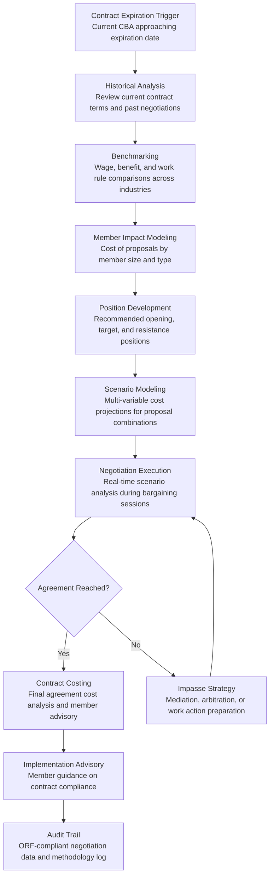

# Collective Bargaining Intelligence

Frankmax

NAICS 813910-813990

> **National Industry Bodies** — Member Services Intelligence Module

## Objective & Purpose

Collective bargaining negotiations between industry bodies (representing employers) and labor unions consume 3-12 months per cycle, involve millions of dollars in legal fees, and produce outcomes that bind member companies for 3-5 years. Yet management-side bargaining teams typically enter negotiations with limited data: a few comparable contracts from peer industries, anecdotal feedback from members, and legal counsel's intuition about what the union will accept. The union side, by contrast, often has sophisticated research departments that compile industry-wide wage data, benefit comparisons, and productivity metrics. This information asymmetry costs industry bodies 2-5% more in wage and benefit concessions than data-supported negotiation would yield -- translating to $50M-$500M in excess labor costs across a major industry sector over a contract term.

The Collective Bargaining Intelligence tool levels the playing field by compiling comprehensive negotiation intelligence: historical contract databases (searchable across industries, regions, and time periods), wage and benefit benchmarking (actual vs. market rates by role, geography, and experience), economic scenario modeling (how different contract terms affect member competitiveness over the contract period), and precedent analysis (how similar proposals have resolved in comparable negotiations). The engine produces negotiation preparation packages that include recommended positions, fallback ranges, cost models for every proposal, and real-time scenario analysis during the negotiation itself.

Within the $3,000-$5,000/month Intelligence Pack, this tool serves industry bodies involved in multi-employer bargaining (construction, hospitality, maritime, healthcare, entertainment) where the industry body directly negotiates on behalf of its membership. The governance layer (methodology documentation, cost model assumptions, data source audit trail) is critical because bargaining positions must withstand scrutiny from labor mediators, arbitrators, and potentially the NLRB. Every number presented at the table must be defensible.

## Business Context

| Attribute | Value |
|---|---|
| **Business Process** | Negotiation support and labor relations strategy |
| **Business Function** | Labor Relations |
| **Category** | Legal |
| **Target Audience** | 10. National Industry Bodies |
| **Bundle** | Industry Intelligence Pack ($3,000-$5,000/mo) |
| **Monthly Cost of Inaction** | $15K-$50K (excess concessions, prolonged negotiations, legal costs) |

## BPMN Workflow

## Features

1. **Contract Database Engine** — Maintains a searchable database of 50,000+ collective bargaining agreements across industries, regions, and time periods. Contracts are parsed into structured data: wage scales, benefit provisions, work rules, grievance procedures, management rights clauses, and duration terms. Full-text search and structured queries enable rapid identification of relevant precedents for any bargaining issue.

2. **Wage & Benefit Benchmarking** — Compares current and proposed contract terms against market data from BLS, member submissions, and the contract database. Produces percentile rankings for each compensation element: base wages by classification, health insurance employer contribution, pension/401k matching, paid time off, overtime provisions, and specialty pay (shift differentials, hazard pay, certifications). Identifies where current contracts are above or below market.

3. **Total Cost Modeling** — Converts every contract proposal into a total cost figure: annual cost per employee, aggregate cost across the bargaining unit, cost trajectory over the contract term (including escalation clauses, step increases, and benefit cost inflation), and cost as a percentage of member revenue by size tier. Models handle complex interactions between provisions (e.g., a work rule change that reduces overtime offsets a wage increase).

4. **Scenario Simulator** — Enables real-time "what-if" analysis during negotiations. Bargaining team members input proposed terms and instantly see total cost implications, comparison to benchmarks, and impact on member competitiveness. Can model package trades: "if we concede 3.5% on wages instead of 3.0%, can we hold on the healthcare cost-sharing change and still come in under target cost?"

5. **Precedent Pattern Analyzer** — Identifies how similar proposals have resolved in comparable negotiations. For any given union proposal, the engine surfaces 10-20 relevant precedents showing the initial ask, the final settlement, the negotiation duration, and the contextual factors that influenced the outcome. Precedent data grounds negotiation strategy in historical reality rather than speculation.

6. **Strike/Lockout Risk Assessor** — Models the probability and cost of work stoppage based on historical patterns: gap between current positions, negotiation duration, industry strike frequency, union leadership posture, and economic conditions. Calculates the cost of a work stoppage at various durations (1 week, 2 weeks, 1 month) to inform the cost-benefit analysis of concession vs. impasse.

7. **Member Impact Distributer** — Different contract terms affect member companies differently. A flat wage increase benefits large employers with complex pay scales; a percentage increase benefits small employers. The engine models contract proposal impacts across the membership by company size, geographic location, labor intensity, and business model, identifying proposals that create disproportionate burden on specific member segments.

## Workflow & Automation

**Step 1: Pre-Negotiation Intelligence** — Twelve months before contract expiration, the engine generates a comprehensive negotiation preparation package: current contract cost analysis, benchmarking against comparable agreements, economic outlook for the contract period, union's likely priorities (inferred from public statements, recent settlements in related industries, and grievance patterns), and recommended bargaining strategy.

**Step 2: Position Development** — The bargaining committee uses cost modeling and benchmarking data to develop positions on each negotiable item. The engine produces recommended ranges: opening position (aspirational but defensible), target position (desired outcome based on market data), and resistance point (the minimum acceptable outcome below which impasse is preferable). Each position carries a cost model and benchmark justification.

**Step 3: Proposal Costing** — As the union submits proposals, the engine instantly costs each item: per-employee annual cost, aggregate bargaining unit cost, cost over the contract term, and comparison to market benchmarks. Complex proposals involving multiple interacting provisions (e.g., wage increase plus work rule change plus benefit modification) are modeled as a package with interaction effects captured.

**Step 4: Real-Time Negotiation Support** — During bargaining sessions, the engine provides scenario analysis on demand. The bargaining team can model counterproposals, evaluate package trades, and assess the cost difference between the current positions. Results are delivered in 30 seconds or less, enabling data-driven decisions at the table.

**Step 5: Impasse Analysis** — If negotiations stall, the engine provides impasse analysis: estimated cost of work stoppage by duration, mediation/arbitration outcome projections based on precedent, and the "settlement zone" where both parties' costs of agreement are lower than their costs of disagreement. This analysis often breaks impasses by quantifying the mutual cost of failure.

**Step 6: Settlement Documentation** — Once agreement is reached, the engine produces a complete cost analysis of the final contract: total cost per year, comparison to pre-negotiation targets, comparison to market benchmarks, and member-specific impact summaries. This documentation supports member communication explaining the negotiation outcome and its implications.

## Input/Output Specifications

| Direction | Data | Format | Description |
|---|---|---|---|
| Input | Current CBA text | PDF / DOCX | Existing collective bargaining agreement for baseline analysis |
| Input | Comparable contracts | PDF / Database | Industry, regional, and peer-group collective agreements |
| Input | Wage and benefit market data | CSV / API | BLS, compensation surveys, member-submitted data |
| Input | Member financial data | CSV / API (anonymized) | Revenue, labor costs, margins by member size tier |
| Input | Union proposals | DOCX / PDF / Structured form | Formal union proposals during negotiation |
| Output | Negotiation preparation package | PDF / Dashboard | Benchmarks, cost models, strategy recommendations |
| Output | Proposal cost analyses | Dashboard / PDF / JSON | Real-time cost modeling for each proposal |
| Output | Scenario comparisons | Dashboard / JSON | Side-by-side scenario analysis with cost differentials |
| Output | Settlement summary | PDF | Final agreement cost analysis and member impact |
| Output | Audit trail | JSON (immutable log) | ORF-compliant methodology, assumptions, and data source log |

## Integration Points

| System | Integration Type | Data Flow |
|---|---|---|
| **Industry Benchmarking Engine** | Inbound data | Compensation and operational benchmarks inform bargaining positions |
| **Skills Gap Analyzer** | Inbound data | Workforce supply/demand data informs wage competitiveness analysis |
| **Regulatory Impact Modeler** | Inbound context | Labor regulation changes affect bargaining framework |
| **Member Engagement Predictor** | Outbound analytics | Bargaining outcomes influence member satisfaction and engagement |
| **Multi-Model AI Orchestrator** | Infrastructure | Routes NLP parsing, cost modeling, and scenario analysis tasks |
| **Audit Trail & Traceability Engine** | Outbound log stream | Complete negotiation methodology and assumption audit trail |
| **Legal Case Management** | Bidirectional API | Grievance and arbitration data informs negotiation strategy |

## Pricing & Revenue Model

| Component | Pricing | Notes |
|---|---|---|
| **Industry Intelligence Pack** | $3,000-$5,000/month | Collective Bargaining Intelligence + benchmarking + analytics tools + 2M AI tokens |
| **Standalone Subscription** | $2,000/month | Contract database access, benchmarking, basic cost modeling |
| **Negotiation cycle intensive** | +$3,000/month during active negotiation | Real-time scenario analysis and impasse modeling |
| **Contract database expansion** | +$500/month | Access to cross-industry contract database (50,000+ agreements) |
| **Strike risk modeling** | +$400/month | Work stoppage probability and cost modeling |
| **AI token consumption** | Included at 80% discount | 2M tokens/month in bundle; overage at marketplace rates |

**Revenue model**: Collective Bargaining Intelligence delivers outsized ROI during negotiation cycles. A 0.5% improvement in wage settlement terms across a 100,000-worker bargaining unit saves $150M-$250M over a 3-year contract -- against a tool cost of $24K-$60K/year. The governance layer (methodology documentation, assumption audit trail, data source verification) attaches at near-100% because every cost model presented at the bargaining table must be defensible before mediators and arbitrators. This makes the tool one of the highest governance-attached products in the portfolio.

## NAICS/SIC Mapping

| NAICS Code | SIC Code | Industry | Relevance |
|---|---|---|---|
| 813910 | 8611 | Business Associations | Primary: employer associations in multi-employer bargaining |
| 813930 | 8641 | Labor Unions and Similar Organizations | Union-side usage for counter-analysis and benchmarking |
| 813920 | 8631 | Professional Organizations | Professional bodies tracking compensation standards |
| 813990 | 8699 | Other Similar Organizations | Industry coalitions coordinating labor relations strategy |
| 541110 | 8111 | Offices of Lawyers | Labor law firms supporting bargaining teams |
