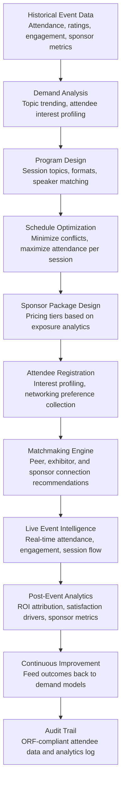

# Event & Conference Optimizer

Frankmax

NAICS 813910-813990

> **National Industry Bodies** — Member Services Intelligence Module

## Objective & Purpose

Annual conferences and events are the single largest revenue line item for many industry bodies, generating 30-50% of total organizational revenue through registration fees, sponsorships, and exhibitions. Yet event planning is overwhelmingly gut-driven: session topics are selected by committee opinion rather than attendee demand analysis, speaker selection relies on personal networks rather than expertise matching, sponsorship pricing is based on "what we charged last year plus 5%" rather than demonstrable ROI, and post-event success measurement rarely goes beyond satisfaction surveys with 20-30% response rates. A typical industry body annual conference with 2,000-10,000 attendees represents $2M-$15M in revenue, and suboptimal programming can reduce attendance by 10-20% year-over-year.

The Event & Conference Optimizer applies AI to every phase of event management: demand analysis (what topics, formats, and speakers will drive the highest attendance and satisfaction), scheduling optimization (minimizing session conflicts for attendee interest profiles), matchmaking (connecting attendees with relevant peers, exhibitors, and sponsors based on business needs), sponsorship optimization (pricing tiers based on exposure analytics and historical conversion data), and post-event measurement (attributing business outcomes to event participation rather than relying on satisfaction scores). The engine transforms events from cost centers with uncertain returns into data-driven revenue engines with measurable member impact.

Within the $3,000-$5,000/month Intelligence Pack, this tool serves the operational backbone of industry body revenue. The governance layer (attendee data privacy, sponsor analytics methodology, ROI attribution audit trail) attaches naturally because sponsors demand transparent metrics on their investment return, and attendees increasingly require data privacy assurance for networking and matchmaking features.

## Business Context

| Attribute | Value |
|---|---|
| **Business Process** | Event management and conference optimization |
| **Business Function** | Events |
| **Category** | Operations |
| **Target Audience** | 10. National Industry Bodies |
| **Bundle** | Industry Intelligence Pack ($3,000-$5,000/mo) |
| **Monthly Cost of Inaction** | $10K-$30K (suboptimal programming, sponsor attrition, declining attendance) |

## BPMN Workflow

## Features

1. **Topic Demand Analysis** — Analyzes attendee interest signals from multiple sources: past session ratings and attendance, member survey responses, industry trend data (from Innovation Radar), search query patterns on the industry body's website, social media discussion themes, and competitor event programming. Produces ranked topic recommendations with projected attendance for each, eliminating committee guesswork.

2. **Speaker-Topic Matching** — Maintains a speaker database scored on expertise (publication record, industry experience, prior speaking ratings), presentation quality (past session ratings, audience engagement metrics), and draw power (registration uplift when speaker is announced). Matches speakers to topics based on expertise alignment and historical audience response, identifying both established draws and emerging voices.

3. **Schedule Conflict Minimizer** — Analyzes attendee interest profiles (collected during registration) to identify session combinations that create the most conflicts -- where large numbers of attendees want to attend overlapping sessions. Optimizes the schedule to minimize conflicts for the largest number of attendees, using constraint satisfaction algorithms that balance room capacity, speaker availability, and topic flow.

4. **Dynamic Sponsorship Pricing** — Replaces "last year plus 5%" pricing with analytics-driven sponsorship valuation. Calculates sponsor exposure metrics: estimated impressions by sponsorship tier, historical lead generation rates by booth location and session sponsorship, attendee-sponsor interest overlap scores, and conversion-to-meeting rates. Produces tiered pricing that sponsors can validate against measurable ROI.

5. **AI-Powered Matchmaking** — During the event, recommends connections between attendees based on complementary business interests (buyer-seller, technology-need, collaboration potential), professional backgrounds, and expressed networking goals. Matchmaking extends to exhibitor recommendations ("visit these 5 booths based on your stated priorities") and scheduled meeting facilitation.

6. **Real-Time Event Intelligence** — Monitors live event metrics through badge scanning, app check-ins, and session attendance tracking. Provides real-time dashboards showing session attendance vs. capacity, traffic flow patterns, exhibitor booth engagement, and networking activity levels. Enables day-of adjustments: room swaps for overcrowded sessions, targeted push notifications to drive traffic to underattended sessions.

7. **ROI Attribution Engine** — Moves beyond satisfaction surveys to measure business outcomes: post-event deals closed attributable to event connections, partnerships formed, knowledge applied (measured through follow-up surveys), and attendee professional development outcomes. Produces sponsor-specific ROI reports showing lead quality, meeting volume, and pipeline value generated from their sponsorship investment.

## Workflow & Automation

**Step 1: Historical Analysis** — Six to twelve months before the event, the engine analyzes historical data from past events: session attendance patterns, speaker ratings, sponsor lead generation, attendee feedback, and year-over-year attendance trends. Combined with current industry trend data, this analysis produces the demand forecast that drives programming decisions.

**Step 2: Program Development** — The engine generates recommended session tracks, topic allocations, and format mix (keynotes, panels, workshops, roundtables, demos) based on demand analysis. Committee members review and refine recommendations, with the engine providing projected attendance for alternative programming scenarios.

**Step 3: Speaker Recruitment** — Based on approved topics, the engine recommends speakers ranked by expertise match, presentation quality, and draw power. For each topic, it suggests 3-5 speaker candidates with historical performance data, enabling committee decisions grounded in evidence rather than relationships alone.

**Step 4: Schedule Optimization** — Once sessions and speakers are confirmed, the optimizer generates the master schedule. Input constraints: room capacities, speaker availability, required breaks, sponsor placement commitments, and attendee interest profile data from early registrations. Output: a conflict-minimized schedule with projected attendance per session.

**Step 5: Registration & Profiling** — As attendees register, the engine collects interest profiles: which topics they prioritize, which exhibitors they want to meet, what networking goals they have, and which sessions they plan to attend. This data feeds schedule refinement (adding capacity for popular sessions) and matchmaking personalization.

**Step 6: Live Event Execution** — During the event, real-time intelligence monitors attendance, engagement, and flow. Event staff receive alerts for capacity issues, underperforming sessions, and high-value matchmaking opportunities. Attendees receive personalized daily agendas with matchmaking recommendations.

**Step 7: Post-Event Measurement** — Within 2-4 weeks after the event, the engine produces comprehensive analytics: overall attendance vs. projection, session-level performance, sponsor exposure and lead metrics, matchmaking connection outcomes, and NPS scores with driver analysis. These metrics feed the next year's demand model.

## Input/Output Specifications

| Direction | Data | Format | Description |
|---|---|---|---|
| Input | Historical event data | CSV / API | Past attendance, ratings, sponsor metrics, financial results |
| Input | Attendee registration data | API / CSV | Profiles, interests, session preferences, networking goals |
| Input | Industry trend data | API / JSON | Topic trending from Innovation Radar and web analytics |
| Input | Speaker database | CSV / API | Speaker profiles, ratings, expertise, availability |
| Input | Sponsor profiles | CSV / JSON | Sponsor objectives, budget, target audience, past ROI |
| Output | Program recommendations | Dashboard / PDF | Topic rankings, format mix, schedule optimization |
| Output | Matchmaking recommendations | Mobile app / Email | Personalized connection recommendations per attendee |
| Output | Real-time event dashboard | Web portal | Live attendance, engagement, flow, and capacity metrics |
| Output | Post-event analytics | PDF / Dashboard / JSON | ROI attribution, satisfaction drivers, sponsor reports |
| Output | Audit trail | JSON (immutable log) | ORF-compliant attendee data handling and analytics methodology |

## Integration Points

| System | Integration Type | Data Flow |
|---|---|---|
| **Member Engagement Predictor** | Bidirectional | Event attendance is key engagement signal; engagement scores inform outreach targeting |
| **Industry Benchmarking Engine** | Inbound content | Benchmark findings fuel session content and speaker topics |
| **Innovation Radar** | Inbound signals | Technology trends drive topic demand analysis |
| **Multi-Model AI Orchestrator** | Infrastructure | Routes recommendation, optimization, and NLP analysis tasks |
| **Audit Trail & Traceability Engine** | Outbound log stream | Attendee data handling and analytics methodology audit |
| **Event Management Platforms** | Bidirectional API | Registration, badge scanning, and session tracking data exchange |
| **CRM / Sponsor Management** | Bidirectional API | Sponsor profiles in; lead and ROI metrics out |

## Pricing & Revenue Model

| Component | Pricing | Notes |
|---|---|---|
| **Industry Intelligence Pack** | $3,000-$5,000/month | Event Optimizer + benchmarking + analytics tools + 2M AI tokens |
| **Standalone Subscription** | $1,500/month | Up to 4 events/year, 5,000 attendees per event |
| **Large event tier (over 5K attendees)** | $2,500/month | Up to 15,000 attendees with real-time intelligence |
| **Matchmaking module** | +$500/event | AI-powered attendee and exhibitor matching |
| **Sponsor ROI analytics** | +$400/month | Detailed sponsor exposure and conversion reporting |
| **AI token consumption** | Included at 80% discount | 2M tokens/month in bundle; overage at marketplace rates |

**Revenue model**: The Event Optimizer protects the industry body's largest revenue line. A 10% attendance increase on a $5M conference generates $500K in additional revenue. Sponsor retention improvements from demonstrable ROI reporting can add another $200K-$500K annually. The governance layer (attendee data privacy compliance, sponsor analytics methodology transparency) attaches as "fries" because GDPR/privacy requirements and sponsor due diligence demands make governance non-optional. Target: 60%+ governance attachment within the first event cycle.

## NAICS/SIC Mapping

| NAICS Code | SIC Code | Industry | Relevance |
|---|---|---|---|
| 813910 | 8611 | Business Associations | Primary: trade associations running industry conferences |
| 813920 | 8631 | Professional Organizations | Professional societies organizing annual meetings |
| 813990 | 8699 | Other Similar Organizations | Specialty groups hosting niche industry events |
| 561920 | 7389 | Convention and Trade Show Organizers | Third-party event management partners |
| 721110 | 7011 | Hotels and Motels | Venue partners consuming event logistics data |
