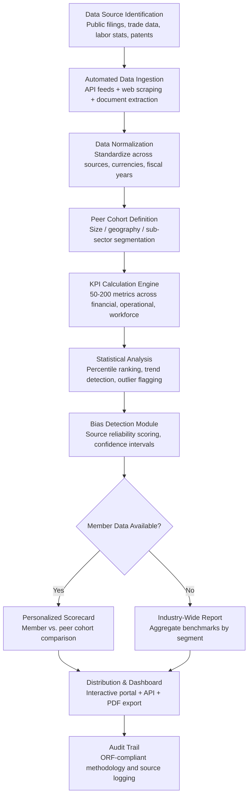

# Industry Benchmarking Engine

Frankmax

NAICS 813910-813990

> **National Industry Bodies** — Industry Intelligence & Advocacy Module

## Objective & Purpose

Industry benchmarking has historically relied on voluntary member surveys that achieve 15-25% response rates, take 6-12 months to compile, and arrive as static PDF reports that are outdated before publication. National industry bodies spend $200K-$500K annually on these benchmark studies, yet the data remains incomplete, self-reported (introducing survivorship and optimism bias), and ungranular. Members pay $5K-$50K in annual dues partly for competitive intelligence they rarely receive in actionable form. Meanwhile, public data sources -- SEC filings, patent databases, labor statistics, trade data, industry publications, and government reports -- contain 80% of the information needed but remain siloed and unprocessed.

The Industry Benchmarking Engine applies AI to synthesize public and proprietary data into continuous, real-time industry benchmarks. Rather than a once-a-year survey, the engine continuously ingests financial data (revenue per employee, margin structures, capital intensity), operational metrics (cycle times, defect rates, capacity utilization), workforce data (compensation bands, turnover rates, skills distribution), and market position data (market share estimates, pricing trends, geographic penetration). Members receive personalized benchmark scorecards that compare their organization against peer cohorts on 50-200 KPIs, segmented by size, geography, and sub-sector.

This tool is the anchor product for the National Industry Bodies bundle at $3,000-$5,000/month. Benchmarking is the single highest-value service an industry body provides to justify membership dues. By delivering continuous, AI-synthesized benchmarks instead of annual surveys, the engine transforms the value proposition of industry body membership. The governance layer -- audit trail on data sourcing, methodology transparency, and bias detection -- attaches naturally as members demand accountability for the numbers shaping their strategic decisions.

## Business Context

| Attribute | Value |
|---|---|
| **Business Process** | Competitive benchmarking across industry sectors |
| **Business Function** | Research & Analysis |
| **Category** | Analytics |
| **Target Audience** | 10. National Industry Bodies |
| **Bundle** | Industry Intelligence Pack ($3,000-$5,000/mo) |
| **Monthly Cost of Inaction** | $8K-$25K (survey costs, member attrition from weak value proposition) |

## BPMN Workflow

## Features

1. **Continuous Data Synthesis** — Ingests data from 200+ public sources including SEC/EDGAR filings, Bureau of Labor Statistics, Census Bureau, patent databases, trade association publications, and industry-specific data providers. Refreshes daily rather than annually, eliminating the 6-12 month lag of traditional survey-based benchmarks.

2. **Dynamic Peer Cohort Builder** — Allows flexible peer group definition along multiple dimensions: revenue band, employee count, geographic region, sub-sector classification, public vs. private status, and growth stage. Members can create custom peer sets or use AI-recommended cohorts based on similarity scoring across 30+ organizational attributes.

3. **Multi-Dimensional KPI Library** — Calculates 50-200 industry-specific KPIs across six categories: financial performance (margins, returns, leverage), operational efficiency (cycle time, utilization, throughput), workforce (compensation, turnover, productivity), market position (share, pricing power, customer concentration), innovation (R&D intensity, patent activity, new product velocity), and sustainability (emissions intensity, resource efficiency, ESG scores).

4. **Personalized Member Scorecards** — Each member organization receives a confidential scorecard comparing their performance against their peer cohort on every applicable KPI. Scorecards show percentile ranking, trend direction, gap-to-median, and gap-to-top-quartile. Color-coded alerts highlight metrics where performance has declined or fallen below the 25th percentile.

5. **Trend Detection & Forecasting** — Time-series analysis identifies industry-wide trends (margin compression, labor cost acceleration, technology adoption curves) and projects 12-24 month trajectories. Early warning alerts notify industry body leadership when structural shifts cross significance thresholds.

6. **Bias & Confidence Scoring** — Every benchmark carries a source reliability score and confidence interval. The engine flags metrics where data coverage is thin (fewer than 20 data points), where self-reported data may introduce bias, or where methodological changes affect comparability. Full methodology documentation is available for every metric.

7. **White-Label Report Generation** — Produces publication-ready benchmark reports branded to the industry body, suitable for member distribution, media releases, and policy advocacy. Reports include executive summaries, detailed data tables, trend charts, and methodology appendices.

8. **Governance & Audit Trail** — Every data point traces back to its source with timestamps, transformation logic, and confidence scores. ORF-compliant logging ensures that benchmark methodology is transparent, reproducible, and defensible -- critical when members use these numbers for board presentations and strategic planning.

## Workflow & Automation

**Step 1: Source Configuration** — Industry body staff define the sector scope, relevant data sources, and priority KPIs during onboarding. The engine maps available public data sources to the target industry and identifies coverage gaps that may require supplemental member survey data.

**Step 2: Automated Ingestion** — The engine continuously pulls data from configured sources via APIs, structured downloads, and document extraction. Financial filings are parsed for income statement, balance sheet, and cash flow metrics. Labor data is extracted by occupation code and geography. Trade data is mapped to sector-specific commodity codes.

**Step 3: Normalization & Alignment** — Raw data is standardized across fiscal year boundaries, currency conversions, accounting method differences (GAAP vs. IFRS), and organizational structure variations (consolidated vs. segment reporting). Normalization rules are documented and auditable.

**Step 4: Benchmark Computation** — The KPI calculation engine processes normalized data into benchmarks: medians, means, percentile distributions, standard deviations, and year-over-year changes. Statistical significance tests ensure reported differences are meaningful, not artifacts of small sample sizes.

**Step 5: Scorecard Generation** — For members who opt in with their own data, personalized scorecards are generated showing their position within the peer cohort. Scorecards are encrypted and accessible only to the submitting member, maintaining strict confidentiality.

**Step 6: Report Publishing** — Aggregate benchmarks are compiled into white-label reports on the industry body's publication schedule (quarterly, semi-annual, or annual). Reports are formatted for multiple distribution channels: interactive web dashboard, downloadable PDF, API feed for members' internal systems.

**Step 7: Continuous Improvement** — Each reporting cycle feeds the engine's accuracy model. Actual outcomes are compared against prior forecasts, peer cohort definitions are refined based on member feedback, and new data sources are integrated as they become available.

## Input/Output Specifications

| Direction | Data | Format | Description |
|---|---|---|---|
| Input | Public financial filings | XBRL / HTML / PDF | SEC, Companies House, and equivalent filings by jurisdiction |
| Input | Labor market data | CSV / API | BLS, OEWS, Census Bureau occupation and wage data |
| Input | Trade and economic data | API / CSV | Import/export volumes, GDP components, industry production indexes |
| Input | Member-submitted data | CSV / Excel / API | Voluntary confidential submissions for personalized benchmarking |
| Input | Patent and R&D data | API / XML | USPTO, EPO, WIPO patent filings and grant data |
| Output | Industry benchmark reports | PDF / HTML / JSON | White-labeled reports with KPI tables, charts, trend analysis |
| Output | Member scorecards | Encrypted PDF / Web portal | Confidential peer-comparison scorecards per member |
| Output | Trend alerts | Email / Webhook / API | Automated notifications when metrics cross significance thresholds |
| Output | Audit trail | JSON (immutable log) | ORF-compliant source and methodology documentation |

## Integration Points

| System | Integration Type | Data Flow |
|---|---|---|
| **Member Engagement Predictor** | Outbound analytics | Benchmark usage patterns feed engagement scoring models |
| **Innovation Radar** | Bidirectional | Technology trends enrich benchmark context; benchmarks validate innovation signals |
| **Skills Gap Analyzer** | Outbound data | Workforce benchmarks feed skills demand/supply modeling |
| **Industry Standards Compiler** | Outbound reference | Benchmark data supports standards development evidence base |
| **Multi-Model AI Orchestrator** | Infrastructure | Routes analysis tasks across extraction, NLP, and statistical models |
| **Audit Trail & Traceability Engine** | Outbound log stream | Complete data lineage and methodology audit trail |
| **Member CRM / AMS** | Bidirectional API | Member profile data in; scorecard delivery and engagement tracking out |

## Pricing & Revenue Model

| Component | Pricing | Notes |
|---|---|---|
| **Industry Intelligence Pack** | $3,000-$5,000/month | Benchmarking Engine + 3 analytics tools + 2M AI tokens |
| **Standalone Subscription** | $2,000/month | Up to 100 KPIs, 1 sector, quarterly reports |
| **Per-member scorecard add-on** | +$50/member/month | Personalized scorecards for participating members |
| **Custom peer cohort modeling** | +$500/month | Advanced cohort builder with unlimited segmentation |
| **White-label report generation** | +$400/month | Publication-ready branded reports |
| **AI token consumption** | Included at 80% discount | 2M tokens/month in bundle; overage at marketplace rates |

**Revenue model**: The Benchmarking Engine is the anchor "burger" for industry bodies -- the tool that justifies the entire platform subscription. Priced to undercut the $200K-$500K annual cost of traditional survey-based benchmark studies by 80%+. Governance add-ons (methodology audit, bias detection reports, compliance documentation) attach as "fries" at 70-85% margin. Target: 60%+ of subscribers adopt at least one governance module within 6 months.

## NAICS/SIC Mapping

| NAICS Code | SIC Code | Industry | Relevance |
|---|---|---|---|
| 813910 | 8611 | Business Associations | Primary: trade associations benchmarking member industries |
| 813920 | 8631 | Professional Organizations | Professional bodies tracking practitioner metrics |
| 813930 | 8641 | Labor Unions and Similar Organizations | Workforce benchmarking for collective bargaining |
| 813940 | 8651 | Political Organizations | Policy-relevant economic benchmarking |
| 813990 | 8699 | Other Similar Organizations | Specialty industry groups and coalitions |
