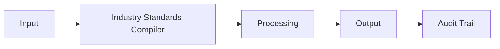

# Industry Standards Compiler

Frankmax

Audience 10

> **National Industry Bodies** — Industry Intelligence & Advocacy

## Objective & Purpose

Standards take 5+ years to develop; AI accelerates drafting from best-practice synthesis

## Business Context

| Attribute | Value |
|---|---|
| **Business Process** | Standards development |
| **Business Function** | Standards Management |
| **Category** | Governance |
| **Target Audience** | 10. National Industry Bodies |

## BPMN Workflow

<!-- TODO: Expand BPMN with actual process steps -->

## Features

<!-- TODO: Define 5-8 key features -->

1. Feature 1
2. Feature 2
3. Feature 3

## Workflow & Automation

<!-- TODO: Step-by-step automation description -->

## Input/Output Specifications

| Direction | Data | Format |
|---|---|---|
| Input | <!-- TODO --> | <!-- TODO --> |
| Output | <!-- TODO --> | <!-- TODO --> |

## Integration Points

<!-- TODO: Connections to other systems -->

## Pricing & Revenue Model

<!-- TODO: From economic model -->

## NAICS/SIC Mapping

<!-- TODO: Industry codes -->
