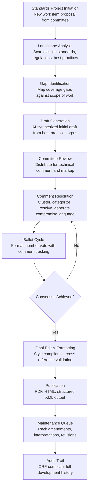

# Industry Standards Compiler

Frankmax

NAICS 813910-813990

> **National Industry Bodies** — Industry Intelligence & Advocacy Module

## Objective & Purpose

Industry standards development is one of the slowest institutional processes in existence. A single ANSI, ISO, or sector-specific standard takes 3-7 years from initiation to publication, involves dozens of committee meetings, hundreds of ballot cycles, and thousands of pages of technical input from member organizations. The process is manual at every stage: committee chairs compile comments from Word documents and email threads, track ballot positions in spreadsheets, reconcile conflicting technical requirements through serial meetings, and produce draft text through iterative copy-paste workflows. A mid-size standards development organization (SDO) may have 50-200 active standards projects running simultaneously, each with its own committee, timeline, and document management challenge.

The Industry Standards Compiler applies AI to accelerate every phase of the standards development lifecycle. During research and drafting, the engine synthesizes existing standards (domestic and international), regulatory requirements, best practices from member submissions, and technical literature into draft standard language. During the committee process, it manages comment resolution by clustering similar comments, identifying conflicts, and generating compromise language options. During ballot cycles, it automates ballot compilation, tracks voting positions, and flags unresolved negative votes requiring resolution. During publication, it ensures formatting compliance with the SDO's style guide, cross-reference accuracy, and normative/informative designation consistency.

Within the Industry Intelligence Pack at $3,000-$5,000/month, the Standards Compiler addresses a core function of industry bodies -- the development and maintenance of the technical standards that define their sector. The tool's governance layer (change tracking, ballot audit trail, comment attribution) is not optional -- it is intrinsic to the standards process, which requires complete transparency and documented consensus. This makes governance attachment effectively 100% for this tool, making it one of the highest-margin products in the bundle.

## Business Context

| Attribute | Value |
|---|---|
| **Business Process** | Standards development and maintenance |
| **Business Function** | Standards Management |
| **Category** | Governance |
| **Target Audience** | 10. National Industry Bodies |
| **Bundle** | Industry Intelligence Pack ($3,000-$5,000/mo) |
| **Monthly Cost of Inaction** | $10K-$30K (delayed standards, committee inefficiency, member frustration) |

## BPMN Workflow

## Features

1. **Best-Practice Corpus Synthesis** — Ingests existing standards (ISO, ANSI, IEC, sector-specific), regulatory requirements, academic literature, patent claims, and member-submitted technical specifications. Synthesizes these sources into draft standard language that addresses the scope of work while avoiding conflicts with existing normative references. Covers 500+ standards bodies and 100,000+ published standards.

2. **Intelligent Comment Resolution** — During committee review cycles, the engine processes hundreds of comments per draft section. Comments are clustered by topic, classified by type (editorial, technical, substantive), and analyzed for conflicts. For conflicting technical positions, the engine generates compromise language options that address the underlying concerns of each commenter, reducing committee negotiation time by 60-70%.

3. **Automated Ballot Management** — Manages the formal ballot process: distributes ballots to eligible voting members, tracks vote positions (affirmative, negative, abstain) in real-time, flags negative votes with unresolved comments (which block consensus under most SDO rules), and generates ballot summary reports showing consensus status. Supports multi-round ballots with automatic carry-forward of unresolved items.

4. **Cross-Reference Validator** — Standards contain extensive cross-references to other standards, clauses, figures, and tables. The engine validates every cross-reference for accuracy: correct document number and version, correct clause numbering, correct normative vs. informative designation, and correct dated vs. undated reference format. Catches reference errors that traditionally slip through to publication.

5. **Normative Language Enforcer** — Standards use precise normative language: "shall" (mandatory), "should" (recommended), "may" (permitted), "can" (possible). The engine enforces consistent usage throughout the document, flags ambiguous requirements language, identifies testability gaps (requirements that cannot be verified through testing or inspection), and ensures compliance with ISO/IEC Directives Part 2 or equivalent SDO drafting rules.

6. **Multi-Standard Conflict Detector** — When an industry body maintains dozens of related standards, the engine detects conflicts between documents: contradictory requirements, overlapping scope, inconsistent definitions, and circular references. Conflict detection runs continuously across the entire standards portfolio, not just individual documents.

7. **Translation & Harmonization Engine** — For international standards adoption, the engine identifies deviations between a domestic standard and its international counterpart (ISO, IEC), classifies deviations by type (technical, editorial, structural), and generates harmonization recommendations. Supports translation between English, French, German, Spanish, and Mandarin with technical terminology accuracy.

## Workflow & Automation

**Step 1: Project Scoping** — A standards committee initiates a new work item by defining the scope, target audience, and relationship to existing standards. The engine scans the existing standards landscape to identify relevant source material, potential conflicts with existing standards, and gap areas the new standard must address.

**Step 2: Draft Synthesis** — The engine generates an initial draft by synthesizing requirements from existing standards, regulatory mandates, and member-submitted technical input. The draft follows the SDO's standard template structure (scope, normative references, terms and definitions, requirements, annexes) and uses correct normative language conventions.

**Step 3: Committee Distribution** — The draft is distributed to committee members through the standards management platform. Members submit comments in structured format (clause reference, comment type, proposed change, rationale). The engine aggregates comments and presents them organized by clause, with clustering of similar comments.

**Step 4: Comment Resolution** — The committee chair uses the engine's resolution tools: view clustered comments, see AI-generated compromise language for conflicting positions, accept/reject/modify each comment, and generate resolution reports. Resolved comments feed directly into the next draft revision.

**Step 5: Ballot Execution** — The revised draft enters formal ballot. The engine distributes ballots, collects votes, tracks consensus metrics in real-time, and flags balloting issues (insufficient participation, negative votes with unresolved comments). Multi-round ballots iterate until consensus thresholds are met.

**Step 6: Final Editing** — The consensus draft passes through automated final editing: style guide compliance, cross-reference validation, normative language consistency, figure/table numbering, and formatting. The engine produces publication-ready output in the SDO's required formats.

**Step 7: Publication & Maintenance** — The published standard enters the maintenance queue. The engine tracks amendment proposals, interpretation requests, and revision triggers (referenced standard updates, regulatory changes, technology shifts). Maintenance items are queued for committee action at defined review intervals.

## Input/Output Specifications

| Direction | Data | Format | Description |
|---|---|---|---|
| Input | Existing standards | PDF / XML / HTML | Source standards for synthesis and cross-reference |
| Input | Committee comments | Structured form / Excel / JSON | Member comments on draft standards |
| Input | Ballot votes | Web form / API | Vote positions and accompanying comments |
| Input | Regulatory requirements | PDF / HTML | Applicable regulations that standards must align with |
| Input | Technical literature | PDF / API | Research papers, test reports, patent claims |
| Output | Draft standards | DOCX / XML / PDF | Formatted draft documents in SDO template |
| Output | Comment resolution reports | PDF / HTML | Clustered comments with resolutions and rationale |
| Output | Ballot status reports | PDF / Dashboard | Voting position summary, consensus metrics |
| Output | Conflict analysis reports | PDF / JSON | Cross-standard conflict identification and recommendations |
| Output | Audit trail | JSON (immutable log) | ORF-compliant complete standards development history |

## Integration Points

| System | Integration Type | Data Flow |
|---|---|---|
| **Industry Benchmarking Engine** | Inbound data | Industry performance data supports evidence-based standard-setting |
| **Regulatory Impact Modeler** | Bidirectional | Standards inform regulatory compliance baselines; regulatory changes trigger standards updates |
| **Innovation Radar** | Inbound signals | Technology trends identify areas where new standards are needed |
| **Member Engagement Predictor** | Outbound analytics | Standards participation patterns feed engagement models |
| **Multi-Model AI Orchestrator** | Infrastructure | Routes NLP synthesis, conflict detection, and translation tasks |
| **Audit Trail & Traceability Engine** | Outbound log stream | Complete development history with comment attribution |
| **Document Management Systems** | Bidirectional API | Standards documents in; published standards out |

## Pricing & Revenue Model

| Component | Pricing | Notes |
|---|---|---|
| **Industry Intelligence Pack** | $3,000-$5,000/month | Standards Compiler + benchmarking + analytics tools + 2M AI tokens |
| **Standalone Subscription** | $2,200/month | Up to 25 active standards projects |
| **Per-project deep analysis** | +$200/project/month | Full lifecycle support for complex standards |
| **Multi-standard conflict detection** | +$400/month | Portfolio-wide cross-reference and conflict scanning |
| **Translation & harmonization** | +$600/month | International standard alignment and translation |
| **AI token consumption** | Included at 80% discount | 2M tokens/month in bundle; overage at marketplace rates |

**Revenue model**: The Standards Compiler has the highest natural governance attachment of any tool in the industry bodies bundle. Standards development inherently requires audit trails, comment attribution, ballot documentation, and methodology transparency -- all of which are governance "fries" products. Because these governance requirements are non-negotiable in standards work, attachment rates approach 100%. Priced to reduce standards development timelines from 5-7 years to 2-3 years, the tool's ROI is measured in accelerated market access and reduced committee costs ($50K-$200K savings per standard).

## NAICS/SIC Mapping

| NAICS Code | SIC Code | Industry | Relevance |
|---|---|---|---|
| 813910 | 8611 | Business Associations | Primary: trade associations developing industry standards |
| 813920 | 8631 | Professional Organizations | Professional bodies maintaining practice standards |
| 813990 | 8699 | Other Similar Organizations | Standards development organizations and technical societies |
| 541380 | 8734 | Testing Laboratories and Services | Testing labs implementing and referencing standards |
| 541690 | 8999 | Other Scientific and Technical Consulting | Consultants supporting standards development |
