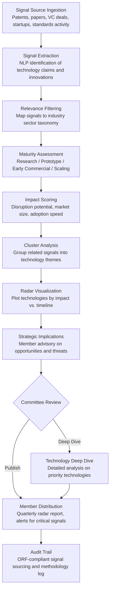

# Innovation Radar

Frankmax

NAICS 813910-813990

> **National Industry Bodies** — Member Services Intelligence Module

## Objective & Purpose

Industries get disrupted because they detect technological threats and opportunities too late. Kodak's board saw digital photography as a niche curiosity until it destroyed the film industry in under a decade. Taxi commissions dismissed ride-sharing apps as regulatory violations until they lost 40-60% of market share. The pattern repeats because industry bodies lack systematic technology scanning: leadership committees rely on conference keynotes, trade publication articles, and vendor pitches -- sources that are either too high-level to be actionable, too biased to be reliable, or too late to enable proactive response. By the time a technology threat appears in an industry body's strategic plan, first-movers have already captured 3-5 years of advantage.

The Innovation Radar continuously scans global technology and innovation signals -- patent filings, academic research publications, venture capital investment patterns, startup formation rates, conference proceedings, standards body activity, and government R&D funding allocations -- to identify technologies and business model innovations that will affect the industry within 2-5 years. The engine classifies each signal by maturity stage (research, prototype, early commercial, scaling), relevance to the industry (direct disruption, adjacent opportunity, enabling technology, regulatory catalyst), and urgency (immediate action required, monitor closely, track for awareness). Output: a quarterly innovation radar that maps emerging technologies by impact and timeline, enabling industry bodies to brief their membership on what is coming and what to do about it.

Within the $3,000-$5,000/month Intelligence Pack, the Innovation Radar serves the strategic advisory function that differentiates a valuable industry body from a dues-collecting bureaucracy. Members cite "keeping ahead of industry trends" as a top-3 reason for maintaining association membership. The governance layer (signal source verification, methodology transparency for maturity and relevance assessments, bias detection in VC-funded hype cycles) attaches because strategic decisions based on technology forecasts require defensible analysis, not marketing narratives.

## Business Context

| Attribute | Value |
|---|---|
| **Business Process** | Technology trend monitoring and strategic foresight |
| **Business Function** | R&D/Innovation |
| **Category** | Strategy |
| **Target Audience** | 10. National Industry Bodies |
| **Bundle** | Industry Intelligence Pack ($3,000-$5,000/mo) |
| **Monthly Cost of Inaction** | $10K-$30K (missed disruption signals, delayed strategic response) |

## BPMN Workflow

## Features

1. **Multi-Source Signal Scanning** — Monitors 500+ innovation signal sources globally: patent databases (USPTO, EPO, WIPO, CNIPA), academic publication databases (PubMed, IEEE, arXiv, Scopus), venture capital deal databases (PitchBook, Crunchbase, CB Insights), startup directories, government R&D funding announcements (NSF, DARPA, Horizon Europe), standards body new work item proposals, and technology conference proceedings. Processes 100,000+ signals per month for a typical industry sector.

2. **Technology Maturity Classifier** — Assigns each technology signal to a maturity stage using a modified TRL (Technology Readiness Level) framework: basic research (TRL 1-3), prototype/proof-of-concept (TRL 4-5), early commercial (TRL 6-7), and scaling/mainstream (TRL 8-9). Classification considers multiple indicators: publication stage (theoretical vs. experimental), patent status (filing vs. granted vs. licensing), funding stage (seed vs. Series B+ vs. corporate adoption), and market evidence (pilot deployments vs. revenue-generating products).

3. **Industry Relevance Scorer** — Classifies each technology by its relationship to the target industry: direct disruption (threatens existing products, services, or business models), adjacent opportunity (enables new offerings for existing customers), enabling technology (improves efficiency of existing operations), and regulatory catalyst (triggers new compliance requirements or standards needs). Relevance scoring uses industry-specific ontologies that map technology categories to industry value chains.

4. **Hype Cycle Correction** — Applies skepticism filters to distinguish genuine innovation from hype. The engine identifies signals that are disproportionately driven by VC marketing (high media mentions relative to patent activity), vendor push (conference keynotes without corresponding academic validation), or regulatory speculation (policy predictions without legislative activity). Hype-adjusted impact scores prevent industry bodies from overreacting to noise.

5. **Innovation Radar Visualization** — Produces the signature output: a radar chart plotting technologies by impact (inner ring = low, outer ring = transformative) and timeline (quadrants = 0-1 year, 1-3 years, 3-5 years, 5+ years). Technologies are color-coded by type (disruption, opportunity, enabler, regulatory) and sized by signal strength. The visualization is designed for board-level strategic discussions and member-facing publications.

6. **Technology Deep Dive Reports** — For high-priority technologies identified on the radar, the engine produces detailed analysis reports: technology description, current state of development, key players (companies, research groups, investors), adoption barriers, competitive implications for the industry, recommended member actions, and timeline projections with confidence intervals. Deep dives are typically 15-25 pages with data tables and source citations.

7. **Alert System for Critical Signals** — When a technology crosses a threshold from "monitor" to "act" -- a major patent is granted, a well-funded startup announces an industry pilot, a government issues an RFP for the technology, or a competitor industry adopts it -- the engine triggers critical alerts to industry body leadership outside the quarterly publication cycle. Early alerts enable proactive response rather than reactive scrambling.

## Workflow & Automation

**Step 1: Signal Collection** — The engine continuously ingests data from configured innovation sources. Patent filings are downloaded and parsed weekly, academic publications are scanned daily, VC deal announcements are monitored in real-time, and government funding announcements are tracked as published. Each signal is timestamped and source-attributed.

**Step 2: Relevance Filtering** — NLP models filter incoming signals against the industry body's sector taxonomy. Signals with no relevance to the industry are discarded. Marginal signals (potentially relevant depending on application) are flagged for analyst review. Clearly relevant signals proceed to assessment.

**Step 3: Assessment & Scoring** — Each relevant signal is assessed on three dimensions: maturity (TRL equivalent), impact (disruption potential, market size affected, adoption speed), and confidence (signal strength based on number of corroborating sources, source quality, and hype adjustment). Assessments are automated for 80% of signals; the remaining 20% (ambiguous or high-impact) are queued for analyst review.

**Step 4: Clustering & Theme Identification** — Individual signals are clustered into technology themes (e.g., 47 separate patent filings, 12 academic papers, and 5 startup announcements all relate to "autonomous quality inspection in manufacturing"). Theme-level assessment aggregates signal strength and provides a more stable view than individual signals.

**Step 5: Radar Compilation** — Quarterly, the engine compiles all assessed themes into the innovation radar visualization. Technologies are plotted, movement from prior quarters is tracked (indicating acceleration or deceleration), and new entries are highlighted. The radar is accompanied by a narrative summary explaining the most significant changes since the prior quarter.

**Step 6: Distribution & Engagement** — The quarterly radar report is distributed to industry body leadership and membership through configured channels: interactive web dashboard (allowing drill-down into any technology), PDF publication (for board presentations and member communications), and API feed (for members integrating innovation intelligence into their own strategic planning processes).

## Input/Output Specifications

| Direction | Data | Format | Description |
|---|---|---|---|
| Input | Patent filings | XML / API | USPTO, EPO, WIPO, CNIPA patent applications and grants |
| Input | Academic publications | API / XML | Abstracts and metadata from major publication databases |
| Input | VC deal data | API / JSON | Investment rounds, valuations, investor profiles, sector tags |
| Input | Government R&D funding | HTML / PDF / API | NSF, DARPA, DOE, EU Horizon funding announcements |
| Input | Conference proceedings | PDF / HTML | Presentations and papers from major industry conferences |
| Output | Innovation radar visualization | SVG / PNG / Interactive web | Technology plot by impact, timeline, and type |
| Output | Quarterly radar report | PDF / HTML | Narrative analysis with radar, technology summaries, recommendations |
| Output | Technology deep dive reports | PDF / HTML | Detailed analysis on priority technologies (15-25 pages) |
| Output | Critical signal alerts | Email / Webhook | Immediate notification when technologies cross action thresholds |
| Output | Audit trail | JSON (immutable log) | ORF-compliant signal sourcing and assessment methodology |

## Integration Points

| System | Integration Type | Data Flow |
|---|---|---|
| **Industry Benchmarking Engine** | Outbound context | Innovation signals contextualize benchmark trends (e.g., R&D intensity changes) |
| **Skills Gap Analyzer** | Outbound data | Emerging technologies predict future skills demand |
| **Regulatory Impact Modeler** | Outbound signals | Technology trends that will trigger new regulation |
| **Supply Chain Sector Monitor** | Outbound data | Innovation signals that will reshape supply chain structures |
| **Industry Standards Compiler** | Outbound triggers | Technologies requiring new standards development |
| **Multi-Model AI Orchestrator** | Infrastructure | Routes NLP extraction, classification, and clustering tasks |
| **Audit Trail & Traceability Engine** | Outbound log stream | Complete signal sourcing and assessment methodology |

## Pricing & Revenue Model

| Component | Pricing | Notes |
|---|---|---|
| **Industry Intelligence Pack** | $3,000-$5,000/month | Innovation Radar + benchmarking + analytics tools + 2M AI tokens |
| **Standalone Subscription** | $1,500/month | Single sector, quarterly radar, basic alerts |
| **Deep dive reports** | +$1,000 per report | Detailed analysis on priority technologies |
| **Real-time alert module** | +$400/month | Critical signal alerts outside quarterly cycle |
| **Cross-industry scanning** | +$600/month | Monitor adjacent sectors for disruption signals |
| **AI token consumption** | Included at 80% discount | 2M tokens/month in bundle; overage at marketplace rates |

**Revenue model**: The Innovation Radar fulfills the strategic foresight mandate that justifies industry body membership. Members pay dues partly for the answer to "what is coming that I should know about?" -- and the radar delivers that answer systematically rather than anecdotally. The governance layer (signal source verification, hype cycle correction, methodology transparency) attaches as "fries" because strategic decisions based on technology forecasts demand defensible analysis. When a CEO asks "should we invest $50M in this technology?" the answer must trace back to verified signals, not conference keynote hype. Target: 55%+ governance attachment within 6 months.

## NAICS/SIC Mapping

| NAICS Code | SIC Code | Industry | Relevance |
|---|---|---|---|
| 813910 | 8611 | Business Associations | Primary: trade associations tracking technology threats and opportunities |
| 813920 | 8631 | Professional Organizations | Professional bodies monitoring technology impact on practice areas |
| 813990 | 8699 | Other Similar Organizations | Technology-focused industry coalitions and consortia |
| 541711 | 8731 | Research and Development in Biotechnology | R&D organizations generating signals monitored by the radar |
| 541712 | 8733 | Research and Development in Physical Sciences | Physical science R&D as innovation signal source |
