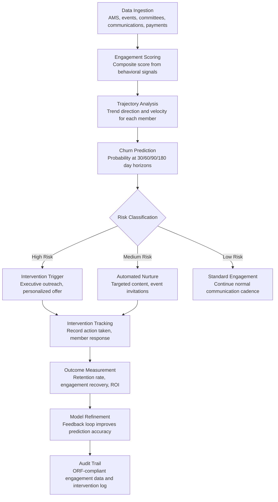

# Member Engagement Predictor

Frankmax

NAICS 813910-813990

> **National Industry Bodies** — Member Services Intelligence Module

## Objective & Purpose

Industry bodies live and die by membership retention. The average trade association loses 15-25% of members annually, and acquiring a new member costs 5-7x more than retaining an existing one. Yet most industry bodies have no systematic way to detect disengagement before a member cancels. Membership renewal is a binary annual event -- the industry body learns a member is unhappy only when they fail to renew, at which point the relationship is already lost. The signals were there months earlier: declining event attendance, reduced committee participation, fewer resource downloads, unanswered surveys, and missed payment deadlines. These behavioral indicators exist in the association management system (AMS) but are never synthesized into a predictive model.

The Member Engagement Predictor ingests all available member interaction data -- event attendance, committee participation, resource consumption, communication open rates, payment patterns, helpdesk contacts, certification renewals, and advocacy participation -- and builds a composite engagement score for each member organization. More importantly, it identifies disengagement trajectories: members whose engagement is declining on a path that historically leads to non-renewal. The engine calculates churn probability at 30/60/90/180 day horizons, identifies the specific disengagement drivers for each at-risk member (e.g., "stopped attending regional events after committee leadership change"), and recommends targeted interventions (personalized outreach, committee invitation, event discount, executive contact).

For industry bodies paying $3,000-$5,000/month for the Intelligence Pack, this tool directly protects the revenue base. A trade association with 5,000 members paying $10K average dues generates $50M in annual membership revenue. Reducing churn from 20% to 15% saves $2.5M annually -- 40-80x the cost of the tool. The governance layer (data privacy compliance, engagement score methodology transparency, intervention audit trail) attaches because members increasingly demand to know how their data is being used.

## Business Context

| Attribute | Value |
|---|---|
| **Business Process** | Membership retention and engagement optimization |
| **Business Function** | Member Relations |
| **Category** | Analytics |
| **Target Audience** | 10. National Industry Bodies |
| **Bundle** | Industry Intelligence Pack ($3,000-$5,000/mo) |
| **Monthly Cost of Inaction** | $12K-$35K (preventable member churn, lost dues revenue) |

## BPMN Workflow

## Features

1. **Multi-Channel Engagement Scoring** — Builds a composite engagement score (0-100) from 15-25 behavioral signals across every member touchpoint: event registration and attendance rates, committee meeting participation, resource download frequency, email open and click rates, website login frequency, survey response rates, certification renewal timeliness, payment promptness, helpdesk contact frequency, and advocacy participation (signing petitions, attending lobby days). Each signal is weighted by its historical correlation with renewal behavior.

2. **Disengagement Trajectory Detection** — Goes beyond point-in-time scores to analyze engagement trends. A member scoring 65 but declining from 85 is higher risk than a member scoring 55 but rising from 40. The engine calculates engagement velocity (rate of change) and acceleration (rate of change of the rate of change) to identify members on deteriorating trajectories before their scores cross critical thresholds.

3. **Churn Probability Modeling** — Machine learning models trained on 3-5 years of historical membership data predict the probability of non-renewal at multiple time horizons: 30, 60, 90, and 180 days. Models account for seasonal patterns (budget cycles drive year-end decisions), industry conditions (economic downturns increase churn across all engagement levels), and organizational changes at the member (leadership transitions, M&A, budget cuts).

4. **Root Cause Identification** — For each at-risk member, the engine identifies the specific disengagement drivers by comparing their behavioral changes against the full population. Output: "Member X stopped attending regional events (down from 4/year to 0) and reduced committee participation (from monthly to quarterly) following the Q2 committee leadership rotation. These two factors account for 75% of their churn risk."

5. **Personalized Intervention Recommendations** — Based on the identified disengagement drivers and the member's engagement history, the engine recommends specific interventions: executive phone call from the association president, invitation to a relevant new committee, complimentary registration for the next regional event, personalized benchmark report highlighting value, or scheduling a membership value review meeting. Interventions are prioritized by historical effectiveness for similar disengagement patterns.

6. **Segment-Level Analytics** — Beyond individual member predictions, the engine identifies systemic engagement patterns across segments: company size cohorts, industry sub-sectors, geographic regions, and membership tenure bands. Surfaces insights like "small manufacturers in the Southeast are disengaging 2x faster than the national average since the Q1 tariff announcement" -- enabling programmatic responses beyond individual outreach.

7. **Renewal Campaign Optimization** — For the annual renewal cycle, the engine prioritizes outreach sequencing: which members to contact first (highest risk, highest value), which communication channel to use (email, phone, in-person based on historical responsiveness), and which value proposition to lead with (benchmarking data, advocacy wins, networking, training access) based on each member's demonstrated engagement patterns.

8. **Privacy-Compliant Data Handling** — All member behavioral data is processed in compliance with applicable privacy regulations (GDPR for international members, state privacy laws). Members can request their engagement profile, understand how scores are calculated, and opt out of specific data collection channels. Privacy compliance is documented and auditable.

## Workflow & Automation

**Step 1: Data Integration** — The engine connects to the industry body's AMS (association management system), event management platform, email marketing system, website analytics, committee management tools, and payment processing system. Data feeds are configured during onboarding with mapping rules for each system's data schema.

**Step 2: Score Computation** — Daily batch processing calculates engagement scores for every active member. Each behavioral signal is normalized (0-100 scale), weighted by its predictive power (determined through historical correlation with renewal outcomes), and combined into a composite score. Scores are stored with full computation transparency -- staff can drill into any score to see contributing factors.

**Step 3: Trajectory Analysis** — The engine computes 30-day rolling engagement trends, identifying members with declining, stable, or improving trajectories. Decline alerts are triggered when trajectory analysis indicates a member is on a path toward a score threshold associated with greater than 50% churn probability within 180 days.

**Step 4: Churn Prediction** — The predictive model assigns churn probabilities at 30/60/90/180 day horizons. Members are classified into risk tiers: critical (over 70% churn probability at 180 days), high (50-70%), medium (30-50%), and standard (under 30%). Risk tiers drive intervention urgency and escalation.

**Step 5: Intervention Dispatch** — Critical and high-risk members trigger intervention workflows: the system generates a member profile with engagement history, disengagement drivers, and recommended actions. Interventions are assigned to membership staff based on the member's relationship owner and the recommended intervention type (executive-level outreach for top-tier members, staff outreach for mid-tier).

**Step 6: Outcome Tracking** — Every intervention is logged with the action taken, member response, and subsequent engagement behavior. The engine tracks intervention effectiveness: which actions led to engagement recovery, which members renewed despite risk, and which churned despite intervention. This data feeds model refinement.

## Input/Output Specifications

| Direction | Data | Format | Description |
|---|---|---|---|
| Input | AMS member records | API / CSV | Membership status, tenure, dues tier, contact information |
| Input | Event attendance data | API / CSV | Registration, attendance, session participation by event |
| Input | Committee participation | API / CSV | Meeting attendance, ballot votes, comment submissions |
| Input | Communication engagement | API | Email opens, clicks, website logins, resource downloads |
| Input | Payment history | API / CSV | Dues payments, timeliness, outstanding balances |
| Output | Engagement scorecards | Dashboard / API / PDF | Per-member engagement scores with contributing factors |
| Output | At-risk member alerts | Email / Webhook / Dashboard | Daily alerts for members crossing risk thresholds |
| Output | Intervention recommendations | Dashboard / JSON | Personalized action plans for at-risk members |
| Output | Segment analytics | Dashboard / PDF | Cohort-level engagement trends and insights |
| Output | Audit trail | JSON (immutable log) | ORF-compliant engagement data processing and intervention log |

## Integration Points

| System | Integration Type | Data Flow |
|---|---|---|
| **Industry Benchmarking Engine** | Outbound data | Benchmark report usage is a key engagement signal |
| **Event & Conference Optimizer** | Bidirectional | Event attendance feeds engagement scoring; engagement data informs event targeting |
| **Skills Gap Analyzer** | Outbound data | Training participation patterns feed engagement models |
| **Innovation Radar** | Outbound analytics | Content consumption patterns feed engagement scoring |
| **Multi-Model AI Orchestrator** | Infrastructure | Routes prediction, clustering, and recommendation tasks |
| **Audit Trail & Traceability Engine** | Outbound log stream | Complete engagement data and intervention audit trail |
| **Association Management System (AMS)** | Bidirectional API | Member data in; engagement scores and alerts out |

## Pricing & Revenue Model

| Component | Pricing | Notes |
|---|---|---|
| **Industry Intelligence Pack** | $3,000-$5,000/month | Member Engagement Predictor + benchmarking + analytics tools + 2M AI tokens |
| **Standalone Subscription** | $1,200/month | Up to 5,000 members, daily scoring, basic intervention |
| **Large association tier (over 5K members)** | $1,800/month | Up to 25,000 members with segment analytics |
| **Renewal campaign module** | +$400/month | Optimized renewal outreach sequencing and personalization |
| **Executive reporting dashboard** | +$200/month | Board-ready retention analytics and ROI reporting |
| **AI token consumption** | Included at 80% discount | 2M tokens/month in bundle; overage at marketplace rates |

**Revenue model**: The Member Engagement Predictor directly protects the industry body's revenue base. ROI is immediately quantifiable: if the tool prevents 50 member cancellations at $10K average dues, it saves $500K/year against a $14K-$60K annual tool cost -- a 8-35x return. The governance layer (privacy compliance, methodology transparency, intervention audit trail) attaches as "fries" because members increasingly expect data usage transparency. Target: 55%+ governance attachment within 6 months.

## NAICS/SIC Mapping

| NAICS Code | SIC Code | Industry | Relevance |
|---|---|---|---|
| 813910 | 8611 | Business Associations | Primary: trade associations managing member retention |
| 813920 | 8631 | Professional Organizations | Professional societies tracking member engagement |
| 813930 | 8641 | Labor Unions and Similar Organizations | Union membership retention and engagement |
| 813940 | 8651 | Political Organizations | Political membership organizations tracking supporter engagement |
| 813990 | 8699 | Other Similar Organizations | Specialty associations and coalitions managing membership |
