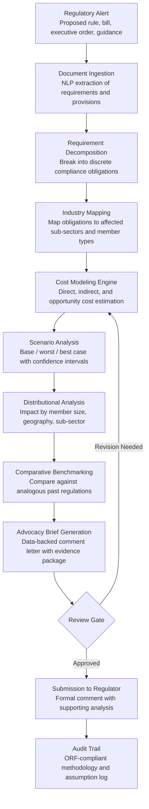

# Regulatory Impact Modeler

Frankmax

NAICS 813910-813990

> **National Industry Bodies** — Industry Intelligence & Advocacy Module

## Objective & Purpose

Industry advocacy before legislatures and regulators is overwhelmingly qualitative. Trade associations submit comment letters asserting that a proposed regulation will "harm competitiveness" or "create undue burden" without quantifying the actual cost, timeline, or distributional impact across their membership. Regulators, meanwhile, produce their own Regulatory Impact Analyses (RIAs) that systematically underestimate compliance costs by 40-60% according to multiple retrospective studies. The result: poorly calibrated regulations that either overshoot (destroying value) or undershoot (failing to address the problem), and industry bodies that lack the analytical firepower to meaningfully influence the outcome.

The Regulatory Impact Modeler ingests proposed regulations (bills, rules, executive orders, agency guidance) and models their quantitative impact on industry members across multiple dimensions: direct compliance costs (new reporting, process changes, technology investments), indirect costs (supply chain pass-through, competitive displacement, market structure shifts), labor market effects (job creation/destruction, wage pressure, skills requirements), and timeline dynamics (phase-in schedules, grace periods, enforcement ramp-up). The engine produces scenario analyses -- base case, worst case, best case -- with confidence intervals, enabling advocacy teams to submit data-backed comments that carry weight in regulatory proceedings.

For industry bodies paying $3,000-$5,000/month for the Intelligence Pack, this tool transforms their government relations function from opinion-based to evidence-based. A single well-modeled regulatory impact analysis can save an industry billions in compliance costs or prevent a poorly designed regulation from taking effect. The governance layer -- methodology transparency, assumption documentation, and audit trail -- ensures that modeled impacts withstand scrutiny from regulators, legislators, and opposing interest groups.

## Business Context

| Attribute | Value |
|---|---|
| **Business Process** | Policy advocacy and regulatory analysis |
| **Business Function** | Government Relations |
| **Category** | Policy |
| **Target Audience** | 10. National Industry Bodies |
| **Bundle** | Industry Intelligence Pack ($3,000-$5,000/mo) |
| **Monthly Cost of Inaction** | $10K-$50K (ineffective advocacy, unquantified compliance exposure) |

## BPMN Workflow

## Features

1. **Automated Regulatory Parsing** — Ingests proposed regulations in any format (Federal Register notices, legislative bill text, EU directives, agency guidance documents) and uses NLP to extract discrete compliance obligations, affected entity definitions, timeline provisions, exemption criteria, and enforcement mechanisms. Handles regulatory text from 50+ jurisdictions.

2. **Compliance Cost Estimation** — Models direct compliance costs across five categories: administrative burden (reporting, recordkeeping, filing requirements), process changes (operational modifications to meet new standards), technology investments (systems, software, monitoring equipment), personnel (new hires, training, certification requirements), and testing/certification (product testing, facility audits, third-party verification). Cost estimates are grounded in industry-specific labor rates, technology costs, and historical compliance data.

3. **Cascading Impact Analysis** — Models indirect and second-order effects that regulators typically underestimate: supply chain cost pass-through (how upstream compliance costs flow to downstream members), competitive displacement (market share shifts toward less-regulated competitors or jurisdictions), market structure changes (consolidation pressure on smaller firms unable to absorb fixed compliance costs), and innovation effects (how regulatory uncertainty affects R&D investment).

4. **Multi-Scenario Modeling** — Produces three scenarios for every analysis: base case (regulation implemented as written with typical enforcement), worst case (aggressive enforcement, narrow interpretation of exemptions, accelerated timeline), and best case (phased implementation, broad exemptions, enforcement discretion). Each scenario carries probability-weighted cost estimates with 90% confidence intervals.

5. **Distributional Impact Assessment** — Breaks aggregate industry impact into segments: small vs. large members, geographic regions, sub-sectors, and business model types. Identifies which member cohorts bear disproportionate burden -- critical for advocacy messaging and for designing targeted compliance assistance programs.

6. **Historical Precedent Engine** — Compares proposed regulations against a database of analogous past regulations and their actual outcomes. Shows how initial cost estimates compared to actual compliance costs, how enforcement evolved, and what adaptation strategies proved effective. Precedent data strengthens advocacy credibility by grounding projections in historical reality.

7. **Advocacy Brief Generator** — Automatically drafts comment letters, testimony outlines, and advocacy one-pagers with embedded data visualizations. Briefs follow regulatory comment best practices: specific provision references, quantified impact claims, proposed alternatives, and supporting evidence citations.

## Workflow & Automation

**Step 1: Regulatory Monitoring** — The engine continuously monitors regulatory feeds (Federal Register, state registers, EU Official Journal, parliamentary trackers) for proposed rules and legislation matching the industry body's configured sector scope. New regulatory developments trigger automatic alerts to the government relations team.

**Step 2: Document Parsing** — Upon analyst selection of a regulation for modeling, the NLP engine extracts all discrete compliance obligations, identifies affected entity definitions, maps timeline provisions (effective dates, phase-in schedules, compliance deadlines), and catalogs exemption criteria. Output: structured obligation register with 50-200 discrete requirements per regulation.

**Step 3: Industry Impact Mapping** — Each obligation is mapped to affected member segments. The engine identifies which sub-sectors, organization sizes, and business models fall within the regulation's scope. Members are classified as directly regulated, indirectly affected (supply chain), or exempt.

**Step 4: Cost Quantification** — The cost modeling engine estimates compliance costs for each obligation using industry-specific cost factors: labor rates by skill level, technology costs by system type, testing costs by product category, and administrative costs by reporting frequency. Costs are aggregated across obligations and segments.

**Step 5: Scenario Development** — Three scenarios are generated with varying assumptions about enforcement intensity, exemption interpretation, timeline acceleration/delay, and market response. Monte Carlo simulation produces probability distributions for total industry impact under each scenario.

**Step 6: Brief Compilation** — Analysis results are compiled into an advocacy brief: executive summary (total industry impact headline number), detailed cost breakdown by obligation, distributional analysis showing member segment impacts, historical precedent comparison, and proposed regulatory alternatives with modeled cost savings.

**Step 7: Submission & Tracking** — The finalized brief is formatted for regulatory comment submission. The engine tracks the regulation through the rulemaking process (comment period, response to comments, final rule, effective date) and flags any changes requiring model updates.

## Input/Output Specifications

| Direction | Data | Format | Description |
|---|---|---|---|
| Input | Proposed regulations | PDF / HTML / XML | Federal Register, legislative text, agency guidance documents |
| Input | Industry cost factors | CSV / JSON | Labor rates, technology costs, testing fees by sector and region |
| Input | Historical regulatory data | Database | Past regulation costs, outcomes, and enforcement patterns |
| Input | Member profile data | API / CSV | Organization size, sub-sector, geography, business model attributes |
| Input | Economic baseline data | API | GDP, employment, trade volumes for affected sectors |
| Output | Impact assessment report | PDF / HTML / JSON | Full quantified analysis with scenarios and confidence intervals |
| Output | Advocacy brief | DOCX / PDF | Comment letter with embedded data visualizations and citations |
| Output | Regulatory alerts | Email / Webhook | Automated notifications of new regulatory developments |
| Output | Audit trail | JSON (immutable log) | ORF-compliant assumption and methodology documentation |

## Integration Points

| System | Integration Type | Data Flow |
|---|---|---|
| **Industry Benchmarking Engine** | Inbound data | Industry baseline metrics provide foundation for impact modeling |
| **Trade Dispute Intelligence** | Bidirectional | Regulatory changes feed trade analysis; trade disputes trigger regulatory responses |
| **Industry Standards Compiler** | Inbound reference | Existing standards inform compliance cost baselines |
| **Innovation Radar** | Inbound signals | Technology trends affect compliance cost projections |
| **Multi-Model AI Orchestrator** | Infrastructure | Routes NLP parsing, cost modeling, and scenario generation tasks |
| **Audit Trail & Traceability Engine** | Outbound log stream | Complete methodology and assumption audit trail |
| **Government Affairs CRM** | Bidirectional API | Regulatory tracking data in; advocacy activity and outcomes out |

## Pricing & Revenue Model

| Component | Pricing | Notes |
|---|---|---|
| **Industry Intelligence Pack** | $3,000-$5,000/month | Regulatory Impact Modeler + benchmarking + analytics tools + 2M AI tokens |
| **Standalone Subscription** | $1,800/month | Up to 10 regulatory analyses per quarter |
| **Per-analysis deep dive** | $500-$2,000 per analysis | Full scenario modeling with distributional breakdown |
| **Historical precedent database** | +$400/month | Access to 10,000+ past regulatory outcome records |
| **Advocacy brief generation** | +$300/month | Automated comment letter and testimony drafting |
| **AI token consumption** | Included at 80% discount | 2M tokens/month in bundle; overage at marketplace rates |

**Revenue model**: The Regulatory Impact Modeler converts qualitative advocacy into quantified, evidence-based government relations. Priced to replace $100K-$300K/year in consulting fees for regulatory impact studies. The governance layer (methodology documentation, assumption audit trail, precedent citations) attaches as high-margin "fries" -- industry bodies need defensible analysis when testifying before Congress or submitting regulatory comments. Target: 55%+ governance attachment within 6 months.

## NAICS/SIC Mapping

| NAICS Code | SIC Code | Industry | Relevance |
|---|---|---|---|
| 813910 | 8611 | Business Associations | Primary: trade associations advocating on regulation |
| 813920 | 8631 | Professional Organizations | Professional bodies tracking regulatory impact on practitioners |
| 813940 | 8651 | Political Organizations | Political advocacy organizations modeling policy impact |
| 813990 | 8699 | Other Similar Organizations | Coalition groups coordinating regulatory responses |
| 541611 | 8742 | Administrative Management Consulting | Consulting firms supporting regulatory advocacy |
