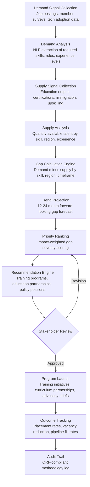

# Skills Gap Analyzer

Frankmax

NAICS 813910-813990

> **National Industry Bodies** — Industry Intelligence & Advocacy Module

## Objective & Purpose

National industry bodies are tasked with workforce development but operate with minimal data on actual skills supply and demand. Most rely on anecdotal feedback from member HR departments, lagging government labor statistics (published 12-18 months after collection), and consultant reports that cost $150K-$300K per study. The result: workforce development programs that train for yesterday's skills gaps while tomorrow's emerge unaddressed. An industry body representing 50,000+ member companies across a sector cannot afford to guess which roles will be hardest to fill in 24 months -- the cost of misalignment between education pipelines and industry demand runs into billions in lost productivity, unfilled positions, and offshoring decisions.

The Skills Gap Analyzer continuously maps skills demand (extracted from job postings, member surveys, project requirements, and technology adoption signals) against skills supply (educational program output, certification pipelines, immigration flows, and internal upskilling capacity). The engine identifies gaps at granular levels: specific technical skills by region, experience bands by role category, and emerging competency requirements driven by technology shifts. Industry bodies can then direct training investments, shape education partnerships, inform immigration policy positions, and advise members on workforce planning with data rather than intuition.

This tool directly supports the industry body's workforce development mandate -- one of the top three reasons members cite for maintaining association membership. When combined with the Industry Benchmarking Engine (which provides compensation and turnover benchmarks), the Skills Gap Analyzer creates a comprehensive workforce intelligence capability that justifies $3,000-$5,000/month in platform spending through measurable improvement in member hiring outcomes and reduced vacancy costs.

## Business Context

| Attribute | Value |
|---|---|
| **Business Process** | Workforce development and skills planning |
| **Business Function** | Education/Training |
| **Category** | HR |
| **Target Audience** | 10. National Industry Bodies |
| **Bundle** | Industry Intelligence Pack ($3,000-$5,000/mo) |
| **Monthly Cost of Inaction** | $8K-$20K (misaligned training programs, member vacancy costs) |

## BPMN Workflow

## Features

1. **Real-Time Demand Mapping** — Continuously ingests job postings from major job boards (Indeed, LinkedIn, Glassdoor, sector-specific boards), member company career pages, and staffing agency data. NLP extraction identifies specific skills, experience requirements, education levels, certifications, and compensation ranges. Processes 500K+ postings per month for a typical industry sector.

2. **Supply Pipeline Quantification** — Maps education and training supply: university program enrollments and graduation rates by relevant degree, community college and vocational program output, certification body pass rates and active holder counts, apprenticeship pipeline volumes, and H-1B/immigration flows by occupation code. Updated quarterly from institutional data and government statistics.

3. **Granular Gap Identification** — Calculates supply-demand gaps at multiple granularity levels: skill (e.g., "Python programming" vs. generic "software development"), geography (metro area, state, region, national), experience band (entry-level, mid-career, senior), and time horizon (current gap, 12-month projected, 24-month projected). Each gap carries a severity score based on magnitude, growth trajectory, and economic impact.

4. **Technology-Driven Demand Forecasting** — Monitors technology adoption signals (vendor announcements, patent filings, industry conference themes, VC investment patterns) to predict emerging skills requirements before they appear in job postings. Identifies "skills of the future" 12-18 months ahead of market demand, enabling proactive training program development.

5. **Regional Heat Mapping** — Produces geographic visualizations showing where skills gaps are most acute, enabling industry bodies to target training investments by region. Heat maps overlay demand density, supply availability, wage premium (a proxy for scarcity), and projected growth, identifying "talent deserts" that require intervention.

6. **Education Partnership Intelligence** — Identifies specific educational institutions with programs aligned to identified gaps, calculates their capacity to scale, and recommends partnership structures (scholarship programs, curriculum advisory boards, adjunct instructor placement, internship pipelines). Prioritizes partnerships by cost-effectiveness: graduates per dollar of industry investment.

7. **Policy Position Generator** — Translates skills gap data into evidence-based policy positions on workforce-relevant issues: immigration quotas by occupation code, education funding priorities, apprenticeship program design, and credentialing reform. Produces advocacy-ready briefs with quantified economic impact of policy alternatives.

8. **Outcome Measurement Dashboard** — Tracks the downstream impact of workforce development initiatives: training program completion rates, post-training placement rates, member vacancy reduction, time-to-fill improvement, and wage stabilization in shortage occupations. Closes the feedback loop between investment and result.

## Workflow & Automation

**Step 1: Demand Signal Ingestion** — The engine collects demand data from configured sources: job posting aggregators (API feeds from major boards), member company HRIS systems (anonymized and aggregated), staffing agency requirement feeds, and technology adoption indicators. Data is refreshed daily for postings, monthly for member surveys, and quarterly for technology signals.

**Step 2: Skills Taxonomy Extraction** — NLP models extract specific skills, roles, and requirements from unstructured job postings and normalize them against a standardized skills taxonomy (aligned to O*NET, ESCO, or industry-specific frameworks). Synonyms are resolved (e.g., "ML engineer" equals "machine learning engineer"), and emerging skill terms are flagged for taxonomy expansion.

**Step 3: Supply Pipeline Mapping** — Education and training data is collected from IPEDS (Integrated Postsecondary Education Data System), certification bodies, apprenticeship registries, and immigration databases. Supply is quantified as projected annual output by skill cluster, region, and experience level.

**Step 4: Gap Computation** — The gap engine calculates demand minus supply across every combination of skill, geography, and experience level. Gaps are expressed as absolute numbers (unfilled positions), percentages (demand coverage rate), and economic impact (productivity loss from vacancies at industry average revenue per employee).

**Step 5: Prioritization & Recommendation** — Gaps are ranked by a composite severity score weighting magnitude, growth rate, economic impact, and addressability (how tractable the gap is through training vs. requiring multi-year education pipelines). Top-priority gaps receive recommended intervention strategies with estimated cost and timeline.

**Step 6: Stakeholder Reporting** — Findings are distributed to industry body leadership, workforce development committees, and member companies through interactive dashboards, quarterly reports, and on-demand analytics. Personalized views allow members to see gaps most relevant to their sub-sector and geography.

## Input/Output Specifications

| Direction | Data | Format | Description |
|---|---|---|---|
| Input | Job posting data | JSON / API feed | Skills, roles, experience, compensation from major job boards |
| Input | Education enrollment/graduation data | CSV / API | IPEDS, institutional data on program enrollment and completion |
| Input | Certification data | API / CSV | Active certifications, pass rates, renewal rates by credential |
| Input | Member workforce surveys | CSV / Excel | Anonymized hiring plans, vacancy data, skills priorities |
| Input | Technology adoption signals | API / Web scrape | Patent filings, VC investment, conference proceedings |
| Output | Skills gap dashboard | Web portal / API | Interactive gap visualization by skill, region, experience |
| Output | Regional heat maps | SVG / PNG / Web | Geographic visualization of gap severity |
| Output | Workforce development reports | PDF / HTML | Prioritized gap analysis with intervention recommendations |
| Output | Policy briefs | DOCX / PDF | Evidence-based advocacy documents on workforce policy |
| Output | Audit trail | JSON (immutable log) | ORF-compliant methodology and data source documentation |

## Integration Points

| System | Integration Type | Data Flow |
|---|---|---|
| **Industry Benchmarking Engine** | Bidirectional | Compensation and turnover benchmarks enrich gap analysis; gap data contextualizes workforce benchmarks |
| **Regulatory Impact Modeler** | Outbound data | Workforce impact of regulations feeds into regulatory analysis |
| **Innovation Radar** | Inbound signals | Technology trends predict emerging skills demand |
| **Member Engagement Predictor** | Outbound analytics | Workforce intelligence usage patterns feed engagement models |
| **Multi-Model AI Orchestrator** | Infrastructure | Routes NLP extraction, forecasting, and recommendation tasks |
| **Audit Trail & Traceability Engine** | Outbound log stream | Complete methodology and source audit trail |
| **Education Partner Portals** | Outbound API | Curriculum recommendations and enrollment data sharing |

## Pricing & Revenue Model

| Component | Pricing | Notes |
|---|---|---|
| **Industry Intelligence Pack** | $3,000-$5,000/month | Skills Gap Analyzer + benchmarking + analytics tools + 2M AI tokens |
| **Standalone Subscription** | $1,500/month | Single sector, national scope, quarterly reports |
| **Regional deep-dive add-on** | +$400/month | Metro-area level granularity with heat mapping |
| **Forecasting module** | +$500/month | 12-24 month forward projections with technology-driven demand signals |
| **Education partnership intelligence** | +$300/month | Institution-level partnership recommendations |
| **AI token consumption** | Included at 80% discount | 2M tokens/month in bundle; overage at marketplace rates |

**Revenue model**: The Skills Gap Analyzer reinforces the industry body's core workforce development mission. Priced to replace $150K-$300K annual consulting studies with continuous, data-driven intelligence. The governance layer (methodology transparency, bias detection in demand signals, audit trail on data sources) attaches as "fries" when industry bodies need defensible data for congressional testimony or education policy advocacy. Target: 50%+ governance attachment within 6 months.

## NAICS/SIC Mapping

| NAICS Code | SIC Code | Industry | Relevance |
|---|---|---|---|
| 813910 | 8611 | Business Associations | Primary: trade associations managing workforce development programs |
| 813920 | 8631 | Professional Organizations | Professional bodies tracking practitioner skills and credentialing |
| 813930 | 8641 | Labor Unions and Similar Organizations | Unions tracking skills requirements for collective bargaining |
| 813990 | 8699 | Other Similar Organizations | Industry coalitions coordinating workforce initiatives |
| 611430 | 8243 | Professional and Management Development Training | Training providers consuming gap analysis to design programs |
