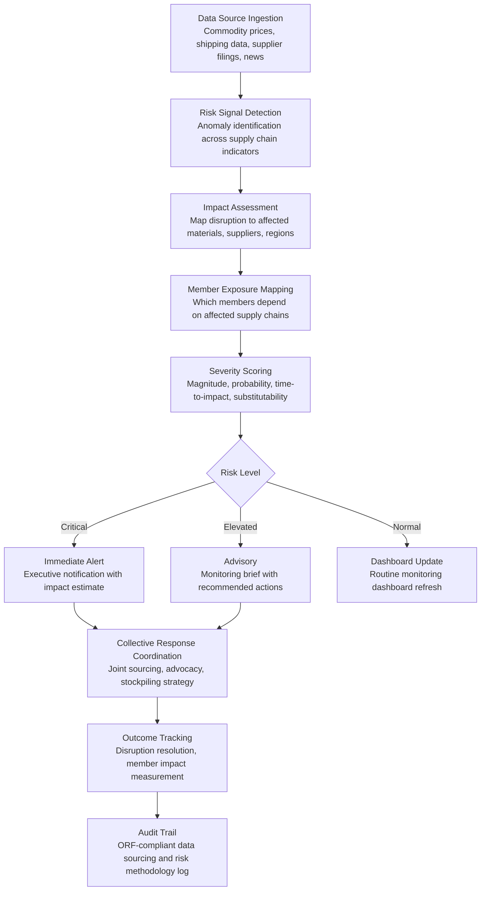

# Supply Chain Sector Monitor

Frankmax

NAICS 813910-813990

> **National Industry Bodies** — Member Services Intelligence Module

## Objective & Purpose

Industry bodies have no systematic visibility into the supply chain risks threatening their members. Individual companies monitor their own tier-1 suppliers, but nobody aggregates the picture across the sector. When a critical material faces a supply disruption -- a semiconductor shortage, a rare earth export ban, a shipping lane blockage, a key supplier bankruptcy -- the industry body learns about it from member complaints, not from its own intelligence. The 2020-2023 supply chain crisis demonstrated this gap at scale: industry bodies were weeks to months behind their members in understanding which disruptions mattered, which suppliers were affected, and what collective action was possible. The cost of this blindness runs into billions per sector when multiplied across member losses from production delays, inventory shortfalls, and emergency sourcing premiums.

The Supply Chain Sector Monitor provides industry-level supply chain intelligence by aggregating public and member-contributed data into a real-time risk dashboard. The engine tracks critical material availability (commodity prices, inventory levels, lead time trends), supplier concentration risk (how many members depend on the same critical suppliers), geographic risk (exposure to disruption-prone regions, trade corridors, and geopolitical hotspots), and substitution feasibility (alternative materials, suppliers, or manufacturing processes that could mitigate specific disruptions). The output is an early warning system that alerts industry body leadership to emerging supply chain risks before they cascade into member production disruptions.

Within the $3,000-$5,000/month Intelligence Pack, this tool serves manufacturing, construction, agriculture, technology, and energy sector associations where supply chain continuity is a top-5 member priority. The governance layer (data anonymization for member-contributed data, methodology transparency for risk scoring, source verification for disruption alerts) attaches because supply chain intelligence directly influences member operational decisions -- inaccurate or poorly sourced alerts could trigger premature inventory hoarding or unnecessary supplier switches.

## Business Context

| Attribute | Value |
|---|---|
| **Business Process** | Industry supply chain risk monitoring |
| **Business Function** | Supply Chain |
| **Category** | Analytics |
| **Target Audience** | 10. National Industry Bodies |
| **Bundle** | Industry Intelligence Pack ($3,000-$5,000/mo) |
| **Monthly Cost of Inaction** | $15K-$40K (late disruption response, uncoordinated member actions) |

## BPMN Workflow

## Features

1. **Multi-Source Risk Signal Aggregation** — Monitors 300+ data streams for supply chain disruption indicators: commodity price feeds (metals, chemicals, agricultural inputs, energy), shipping and logistics data (port congestion, container rates, vessel tracking), supplier financial health (credit ratings, filing delays, bankruptcy filings), geopolitical indicators (sanctions, trade actions, conflict zones), and weather/natural disaster alerts. Signals are correlated to identify emerging disruptions before they hit mainstream news.

2. **Industry Supply Chain Mapping** — Builds and maintains a sector-level supply chain map showing critical material flows, key supplier nodes, geographic concentration points, and transportation corridors. The map identifies single points of failure: materials with fewer than 3 global suppliers, transportation corridors with no alternatives, and geographic concentrations in high-risk regions. Updated continuously from trade data, member input, and public filings.

3. **Concentration Risk Scoring** — Calculates supplier and material concentration risk at the industry level. Identifies where multiple members unknowingly depend on the same tier-2 or tier-3 supplier, where critical materials come from a single country or region, and where the industry has no viable substitution options. Concentration scores are expressed as HHI (Herfindahl-Hirschman Index) equivalents familiar to competition analysts.

4. **Disruption Impact Simulator** — Models the cascading impact of specific disruption scenarios: "What happens if China restricts rare earth exports by 30%?" or "What is the production impact of a 6-week closure of the Suez Canal?" Simulations trace impacts through the supply chain from raw material to finished product, estimating production delays, cost increases, and revenue impact at the member level.

5. **Substitution Feasibility Analyzer** — For each critical material and supplier, the engine identifies potential substitutes: alternative materials (with performance trade-offs), alternative suppliers (with capacity, quality, and lead time comparisons), and alternative manufacturing processes (that reduce or eliminate the dependency). Substitution options are scored by feasibility (timeline to implement), cost impact (premium over current sourcing), and risk reduction (how much concentration risk the switch eliminates).

6. **Member-Contributed Data Anonymization** — Members can contribute their own supply chain data (supplier lists, material volumes, lead time experiences) to enrich the industry-level picture. All contributed data is anonymized and aggregated before being visible to other members, maintaining competitive confidentiality while enabling collective intelligence. Anonymization methodology is documented and auditable.

7. **Collective Action Coordinator** — When disruptions require coordinated industry response (joint sourcing initiatives, government advocacy for trade policy relief, stockpiling strategies), the engine provides the data backbone: aggregate demand for affected materials, coordinated negotiation leverage calculations, and impact quantification for government submissions.

## Workflow & Automation

**Step 1: Continuous Monitoring** — The engine ingests data from configured supply chain intelligence sources on a continuous basis: commodity prices update in near-real-time, shipping data refreshes daily, supplier financial data refreshes monthly, and geopolitical risk indicators update as events occur. Anomaly detection algorithms flag deviations from baseline patterns.

**Step 2: Signal Classification** — Detected anomalies are classified by type (price spike, supply shortage, logistics disruption, supplier distress, geopolitical event), severity (critical, elevated, normal), and relevance (mapped to the industry body's critical material and supplier taxonomy). False positive filtering reduces alert noise based on historical signal accuracy.

**Step 3: Impact Assessment** — For classified signals, the engine traces the potential impact through the sector supply chain: which materials are affected, which suppliers are involved, which geographic corridors are disrupted, and which member segments are exposed. Impact is quantified in estimated production delay (days), cost increase (percentage), and affected member count.

**Step 4: Alert Distribution** — Critical alerts go to industry body leadership within 2 hours of signal detection. Elevated alerts are compiled into weekly monitoring briefs. Normal updates appear on the monitoring dashboard. All alerts include impact estimates, affected member segments, and recommended actions.

**Step 5: Member Advisory** — For significant disruptions, the engine generates member-specific advisories based on each member's supply chain profile: "Based on your reported dependence on Supplier X for Material Y, the current disruption may affect your Q3 production by 15-20%. Recommended actions: activate secondary supplier Z, increase safety stock to 6-week coverage, evaluate Material Y-alternative for non-critical applications."

**Step 6: Collective Response** — When disruptions require industry-level action, the engine provides coordination tools: aggregate demand data for joint sourcing negotiations, impact quantification for government advocacy submissions, and scenario modeling for proposed collective strategies (stockpiling, demand pooling, alternative supply development).

## Input/Output Specifications

| Direction | Data | Format | Description |
|---|---|---|---|
| Input | Commodity price feeds | API (real-time) | Metals, chemicals, agricultural inputs, energy prices |
| Input | Shipping and logistics data | API / CSV | Port congestion, container rates, vessel tracking, lead times |
| Input | Supplier financial data | API / CSV | Credit ratings, financial filings, bankruptcy alerts |
| Input | Member supply chain data | CSV / API (anonymized) | Voluntary supplier lists, material volumes, lead time data |
| Input | Geopolitical intelligence | API / RSS | Sanctions, trade actions, conflict zone updates |
| Output | Risk dashboard | Web portal / API | Real-time supply chain risk visualization by material, region, supplier |
| Output | Disruption alerts | Email / Webhook / SMS | Critical and elevated alerts with impact estimates |
| Output | Member advisories | Email / Portal / PDF | Personalized disruption impact and recommended actions |
| Output | Collective action briefs | PDF / DOCX | Aggregate data packages for joint sourcing or government advocacy |
| Output | Audit trail | JSON (immutable log) | ORF-compliant data sourcing and risk scoring methodology |

## Integration Points

| System | Integration Type | Data Flow |
|---|---|---|
| **Trade Dispute Intelligence** | Bidirectional | Trade actions trigger supply chain risk reassessment; supply chain data informs trade advocacy |
| **Industry Benchmarking Engine** | Inbound data | Industry cost structure data informs disruption cost modeling |
| **Innovation Radar** | Inbound signals | Technology changes that affect supply chain structure (new materials, manufacturing methods) |
| **Regulatory Impact Modeler** | Outbound data | Supply chain disruption data supports regulatory advocacy (tariff relief, stockpiling programs) |
| **Multi-Model AI Orchestrator** | Infrastructure | Routes anomaly detection, NLP parsing, and scenario modeling tasks |
| **Audit Trail & Traceability Engine** | Outbound log stream | Complete data sourcing and risk methodology audit trail |
| **Member ERP / Supply Chain Systems** | Bidirectional API (opt-in) | Member supply chain data in; disruption alerts out |

## Pricing & Revenue Model

| Component | Pricing | Notes |
|---|---|---|
| **Industry Intelligence Pack** | $3,000-$5,000/month | Supply Chain Monitor + benchmarking + analytics tools + 2M AI tokens |
| **Standalone Subscription** | $1,800/month | Single sector, 50 critical materials, daily monitoring |
| **Extended material coverage** | +$300/month per 50 materials | For diversified industry bodies with broad supply chains |
| **Disruption simulation module** | +$500/month | Scenario modeling for specific disruption types |
| **Member advisory add-on** | +$50/member/month | Personalized supply chain risk alerts per member |
| **AI token consumption** | Included at 80% discount | 2M tokens/month in bundle; overage at marketplace rates |

**Revenue model**: The Supply Chain Sector Monitor delivers value through early warning and collective action coordination. A single early disruption alert that enables members to secure alternative sourcing before prices spike can save 5-15% on affected material costs -- potentially $10M-$100M across a major industry sector. Governance add-ons (data anonymization audit, risk methodology documentation, source verification) attach as high-margin "fries" because members contributing supply chain data demand privacy assurance, and members consuming alerts demand source credibility. Target: 65%+ governance attachment within 6 months.

## NAICS/SIC Mapping

| NAICS Code | SIC Code | Industry | Relevance |
|---|---|---|---|
| 813910 | 8611 | Business Associations | Primary: trade associations monitoring sector supply chains |
| 813920 | 8631 | Professional Organizations | Professional bodies tracking supply chain standards |
| 813990 | 8699 | Other Similar Organizations | Industry coalitions coordinating supply chain responses |
| 423000 | 5000 | Merchant Wholesalers, Durable Goods | Wholesale distributors contributing supply chain data |
| 424000 | 5100 | Merchant Wholesalers, Nondurable Goods | Nondurable goods distributors providing market data |
