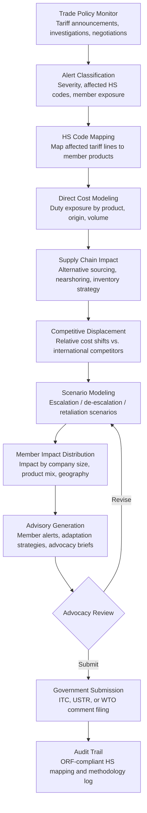

# Trade Dispute Intelligence

Frankmax

NAICS 813910-813990

> **National Industry Bodies** — Industry Intelligence & Advocacy Module

## Objective & Purpose

Tariffs, anti-dumping duties, countervailing measures, and trade agreement renegotiations can restructure an entire industry's competitive landscape within months. Yet most industry bodies learn about trade disputes reactively -- after tariffs are announced, after Section 301 investigations are initiated, after WTO rulings are handed down. The lag between a trade policy action and an industry body's ability to quantify its impact on members ranges from weeks to months, by which time supply chain decisions have already been made and market share has already shifted. For industries with significant import/export exposure, a single trade dispute can cost members $50M-$500M in tariff liability, supply chain disruption, and lost market access.

The Trade Dispute Intelligence tool continuously monitors global trade policy actions (tariff announcements, anti-dumping investigations, safeguard measures, trade agreement negotiations, sanctions updates) and models their cascading impact on the industry body's membership. The engine maps tariff schedules to member products using HS (Harmonized System) codes, calculates direct cost impact (duty exposure by product line and origin country), models supply chain reconfigurations (alternative sourcing, nearshoring economics, inventory buffer strategies), and projects competitive displacement effects (how tariffs shift relative cost positions against international competitors). The output: actionable intelligence that enables industry bodies to advocate effectively, advise members on adaptation strategies, and position the industry ahead of trade policy shifts.

Within the $3,000-$5,000/month Industry Intelligence Pack, Trade Dispute Intelligence serves industry bodies with significant international exposure -- manufacturing, agriculture, technology, energy, and professional services sectors where cross-border trade represents 20-60% of member revenue. The governance layer (HS code mapping audit, assumption documentation, scenario methodology transparency) is critical because trade impact analyses are used in formal government submissions, International Trade Commission proceedings, and USTR comment periods.

## Business Context

| Attribute | Value |
|---|---|
| **Business Process** | Trade policy analysis and advocacy |
| **Business Function** | International Trade |
| **Category** | Policy |
| **Target Audience** | 10. National Industry Bodies |
| **Bundle** | Industry Intelligence Pack ($3,000-$5,000/mo) |
| **Monthly Cost of Inaction** | $15K-$40K (unquantified tariff exposure, delayed member advisory) |

## BPMN Workflow

## Features

1. **Global Trade Policy Monitor** — Continuously scans 100+ trade policy sources: Federal Register tariff announcements, USTR actions, ITC investigations, WTO dispute settlement filings, EU trade defense measures, bilateral trade agreement updates, and sanctions announcements (OFAC, EU, UN). Alerts industry body staff within hours of new actions affecting their sector's HS codes.

2. **HS Code Product Mapper** — Maintains a continuously updated mapping between Harmonized System tariff codes and member products/services. Maps at 6-digit (subheading) and 8-digit (statistical suffix) granularity. Handles classification ambiguities by flagging products that may fall under multiple tariff headings and recommending classification rulings.

3. **Tariff Exposure Calculator** — Quantifies direct duty impact: tariff rate multiplied by import/export volume by product-origin pair. Calculates current exposure (existing tariffs in effect), incremental exposure (proposed new tariffs or rate increases), and cumulative exposure (total tariff burden as percentage of product cost). Models the impact of tariff rate quotas, preferential trade agreement rates, and duty drawback/Foreign Trade Zone strategies.

4. **Supply Chain Reconfiguration Modeler** — When tariffs alter sourcing economics, the engine models alternative supply chain configurations: shifting to non-tariffed origin countries, nearshoring/reshoring economics (comparing tariff savings against higher production costs), inventory pre-positioning strategies (accelerated imports before tariff effective dates), and multi-sourcing diversification to reduce single-country concentration risk.

5. **Competitive Displacement Analyzer** — Models how trade actions shift competitive positions. A tariff on Chinese imports may benefit domestic producers but harm downstream manufacturers who use those imports as inputs. The engine traces these effects across the value chain, identifying winners and losers within the membership and quantifying net industry impact.

6. **Retaliation Scenario Engine** — Trade disputes rarely remain one-sided. The engine models likely retaliation sequences: if Country A imposes tariffs on Product X, Country B's probable retaliation targets (based on historical patterns and political economy analysis), and the impact of retaliatory tariffs on member exports. Multi-round escalation scenarios project cumulative costs through 3-5 rounds of tit-for-tat.

7. **Advocacy Evidence Packager** — Compiles trade impact analyses into formats required for government proceedings: ITC injury determination submissions, USTR Section 301 comment responses, Congressional testimony supporting materials, and WTO dispute panel evidence. Includes required data formats, citation standards, and evidentiary requirements for each venue.

## Workflow & Automation

**Step 1: Policy Monitoring** — The engine scans configured trade policy feeds daily. New actions matching the industry body's HS code profile trigger classified alerts: critical (immediate member impact, comment deadline within 30 days), significant (indirect or future impact), or informational (related developments for tracking).

**Step 2: Exposure Assessment** — For critical and significant alerts, the engine automatically maps affected HS codes to member product lines using the maintained product-tariff mapping. It calculates aggregate industry exposure: total import/export volume affected, current and proposed tariff rates, and estimated annual duty impact.

**Step 3: Impact Modeling** — The cost modeling engine runs base-case analysis: direct tariff costs, pass-through assumptions (how much of the tariff members can pass to customers vs. absorb), demand elasticity effects (volume reduction from price increases), and margin compression estimates. Models are calibrated against historical tariff impact data from prior trade actions.

**Step 4: Scenario Development** — Three to five scenarios are developed: (a) tariff as proposed, (b) reduced tariff following negotiation, (c) expanded tariff scope, (d) retaliatory tariff on member exports, (e) tariff removal/sunset. Each scenario carries probability weights based on political economy analysis and historical precedent.

**Step 5: Member Advisory** — Impact analysis is distributed to member companies with personalized exposure estimates based on their product mix, sourcing geography, and export markets. Advisories include recommended actions: accelerated purchasing before tariff effective dates, alternative sourcing evaluation, pricing strategy adjustments, and FTZ/duty drawback opportunities.

**Step 6: Advocacy Filing** — For trade actions with formal comment periods, the engine generates evidence-backed submissions quantifying industry impact, identifying disproportionately affected segments, and proposing tariff modifications or exemptions. Filings include the data tables, charts, and source citations required by the receiving agency.

## Input/Output Specifications

| Direction | Data | Format | Description |
|---|---|---|---|
| Input | Tariff schedules | CSV / API | Harmonized Tariff Schedule with rates by HS code and country |
| Input | Trade flow data | API / CSV | Import/export volumes and values by HS code, origin, destination |
| Input | Member product-HS mappings | CSV / JSON | Product catalog mapped to applicable tariff classifications |
| Input | Trade policy announcements | HTML / PDF / XML | Federal Register, USTR, ITC, WTO, EU trade actions |
| Input | Historical trade dispute data | Database | Past tariff impacts, retaliation patterns, settlement outcomes |
| Output | Trade impact reports | PDF / HTML / JSON | Quantified impact analysis with scenarios and member distribution |
| Output | Member exposure alerts | Email / Webhook / API | Personalized tariff exposure notifications per member |
| Output | Advocacy submissions | DOCX / PDF | ITC, USTR, WTO-formatted evidence packages |
| Output | Audit trail | JSON (immutable log) | ORF-compliant HS mapping and methodology documentation |

## Integration Points

| System | Integration Type | Data Flow |
|---|---|---|
| **Regulatory Impact Modeler** | Bidirectional | Trade-related regulations feed regulatory analysis; regulatory changes trigger trade impact reassessment |
| **Industry Benchmarking Engine** | Inbound data | Industry cost structure data informs tariff pass-through assumptions |
| **Supply Chain Sector Monitor** | Bidirectional | Trade disruptions feed supply chain alerts; supply chain data informs sourcing alternatives |
| **Innovation Radar** | Inbound signals | Technology shifts that alter trade patterns (e.g., automation reducing offshoring incentive) |
| **Multi-Model AI Orchestrator** | Infrastructure | Routes NLP parsing, economic modeling, and scenario generation tasks |
| **Audit Trail & Traceability Engine** | Outbound log stream | Complete HS mapping and methodology audit trail |
| **Government Affairs Systems** | Outbound API | Filing data and tracking for regulatory submissions |

## Pricing & Revenue Model

| Component | Pricing | Notes |
|---|---|---|
| **Industry Intelligence Pack** | $3,000-$5,000/month | Trade Dispute Intelligence + benchmarking + analytics tools + 2M AI tokens |
| **Standalone Subscription** | $1,800/month | Single sector, 50 HS code families, quarterly scenario updates |
| **HS code expansion** | +$200/month per 50 codes | Coverage for diversified industry bodies |
| **Retaliation scenario module** | +$500/month | Multi-round escalation modeling with probability weighting |
| **Advocacy brief generation** | +$400/month | ITC/USTR/WTO formatted submission drafting |
| **AI token consumption** | Included at 80% discount | 2M tokens/month in bundle; overage at marketplace rates |

**Revenue model**: Trade Dispute Intelligence is high-impact for internationally exposed industries. A single tariff analysis that helps an industry body secure an exclusion or modification can save members $10M-$100M+. Priced to replace $200K-$500K in trade law firm analyses with continuous, data-driven monitoring. Governance add-ons (HS code audit, methodology documentation for ITC submissions) attach as high-margin "fries" because government proceedings demand defensible analysis. Target: 60%+ governance attachment for trade-active industry bodies.

## NAICS/SIC Mapping

| NAICS Code | SIC Code | Industry | Relevance |
|---|---|---|---|
| 813910 | 8611 | Business Associations | Primary: trade associations advocating on trade policy |
| 813920 | 8631 | Professional Organizations | Professional bodies tracking trade impacts on practitioners |
| 813990 | 8699 | Other Similar Organizations | Industry coalitions coordinating trade responses |
| 926110 | 9611 | Administration of General Economic Programs | Government trade agencies receiving advocacy submissions |
| 541110 | 8111 | Offices of Lawyers | Trade law firms supporting advocacy filings |
