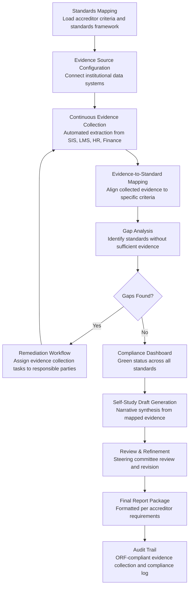

# Accreditation Compliance Automator

Frankmax

NAICS 611110-611710

> **Education / R&D / Think Tanks** — Education Operations Module

## Objective & Purpose

Accreditation is the existential requirement for educational institutions -- loss of accreditation means loss of federal financial aid eligibility, which effectively shuts down enrollment. Yet accreditation compliance is a brutally manual process. A typical institutional accreditation cycle (HLC, SACSCOC, MSCHE, NEASC, WASC, or NWCCU) requires a self-study report of 200-500 pages addressing 80-150 standards and criteria, supported by thousands of pages of evidence (syllabi, assessment data, committee minutes, policy documents, financial statements, program review reports). Institutions spend 18-24 months preparing for each decennial review, consuming 5,000-15,000 person-hours of faculty and staff time. Programmatic accreditations (ABET for engineering, AACSB for business, CCNE for nursing) add another 3-8 reviews per year for a comprehensive university, each requiring its own evidence collection and reporting.

The Accreditation Compliance Automator continuously collects, organizes, and validates accreditation evidence from institutional systems, maps evidence to standards requirements, identifies compliance gaps before they become findings, and generates self-study report drafts that meet accreditor formatting and content expectations. Rather than a frantic 18-month sprint before each visit, the engine maintains perpetual accreditation readiness -- evidence is always current, gaps are always visible, and report generation is a matter of compilation rather than creation.

Within the $2,000-$4,000/month Research Intelligence Pack, the Accreditation Compliance Automator addresses a non-negotiable institutional requirement. The consequence of accreditation failure is existential; the cost of manual compliance is enormous. Reducing self-study preparation time by 50-70% saves $200K-$500K per accreditation cycle in staff time. The governance layer is the product itself -- accreditation is governance. Every feature of this tool produces auditable, evidence-based compliance documentation. Governance attachment is 100% by definition.

## Business Context

| Attribute | Value |
|---|---|
| **Business Process** | Accreditation reporting and continuous compliance |
| **Business Function** | Compliance |
| **Category** | Regulatory |
| **Target Audience** | 11. Education / R&D / Think Tanks |
| **Bundle** | Research Intelligence Pack ($2,000-$4,000/mo) |
| **Monthly Cost of Inaction** | $15K-$40K (compliance staff time, accreditation risk, finding remediation) |

## BPMN Workflow

## Features

1. **Multi-Accreditor Standards Library** — Pre-loaded with standards frameworks from major institutional accreditors (HLC, SACSCOC, MSCHE, NEASC, WASC, NWCCU) and programmatic accreditors (ABET, AACSB, CCNE, APA, CSWE, CAEP, ACPE). Each framework is decomposed into individual standards, criteria, and sub-criteria with associated evidence requirements. The library is updated when accreditors revise their standards (typically every 5-10 years), ensuring the engine always maps to current requirements.

2. **Continuous Evidence Collection** — Connects to institutional systems (SIS, LMS, HR, Finance, Assessment Management, Committee Management) to automatically extract evidence: student learning outcomes data, graduation and retention rates, faculty qualifications, financial statements, governance committee minutes, curriculum maps, and program review reports. Evidence is time-stamped, version-controlled, and linked to the specific standard it supports.

3. **Evidence-Standard Mapping Engine** — Each piece of collected evidence is mapped to one or more accreditation standards it supports. The engine uses NLP to classify evidence relevance and completeness: does this evidence fully address the standard, partially address it, or only tangentially relate? Mapping quality scores enable precise gap identification -- knowing not just which standards lack evidence, but which standards have weak evidence that may not satisfy reviewers.

4. **Gap Analysis & Early Warning** — Continuously monitors evidence coverage across all applicable standards. The dashboard shows red/yellow/green status for each standard: green (multiple strong evidence items), yellow (evidence present but thin or dated), red (no adequate evidence). Trend analysis identifies standards where evidence quality is deteriorating (e.g., assessment data becoming stale because a program stopped collecting it). Early warning alerts fire 12+ months before scheduled review visits.

5. **Self-Study Narrative Generator** — Drafts self-study report sections by synthesizing mapped evidence into coherent narratives that address each standard. The engine follows accreditor-specific formatting expectations: evidence citation style, required subsections, compliance language conventions, and narrative structure (description, analysis, evidence, continuous improvement). Drafts serve as 80% complete starting points that steering committee members refine rather than write from scratch.

6. **Remediation Workflow Manager** — When gaps are identified, the engine generates remediation tasks: what evidence is needed, who is responsible for providing it (mapped to institutional roles), what the deadline is (based on review visit timeline), and what the compliance risk is if the gap persists. Tasks are tracked through completion, with escalation alerts for overdue items.

7. **Visit Preparation Toolkit** — In the months leading up to a review visit, the engine generates: site visitor briefing materials, evidence room organization (physical or virtual), response templates for anticipated reviewer questions (based on gap analysis and common findings for similar institutions), and a compliance confidence assessment estimating the likelihood of findings in each standard area.

## Workflow & Automation

**Step 1: Accreditation Calendar Setup** — The institution configures its accreditation calendar: which accreditors, which programs, review visit dates, and interim report deadlines. The engine creates a master compliance timeline with milestones for evidence collection, self-study drafting, committee review, and final submission.

**Step 2: Standards Decomposition** — For each upcoming review, the engine loads the applicable standards framework and decomposes it into individual compliance requirements. Each requirement is annotated with: evidence types typically expected, data sources within the institution, and the responsible office or committee.

**Step 3: Automated Evidence Collection** — Connected institutional systems begin feeding evidence to the engine. Collection runs on configured schedules: real-time (LMS engagement data), daily (enrollment and grade data), semesterly (assessment results, program review reports), and annually (financial statements, faculty activity reports). Each evidence item is cataloged with metadata: source system, collection date, applicable standard(s), and quality score.

**Step 4: Continuous Gap Monitoring** — The gap analysis engine runs after each evidence collection cycle, updating the compliance dashboard. Standards moving from green to yellow trigger notifications to responsible parties. Standards remaining red for more than one review cycle trigger escalation to institutional leadership. Monthly compliance summary reports are distributed to the accreditation steering committee.

**Step 5: Self-Study Drafting** — Beginning 12-18 months before the review visit, the engine generates self-study narrative drafts organized by standard. Each draft section includes: factual description of institutional practices, evidence citations with links to source documents, analysis of institutional effectiveness against the standard, and continuous improvement plans addressing any identified weaknesses.

**Step 6: Committee Review & Finalization** — Steering committee members review and refine AI-generated drafts, adding institutional voice, strategic context, and nuanced analysis that only human stakeholders can provide. The engine tracks revisions, manages committee feedback, and produces the final formatted report package.

## Input/Output Specifications

| Direction | Data | Format | Description |
|---|---|---|---|
| Input | Accreditation standards frameworks | JSON / PDF | Criteria hierarchies from institutional and programmatic accreditors |
| Input | Student data (enrollment, retention, graduation) | API / CSV (SIS) | Outcome metrics required for nearly every accreditation standard |
| Input | Assessment data | API / CSV | Student learning outcomes, program-level assessment results |
| Input | Faculty data | API / CSV (HR) | Qualifications, workload, professional development, tenure status |
| Input | Financial data | API / CSV | Budgets, audited statements, financial ratios |
| Output | Compliance dashboard | Web portal / API | Per-standard evidence coverage with red/yellow/green status |
| Output | Self-study report drafts | DOCX / PDF | Accreditor-formatted narrative with evidence citations |
| Output | Gap analysis reports | PDF / Dashboard | Standards lacking adequate evidence with remediation plans |
| Output | Remediation task lists | Dashboard / Email | Assigned tasks with deadlines and escalation tracking |
| Output | Audit trail | JSON (immutable log) | ORF-compliant evidence collection and compliance documentation |

## Integration Points

| System | Integration Type | Data Flow |
|---|---|---|
| **Student Outcome Predictor** | Inbound data | Retention and completion metrics feed accreditation evidence |
| **Adaptive Learning Orchestrator** | Inbound data | Learning outcome data feeds assessment evidence |
| **Research Impact Quantifier** | Inbound metrics | Research productivity data supports research-related standards |
| **Grant Proposal Optimizer** | Inbound data | Funded research data supports research mission evidence |
| **Multi-Model AI Orchestrator** | Infrastructure | Routes NLP classification, narrative generation, and gap analysis tasks |
| **Audit Trail & Traceability Engine** | Outbound log stream | Complete evidence collection and compliance documentation |
| **Institutional Systems (SIS, LMS, HR, Finance)** | Inbound API | Automated evidence extraction from operational systems |

## Pricing & Revenue Model

| Component | Pricing | Notes |
|---|---|---|
| **Research Intelligence Pack** | $2,000-$4,000/month | Accreditation Automator + education tools + 2M AI tokens |
| **Standalone Subscription** | $1,800/month | 1 institutional accreditor, up to 3 programmatic |
| **Comprehensive tier** | $3,200/month | Unlimited accreditors, unlimited programs |
| **Self-study generation module** | +$500/month | AI-drafted narrative sections with evidence synthesis |
| **Visit preparation toolkit** | +$300/month | Visitor briefings, response templates, confidence assessment |
| **AI token consumption** | Included at 80% discount | 2M tokens/month in bundle; overage at marketplace rates |

**Revenue model**: The Accreditation Compliance Automator protects the institution's existential requirement -- maintaining accredited status. Reducing self-study preparation from 15,000 person-hours to 5,000 person-hours saves $200K-$500K per cycle. Governance attachment is 100% by definition: accreditation IS governance. Every output of this tool is an auditable compliance document. This makes the tool the single highest-margin product in the Education pack -- there is no version of this tool that does not include governance.

## NAICS/SIC Mapping

| NAICS Code | SIC Code | Industry | Relevance |
|---|---|---|---|
| 611310 | 8221 | Colleges, Universities, and Professional Schools | Primary: universities managing institutional and programmatic accreditation |
| 611210 | 8222 | Junior Colleges | Community college accreditation compliance |
| 611110 | 8211 | Elementary and Secondary Schools | K-12 accreditation and school quality assurance |
| 611710 | 8299 | Educational Support Services | Accreditation consulting and support services |
| 611510 | 8243 | Technical and Trade Schools | Programmatic accreditation for vocational programs |
