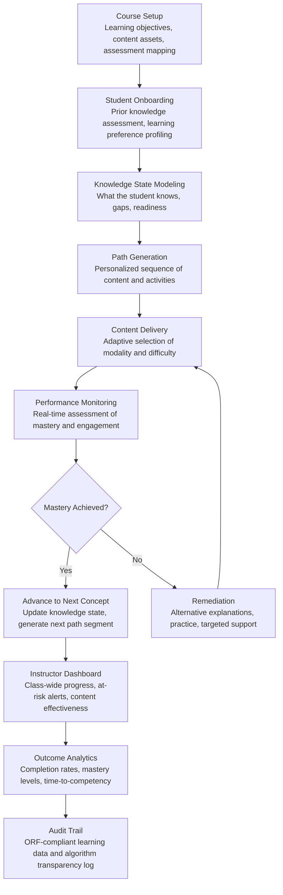

# Adaptive Learning Orchestrator

Frankmax

NAICS 611110-611710

> **Education / R&D / Think Tanks** — Education Operations Module

## Objective & Purpose

Higher education delivers curriculum in a one-size-fits-all model that has remained essentially unchanged for a century: all students in a section receive the same lectures, the same assignments, the same pace, and the same assessments. Yet learning science has conclusively demonstrated that students enter courses with wildly different prior knowledge, learn at different rates, respond to different instructional modalities (visual, textual, interactive, experiential), and struggle with different concepts. The result: 30-40% of students in any given course are either bored (material too slow) or lost (material too fast), contributing to the 40% national dropout rate for undergraduate programs. Institutions spend $10K-$50K per dropped student in lost tuition and financial aid recovery -- a mid-size university losing 500 students annually forfeits $5M-$25M.

The Adaptive Learning Orchestrator personalizes curriculum delivery at the individual student level. The engine ingests course learning objectives, content assets (lectures, readings, problem sets, simulations, labs), and student performance data (assessment scores, time-on-task, interaction patterns, prerequisite mastery). It constructs a knowledge state model for each student -- what they know, what they are ready to learn, and where they have gaps -- and generates personalized learning paths that adapt in real-time to student progress. Students who master a concept quickly advance to the next; students who struggle receive additional explanations, alternative representations, and targeted practice before moving on.

Within the $2,000-$4,000/month Research Intelligence Pack, the Adaptive Learning Orchestrator serves the teaching mission of educational institutions. Student retention improvements of 5-15% are well-documented in adaptive learning implementations, translating to $1M-$10M in preserved tuition revenue for a mid-size university. The governance layer (learning data privacy compliance with FERPA and GDPR, algorithm transparency for academic integrity, bias detection in recommendation patterns) attaches because educational institutions face strict data privacy requirements and growing scrutiny of AI use in student-facing applications.

## Business Context

| Attribute | Value |
|---|---|
| **Business Process** | Personalized curriculum delivery |
| **Business Function** | Teaching |
| **Category** | Education |
| **Target Audience** | 11. Education / R&D / Think Tanks |
| **Bundle** | Research Intelligence Pack ($2,000-$4,000/mo) |
| **Monthly Cost of Inaction** | $10K-$30K (student attrition, poor completion rates, instructional inefficiency) |

## BPMN Workflow

## Features

1. **Knowledge State Modeler** — Builds and continuously updates a Bayesian knowledge model for each student. The model represents mastery probability for every concept in the course's knowledge graph (typically 50-300 concepts per course). Mastery estimates update with each student interaction: correct answers increase mastery probability, incorrect answers decrease it, response time provides additional signal (fast correct answers indicate stronger mastery than slow correct answers), and hint usage indicates partial knowledge.

2. **Adaptive Path Generator** — Generates personalized learning sequences that respect prerequisite dependencies (Concept B requires mastery of Concept A), optimize for spacing effects (revisiting previously mastered concepts at intervals to strengthen retention), and adapt to demonstrated learning pace. Students who master concepts quickly receive compressed paths; students who struggle receive expanded paths with additional scaffolding. Paths are recalculated after every significant student interaction.

3. **Multi-Modal Content Selector** — For each concept, the engine selects from available content assets based on the student's demonstrated learning preferences and the concept's characteristics. Options include: video lectures (visual/auditory learners), interactive simulations (kinesthetic learners), written explanations (reading-preferred learners), worked examples (procedural concepts), and practice problems (skill-building). Content selection adapts based on which modalities have produced the strongest mastery gains for each individual student.

4. **Real-Time Engagement Detection** — Monitors behavioral signals that indicate engagement or disengagement: time-on-task patterns (rapid clicking through content suggests disengagement), assessment attempt patterns (repeated guessing suggests frustration), session duration and frequency (declining login frequency predicts dropout), and content interaction depth (skimming vs. deep engagement). Triggers interventions when disengagement patterns are detected.

5. **Instructor Analytics Dashboard** — Provides instructors with class-wide visibility: concept-level mastery distributions (which concepts are students struggling with most?), at-risk student identification (who is falling behind?), content effectiveness metrics (which content assets produce the strongest mastery gains?), and pacing analysis (is the course timeline realistic given actual student progress?). Enables data-driven instructional decisions without requiring instructors to monitor individual students.

6. **Formative Assessment Engine** — Generates adaptive formative assessments that target each student's zone of proximal development: questions that are neither too easy (producing no learning signal) nor too hard (producing frustration). Assessments adapt in real-time using item response theory (IRT) models, providing precise mastery estimates with fewer questions than traditional fixed-form assessments.

7. **FERPA-Compliant Data Architecture** — All student learning data is processed in compliance with FERPA (Family Educational Rights and Privacy Act) and applicable state privacy laws. Students can access their learning profiles, understand how recommendations are generated, and request data corrections. Data is stored with role-based access controls ensuring that only authorized institutional personnel can view individual student records.

## Workflow & Automation

**Step 1: Course Configuration** — Instructors or instructional designers configure the course in the system: define learning objectives, upload content assets (or map existing LMS content), create the concept knowledge graph (prerequisite relationships between topics), and align assessments to concepts. The engine provides a configuration wizard that suggests knowledge graph structures based on the syllabus.

**Step 2: Student Onboarding** — At course start, each student completes a diagnostic assessment that establishes their initial knowledge state: which prerequisite concepts they have already mastered, which they partially know, and which are entirely new. The assessment adapts in length based on confidence in the estimates (stopping early for clear mastery or clear gaps, probing further for ambiguous areas).

**Step 3: Personalized Path Delivery** — Based on the initial knowledge state, the engine generates each student's first learning path segment (typically 3-5 activities). As the student completes activities and assessments, the knowledge state updates and the next path segment is generated. The system operates as a continuous loop: deliver content, assess mastery, update model, generate next content.

**Step 4: Instructor Monitoring** — Throughout the course, the instructor dashboard shows aggregate progress: class mastery distributions by concept, pacing relative to the syllabus timeline, at-risk student alerts (students whose engagement or mastery trends predict non-completion), and content effectiveness data. Instructors can intervene with targeted support for at-risk students or adjust course pacing based on aggregate data.

**Step 5: Remediation & Support** — When a student fails to achieve mastery after initial content delivery, the engine triggers remediation: alternative content modalities, simplified explanations, prerequisite concept review (if the gap traces to an earlier concept), and practice problem sets with worked solutions. Persistent struggles trigger instructor notifications for human intervention.

**Step 6: Outcome Assessment** — End-of-course summative assessments measure final mastery levels against learning objectives. The engine produces per-student mastery profiles showing which objectives were met and which require continued development. Aggregate outcome data feeds institutional effectiveness reporting and accreditation evidence.

## Input/Output Specifications

| Direction | Data | Format | Description |
|---|---|---|---|
| Input | Course content assets | SCORM / xAPI / HTML / Video / PDF | Lectures, readings, simulations, problem sets, assessments |
| Input | Learning objectives and knowledge graph | JSON / Web form | Concept hierarchy with prerequisite dependencies |
| Input | Student interaction data | xAPI / LTI | Activity completions, assessment responses, time-on-task |
| Input | Student diagnostic assessments | Web form / API | Initial knowledge state establishment |
| Input | Instructor configurations | Web form / JSON | Pacing preferences, intervention thresholds, content priorities |
| Output | Personalized learning paths | API / LMS integration | Sequenced content and activity recommendations per student |
| Output | Student knowledge state profiles | Dashboard / JSON | Mastery probability per concept, updated in real-time |
| Output | Instructor analytics dashboard | Web portal | Class-wide progress, at-risk alerts, content effectiveness |
| Output | Outcome reports | PDF / CSV | Per-student and aggregate mastery achievement |
| Output | Audit trail | JSON (immutable log) | ORF-compliant learning data handling and algorithm decisions |

## Integration Points

| System | Integration Type | Data Flow |
|---|---|---|
| **Student Outcome Predictor** | Bidirectional | Engagement data feeds dropout prediction; risk scores inform adaptive path urgency |
| **Accreditation Compliance Automator** | Outbound data | Learning outcome data feeds accreditation evidence collection |
| **Research Impact Quantifier** | Outbound metrics | Teaching effectiveness data contributes to institutional impact profiles |
| **Multi-Model AI Orchestrator** | Infrastructure | Routes Bayesian modeling, content recommendation, and assessment generation tasks |
| **Audit Trail & Traceability Engine** | Outbound log stream | Complete learning data and algorithm decision audit trail |
| **Learning Management Systems (LMS)** | Bidirectional API (LTI) | Content delivery and grade passback via LTI integration |
| **Student Information Systems (SIS)** | Inbound data | Enrollment, prerequisite completion, and demographic data |

## Pricing & Revenue Model

| Component | Pricing | Notes |
|---|---|---|
| **Research Intelligence Pack** | $2,000-$4,000/month | Adaptive Learning Orchestrator + research tools + 2M AI tokens |
| **Standalone Subscription** | $1,200/month | Up to 10 courses, 500 students |
| **University-wide license** | $3,500/month | Unlimited courses and students |
| **Formative assessment engine** | +$400/month | Adaptive quiz generation with IRT models |
| **Engagement detection module** | +$300/month | Real-time disengagement alerts and intervention triggers |
| **AI token consumption** | Included at 80% discount | 2M tokens/month in bundle; overage at marketplace rates |

**Revenue model**: The Adaptive Learning Orchestrator drives value through student retention. A 5% retention improvement for a university with 10,000 students at $20K average tuition preserves $10M in annual revenue. The governance layer (FERPA compliance, algorithm transparency, bias detection in recommendation patterns) attaches at near-100% because educational institutions are legally required to protect student data and increasingly required to document AI use in student-facing applications. Target: 90%+ governance attachment.

## NAICS/SIC Mapping

| NAICS Code | SIC Code | Industry | Relevance |
|---|---|---|---|
| 611310 | 8221 | Colleges, Universities, and Professional Schools | Primary: universities deploying adaptive courseware |
| 611110 | 8211 | Elementary and Secondary Schools | K-12 adaptive learning implementations |
| 611210 | 8222 | Junior Colleges | Community college student success initiatives |
| 611710 | 8299 | Educational Support Services | EdTech providers and instructional design services |
| 611430 | 8243 | Professional and Management Development Training | Professional development adaptive learning |
