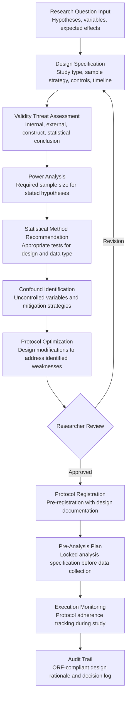

# Experiment Design Assistant

Frankmax

NAICS 611110-541720

> **Education / R&D / Think Tanks** — Research Intelligence Module

## Objective & Purpose

Poor experimental design is the silent killer of research funding. Studies estimate that 50-85% of biomedical research spending is wasted on experiments with preventable design flaws: inadequate sample sizes (leading to underpowered studies), uncontrolled confounding variables, inappropriate statistical methods, and non-reproducible protocols. In the social sciences and policy research, the replication crisis has revealed that 60-70% of published findings fail to replicate -- largely due to methodological weaknesses that could have been identified before data collection began. At an average cost of $200K-$500K per failed experiment (including researcher time, materials, equipment, and opportunity cost), design failures represent billions in wasted research funding annually.

The Experiment Design Assistant validates research methodology before execution. Researchers input their research question, proposed design (study type, variables, controls, sample strategy, analysis plan), and constraints (budget, timeline, available equipment, ethical considerations). The engine evaluates the design against established methodological standards, identifies potential threats to validity (internal, external, construct, statistical conclusion), calculates required sample sizes for the stated hypotheses, recommends appropriate statistical methods, and flags confounding variables that the current design does not adequately control. The output is a design review report that either confirms the methodology is sound or identifies specific weaknesses with recommended corrections.

Within the $2,000-$4,000/month Research Intelligence Pack, the Experiment Design Assistant reduces wasted research spending by catching design flaws before they consume resources. For a research institution running 100+ experiments annually, preventing even 10% of design-related failures saves $2M-$5M in wasted effort. The governance layer (design review documentation, protocol registration support, pre-analysis plan archiving) attaches naturally because funders, IRBs, and journals increasingly require pre-registered protocols with documented design justification.

## Business Context

| Attribute | Value |
|---|---|
| **Business Process** | Research methodology validation and design optimization |
| **Business Function** | Research Design |
| **Category** | R&D |
| **Target Audience** | 11. Education / R&D / Think Tanks |
| **Bundle** | Research Intelligence Pack ($2,000-$4,000/mo) |
| **Monthly Cost of Inaction** | $8K-$25K (failed experiments, underpowered studies, non-replicable results) |

## BPMN Workflow

## Features

1. **Design Pattern Library** — Maintains a comprehensive library of experimental and quasi-experimental designs with their applicability conditions, strengths, and limitations: randomized controlled trials (parallel, crossover, factorial, adaptive), quasi-experimental designs (difference-in-differences, regression discontinuity, instrumental variables, synthetic control), observational designs (cohort, case-control, cross-sectional), and qualitative designs (case study, ethnography, grounded theory). Recommends the optimal design based on research question characteristics and practical constraints.

2. **Statistical Power Calculator** — Computes required sample sizes for any design and hypothesis combination. Supports power analysis for t-tests, ANOVA, regression, multilevel models, survival analysis, and Bayesian designs. Accounts for expected effect sizes (informed by prior literature via Literature Review Accelerator integration), dropout rates, clustering effects (design effects for cluster-randomized studies), and multiple comparison corrections. Prevents the most common design flaw: underpowered studies that cannot detect the effects they aim to measure.

3. **Validity Threat Analyzer** — Systematically evaluates the proposed design against Campbell and Stanley's validity framework: internal validity (history, maturation, testing, instrumentation, regression to mean, selection, attrition), external validity (population, setting, temporal generalizability), construct validity (measurement adequacy, treatment fidelity), and statistical conclusion validity (low power, violated assumptions, fishing for significance). Each threat is scored by severity and accompanied by specific mitigation recommendations.

4. **Confounding Variable Detector** — Uses causal inference frameworks (directed acyclic graphs, potential outcomes) to identify variables that could confound the relationship between the independent and dependent variables. For each identified confounder, the engine recommends control strategies: randomization, matching, statistical adjustment, instrumental variables, or design changes that break the confounding path.

5. **Pre-Registration Protocol Generator** — Produces pre-registration documents compliant with major registries: ClinicalTrials.gov (clinical research), OSF Registrations (social and behavioral science), AEA RCT Registry (economics), and PROSPERO (systematic reviews). Pre-registration locks the design, hypotheses, and analysis plan before data collection, addressing the replication crisis and demonstrating methodological rigor to reviewers and funders.

6. **Analysis Plan Specifier** — Generates a detailed pre-analysis plan: primary analysis (hypothesis tests with specified models, variables, and decision criteria), secondary analyses (exploratory questions with appropriate multiple comparison corrections), sensitivity analyses (robustness checks against violated assumptions), and missing data handling (imputation strategies, per-protocol vs. intention-to-treat definitions). The locked plan prevents post-hoc analytical flexibility (p-hacking).

7. **Protocol Adherence Monitor** — During experiment execution, tracks adherence to the registered protocol: enrollment rates vs. targets, randomization balance checks, treatment fidelity metrics, data collection completeness, and timeline milestones. Flags deviations from protocol that could compromise study validity, enabling real-time corrective action rather than post-hoc discovery of compromised data.

## Workflow & Automation

**Step 1: Research Question Structuring** — The researcher inputs their research question, the engine helps structure it into testable hypotheses with clearly defined independent variables (treatments/exposures), dependent variables (outcomes), and expected effect sizes (informed by prior literature or minimum clinically/practically significant differences).

**Step 2: Design Selection** — Based on the research question, available resources, and ethical constraints, the engine recommends appropriate experimental designs. For each recommended design, it shows: required sample size, estimated cost, timeline, validity profile (which threats are controlled), and feasibility assessment against stated constraints.

**Step 3: Validity Assessment** — The researcher selects a design, and the engine performs a comprehensive validity threat assessment. Each identified threat is scored (high/medium/low) with specific evidence (e.g., "history threat: high -- 6-month study period spans legislative change that may independently affect outcome variable"). Mitigation strategies are recommended for each high-severity threat.

**Step 4: Sample Size Determination** — The power calculator computes required sample sizes based on the selected design, expected effect size, desired power (typically 0.80 or 0.90), significance level, and any design-specific factors (clustering, stratification, repeated measures). The engine provides sensitivity analyses showing how sample size varies with effect size assumptions.

**Step 5: Protocol Documentation** — The validated design is documented in a comprehensive protocol: background and rationale, study design description, participant eligibility, randomization and blinding procedures, outcome measures, sample size justification, data collection procedures, statistical analysis plan, and ethical considerations. The protocol is formatted for pre-registration submission.

**Step 6: Pre-Registration & Lock** — The protocol is submitted to the appropriate pre-registration platform. The pre-analysis plan is time-stamped and archived, creating a verifiable record of the planned analysis before data collection begins. Any subsequent changes to the protocol are tracked as amendments with justifications.

## Input/Output Specifications

| Direction | Data | Format | Description |
|---|---|---|---|
| Input | Research question and hypotheses | Structured form / Natural language | Variables, expected effects, theoretical framework |
| Input | Design parameters | Structured form | Study type, sample strategy, timeline, budget constraints |
| Input | Prior literature effect sizes | JSON / API (from Literature Review) | Expected effect sizes and variability from prior studies |
| Input | Institutional constraints | Structured form | Budget, equipment, IRB requirements, timelines |
| Input | Protocol drafts | DOCX / PDF | Work-in-progress study protocols for review |
| Output | Design review report | PDF / Dashboard | Validity assessment, power analysis, recommendations |
| Output | Pre-registration document | PDF / DOCX | Registry-formatted protocol with analysis plan |
| Output | Sample size report | PDF / JSON | Power analysis results with sensitivity curves |
| Output | Adherence monitoring dashboard | Web portal / API | Real-time protocol compliance tracking |
| Output | Audit trail | JSON (immutable log) | ORF-compliant design rationale and decision documentation |

## Integration Points

| System | Integration Type | Data Flow |
|---|---|---|
| **Literature Review Accelerator** | Inbound data | Prior effect sizes and methodological patterns inform design parameters |
| **Grant Proposal Optimizer** | Outbound methodology | Validated designs strengthen grant proposal methodology sections |
| **Lab Resource Optimizer** | Inbound constraints | Lab capacity and equipment availability constrain experimental designs |
| **Research Impact Quantifier** | Outbound quality | Pre-registered, well-designed studies achieve higher impact metrics |
| **Multi-Model AI Orchestrator** | Infrastructure | Routes statistical computation, NLP analysis, and design optimization tasks |
| **Audit Trail & Traceability Engine** | Outbound log stream | Complete design rationale and protocol change documentation |
| **IRB / Ethics Review Systems** | Outbound protocols | Protocol submissions for ethical review |

## Pricing & Revenue Model

| Component | Pricing | Notes |
|---|---|---|
| **Research Intelligence Pack** | $2,000-$4,000/month | Experiment Design Assistant + research tools + 2M AI tokens |
| **Standalone Subscription** | $1,000/month | Up to 20 design reviews per month |
| **University-wide license** | $2,200/month | Unlimited reviews, multi-department, protocol management |
| **Pre-registration module** | +$300/month | Registry-formatted protocol generation and submission |
| **Adherence monitoring** | +$400/month | Real-time protocol compliance tracking during execution |
| **AI token consumption** | Included at 80% discount | 2M tokens/month in bundle; overage at marketplace rates |

**Revenue model**: The Experiment Design Assistant saves research funding by preventing design-driven failures. Preventing one underpowered clinical trial (average cost $500K-$2M) pays for the tool for 10-40 years. The governance layer (pre-registration documentation, design rationale audit trail, protocol adherence tracking) attaches at near-100% because funders and journals increasingly require pre-registered protocols. The tool's governance output is not optional -- it is the credibility mechanism that modern science demands.

## NAICS/SIC Mapping

| NAICS Code | SIC Code | Industry | Relevance |
|---|---|---|---|
| 611310 | 8221 | Colleges, Universities, and Professional Schools | Primary: university research labs and methodology courses |
| 541711 | 8731 | Research and Development in Biotechnology | Biotech experiment design and clinical trial planning |
| 541712 | 8733 | Research and Development in Physical Sciences | Physical science experimental methodology |
| 541720 | 8732 | Research and Development in Social Sciences | Social science and policy experiment design |
| 611710 | 8299 | Educational Support Services | Research methodology training and support |
