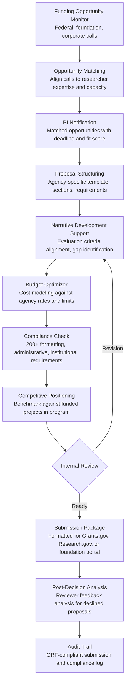

# Grant Proposal Optimizer

Frankmax

NAICS 611110-611710

> **Education / R&D / Think Tanks** — Research Intelligence Module

## Objective & Purpose

Research institutions depend on grant funding: federal agencies (NSF, NIH, DOE, DARPA), private foundations (Gates, Ford, MacArthur), and corporate sponsors collectively fund over $90B annually in U.S. research. Yet grant success rates are brutally low -- NSF funds 25% of proposals, NIH funds 20%, and many private foundations fund under 10%. A typical PI (Principal Investigator) spends 30-50% of their working time writing proposals, with an average of 4-6 months per major federal proposal. At a fully loaded cost of $150K-$250K per PI per year, the proposal writing burden represents $50K-$125K in annual opportunity cost per researcher -- before accounting for the lost research productivity during proposal preparation periods.

The Grant Proposal Optimizer applies AI across the full grant lifecycle: opportunity identification (matching researcher expertise and institutional capabilities to open funding calls), proposal development (structured drafting with agency-specific formatting, evaluation criteria alignment, and budget optimization), competitive positioning (benchmarking the proposed research against funded projects in the same program), and revision support (analyzing reviewer feedback on declined proposals to strengthen resubmissions). The engine does not write proposals -- it structures the researcher's ideas into agency-optimized formats, identifies gaps in the narrative that reviewers will flag, and ensures compliance with the 200+ formatting and administrative requirements that sink otherwise meritorious proposals.

Within the $2,000-$4,000/month Research Intelligence Pack, the Grant Proposal Optimizer directly addresses the revenue engine of research institutions. A university research office processing 200+ proposals per year can increase funded volume by 15-25% through better proposal quality, better opportunity targeting, and faster turnaround on resubmissions. At average grant sizes of $300K-$1M, even a 5% improvement in success rate generates $3M-$10M in additional funded research annually.

## Business Context

| Attribute | Value |
|---|---|
| **Business Process** | Grant writing, submission, and administration |
| **Business Function** | Research Administration |
| **Category** | Finance |
| **Target Audience** | 11. Education / R&D / Think Tanks |
| **Bundle** | Research Intelligence Pack ($2,000-$4,000/mo) |
| **Monthly Cost of Inaction** | $10K-$30K (failed proposals, missed opportunities, PI time waste) |

## BPMN Workflow

## Features

1. **Funding Opportunity Scanner** — Monitors 50+ funding sources daily: Grants.gov (all federal agencies), NSF, NIH Reporter, DOE EERE, DARPA, foundation databases (Foundation Directory Online), and corporate research partnerships. Matches opportunities to researcher profiles using expertise keywords, publication history, past funded topics, and institutional capabilities. Delivers personalized opportunity alerts with fit scores and deadline tracking.

2. **Evaluation Criteria Aligner** — Parses the funding agency's review criteria (NSF's Intellectual Merit and Broader Impacts, NIH's five scored criteria, DARPA's technical approach requirements) and maps them to the proposal structure. Highlights sections where the current draft inadequately addresses specific criteria, flags criteria that are unaddressed, and suggests where to strengthen arguments. Ensures every evaluation criterion receives proportional attention in the narrative.

3. **Narrative Gap Detector** — Analyzes the proposal draft for structural and logical gaps: missing preliminary data for feasibility claims, unsupported budget items, timeline inconsistencies, team capability gaps (proposed work requiring expertise not represented on the team), and logical disconnects between aims (where Aim 2 depends on Aim 1 outcomes that may not materialize). Provides specific, actionable feedback rather than generic writing suggestions.

4. **Budget Optimization Engine** — Builds compliant budgets aligned to agency-specific rules: salary caps (NIH salary limit), fringe benefit rates, equipment thresholds, travel policies, indirect cost rates (negotiated F&A rates by institution), subcontract limitations, and cost-sharing requirements. Identifies budget red flags that trigger administrative reviews and suggests restructuring to maximize the research-to-overhead ratio.

5. **Competitive Intelligence Module** — Analyzes funded projects in the target program using NSF Award Search, NIH Reporter, and agency annual reports. Identifies: what topics have been funded recently (saturation risk), what methodological approaches reviewers have favored, which PIs have been funded (potential collaborators or competitors), and what budget ranges have been successful. Provides positioning recommendations to differentiate the proposal.

6. **Compliance Validator** — Checks the proposal against 200+ formatting and administrative requirements: page limits, font size/type, margin requirements, required sections (data management plan, postdoctoral mentoring plan, facilities description), institutional certifications (IRB, IACUC, conflict of interest), and submission system requirements (Grants.gov validations, Research.gov formatting). Catches compliance failures that cause desk rejections before review.

7. **Resubmission Optimizer** — For declined proposals with reviewer feedback, the engine analyzes each reviewer comment, classifies its type (scientific concern, methodological criticism, clarity issue, scope concern), maps it to the relevant proposal section, and generates a structured response plan. For NIH resubmissions, it drafts the Introduction page explaining how each reviewer concern has been addressed.

## Workflow & Automation

**Step 1: Opportunity Identification** — The engine scans funding databases against researcher profiles maintained in the system. New opportunities matching researcher expertise trigger notifications with deadline, budget range, fit score, and a brief assessment of competitive landscape (how many proposals the program typically receives, historical funding rate).

**Step 2: Proposal Planning** — When a PI decides to pursue an opportunity, the engine generates a proposal skeleton: agency-required sections populated with template language, evaluation criteria mapped to section headers, deadline-driven timeline with milestones (draft completion, internal review, budget finalization, institutional approval, submission), and a checklist of required supplementary documents.

**Step 3: Draft Development** — As the PI writes, the engine provides real-time feedback: evaluation criteria alignment scoring (are all criteria addressed?), narrative gap detection (missing justifications, unsupported claims), and readability assessment (sentence complexity, jargon density relative to the likely review panel's expertise). Feedback is section-specific and linked to agency review guidance.

**Step 4: Budget Construction** — The engine constructs the budget in parallel with narrative development. As personnel, equipment, and activities are described in the narrative, the budget automatically updates. The system applies institutional rates (F&A, fringe, tuition remission) and agency rules (salary caps, equipment thresholds), flagging any compliance issues.

**Step 5: Internal Review Coordination** — The engine routes the completed draft through the institution's internal review process: department review, research office compliance check, institutional official sign-off. Review comments are tracked and resolved within the system, with version control maintaining the complete revision history.

**Step 6: Submission & Tracking** — The finalized proposal is packaged for submission through the appropriate portal (Grants.gov, Research.gov, foundation-specific systems). The engine validates the package against submission system requirements before upload. Post-submission, the engine tracks the review timeline and notifies the PI of status changes.

## Input/Output Specifications

| Direction | Data | Format | Description |
|---|---|---|---|
| Input | Funding opportunity announcements | HTML / XML / API | FOAs, RFPs, program announcements from funding agencies |
| Input | Researcher profiles | JSON / CV import | Expertise keywords, publication history, past grants, lab capabilities |
| Input | Proposal drafts | DOCX / LaTeX / PDF | Work-in-progress proposal narratives and supporting documents |
| Input | Agency review criteria | PDF / HTML | Evaluation criteria, review panel guidance, proposal instructions |
| Input | Reviewer feedback (for resubmissions) | PDF / Email | Summary statements and individual reviewer critiques |
| Output | Opportunity match alerts | Email / Dashboard / API | Personalized funding opportunity notifications with fit scores |
| Output | Proposal feedback reports | Dashboard / PDF | Section-by-section analysis against evaluation criteria |
| Output | Compliant budget | Excel / PDF / XML | Agency-formatted budget with justification narrative |
| Output | Submission package | Agency-specific format | Complete proposal ready for portal submission |
| Output | Audit trail | JSON (immutable log) | ORF-compliant proposal development and compliance check log |

## Integration Points

| System | Integration Type | Data Flow |
|---|---|---|
| **Literature Review Accelerator** | Inbound data | Review findings inform proposal background and significance sections |
| **Research Collaboration Matcher** | Bidirectional | Collaboration matches inform team composition; proposal needs drive matching |
| **Research Impact Quantifier** | Inbound metrics | PI track record metrics strengthen investigator qualifications section |
| **Lab Resource Optimizer** | Inbound data | Lab capacity data informs facilities and equipment descriptions |
| **Multi-Model AI Orchestrator** | Infrastructure | Routes NLP analysis, compliance checking, and recommendation tasks |
| **Audit Trail & Traceability Engine** | Outbound log stream | Complete proposal development and compliance audit trail |
| **Institutional Research Office Systems** | Bidirectional API | Institutional data in; submission packages out |

## Pricing & Revenue Model

| Component | Pricing | Notes |
|---|---|---|
| **Research Intelligence Pack** | $2,000-$4,000/month | Grant Optimizer + research tools + 2M AI tokens |
| **Standalone Subscription** | $1,500/month | Up to 20 active proposals, 5 researcher profiles |
| **University-wide license** | $3,000/month | Unlimited proposals and profiles, multi-department |
| **Competitive intelligence module** | +$400/month | Funded project analysis and positioning recommendations |
| **Resubmission optimizer** | +$300/month | Reviewer feedback analysis and response planning |
| **AI token consumption** | Included at 80% discount | 2M tokens/month in bundle; overage at marketplace rates |

**Revenue model**: The Grant Proposal Optimizer directly drives institutional revenue. A 5% improvement in grant success rate for a university processing 200 proposals/year at $500K average grant size generates $5M in additional funded research -- against a $24K-$48K annual tool cost. The governance layer (compliance validation, submission audit trail, evaluation criteria documentation) attaches at near-100% because grant administration inherently requires compliance documentation. Federal audits (A-133, Uniform Guidance) demand the exact audit trail this tool produces.

## NAICS/SIC Mapping

| NAICS Code | SIC Code | Industry | Relevance |
|---|---|---|---|
| 611310 | 8221 | Colleges, Universities, and Professional Schools | Primary: university research offices and PIs |
| 611710 | 8299 | Educational Support Services | Research administration and sponsored programs offices |
| 541711 | 8731 | Research and Development in Biotechnology | Biotech R&D organizations seeking grant funding |
| 541712 | 8733 | Research and Development in Physical Sciences | Physical science labs pursuing federal grants |
| 541720 | 8732 | Research and Development in Social Sciences | Think tanks and social science researchers |
