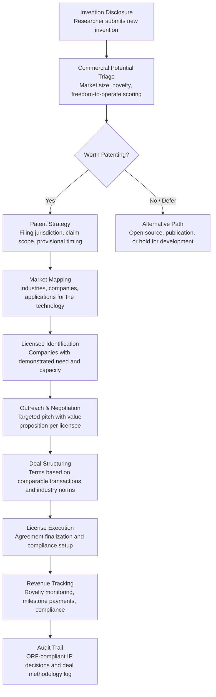

# IP Commercialization Engine

Frankmax

NAICS 611310-541720

> **Education / R&D / Think Tanks** — Research Intelligence Module

## Objective & Purpose

U.S. universities hold over 80,000 active patents, yet 95% of university-generated intellectual property goes unlicensed. Technology transfer offices (TTOs) are overwhelmed: the average TTO manages 200-500 invention disclosures per year with a staff of 5-15 licensing professionals, each juggling 30-50 active cases. The process from disclosure to license averages 3-5 years, and most TTOs operate at a net loss -- only 15-20 universities nationwide generate technology transfer revenue exceeding their TTO operating costs. The fundamental problem is matching: TTOs lack the market intelligence to identify which companies need their technology, and companies lack the visibility to discover relevant university IP among tens of thousands of undifferentiated patent listings.

The IP Commercialization Engine applies AI to bridge this gap across the entire technology transfer pipeline: invention triage (scoring new disclosures for commercial potential before investing in patent protection), market mapping (identifying companies, industries, and applications where the technology has commercial value), licensee matching (connecting specific patents to specific companies with demonstrated need), deal structuring (recommending license terms based on comparable transactions and industry norms), and portfolio optimization (identifying undermonetized assets, expiring patents worth abandoning, and patent families worth strengthening). The engine transforms TTOs from passive "post-it-and-pray" operations into active market-making entities.

Within the $2,000-$4,000/month Research Intelligence Pack, the IP Commercialization Engine targets the most direct revenue opportunity for research institutions: turning research output into license revenue. A single successful license can generate $100K-$10M+ in royalties. By increasing the commercialization rate from 5% to 10-15%, the engine can generate $500K-$5M in additional annual licensing revenue for a mid-size research university -- against a $24K-$48K annual tool cost.

## Business Context

| Attribute | Value |
|---|---|
| **Business Process** | Technology transfer and IP commercialization |
| **Business Function** | Innovation/IP |
| **Category** | Finance |
| **Target Audience** | 11. Education / R&D / Think Tanks |
| **Bundle** | Research Intelligence Pack ($2,000-$4,000/mo) |
| **Monthly Cost of Inaction** | $10K-$40K (unlicensed IP, missed commercial opportunities, patent maintenance waste) |

## BPMN Workflow

## Features

1. **Invention Triage Scorer** — Evaluates new invention disclosures on five dimensions before patent investment: technical novelty (prior art analysis against patent and literature databases), market size (addressable market for applications of the technology), competitive landscape (existing solutions and their limitations), freedom-to-operate (blocking patents that may limit commercialization), and development stage (how much additional development is needed for commercial readiness). Scores determine priority for patent investment, preventing the common mistake of patenting everything equally.

2. **Market Opportunity Mapper** — For each patented technology, the engine identifies commercial applications across industries. Maps technology capabilities to industry pain points using a cross-reference of patent claims, industry problem databases, and company product roadmaps (inferred from job postings, patent filings, and M&A activity). Identifies primary markets (obvious applications), adjacent markets (non-obvious but high-value applications), and emerging markets (applications that will become viable as enabling technologies mature).

3. **Licensee Matching Engine** — Identifies specific companies most likely to license each technology based on: technology fit (alignment between patent claims and company product/process needs), financial capacity (revenue and R&D spending sufficient to absorb licensing costs), strategic alignment (company's stated innovation priorities from 10-K filings, earnings calls, and press releases), and acquisition history (companies that have previously licensed university IP). Rankings are accompanied by evidence for each match.

4. **Deal Comparables Database** — Maintains a database of 10,000+ technology license transactions with deal terms: upfront payments, running royalty rates, milestone payments, minimum annual royalties, field-of-use restrictions, territory scope, and exclusivity provisions. For any proposed deal, the engine provides comparable transactions by technology type, deal structure, and industry, ensuring TTO negotiators enter discussions with market-calibrated expectations.

5. **Patent Portfolio Optimizer** — Analyzes the institution's entire patent portfolio to identify: high-potential underpromoted assets (patents with strong commercial potential that have received insufficient marketing), maintenance cost optimization (patents approaching maintenance fee deadlines that are unlikely to generate revenue), filing strategy gaps (provisional applications not yet converted, international filing deadlines approaching), and family strengthening opportunities (continuation applications that could broaden claim coverage for high-value inventions).

6. **Startup Formation Advisor** — For technologies better suited to startup formation than licensing, the engine evaluates startup viability: addressable market size, competitive moat from the IP, founding team requirements, estimated capital needs to reach revenue, and comparable startup outcomes in the technology space. Produces a startup formation brief that can support incubator applications, SBIR/STTR grants, and angel/VC pitches.

7. **Revenue Forecasting Engine** — Projects licensing revenue across the portfolio: expected royalty streams from active licenses, probability-weighted revenue from deals in negotiation, and estimated future revenue from uncommitted high-potential patents. Forecasts support institutional budgeting and TTO resource allocation decisions.

## Workflow & Automation

**Step 1: Disclosure Intake** — Researchers submit invention disclosures through the TTO portal. The engine automatically parses the disclosure for key information: technology description, potential applications, development stage, inventor team, and funding source (which determines IP ownership and licensing obligations).

**Step 2: Triage & Prioritization** — Within 48 hours of disclosure, the triage scorer produces a commercial potential assessment. High-scoring disclosures are fast-tracked for patent counsel review. Medium-scoring disclosures receive targeted follow-up questions to clarify commercial potential. Low-scoring disclosures are recommended for alternative paths (publication, open-source release, hold for further development).

**Step 3: Patent Strategy** — For disclosures advancing to patent protection, the engine recommends: filing strategy (provisional vs. non-provisional, jurisdiction selection, claim scope), timeline (conversion deadlines, PCT filing windows, national phase entry), and budget (estimated prosecution costs by jurisdiction, maintenance fee projections over the patent lifetime).

**Step 4: Market Intelligence** — In parallel with patent prosecution, the engine maps commercial opportunities: target industries, specific companies, application areas, and estimated market value. Market maps are refreshed quarterly as new industry data becomes available, ensuring that licensing outreach targets the most current opportunities.

**Step 5: Licensee Outreach** — The TTO licensing team uses engine-generated target lists and value propositions to approach potential licensees. Each outreach package includes: technology summary tailored to the target company's needs, competitive advantage analysis, and suggested deal structure based on comparable transactions.

**Step 6: Deal Negotiation Support** — During license negotiations, the engine provides real-time comparable deal data: what similar technologies have licensed for, typical deal structures in the target industry, and sensitivity analysis showing how different terms (royalty rate, upfront payment, exclusivity scope) affect total expected revenue.

## Input/Output Specifications

| Direction | Data | Format | Description |
|---|---|---|---|
| Input | Invention disclosures | Web form / PDF / DOCX | Technology descriptions, inventor information, development stage |
| Input | Patent portfolio data | API / CSV | Active patents, applications, maintenance schedules, claims |
| Input | Company intelligence | API / Web scrape | 10-K filings, patent portfolios, product catalogs, job postings |
| Input | License transaction comparables | Database / CSV | Historical deal terms from public and proprietary sources |
| Input | Market data | API / JSON | Industry market sizes, growth rates, technology adoption curves |
| Output | Triage scorecards | Dashboard / PDF | Commercial potential assessment per disclosure |
| Output | Market opportunity maps | Dashboard / PDF | Industries, companies, and applications for each technology |
| Output | Licensee match reports | PDF / JSON | Ranked company targets with evidence and rationale |
| Output | Portfolio analytics | Dashboard / PDF | Revenue forecasts, optimization recommendations, maintenance decisions |
| Output | Audit trail | JSON (immutable log) | ORF-compliant IP decisions, triage rationale, deal methodology |

## Integration Points

| System | Integration Type | Data Flow |
|---|---|---|
| **Grant Proposal Optimizer** | Inbound context | Grant-funded inventions trigger disclosure pipeline |
| **Research Impact Quantifier** | Bidirectional | License revenue counts as research impact; impact metrics inform triage scoring |
| **Literature Review Accelerator** | Inbound data | Prior art analysis leverages literature review capabilities |
| **Research Collaboration Matcher** | Outbound signals | IP commercialization needs drive collaboration for further development |
| **Multi-Model AI Orchestrator** | Infrastructure | Routes NLP analysis, matching, and forecasting tasks |
| **Audit Trail & Traceability Engine** | Outbound log stream | Complete IP decision and deal methodology audit trail |
| **Patent Management Systems** | Bidirectional API | Patent data in; triage scores and strategy recommendations out |

## Pricing & Revenue Model

| Component | Pricing | Notes |
|---|---|---|
| **Research Intelligence Pack** | $2,000-$4,000/month | IP Commercialization Engine + research tools + 2M AI tokens |
| **Standalone Subscription** | $1,500/month | Up to 200 patents in portfolio, 50 disclosures/year |
| **Large portfolio tier** | $2,800/month | Up to 1,000 patents, unlimited disclosures |
| **Licensee matching module** | +$500/month | Active company targeting with evidence packages |
| **Deal comparables database** | +$400/month | Access to 10,000+ transaction records |
| **AI token consumption** | Included at 80% discount | 2M tokens/month in bundle; overage at marketplace rates |

**Revenue model**: The IP Commercialization Engine generates directly measurable ROI through increased licensing revenue. A single additional license generating $200K in royalties pays for 4-8 years of tool subscription. The governance layer (triage rationale documentation, deal methodology audit trail, IP decision logging) attaches because Bayh-Dole compliance requires documented IP management processes for federally funded inventions. Federal audit requirements make governance attachment effectively mandatory for universities receiving federal grants. Target: 80%+ governance attachment.

## NAICS/SIC Mapping

| NAICS Code | SIC Code | Industry | Relevance |
|---|---|---|---|
| 611310 | 8221 | Colleges, Universities, and Professional Schools | Primary: university technology transfer offices |
| 541711 | 8731 | Research and Development in Biotechnology | Biotech IP commercialization |
| 541712 | 8733 | Research and Development in Physical Sciences | Physical science patent licensing |
| 541720 | 8732 | Research and Development in Social Sciences | Policy IP and methodology licensing |
| 541690 | 8999 | Other Scientific and Technical Consulting | IP strategy consulting firms |
