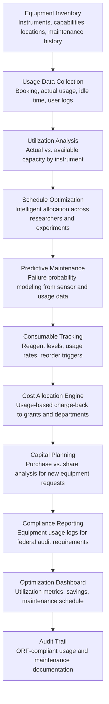

# Lab Resource Optimizer

Frankmax

NAICS 611310-541720

> **Education / R&D / Think Tanks** — Education Operations Module

## Objective & Purpose

Research laboratory equipment is among the most expensive capital investments an institution makes. A single electron microscope costs $1M-$5M, an MRI scanner $1.5M-$3M, a mass spectrometer $200K-$2M, and even routine analytical instruments (centrifuges, sequencers, spectrometers) run $50K-$500K each. Yet utilization studies consistently show that shared research equipment sits idle 50-70% of available time. The reasons are structural: scheduling is managed through paper sign-up sheets or basic calendaring systems that cannot optimize across multiple users and experiments, PIs hoard equipment time "just in case," maintenance is reactive rather than predictive (causing multi-week unplanned downtime), and there is no institutional visibility into whether purchasing a new instrument is justified when existing capacity is underused.

The Lab Resource Optimizer applies AI to maximize research equipment utilization and minimize operational waste across five dimensions: scheduling optimization (intelligent allocation of equipment time across researchers, experiments, and training), predictive maintenance (forecasting equipment failures before they cause unplanned downtime), consumable management (tracking reagent usage, predicting stockouts, and optimizing procurement), space utilization (measuring lab space usage patterns and identifying reconfiguration opportunities), and cost allocation (transparent usage-based costing for grant-funded research, ensuring accurate charge-back to funding sources).

Within the $2,000-$4,000/month Research Intelligence Pack, the Lab Resource Optimizer directly reduces operational costs. Increasing equipment utilization from 40% to 65% can defer $2M-$10M in capital equipment purchases for a major research university. Reducing unplanned downtime by 40% through predictive maintenance saves 200-500 research days per year across the institution. The governance layer (usage logging for grant cost allocation, maintenance documentation for equipment audits, safety compliance tracking) attaches because federal cost principles (2 CFR 200) require documented equipment usage records for grant-funded research.

## Business Context

| Attribute | Value |
|---|---|
| **Business Process** | Laboratory resource management and optimization |
| **Business Function** | Operations |
| **Category** | Facilities |
| **Target Audience** | 11. Education / R&D / Think Tanks |
| **Bundle** | Research Intelligence Pack ($2,000-$4,000/mo) |
| **Monthly Cost of Inaction** | $10K-$30K (idle equipment, unplanned downtime, procurement waste) |

## BPMN Workflow

## Features

1. **Intelligent Scheduling Engine** — Replaces paper sign-up sheets with AI-optimized scheduling. The engine considers experiment requirements (instrument settings, run duration, sample preparation time, cool-down periods), researcher preferences (preferred time slots, experiment dependencies), equipment constraints (warmup time, calibration needs, maintenance windows), and institutional priorities (grant-funded experiments with deadlines, teaching lab reservations, external user access). Scheduling maximizes utilization while preventing conflicts and ensuring adequate maintenance windows.

2. **Predictive Maintenance Module** — Analyzes equipment sensor data (temperature, vibration, pressure, error logs), usage patterns (hours since last service, number of runs, sample types processed), and historical failure data to predict maintenance needs before failures occur. Generates maintenance recommendations: "Instrument X shows vibration patterns consistent with bearing wear; schedule replacement within 2 weeks to prevent 3-4 week unplanned downtime." Reduces unplanned downtime by 30-50%.

3. **Consumable Inventory Manager** — Tracks reagent, gas, and supply consumption across labs. Monitors usage rates, predicts stockout dates based on current consumption velocity, generates automatic reorder recommendations at optimal lead-time thresholds, and identifies bulk purchasing opportunities across departments. Prevents experiment delays from stockouts (a common researcher complaint) while avoiding overstocking of expensive, time-sensitive reagents.

4. **Usage-Based Cost Allocation** — Calculates accurate per-use costs for shared equipment: instrument depreciation (allocated across actual usage hours), maintenance costs (distributed by usage proportion), consumables (charged by actual consumption per experiment), and staff support time. Produces grant-compliant charge-back records that satisfy federal cost principles for equipment usage on sponsored research. Eliminates the common problem of grants under- or over-charged for equipment access.

5. **Capital Equipment Decision Support** — When a PI requests a new instrument purchase, the engine analyzes whether existing institutional capacity could meet the need: current utilization of comparable instruments, scheduling feasibility for the requested capacity, cost comparison (purchase vs. shared access vs. external service provider), and strategic value (does the institution need this capability for competitive positioning?). Prevents unnecessary duplicate purchases that sit underutilized.

6. **Space Utilization Analyzer** — Monitors lab space usage patterns through badge access data, equipment usage logs, and researcher scheduling: which lab spaces are consistently underused, which are overcrowded, where reconfiguration could improve workflow, and where shared spaces could replace dedicated spaces. Space optimization recommendations can reduce lab space costs by 10-20% or increase research capacity without construction.

7. **Safety and Compliance Tracker** — Monitors equipment safety compliance: calibration currency (instruments due for recalibration), safety inspection schedules, user training certification (has each equipment user completed required safety training?), and hazardous material inventory (chemicals, biological agents, radioactive materials tracked against permit limits). Generates compliance reports for EHS (Environmental Health & Safety) audits and institutional safety reviews.

## Workflow & Automation

**Step 1: Inventory & Configuration** — The engine catalogs all shared research equipment: instrument type, capabilities, location, acquisition date, replacement cost, maintenance schedule, and associated consumables. Equipment is grouped by capability category (imaging, analytical, fabrication, biological, computational) to enable cross-lab optimization.

**Step 2: Usage Data Collection** — The engine collects usage data from multiple sources: booking system records (scheduled vs. actual usage), instrument logs (runtime hours, sample counts), badge access (lab entry/exit times), and researcher self-reporting (experiment type, grant charge codes). Data collection is as automated as instrument connectivity allows, with manual logging as fallback.

**Step 3: Utilization Analysis** — Weekly utilization reports show: actual usage hours vs. available hours per instrument, booking-to-usage ratio (no-show rate), peak and off-peak patterns, and utilization trends over time. Instruments with consistently low utilization (under 30%) are flagged for consolidation analysis. Instruments with consistently high utilization (over 85%) are flagged for capacity expansion planning.

**Step 4: Schedule Optimization** — The scheduling engine runs overnight to generate optimal schedules for the next booking period. Researchers submit scheduling requests through the portal; the engine allocates slots considering experiment requirements, user priorities, and utilization targets. Waitlist management automatically fills cancellations. Recurring bookings are analyzed for actual usage patterns, and habitual no-shows receive adjusted priority.

**Step 5: Maintenance Planning** — The predictive maintenance module generates a rolling 90-day maintenance forecast: scheduled preventive maintenance, predicted corrective maintenance (based on sensor data and usage patterns), and calibration due dates. Maintenance is scheduled during low-utilization windows to minimize research disruption.

**Step 6: Financial Reporting** — Monthly financial reports show: equipment usage charges by grant, department, and PI; consumable costs by lab; maintenance costs by instrument; and total cost of ownership trends. Reports are formatted for institutional finance systems and federal audit requirements.

## Input/Output Specifications

| Direction | Data | Format | Description |
|---|---|---|---|
| Input | Equipment inventory | CSV / API | Instrument specifications, location, cost, maintenance history |
| Input | Usage logs | API / sensor data / manual entry | Runtime hours, sample counts, user identification |
| Input | Booking requests | Web form / API | Researcher scheduling requests with experiment parameters |
| Input | Maintenance records | CSV / API | Service history, calibration records, parts replacement logs |
| Input | Consumable inventory | CSV / barcode scan | Reagent levels, lot numbers, expiration dates |
| Output | Optimized schedules | Web portal / Calendar API / Email | Per-instrument booking calendars with conflict resolution |
| Output | Maintenance forecasts | Dashboard / Email | Predicted maintenance needs with priority and timing |
| Output | Utilization reports | Dashboard / PDF / CSV | Per-instrument usage metrics and trend analysis |
| Output | Cost allocation reports | CSV / PDF | Grant-compliant equipment usage charge-back records |
| Output | Audit trail | JSON (immutable log) | ORF-compliant usage, maintenance, and cost allocation documentation |

## Integration Points

| System | Integration Type | Data Flow |
|---|---|---|
| **Grant Proposal Optimizer** | Outbound data | Lab capacity data informs grant proposal facilities descriptions |
| **Experiment Design Assistant** | Outbound constraints | Equipment availability constrains experiment design parameters |
| **Research Impact Quantifier** | Outbound metrics | Lab productivity metrics contribute to research output measurement |
| **Accreditation Compliance Automator** | Outbound data | Facilities and equipment documentation for accreditation |
| **Multi-Model AI Orchestrator** | Infrastructure | Routes optimization, prediction, and scheduling tasks |
| **Audit Trail & Traceability Engine** | Outbound log stream | Complete equipment usage and maintenance audit trail |
| **Institutional ERP / Finance Systems** | Bidirectional API | Cost data out; budget and grant account codes in |

## Pricing & Revenue Model

| Component | Pricing | Notes |
|---|---|---|
| **Research Intelligence Pack** | $2,000-$4,000/month | Lab Resource Optimizer + research tools + 2M AI tokens |
| **Standalone Subscription** | $1,000/month | Up to 50 instruments, basic scheduling and utilization |
| **Large facility tier** | $2,200/month | Up to 200 instruments with predictive maintenance |
| **Predictive maintenance module** | +$500/month | Sensor data analysis and failure prediction |
| **Consumable management** | +$300/month | Inventory tracking, stockout prediction, procurement optimization |
| **AI token consumption** | Included at 80% discount | 2M tokens/month in bundle; overage at marketplace rates |

**Revenue model**: The Lab Resource Optimizer delivers ROI through deferred capital expenditure and reduced downtime. Deferring one $2M equipment purchase by improving utilization of existing instruments pays for the tool for 40+ years. Reducing unplanned downtime by 200 research days across the institution (at $500-$2,000 per day in researcher opportunity cost) saves $100K-$400K annually. The governance layer (usage logging for federal cost allocation, maintenance documentation, safety compliance) attaches at near-100% because 2 CFR 200 requires documented equipment usage records for grant-funded research. Target: 85%+ governance attachment.

## NAICS/SIC Mapping

| NAICS Code | SIC Code | Industry | Relevance |
|---|---|---|---|
| 611310 | 8221 | Colleges, Universities, and Professional Schools | Primary: university shared equipment facilities and core labs |
| 541711 | 8731 | Research and Development in Biotechnology | Biotech lab resource management |
| 541712 | 8733 | Research and Development in Physical Sciences | Physical science laboratory optimization |
| 541380 | 8734 | Testing Laboratories and Services | Commercial testing lab equipment utilization |
| 541720 | 8732 | Research and Development in Social Sciences | Survey research lab and data center optimization |
