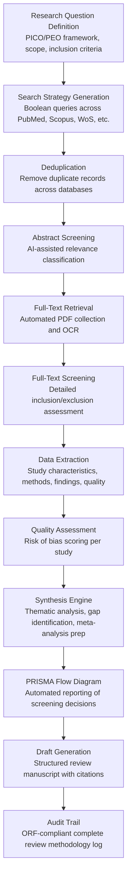

# Literature Review Accelerator

Frankmax

NAICS 611110-611710

> **Education / R&D / Think Tanks** — Research Intelligence Module

## Objective & Purpose

Systematic literature reviews are the foundation of credible research, yet they are among the most time-consuming tasks in academia and R&D. A thorough systematic review in biomedicine takes 12-18 months, requires screening 5,000-15,000 abstracts, reading 200-500 full papers, and synthesizing findings into a structured narrative. In social sciences and policy research, reviews span even broader literatures with less standardized methodology. A single researcher conducting a systematic review manually costs their institution $80K-$150K in salary and opportunity cost during the review period. Think tanks producing policy-relevant evidence syntheses face similar burdens, with the added pressure of policy windows that close faster than reviews complete.

The Literature Review Accelerator applies AI to every phase of the systematic review process: search strategy formulation (generating comprehensive search strings across multiple databases), abstract screening (classifying relevance at 500+ abstracts per hour with human-comparable accuracy), full-text analysis (extracting study characteristics, methods, findings, and quality indicators from included papers), synthesis (identifying themes, contradictions, gaps, and meta-analytic opportunities across the included literature), and bias detection (flagging publication bias, methodological concerns, and funding-source conflicts across the evidence base). The engine reduces a 12-18 month review to 4-8 weeks while maintaining the methodological rigor required for publication in peer-reviewed journals.

Within the $2,000-$4,000/month Education and Research Intelligence Pack, this tool addresses the highest-volume pain point in research operations. Universities, R&D labs, and think tanks produce dozens of literature reviews annually across departments. The governance layer (search strategy documentation, screening decision audit trail, extraction methodology transparency, bias detection reports) is not optional -- it is required by PRISMA guidelines, Cochrane standards, and journal submission requirements. This makes governance attachment effectively 100%, producing one of the highest-margin tool deployments in the portfolio.

## Business Context

| Attribute | Value |
|---|---|
| **Business Process** | Systematic literature review and evidence synthesis |
| **Business Function** | Research |
| **Category** | Analytics |
| **Target Audience** | 11. Education / R&D / Think Tanks |
| **Bundle** | Research Intelligence Pack ($2,000-$4,000/mo) |
| **Monthly Cost of Inaction** | $8K-$20K (researcher time, delayed publications, missed policy windows) |

## BPMN Workflow

## Features

1. **Intelligent Search Strategy Builder** — Generates comprehensive search strategies from a research question defined in PICO (Population, Intervention, Comparator, Outcome) or PEO (Population, Exposure, Outcome) format. Produces Boolean search strings optimized for each target database (PubMed/MEDLINE, Scopus, Web of Science, PsycINFO, Cochrane Library, ERIC, EconLit). Identifies MeSH terms, synonyms, and variant spellings to maximize recall while controlling precision.

2. **AI-Powered Abstract Screening** — Screens abstracts against inclusion/exclusion criteria at 500+ abstracts per hour. Uses active learning: the researcher screens an initial training set of 50-100 abstracts, the AI model calibrates, and subsequent screening is automated with confidence scoring. Abstracts below the confidence threshold are routed for human review. Achieves 95%+ sensitivity (fewer than 5% of relevant papers missed) validated against fully manual screening benchmarks.

3. **Automated Data Extraction** — Extracts structured data from included full-text papers: study design, sample size, population characteristics, intervention/exposure details, outcome measures, statistical results (effect sizes, confidence intervals, p-values), funding sources, and declared conflicts of interest. Extraction templates are customizable by review type (clinical, educational, policy, engineering).

4. **Quality and Bias Assessment** — Applies standard quality assessment frameworks automatically: Cochrane Risk of Bias (RoB 2) for randomized trials, Newcastle-Ottawa Scale for observational studies, GRADE for evidence certainty, and custom quality checklists for non-clinical research. Generates per-study quality scores with justifications linked to specific passages in the source text.

5. **Synthesis and Gap Mapper** — Analyzes the full body of included evidence to identify: convergent findings (where studies agree), contradictions (where studies disagree and why), methodological patterns (common strengths and weaknesses), temporal trends (how evidence has evolved over time), geographic gaps (populations or settings underrepresented), and research questions the existing literature cannot answer.

6. **Publication Bias Detector** — Applies statistical tests for publication bias across the included studies: funnel plot analysis (asymmetry detection), Egger's regression, trim-and-fill estimation, and p-curve analysis. Flags bodies of evidence where publication bias may inflate reported effect sizes, a critical concern for policy-relevant reviews where decisions hinge on effect magnitude.

7. **PRISMA-Compliant Reporting** — Automatically generates the PRISMA (Preferred Reporting Items for Systematic Reviews and Meta-Analyses) flow diagram showing records at each screening stage, along with the PRISMA checklist documenting compliance with all 27 reporting items. The output meets the submission requirements of major journals without manual checklist completion.

8. **Collaborative Review Management** — Supports multi-reviewer workflows: dual screening with inter-rater reliability calculation (Cohen's kappa), conflict resolution queues, reviewer assignment and workload balancing, and progress tracking dashboards. Enables distributed review teams across institutions to collaborate on a single review with full activity logging.

## Workflow & Automation

**Step 1: Protocol Registration** — The research team defines the review protocol: research question (structured in PICO/PEO format), inclusion/exclusion criteria, target databases, data extraction template, and quality assessment framework. The protocol is registered (e.g., PROSPERO for health reviews) and locked, establishing the methodological foundation that the audit trail will document.

**Step 2: Search Execution** — The engine generates optimized search strings for each target database and executes searches through available API connections or exports search strings for manual execution. Results are imported, deduplicated (typically removing 20-40% of records), and prepared for screening. Total record counts at each stage are tracked for PRISMA reporting.

**Step 3: Abstract Screening** — The AI screening model is calibrated through an initial human-screened training set. Once calibrated, the model classifies remaining abstracts as include, exclude, or uncertain. Uncertain records go to human reviewers. Dual-screening is supported for reviews requiring independent screening by two reviewers, with automated kappa calculation and conflict flagging.

**Step 4: Full-Text Assessment** — PDFs for included abstracts are retrieved (via institutional library access, open access repositories, or inter-library loan request generation). Full-text screening applies detailed inclusion/exclusion criteria. Excluded papers are logged with specific exclusion reasons for PRISMA reporting.

**Step 5: Data Extraction & Quality Assessment** — The extraction engine processes included papers against the review's data extraction template. Extracted data is presented to the reviewer for verification and correction. Quality assessment scores are generated with passage-level evidence citations. Reviewers can override AI assessments with documented justifications.

**Step 6: Evidence Synthesis** — The synthesis engine analyzes the extracted data corpus: narrative synthesis (thematic analysis with study-level evidence mapping), quantitative synthesis preparation (effect size calculation, heterogeneity assessment, forest plot generation for meta-analysis), and gap analysis (identifying unanswered questions and methodological needs for future research).

**Step 7: Manuscript Generation** — The engine produces a structured review manuscript: introduction (background, rationale, objectives), methods (search strategy, screening process, extraction protocol, quality assessment), results (PRISMA flow, study characteristics table, synthesis findings, quality assessment summary), and discussion (evidence summary, limitations, implications). All citations are formatted for the target journal.

## Input/Output Specifications

| Direction | Data | Format | Description |
|---|---|---|---|
| Input | Research question | Structured form (PICO/PEO) | Population, intervention/exposure, comparator, outcome |
| Input | Inclusion/exclusion criteria | Structured form | Study design, date range, language, population, outcome |
| Input | Database search results | RIS / BibTeX / CSV | Bibliographic records from PubMed, Scopus, WoS, etc. |
| Input | Full-text papers | PDF | Retrieved papers for full-text screening and extraction |
| Input | Reviewer screening decisions | Web form / API | Human screening and extraction verification inputs |
| Output | PRISMA flow diagram | SVG / PNG | Screening decision flow with record counts at each stage |
| Output | Data extraction tables | CSV / Excel / JSON | Structured extracted data from all included studies |
| Output | Quality assessment summary | PDF / Excel | Per-study quality scores with evidence citations |
| Output | Review manuscript draft | DOCX / LaTeX | Structured review paper ready for journal formatting |
| Output | Audit trail | JSON (immutable log) | ORF-compliant complete screening and extraction methodology |

## Integration Points

| System | Integration Type | Data Flow |
|---|---|---|
| **Grant Proposal Optimizer** | Outbound data | Literature review findings feed grant proposal background sections |
| **Research Impact Quantifier** | Outbound citations | Review publications tracked for citation impact |
| **Research Collaboration Matcher** | Outbound expertise | Review topics signal researcher expertise for collaboration matching |
| **Experiment Design Assistant** | Outbound gaps | Literature gaps inform new experimental research questions |
| **Multi-Model AI Orchestrator** | Infrastructure | Routes NLP screening, extraction, and synthesis tasks |
| **Audit Trail & Traceability Engine** | Outbound log stream | Complete screening decision and methodology audit trail |
| **Library Systems / Databases** | Bidirectional API | Search execution and full-text retrieval |

## Pricing & Revenue Model

| Component | Pricing | Notes |
|---|---|---|
| **Research Intelligence Pack** | $2,000-$4,000/month | Literature Review Accelerator + research tools + 2M AI tokens |
| **Standalone Subscription** | $1,200/month | Up to 5 concurrent reviews, 10,000 abstracts/month screening |
| **High-volume research tier** | $2,000/month | Up to 20 concurrent reviews, 50,000 abstracts/month |
| **Meta-analysis module** | +$400/month | Effect size calculation, forest plots, heterogeneity analysis |
| **Publication bias analysis** | +$200/month | Funnel plots, Egger's test, p-curve analysis |
| **AI token consumption** | Included at 80% discount | 2M tokens/month in bundle; overage at marketplace rates |

**Revenue model**: The Literature Review Accelerator is the anchor product for education and research institutions. A tool that reduces a 12-month review to 8 weeks saves $60K-$100K per review in researcher time -- against a $14K-$48K annual tool cost. Governance (PRISMA compliance, screening audit trail, methodology documentation) attaches at near-100% because every systematic review requires this documentation for publication. The tool's governance layer is not an add-on; it is the review methodology itself, making this one of the highest-margin deployments in the portfolio.

## NAICS/SIC Mapping

| NAICS Code | SIC Code | Industry | Relevance |
|---|---|---|---|
| 611310 | 8221 | Colleges, Universities, and Professional Schools | Primary: academic researchers conducting systematic reviews |
| 611110 | 8211 | Elementary and Secondary Schools | Education policy research and curriculum evidence reviews |
| 541711 | 8731 | Research and Development in Biotechnology | Biotech R&D literature synthesis |
| 541712 | 8733 | Research and Development in Physical Sciences | Physical science evidence synthesis |
| 541720 | 8732 | Research and Development in Social Sciences | Social science and policy research reviews |
