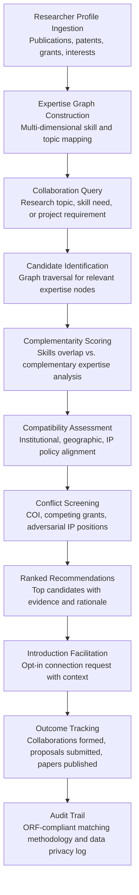

# Research Collaboration Matcher

Frankmax

NAICS 611110-611710

> **Education / R&D / Think Tanks** — Research Intelligence Module

## Objective & Purpose

The most impactful research emerges from interdisciplinary collaboration, yet researchers operate in disciplinary silos with limited visibility into adjacent work. A computational biologist at MIT may be unaware that a materials scientist at Stanford is developing complementary techniques applicable to their protein folding problem. A policy researcher at Brookings may not know that an economist at the University of Chicago has unpublished data directly relevant to their workforce study. The cost of these missed connections is enormous: duplicated effort, slower discovery timelines, weaker grant proposals (multi-PI proposals are funded at higher rates than single-PI proposals), and research that fails to integrate available expertise from other fields.

The Research Collaboration Matcher applies AI to build and continuously update a research expertise graph spanning institutions, disciplines, and geographies. The engine ingests publication records, patent filings, grant histories, conference presentations, dataset contributions, and researcher self-reported interests to create multidimensional expertise profiles. When a researcher submits a collaboration query -- "Who is working on transformer architectures applied to drug discovery?" -- the engine returns ranked matches with evidence for each recommendation: specific publications demonstrating relevant expertise, complementary (not duplicative) skills, and institutional compatibility (prior inter-institutional collaborations, compatible IP policies, aligned funding sources).

Within the $2,000-$4,000/month Research Intelligence Pack, the Collaboration Matcher accelerates the formation of research teams that funding agencies increasingly demand. NIH, NSF, and EU Horizon all favor multi-institutional, multidisciplinary proposals. The governance layer (matching methodology transparency, data privacy compliance for researcher profiles, conflict-of-interest screening) attaches because institutions must document that collaboration decisions are evidence-based and free from undisclosed conflicts -- particularly for federally funded research.

## Business Context

| Attribute | Value |
|---|---|
| **Business Process** | Researcher networking and team formation |
| **Business Function** | Collaboration |
| **Category** | R&D |
| **Target Audience** | 11. Education / R&D / Think Tanks |
| **Bundle** | Research Intelligence Pack ($2,000-$4,000/mo) |
| **Monthly Cost of Inaction** | $5K-$15K (missed collaborations, weaker proposals, duplicated work) |

## BPMN Workflow

## Features

1. **Multi-Source Expertise Profiling** — Builds comprehensive researcher profiles from publications (Scopus, Web of Science, Google Scholar, PubMed, arXiv), patents (USPTO, EPO, WIPO), grant records (NSF Award Search, NIH Reporter, EU CORDIS), conference presentations, dataset contributions (Zenodo, Figshare, Dryad), and self-reported expertise. Profiles are automatically updated as new outputs appear, with no manual maintenance required.

2. **Research Knowledge Graph** — Constructs a continuously updated graph connecting researchers, topics, methods, datasets, institutions, and funding sources. The graph captures not just "who knows what" but "who has collaborated with whom," "which methods are applied to which problems," and "which institutions have complementary capabilities." Graph queries enable both specific searches ("find experts in federated learning applied to healthcare") and exploratory discovery ("show me adjacent research areas where collaboration would be novel").

3. **Complementarity Scoring Algorithm** — Distinguishes between duplicate expertise (another researcher doing the same thing) and complementary expertise (a researcher with skills that fill gaps in your team). The algorithm identifies the optimal team composition for a given research question: the combination of expertise areas that maximizes coverage of the problem space while minimizing redundancy. This is critical for multi-PI proposals where reviewers assess whether the team collectively covers the proposed work.

4. **Institutional Compatibility Assessment** — Evaluates practical collaboration feasibility: institutional IP policies (exclusive vs. shared licensing preferences), overhead rate compatibility (agencies may limit combined indirect costs), prior inter-institutional collaboration history (established administrative frameworks reduce friction), geographic alignment (time zone compatibility for ongoing collaboration), and funding source compatibility (some agencies restrict foreign collaborators or require specific institutional types).

5. **Conflict of Interest Screening** — Automatically screens potential collaborators against known COI indicators: competing active grants on the same topic, adversarial patent positions, prior co-PI relationships requiring disclosure, editorial relationships (reviewer/editor for each other's work), and financial interests in competing commercial entities. COI flags are advisory, enabling researchers to address conflicts proactively rather than having them surface during review.

6. **Emerging Collaborator Discovery** — Identifies rising researchers who may not yet be widely known: early-career investigators with high-impact publications, researchers who have recently pivoted into a new area (bringing fresh perspectives from their home discipline), and international researchers whose work is not well-indexed in English-language databases. Surfaces collaboration opportunities that network-based discovery (conference contacts, advisor referrals) would miss.

7. **Collaboration Outcome Tracking** — Measures the downstream impact of facilitated collaborations: joint proposals submitted (and funded), co-authored publications, shared datasets, co-filed patents, and cross-institutional student supervision. Outcome data feeds the matching algorithm, improving recommendation quality over time by learning which types of matches produce productive collaborations.

## Workflow & Automation

**Step 1: Profile Initialization** — Researchers authenticate with their institutional credentials and link their publication profiles (ORCID, Google Scholar, Scopus Author ID). The engine ingests their full publication and grant history, extracts expertise topics using NLP, and constructs their initial profile. Researchers can review and refine their profile, adding self-reported interests and flagging areas where they seek collaborators.

**Step 2: Query Submission** — A researcher submits a collaboration query: a natural language description of the research problem, specific skills needed, project constraints (geographic restrictions, timeline, funding source), and team composition preferences (senior PI, early-career co-PI, specific methodological expertise). The engine translates the query into a structured search across the knowledge graph.

**Step 3: Candidate Identification** — The engine traverses the knowledge graph to identify researchers whose expertise profiles match the query. Initial candidate lists typically contain 50-200 researchers. Candidates are scored on expertise relevance (how closely their work matches the query), complementarity (how well they fill gaps versus duplicate existing team expertise), and activity level (recent publication and funding activity indicating current engagement).

**Step 4: Compatibility & Conflict Screening** — Candidates passing the relevance threshold are assessed for institutional compatibility and screened for conflicts of interest. Incompatible or conflicted candidates are flagged with explanations rather than silently removed, allowing the querying researcher to make informed decisions.

**Step 5: Recommendation Delivery** — The top 10-20 candidates are presented with rich profiles: publication highlights demonstrating relevant expertise, complementarity analysis showing what they add to the team, compatibility assessment, and any conflict flags. Each recommendation includes the evidence chain that supports the match.

**Step 6: Facilitated Introduction** — The querying researcher can send opt-in connection requests through the platform. Requests include context (the research question, why this researcher was identified as a potential collaborator) to facilitate meaningful first contact rather than cold outreach.

## Input/Output Specifications

| Direction | Data | Format | Description |
|---|---|---|---|
| Input | Publication records | API / XML (ORCID, Scopus, PubMed) | Full bibliographic records with abstracts and keywords |
| Input | Grant records | API / CSV | Funded grants with abstracts, budgets, and team composition |
| Input | Patent filings | API / XML | Patent applications and grants with claims and descriptions |
| Input | Researcher self-reported profiles | Web form / JSON | Expertise areas, collaboration interests, constraints |
| Input | Collaboration queries | Natural language / Structured form | Research topic, skill needs, team requirements |
| Output | Collaboration recommendations | Dashboard / API / Email | Ranked candidates with evidence and compatibility scores |
| Output | Researcher expertise profiles | Web portal / JSON | Multi-dimensional expertise summaries |
| Output | Collaboration analytics | Dashboard / PDF | Outcome tracking: proposals, publications, patents from matches |
| Output | COI screening reports | PDF / JSON | Conflict identification with supporting evidence |
| Output | Audit trail | JSON (immutable log) | ORF-compliant matching methodology and data privacy log |

## Integration Points

| System | Integration Type | Data Flow |
|---|---|---|
| **Grant Proposal Optimizer** | Bidirectional | Proposal skill gaps drive collaboration queries; matches inform team composition |
| **Literature Review Accelerator** | Inbound expertise | Review authorship signals expertise for profile building |
| **Research Impact Quantifier** | Inbound metrics | Impact scores inform candidate ranking |
| **Experiment Design Assistant** | Outbound teams | Collaboration matches feed experiment team formation |
| **Multi-Model AI Orchestrator** | Infrastructure | Routes NLP profiling, graph queries, and recommendation tasks |
| **Audit Trail & Traceability Engine** | Outbound log stream | Complete matching methodology and privacy compliance log |
| **Institutional CRIS/Research Profile Systems** | Bidirectional API | Researcher data in; collaboration metrics out |

## Pricing & Revenue Model

| Component | Pricing | Notes |
|---|---|---|
| **Research Intelligence Pack** | $2,000-$4,000/month | Collaboration Matcher + research tools + 2M AI tokens |
| **Standalone Subscription** | $800/month | Up to 50 researcher profiles, unlimited queries |
| **University-wide license** | $1,800/month | Unlimited profiles, cross-departmental matching |
| **Cross-institutional network** | +$500/month | Matching across partner institution networks |
| **COI screening module** | +$300/month | Automated conflict of interest identification |
| **AI token consumption** | Included at 80% discount | 2M tokens/month in bundle; overage at marketplace rates |

**Revenue model**: The Collaboration Matcher drives value through stronger grant proposals and accelerated discovery. Multi-PI proposals funded at higher rates (30-40% vs. 20-25% for single-PI at NSF) generate institutional revenue that dwarfs tool costs. The governance layer (COI screening, matching methodology transparency, data privacy compliance) attaches because federally funded institutions must document collaboration formation processes and disclose conflicts. Target: 60%+ governance attachment within 6 months.

## NAICS/SIC Mapping

| NAICS Code | SIC Code | Industry | Relevance |
|---|---|---|---|
| 611310 | 8221 | Colleges, Universities, and Professional Schools | Primary: university researchers seeking collaborators |
| 541711 | 8731 | Research and Development in Biotechnology | Biotech R&D collaboration formation |
| 541712 | 8733 | Research and Development in Physical Sciences | Physical science cross-disciplinary collaboration |
| 541720 | 8732 | Research and Development in Social Sciences | Think tank and policy research collaboration |
| 611710 | 8299 | Educational Support Services | Research support services facilitating collaboration |
