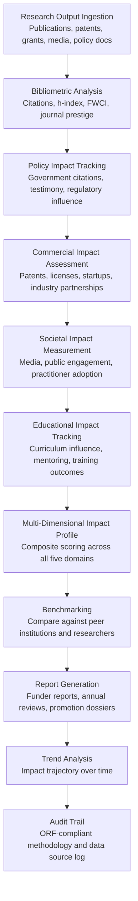

# Research Impact Quantifier

Frankmax

NAICS 611310-541720

> **Education / R&D / Think Tanks** — Education Operations Module

## Objective & Purpose

The research impact measurement system is broken. "Publish or perish" reduces impact to citation counts and journal impact factors -- metrics that measure academic attention, not real-world influence. A paper cited 500 times by other academics but never translated into policy, practice, or product has high bibliometric impact but zero societal impact. Conversely, a technical report that informs a $50B infrastructure decision may receive zero citations. Funders, legislators, and institutional leaders increasingly demand evidence of research impact beyond publications: policy influence, commercial translation, public engagement, workforce development, and community benefit. Yet institutions lack systematic tools to track these broader impact dimensions, relying instead on anecdotal "impact stories" collected manually for annual reports and funder submissions.

The Research Impact Quantifier moves beyond bibliometrics to measure multidimensional research impact. The engine tracks five impact domains: academic impact (citations, h-index, journal prestige, field-weighted citation impact), policy impact (policy document citations, government testimony, regulatory influence, think tank citations), commercial impact (patents, licenses, startup formation, industry partnerships), societal impact (media mentions, public engagement, community partnerships, practitioner adoption), and educational impact (curriculum influence, textbook citations, student research mentoring). Each domain aggregates data from relevant sources, producing a comprehensive impact profile for researchers, departments, and the institution as a whole.

Within the $2,000-$4,000/month Research Intelligence Pack, the Research Impact Quantifier serves institutional reporting, faculty evaluation, and funder accountability. Universities undergoing research performance reviews, think tanks justifying foundation funding, and R&D labs demonstrating ROI to corporate sponsors all need multidimensional impact evidence. The governance layer (methodology transparency for impact calculations, data source verification, bias detection in metrics) attaches because impact metrics influence tenure decisions, funding allocations, and institutional rankings -- high-stakes contexts demanding defensible methodology.

## Business Context

| Attribute | Value |
|---|---|
| **Business Process** | Research impact measurement and reporting |
| **Business Function** | Analytics |
| **Category** | Performance |
| **Target Audience** | 11. Education / R&D / Think Tanks |
| **Bundle** | Research Intelligence Pack ($2,000-$4,000/mo) |
| **Monthly Cost of Inaction** | $8K-$20K (underreported impact, weak funder reports, missed ranking improvements) |

## BPMN Workflow

## Features

1. **Comprehensive Bibliometric Engine** — Goes beyond simple citation counts to calculate field-normalized metrics: Field-Weighted Citation Impact (FWCI), which accounts for differences in citation norms across disciplines; h-index and its variants (g-index, i10-index); journal prestige indicators (SJR, SNIP, CiteScore); collaboration indices (international co-authorship, interdisciplinary breadth); and open access impact (does open access publishing increase citation rates for the institution's research?). Normalizes all metrics to enable fair comparison across departments with different publishing norms.

2. **Policy Impact Tracker** — Monitors policy documents, legislative records, and government reports for citations of institutional research. Tracks: policy briefs citing research findings, congressional testimony referencing institutional work, regulatory impact analyses using institutional data, government grant reports citing institutional publications, and think tank reports incorporating institutional research. Sources include GPO, Federal Register, congressional record, state legislature archives, and major policy institute publications.

3. **Commercial Translation Tracker** — Measures the journey from research to market: invention disclosures per researcher, patent applications and grants, license agreements executed, royalty revenue generated, startups formed from institutional research, industry-sponsored research agreements, and consulting engagements. Integrates with the IP Commercialization Engine for technology transfer metrics and with institutional finance systems for revenue data.

4. **Societal Engagement Monitor** — Tracks research visibility and influence beyond academic and policy circles: mainstream media mentions (newspapers, magazines, broadcast), social media engagement (Twitter/X, Reddit, blog citations via Altmetric), public lectures and talks, community partnership activities, practitioner tool adoption, and public dataset usage. Distinguishes between high-quality societal engagement (sustained practitioner adoption, curriculum change) and low-signal noise (viral social media without lasting impact).

5. **Institutional Benchmarking** — Compares institutional impact metrics against peer institutions using configurable peer groups: Carnegie Classification peers, aspirational peers, geographic peers, or custom cohorts. Benchmarking reveals relative strengths and weaknesses across impact domains: "Institution X ranks in the top quartile for commercial impact but bottom quartile for policy impact among its peer group."

6. **Faculty Impact Profiles** — Generates individual researcher impact profiles spanning all five domains. Profiles support faculty evaluation (tenure and promotion committees), grant applications (demonstrating investigator track record), and internal resource allocation (directing support toward high-impact research programs). Profiles are researcher-accessible for self-assessment and career planning.

7. **Funder Report Generator** — Produces impact reports formatted for specific funder requirements: NSF Project Outcomes (required for all NSF grants), NIH RePORTER submissions, foundation annual reports, and institutional annual research reports. Reports automatically compile relevant impact data from across all five domains, formatted to the funder's template and reporting period.

## Workflow & Automation

**Step 1: Output Discovery** — The engine continuously discovers institutional research outputs: new publications (from Scopus, Web of Science, PubMed, institutional repository), new patents (from USPTO, EPO), new grants (from institutional research office), and new media mentions (from media monitoring services and Altmetric). Discovered outputs are linked to researcher profiles and organizational units.

**Step 2: Bibliometric Computation** — For each publication, the engine calculates citation metrics as citations accumulate over time. Field-normalized metrics are recalculated monthly as citation databases update. Journal prestige indicators are refreshed annually. The engine tracks citation velocity (rate of citation accumulation) to identify emerging high-impact work before cumulative counts reflect its significance.

**Step 3: Non-Bibliometric Impact Collection** — In parallel, the engine collects non-bibliometric impact data: policy citation monitoring runs weekly, media mention tracking runs daily, technology transfer data refreshes monthly, and societal engagement metrics update as events occur. Each impact data point is linked to the originating research output(s) and researcher(s).

**Step 4: Profile Compilation** — Impact data is compiled into profiles at multiple levels: individual researcher, research group/lab, department, college/school, and institution. Each profile shows performance across all five impact domains with trend indicators (improving, stable, declining) and benchmarking against relevant peer groups.

**Step 5: Report Generation** — On demand or on schedule, the engine generates impact reports for various audiences: annual institutional research reports (for board and public consumption), funder reports (formatted per funder requirements), promotion and tenure dossiers (individual researcher impact evidence), and accreditation evidence (for research-related accreditation standards).

**Step 6: Strategic Analysis** — Institutional research leadership receives strategic analyses: which research areas are generating the most multidimensional impact, where institutional investment in research infrastructure is producing returns, which impact domains are underperforming relative to peers, and where targeted investment could improve impact metrics.

## Input/Output Specifications

| Direction | Data | Format | Description |
|---|---|---|---|
| Input | Publication metadata | API (Scopus, WoS, PubMed, ORCID) | Bibliographic records, citations, journal metadata |
| Input | Patent and technology transfer data | API / CSV | Disclosures, patents, licenses, royalties, startups |
| Input | Grant and funding data | API / CSV | Awards, budgets, project outcomes, funder reports |
| Input | Policy and media citations | API / Web scrape | Government document citations, media mentions, Altmetric data |
| Input | Institutional activity data | API / CSV | Consulting, community partnerships, public lectures, training |
| Output | Researcher impact profiles | Dashboard / PDF | Multi-domain impact visualization per researcher |
| Output | Institutional impact reports | PDF / HTML | Annual research impact reports with benchmarking |
| Output | Funder-specific reports | PDF / Web form | NSF, NIH, foundation-formatted impact submissions |
| Output | Benchmarking analytics | Dashboard / PDF | Peer comparison across impact domains |
| Output | Audit trail | JSON (immutable log) | ORF-compliant methodology and data source documentation |

## Integration Points

| System | Integration Type | Data Flow |
|---|---|---|
| **Literature Review Accelerator** | Inbound citations | Publication and citation data from review processes |
| **IP Commercialization Engine** | Inbound data | Technology transfer metrics feed commercial impact domain |
| **Grant Proposal Optimizer** | Bidirectional | Impact profiles strengthen grant proposals; funded grants feed impact tracking |
| **Accreditation Compliance Automator** | Outbound data | Research impact metrics feed accreditation evidence |
| **Multi-Model AI Orchestrator** | Infrastructure | Routes NLP analysis, metric computation, and report generation tasks |
| **Audit Trail & Traceability Engine** | Outbound log stream | Complete methodology and data source audit trail |
| **Institutional Research Information Systems (CRIS)** | Bidirectional API | Research output data in; impact profiles out |

## Pricing & Revenue Model

| Component | Pricing | Notes |
|---|---|---|
| **Research Intelligence Pack** | $2,000-$4,000/month | Impact Quantifier + research tools + 2M AI tokens |
| **Standalone Subscription** | $1,200/month | Up to 500 researcher profiles, 5 impact domains |
| **University-wide license** | $2,500/month | Unlimited profiles, institutional benchmarking |
| **Policy impact tracking** | +$400/month | Government and policy document citation monitoring |
| **Funder report automation** | +$300/month | Template-formatted reports for NSF, NIH, foundations |
| **AI token consumption** | Included at 80% discount | 2M tokens/month in bundle; overage at marketplace rates |

**Revenue model**: The Research Impact Quantifier supports institutional competitiveness: better impact reporting leads to higher rankings, stronger funder relationships, and more successful faculty recruitment. The governance layer (methodology transparency, metric calculation documentation, bias detection in impact scoring) attaches because impact metrics influence tenure decisions and funding allocations -- contexts where methodology must withstand scrutiny. When a professor's career depends on an impact score, the calculation must be documented and defensible. Target: 75%+ governance attachment within 6 months.

## NAICS/SIC Mapping

| NAICS Code | SIC Code | Industry | Relevance |
|---|---|---|---|
| 611310 | 8221 | Colleges, Universities, and Professional Schools | Primary: university research offices and faculty |
| 541711 | 8731 | Research and Development in Biotechnology | Biotech R&D impact measurement |
| 541712 | 8733 | Research and Development in Physical Sciences | Physical science research impact |
| 541720 | 8732 | Research and Development in Social Sciences | Think tank and policy research impact |
| 611710 | 8299 | Educational Support Services | Research evaluation and institutional effectiveness |
