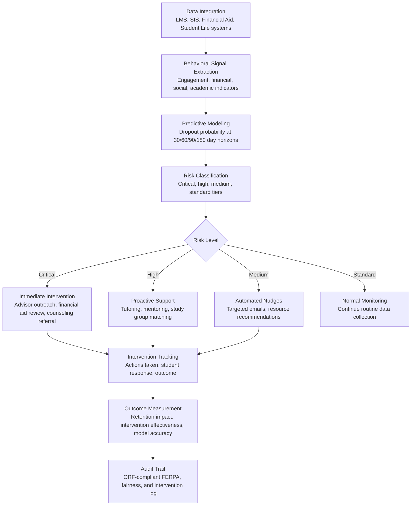

# Student Outcome Predictor

Frankmax

NAICS 611110-611710

> **Education / R&D / Think Tanks** — Education Operations Module

## Objective & Purpose

Higher education institutions lose 40% of entering students before degree completion. The national six-year graduation rate for four-year institutions hovers at 60%, and for community colleges the three-year completion rate is under 30%. Each lost student represents $40K-$200K in foregone tuition revenue over their remaining enrolled years, plus institutional costs already invested in recruitment, onboarding, and first-year instruction. For a mid-size university with 15,000 students, a 40% attrition rate means 6,000 students leaving without degrees -- $240M-$1.2B in lost lifetime tuition. Most critically, institutions identify at-risk students too late: the typical intervention comes after a student has already failed a midterm or stopped attending class, by which point the dropout decision is often already made.

The Student Outcome Predictor identifies at-risk students 4-8 weeks before traditional indicators (failing grades, missed classes) become visible. The engine ingests behavioral signals from institutional systems: LMS engagement patterns (login frequency, assignment submission timing, content interaction depth), financial indicators (payment delays, financial aid changes, work-study hours), social integration signals (campus event attendance, club participation, peer interaction), and academic trajectory (grade trends, course withdrawal patterns, academic advisor contact). Machine learning models trained on 3-5 years of institutional data predict the probability of three outcomes: on-time degree completion, delayed completion, and dropout -- at 30/60/90/180 day horizons.

Within the $2,000-$4,000/month Research Intelligence Pack, the Student Outcome Predictor directly protects institutional revenue. A 5-point improvement in retention rate (e.g., from 75% to 80%) for a 15,000-student university at $25K average tuition saves $18.75M annually. The governance layer (FERPA compliance, algorithmic fairness audit, intervention documentation) attaches at near-100% because student data privacy is legally mandated, and institutions face growing scrutiny over whether predictive algorithms produce equitable outcomes across demographic groups.

## Business Context

| Attribute | Value |
|---|---|
| **Business Process** | Student success monitoring and early intervention |
| **Business Function** | Student Services |
| **Category** | Analytics |
| **Target Audience** | 11. Education / R&D / Think Tanks |
| **Bundle** | Research Intelligence Pack ($2,000-$4,000/mo) |
| **Monthly Cost of Inaction** | $15K-$50K (preventable dropout, lost tuition, wasted recruitment investment) |

## BPMN Workflow

## Features

1. **Multi-System Behavioral Integration** — Ingests data from 5-10 institutional systems: Learning Management System (Canvas, Blackboard, Moodle -- login frequency, assignment submissions, content interaction), Student Information System (enrollment, grades, course registration patterns), Financial Aid (award status, payment timeliness, unmet need), Student Life (campus card swipes, event attendance, residential status), and Advising (meeting frequency, academic plan changes). Each data point contributes to a holistic behavioral profile.

2. **Early Warning Risk Scores** — Machine learning models produce risk scores at multiple time horizons: 30-day (immediate risk requiring urgent intervention), 60-day (developing risk requiring proactive support), 90-day (emerging risk requiring monitoring), and 180-day (trajectory risk for long-range planning). Models achieve 80-85% accuracy in identifying students who will drop out within 180 days, validated against 3-5 years of historical data during implementation.

3. **Root Cause Attribution** — For each at-risk student, the engine identifies the primary contributing factors: academic struggle (specific courses, not general), financial stress (aid gap, work hours, payment delays), social isolation (low campus engagement, no peer connections), health and wellness (counseling center utilization patterns), and personal circumstances (housing instability, family obligations). Attribution enables targeted interventions rather than generic support.

4. **Algorithmic Fairness Monitoring** — Continuously audits prediction models for demographic bias: do risk scores produce equitable outcomes across racial/ethnic groups, socioeconomic categories, first-generation status, and gender? The engine calculates fairness metrics (equalized odds, demographic parity, calibration by group) and flags when model predictions show statistically significant differential accuracy or false positive rates across protected groups.

5. **Intervention Recommendation Engine** — Based on root cause attribution and intervention effectiveness data, recommends specific actions for each at-risk student: academic tutoring (for course-specific struggles), financial aid counseling (for financial stress indicators), peer mentoring (for social isolation), counseling center referral (for wellness indicators), and academic advisor meeting (for course planning issues). Recommendations are ranked by expected effectiveness based on historical outcomes for similar student profiles.

6. **Nudge Campaign Automation** — For medium-risk students, the engine triggers automated communication campaigns: targeted emails about available resources (tutoring centers, study groups, financial aid deadlines), personalized encouragement messages based on the student's specific situation, and deadline reminders for critical academic actions (registration, financial aid renewal, course withdrawal deadlines). Nudge timing and messaging are optimized through A/B testing.

7. **Cohort Analytics Dashboard** — Provides institutional leadership with aggregate views: retention rates by cohort (entering class, transfer students, online students), risk distribution across the student body (what percentage is at each risk level), intervention effectiveness metrics (which interventions produce the strongest retention improvements), and trend analysis (is institutional risk improving or deteriorating over time).

8. **FERPA-Compliant Data Governance** — All student data processing complies with FERPA requirements: access limited to school officials with legitimate educational interest, student right to inspect their records, audit trail for all data access and use, and de-identification for any reporting that leaves the institution. Data retention policies align with institutional records management standards.

## Workflow & Automation

**Step 1: System Integration** — During implementation, the engine connects to institutional data systems via API or scheduled data feeds. Data mapping aligns disparate system schemas to a unified student behavior model. Historical data (3-5 years) is ingested for model training, with current data feeds configured for daily or real-time updates.

**Step 2: Model Training & Validation** — Machine learning models are trained on the institution's historical data: student behavioral patterns linked to known outcomes (graduated, dropped out, transferred). Models are validated using held-out test sets and cross-validation, with accuracy, precision, recall, and fairness metrics reported before deployment.

**Step 3: Daily Risk Scoring** — Each day, the engine processes new behavioral data and updates risk scores for every enrolled student. Score changes (students whose risk has increased significantly) trigger alerts to the relevant support staff: academic advisors, financial aid counselors, or student success coordinators.

**Step 4: Tiered Intervention Dispatch** — Students crossing into critical or high-risk tiers trigger intervention workflows. The system assigns interventions to the appropriate staff member based on the identified root cause and generates an intervention brief: student profile, risk factors, recommended actions, and relevant context. Staff log their outreach and the student's response.

**Step 5: Automated Engagement** — Medium-risk students receive automated nudge campaigns: emails, text messages, or app notifications tailored to their specific risk factors. Nudge content and timing are optimized through continuous A/B testing. Students who respond to nudges (e.g., visit tutoring center, meet with advisor) see their risk scores adjusted accordingly.

**Step 6: Outcome Tracking & Model Refinement** — At the end of each semester, actual outcomes (retained, dropped, graduated) are compared against predictions. Model accuracy is assessed, fairness metrics are recalculated, and the model is retrained with the new data. Intervention effectiveness is measured: which actions produced the strongest retention improvements for which student profiles.

## Input/Output Specifications

| Direction | Data | Format | Description |
|---|---|---|---|
| Input | LMS activity data | xAPI / LTI / API | Login frequency, assignment submissions, content engagement |
| Input | Student academic records | API / CSV (SIS) | Grades, enrollment, course registration, academic standing |
| Input | Financial aid data | API / CSV | Award amounts, payment status, unmet need, work-study |
| Input | Campus engagement data | API / CSV | Card swipes, event attendance, club membership, residential data |
| Input | Historical outcome data | CSV / Database | 3-5 years of enrollment, retention, and graduation records |
| Output | Student risk scores | Dashboard / API | Per-student risk probability at 30/60/90/180 day horizons |
| Output | At-risk alerts | Email / Dashboard / API | Notifications when students cross risk thresholds |
| Output | Intervention recommendations | Dashboard / JSON | Specific actions with expected effectiveness scores |
| Output | Cohort analytics | Dashboard / PDF | Aggregate retention metrics, trends, intervention effectiveness |
| Output | Audit trail | JSON (immutable log) | ORF-compliant FERPA, fairness audit, and intervention documentation |

## Integration Points

| System | Integration Type | Data Flow |
|---|---|---|
| **Adaptive Learning Orchestrator** | Bidirectional | Learning engagement data feeds prediction; risk scores inform adaptive path urgency |
| **Accreditation Compliance Automator** | Outbound data | Retention metrics and intervention outcomes feed accreditation evidence |
| **Research Impact Quantifier** | Outbound metrics | Institutional effectiveness data contributes to impact reporting |
| **Multi-Model AI Orchestrator** | Infrastructure | Routes prediction, fairness analysis, and recommendation tasks |
| **Audit Trail & Traceability Engine** | Outbound log stream | Complete FERPA compliance and algorithm fairness audit trail |
| **Student Information System (SIS)** | Bidirectional API | Academic and enrollment data in; risk flags and intervention records out |
| **Learning Management System (LMS)** | Inbound API | Engagement and activity data feeds |

## Pricing & Revenue Model

| Component | Pricing | Notes |
|---|---|---|
| **Research Intelligence Pack** | $2,000-$4,000/month | Student Outcome Predictor + education tools + 2M AI tokens |
| **Standalone Subscription** | $1,500/month | Up to 5,000 students, daily risk scoring |
| **Large institution tier** | $3,000/month | Up to 25,000 students with real-time scoring |
| **Algorithmic fairness module** | +$400/month | Continuous demographic bias monitoring and reporting |
| **Nudge campaign automation** | +$300/month | Automated student communication with A/B optimization |
| **AI token consumption** | Included at 80% discount | 2M tokens/month in bundle; overage at marketplace rates |

**Revenue model**: The Student Outcome Predictor directly preserves tuition revenue. Each retained student represents $20K-$50K in annual tuition. Retaining 50 additional students per year (a conservative estimate for a 15,000-student institution) saves $1M-$2.5M annually against a $18K-$48K tool cost. The governance layer (FERPA compliance, algorithmic fairness audit, intervention documentation) attaches at near-100% because student data privacy is federally mandated and algorithmic fairness in education is subject to civil rights oversight. Target: 95%+ governance attachment.

## NAICS/SIC Mapping

| NAICS Code | SIC Code | Industry | Relevance |
|---|---|---|---|
| 611310 | 8221 | Colleges, Universities, and Professional Schools | Primary: university student success and retention offices |
| 611210 | 8222 | Junior Colleges | Community college retention improvement |
| 611110 | 8211 | Elementary and Secondary Schools | K-12 dropout prevention and early warning |
| 611710 | 8299 | Educational Support Services | Student success technology providers |
| 611410 | 8249 | Business and Secretarial Schools | Vocational program completion tracking |
