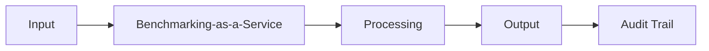

# Benchmarking-as-a-Service

Frankmax

Audience 12

> **Consulting Firms & System Integrators** — Consulting Delivery Intelligence

## Objective & Purpose

Benchmarking data expensive and stale; AI synthesizes real-time comparative data

## Business Context

| Attribute | Value |
|---|---|
| **Business Process** | Industry benchmarking |
| **Business Function** | Analysis |
| **Category** | Client Service |
| **Target Audience** | 12. Consulting Firms & System Integrators |

## BPMN Workflow

<!-- TODO: Expand BPMN with actual process steps -->

## Features

<!-- TODO: Define 5-8 key features -->

1. Feature 1
2. Feature 2
3. Feature 3

## Workflow & Automation

<!-- TODO: Step-by-step automation description -->

## Input/Output Specifications

| Direction | Data | Format |
|---|---|---|
| Input | <!-- TODO --> | <!-- TODO --> |
| Output | <!-- TODO --> | <!-- TODO --> |

## Integration Points

<!-- TODO: Connections to other systems -->

## Pricing & Revenue Model

<!-- TODO: From economic model -->

## NAICS/SIC Mapping

<!-- TODO: Industry codes -->
