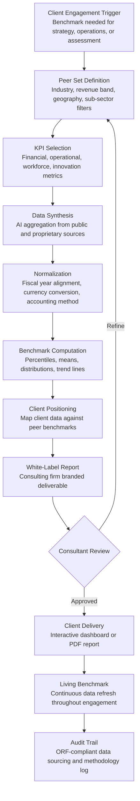

# Benchmarking-as-a-Service

Frankmax

NAICS 541611-541618

> **Consulting Firms & System Integrators** — Consulting Delivery Intelligence Module

## Objective & Purpose

Benchmarking is the bread and butter of consulting engagements -- clients pay for the answer to "how do we compare to our peers?" Yet benchmarking data is expensive and stale. Traditional benchmark studies from Gartner, McKinsey, or industry-specific providers cost $20K-$100K per study, are published annually or biannually, and cover broad industry categories rather than the specific peer set the client cares about. Consulting firms either purchase these studies (absorbing costs that erode engagement margins) or build bespoke benchmarks from scratch for each client (consuming 40-80 analyst hours per engagement). Neither approach scales. A mid-size consulting firm spending $200K-$500K annually on benchmark data access still delivers benchmarks that are 6-18 months stale by the time they reach the client's boardroom.

The Benchmarking-as-a-Service tool gives consulting firms real-time, AI-synthesized benchmark data that they can white-label and deliver to clients. The engine continuously ingests public data (financial filings, labor statistics, industry reports, patent databases, trade data) and synthesizes it into customizable benchmark dashboards covering 50-200 KPIs per industry. Consultants define the client's peer set (by revenue band, geography, sub-sector), select relevant KPIs, and generate client-ready benchmark reports in minutes rather than weeks. The data refreshes continuously, allowing consultants to deliver "living benchmarks" that update throughout the engagement and beyond -- creating a recurring revenue stream for the consulting firm.

Within the $3,000-$6,000/month Consulting Intelligence Pack, Benchmarking-as-a-Service transforms a cost center (purchased benchmark data) into a profit center (white-labeled benchmark deliverables sold to clients at consulting margins). A consulting firm delivering 50 benchmark engagements per year at $25K-$75K per engagement generates $1.25M-$3.75M in benchmark-driven revenue. The governance layer (data source verification, methodology transparency, peer set definition audit trail) attaches because clients demand to know where benchmark numbers come from -- a requirement that intensifies when benchmarks inform board-level strategic decisions.

## Business Context

| Attribute | Value |
|---|---|
| **Business Process** | Industry benchmarking for client engagements |
| **Business Function** | Analysis |
| **Category** | Client Service |
| **Target Audience** | 12. Consulting Firms & System Integrators |
| **Bundle** | Consulting Intelligence Pack ($3,000-$6,000/mo) |
| **Monthly Cost of Inaction** | $10K-$30K (stale data, analyst hours, purchased benchmark costs) |

## BPMN Workflow

## Features

1. **Dynamic Peer Set Builder** — Allows consultants to define custom peer groups along multiple dimensions: NAICS/SIC code (with sub-sector granularity), revenue range, employee count, geographic scope, public vs. private status, growth rate, and business model type. Peer sets can include named companies or be defined by criteria. The engine identifies all qualifying entities from its data universe and shows the resulting peer set size, enabling consultants to balance specificity with statistical significance.

2. **Multi-Dimensional KPI Library** — Covers 200+ KPIs across six categories: financial (revenue growth, margins, returns, leverage, cash conversion), operational (cycle time, throughput, inventory turns, quality metrics, capacity utilization), workforce (revenue per employee, compensation ratios, turnover rates, training investment), market position (market share estimates, pricing indices, customer concentration), innovation (R&D intensity, patent rates, new product introduction velocity), and sustainability (emissions intensity, resource efficiency, ESG ratings). Industry-specific KPIs are available for 20+ sectors.

3. **Real-Time Data Synthesis** — Unlike traditional benchmark studies published annually, the engine continuously ingests data from public sources: SEC/EDGAR filings (updated within 48 hours of filing), BLS employment data (monthly), Census Bureau economic data (quarterly), patent databases (weekly), and trade data (monthly). Consultants deliver benchmarks with data freshness measured in days or weeks, not months or years.

4. **White-Label Report Generator** — Produces client-ready benchmark reports branded to the consulting firm. Reports include: executive summary with key findings, peer set methodology description, KPI-level benchmark charts (bar charts with percentile distributions, spider/radar charts for multi-metric comparison, trend line charts for longitudinal analysis), and detailed data tables. Reports are formatted for board presentation quality with customizable color schemes and firm branding.

5. **Client Positioning Overlay** — When the client provides their own data, the engine overlays their performance against the peer benchmark for every selected KPI. Output: percentile ranking, gap-to-median, gap-to-top-quartile, and trend comparison (is the client improving faster or slower than peers?). This is the deliverable that drives client action -- seeing exactly where they stand relative to peers, with specific metrics quantifying the gap.

6. **Living Benchmark Subscription** — Benchmarks can be configured as "living" -- continuously updating as new data becomes available. The consulting firm can offer clients ongoing benchmark access as a subscription service, creating recurring revenue beyond the initial engagement. Living benchmarks include automated alerts when the client's peer positioning changes significantly (e.g., "You have moved from 45th to 62nd percentile on inventory turns due to peer improvement").

7. **Cross-Engagement Insights** — Aggregates anonymized benchmark patterns across the firm's client base. Identifies industry-wide trends (margin compression in specific sectors, workforce productivity improvements, innovation acceleration) that inform thought leadership publications and business development positioning. Cross-engagement insights are anonymized and aggregated to maintain client confidentiality.

## Workflow & Automation

**Step 1: Engagement Setup** — The consultant configures the benchmark analysis: selects the client's industry, defines the peer set criteria, and chooses relevant KPIs from the library. The engine previews the peer set (number of qualifying entities, data coverage for selected KPIs) and flags any selections where data may be thin.

**Step 2: Data Assembly** — The engine assembles benchmark data from its continuously updated data warehouse. For each KPI and peer entity, it retrieves the most recent available data point, applies normalization (fiscal year alignment, currency conversion, accounting method adjustments), and computes the benchmark statistics.

**Step 3: Quality Assurance** — Automated QA checks flag data anomalies: outliers that may indicate data errors, KPIs with low peer coverage (fewer than 10 data points), and year-over-year changes that exceed plausibility thresholds. Flagged items are routed for consultant review before client delivery.

**Step 4: Client Data Integration** — If the client has provided their own data, the engine maps it to the benchmark KPI definitions, normalizes it against the same methodology used for peer data, and computes the client's position within the peer distribution.

**Step 5: Report Generation** — The consultant selects the report format (interactive dashboard, PDF, PowerPoint) and the engine generates the white-labeled deliverable. Reports include the methodology section documenting peer set definition, data sources, normalization approach, and any data limitations -- providing the transparency clients demand.

**Step 6: Living Benchmark Activation** — For engagements with ongoing benchmark needs, the consultant activates the living benchmark subscription. The client receives access to a continuously updated dashboard with their peer positioning. Automated alerts notify the client and engagement team when significant changes occur.

## Input/Output Specifications

| Direction | Data | Format | Description |
|---|---|---|---|
| Input | Peer set definition criteria | Web form / JSON | Industry, size, geography, and other filtering parameters |
| Input | KPI selections | Web form / JSON | Selected metrics from the 200+ KPI library |
| Input | Client performance data | CSV / Excel / API | Client's own metrics for positioning overlay |
| Input | Public financial data | XBRL / HTML / API | SEC filings, international equivalents |
| Input | Labor and economic data | API / CSV | BLS, Census, trade statistics, industry reports |
| Output | Benchmark reports | PDF / PPTX / Interactive dashboard | White-labeled peer comparison with visualizations |
| Output | Client positioning scorecards | PDF / Dashboard | Per-KPI ranking with gap analysis |
| Output | Living benchmark dashboards | Web portal / API | Continuously updated peer positioning |
| Output | Cross-engagement insights | PDF / Dashboard (internal) | Anonymized industry trend analysis |
| Output | Audit trail | JSON (immutable log) | ORF-compliant data sourcing and methodology documentation |

## Integration Points

| System | Integration Type | Data Flow |
|---|---|---|
| **Knowledge Reuse Engine** | Bidirectional | Benchmark data enriches deliverables; engagement analyses feed benchmark context |
| **Engagement Scoping Optimizer** | Inbound context | Benchmark scope informs engagement scoping estimates |
| **Proposal Generation Engine** | Outbound content | Benchmark capabilities described in proposals |
| **Due Diligence Automation Suite** | Outbound data | Benchmark data informs target company positioning in M&A due diligence |
| **Multi-Model AI Orchestrator** | Infrastructure | Routes data synthesis, normalization, and report generation tasks |
| **Audit Trail & Traceability Engine** | Outbound log stream | Complete data sourcing and methodology audit trail |
| **Financial Data Providers** | Inbound API | SEC/EDGAR, BLS, Census, patent databases |

## Pricing & Revenue Model

| Component | Pricing | Notes |
|---|---|---|
| **Consulting Intelligence Pack** | $3,000-$6,000/month | Benchmarking-as-a-Service + delivery tools + 2M AI tokens |
| **Standalone Subscription** | $2,200/month | Up to 10 benchmark analyses/quarter, 200 KPIs |
| **Enterprise tier** | $4,500/month | Unlimited analyses, cross-engagement insights |
| **Living benchmark add-on** | +$500/month per active client | Continuously updated client dashboards |
| **White-label report generation** | +$300/month | Firm-branded deliverable templates |
| **AI token consumption** | Included at 80% discount | 2M tokens/month in bundle; overage at marketplace rates |

**Revenue model**: Benchmarking-as-a-Service transforms a consulting cost center into a profit center. The tool costs $26K-$72K/year versus $200K-$500K in traditional benchmark data subscriptions -- an immediate saving. More importantly, consultants can white-label benchmark deliverables to clients at $25K-$75K per engagement, creating a new revenue stream. The governance layer (data source verification, methodology documentation, peer set audit trail) attaches because board-level benchmarks demand defensible methodology. Target: 75%+ governance attachment within 6 months.

## NAICS/SIC Mapping

| NAICS Code | SIC Code | Industry | Relevance |
|---|---|---|---|
| 541611 | 8742 | Administrative Management Consulting | Primary: management consulting benchmarking services |
| 541614 | 8742 | Process, Physical Distribution, and Logistics Consulting | Operations benchmarking |
| 541618 | 8748 | Other Management Consulting | Specialty benchmarking services |
| 541512 | 7371 | Computer Systems Design Services | Technology benchmarking for SI engagements |
| 541613 | 8742 | Marketing Consulting | Market position benchmarking |
