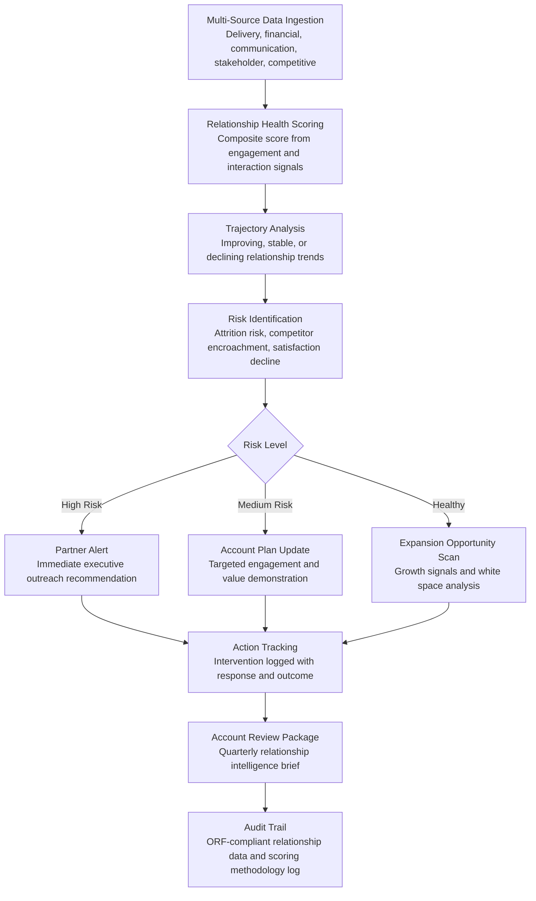

# Client Relationship Intelligence

Frankmax

NAICS 541611-541618

> **Consulting Firms & System Integrators** — SI Operations Intelligence Module

## Objective & Purpose

Consulting firm revenue is concentrated in existing clients. Industry data shows that 70-80% of revenue comes from repeat and expansion work with current clients, yet relationship management depends almost entirely on individual partner networks. When a partner retires, changes firms, or simply loses focus on an account, client relationships atrophy -- and the firm discovers the damage only when a renewal is lost or a competitor wins an expansion opportunity. The underlying problem: no systematic visibility into client relationship health. CRM systems track activities (meetings logged, emails sent) but not relationship quality (is the client satisfied? are they expanding or contracting? are competitors gaining ground?).

The Client Relationship Intelligence tool synthesizes data from every client touchpoint to produce a continuous relationship health score and actionable intelligence. The engine ingests: engagement delivery data (project health, deliverable quality, timeline adherence), financial data (revenue trajectory, payment patterns, pricing trends), communication patterns (meeting frequency, response times, escalation patterns), stakeholder mapping (who the firm knows at the client, relationship depth by contact, coverage of the decision-making structure), and competitive signals (competitor mentions in client communications, RFP invitations to competitors, market intelligence on competitor activity at the account). The output: a per-client health score, trend indicators, risk alerts, and expansion opportunity recommendations.

Within the $3,000-$6,000/month Consulting Intelligence Pack, the Client Relationship Intelligence tool directly protects and grows revenue. Reducing client attrition by 5 percentage points (from 20% to 15% annual loss rate) for a firm with $50M in client revenue preserves $2.5M annually. Identifying expansion opportunities 3-6 months earlier than partner intuition accelerates revenue growth by 10-15%. The governance layer (relationship data privacy, scoring methodology transparency, competitive intelligence sourcing audit) attaches because clients increasingly demand to know how their data is used, and firm leadership needs defensible evidence when making account investment decisions.

## Business Context

| Attribute | Value |
|---|---|
| **Business Process** | Account management and client relationship health monitoring |
| **Business Function** | Sales |
| **Category** | CRM |
| **Target Audience** | 12. Consulting Firms & System Integrators |
| **Bundle** | Consulting Intelligence Pack ($3,000-$6,000/mo) |
| **Monthly Cost of Inaction** | $15K-$40K (client attrition, missed expansion, relationship blind spots) |

## BPMN Workflow

## Features

1. **Composite Relationship Health Score** — Calculates a 0-100 relationship health score for each client account from 15-20 signals: delivery health (project on-time/on-budget percentage, client satisfaction ratings), financial health (revenue growth trajectory, pricing stability, payment promptness), engagement depth (number of active engagements, service line breadth, stakeholder coverage), communication quality (meeting frequency trends, response time patterns, escalation frequency), and competitive position (share of wallet, exclusive vs. multi-vendor status).

2. **Stakeholder Relationship Map** — Visualizes the firm's relationship network within each client organization: which stakeholders are known, who knows them at the firm (partner, manager, consultant), relationship strength (frequency and depth of interaction), decision-making influence (budget authority, project sponsorship), and coverage gaps (senior stakeholders with no firm relationship). Identifies "single-threaded" accounts where the entire relationship depends on one partner-client contact pair -- a significant attrition risk.

3. **Attrition Early Warning** — Detects client disengagement patterns 3-6 months before formal relationship deterioration: declining meeting acceptance rates, increasing response times to proposals, reduced scope in new engagement requests, leadership changes at the client (new CIO/CFO who may prefer different firms), and competitive RFP activity. Each warning signal includes historical accuracy data: "75% of clients showing this pattern failed to renew within 12 months."

4. **Expansion Opportunity Detector** — Identifies growth signals at client accounts: new strategic initiatives (from earnings calls, press releases, and job postings), technology investment plans (from IT budget announcements and vendor selections), organizational changes (acquisitions, reorganizations, new market entries) that create consulting needs, and white space analysis (services the firm provides to peers in the same industry that this client has not yet purchased).

5. **Competitive Intelligence Monitor** — Tracks competitor activity at client accounts: mentions in client communications (with appropriate privacy controls), competitive RFP activity (the client inviting other firms to bid), competitor press releases about wins in the client's industry, and market intelligence about competitor capability investments. Competitive signals are classified by threat level and accompanied by defensive recommendations.

6. **Account Planning Automation** — Generates quarterly account plans based on relationship intelligence: current relationship health and trajectory, top risks with recommended mitigations, expansion opportunities with estimated revenue potential, stakeholder engagement priorities (who to meet, at what level, about what), and competitive defense strategies. Account plans replace the manual planning process that partners rarely complete on schedule.

7. **Revenue Forecasting** — Predicts per-client revenue at 30/60/90/180 day horizons based on relationship health, pipeline visibility, and historical patterns. Revenue forecasts distinguish between committed (contracted work), probable (proposals under review), and possible (expansion opportunities identified but not yet proposed). Aggregated across the client portfolio, forecasts provide firm-wide revenue visibility.

## Workflow & Automation

**Step 1: Data Integration** — The engine connects to the firm's CRM, project management tools, billing system, email/calendar platforms, and proposal management system. Initial setup maps data fields and establishes historical baselines for each client account (typical communication frequency, revenue patterns, engagement cadence).

**Step 2: Score Computation** — Weekly score updates calculate relationship health for every active client account. Each contributing signal is normalized and weighted based on its historical correlation with client retention/attrition. Scores are decomposed so partners can see which factors are driving the overall score.

**Step 3: Trajectory Analysis** — The engine analyzes 90-day rolling trends for each score component: which factors are improving, which are declining, and which are stable. Trajectory is often more important than absolute score -- a client at 72 and declining is higher risk than a client at 65 and improving.

**Step 4: Alert Distribution** — High-risk alerts (health score below 50, or rapid decline exceeding 15 points in 30 days) are sent to the account partner and firm leadership. Medium-risk alerts (slow decline or competitive signals) are included in the weekly account intelligence digest. Expansion opportunity alerts are sent to business development teams.

**Step 5: Intervention Planning** — For at-risk accounts, the engine recommends specific actions: executive-level outreach (for relationship-level concerns), delivery review (for project-quality concerns), pricing discussion (for commercial-tension concerns), and stakeholder expansion (for single-threaded relationship risks). Actions are tracked with outcomes.

**Step 6: Quarterly Account Review** — The engine generates a comprehensive account intelligence package for quarterly business reviews: relationship health dashboard, revenue forecast, risk register, expansion pipeline, stakeholder map, and competitive landscape. Partners use this package for internal account reviews and, selectively, for client-facing relationship discussions.

## Input/Output Specifications

| Direction | Data | Format | Description |
|---|---|---|---|
| Input | CRM activity data | API (Salesforce, HubSpot, Dynamics) | Meetings, calls, emails, proposal status |
| Input | Project delivery data | API (PM tools) | Engagement health, milestones, client feedback |
| Input | Financial data | API / CSV | Revenue by client, billing rates, payment patterns |
| Input | Communication patterns | API (email/calendar analytics) | Meeting frequency, response times, communication volume |
| Input | Competitive intelligence | Web scrape / API / Manual entry | Competitor activity at accounts, RFP intelligence |
| Output | Relationship health dashboards | Web portal / API | Per-client health scores with trend indicators |
| Output | At-risk alerts | Email / Slack / Dashboard | Attrition risk notifications with evidence |
| Output | Expansion opportunities | Dashboard / Email | Growth signals with revenue potential estimates |
| Output | Account review packages | PDF / PPTX | Quarterly intelligence briefs for account planning |
| Output | Audit trail | JSON (immutable log) | ORF-compliant scoring methodology and data sourcing log |

## Integration Points

| System | Integration Type | Data Flow |
|---|---|---|
| **Engagement Scoping Optimizer** | Inbound context | Client engagement history informs scoping approach |
| **Implementation Risk Predictor** | Inbound signals | Project risk levels feed relationship health scoring |
| **Proposal Generation Engine** | Outbound intelligence | Client preferences and history inform proposal customization |
| **Knowledge Reuse Engine** | Inbound context | Client deliverable history informs relationship depth |
| **Multi-Model AI Orchestrator** | Infrastructure | Routes NLP analysis, scoring, and forecasting tasks |
| **Audit Trail & Traceability Engine** | Outbound log stream | Complete relationship data and scoring methodology audit trail |
| **CRM Systems** | Bidirectional API | Activity data in; health scores and alerts out |

## Pricing & Revenue Model

| Component | Pricing | Notes |
|---|---|---|
| **Consulting Intelligence Pack** | $3,000-$6,000/month | Client Relationship Intelligence + delivery tools + 2M AI tokens |
| **Standalone Subscription** | $1,500/month | Up to 50 client accounts monitored |
| **Enterprise tier** | $3,000/month | Unlimited accounts, competitive intelligence, forecasting |
| **Competitive intelligence module** | +$500/month | Competitor activity monitoring across client portfolio |
| **Account planning automation** | +$300/month | Automated quarterly account plan generation |
| **AI token consumption** | Included at 80% discount | 2M tokens/month in bundle; overage at marketplace rates |

**Revenue model**: Client Relationship Intelligence protects existing revenue and accelerates growth. A 5% reduction in client attrition on a $50M client portfolio preserves $2.5M annually. Identifying expansion opportunities 3-6 months earlier adds $1M-$3M in accelerated revenue. The governance layer (relationship data privacy, scoring methodology transparency, competitive intelligence sourcing) attaches because relationship scores influence partner compensation and investment decisions -- high-stakes contexts requiring defensible methodology. Target: 65%+ governance attachment within 6 months.

## NAICS/SIC Mapping

| NAICS Code | SIC Code | Industry | Relevance |
|---|---|---|---|
| 541611 | 8742 | Administrative Management Consulting | Primary: management consulting client management |
| 541612 | 8742 | Human Resources Consulting | HR consulting account management |
| 541618 | 8748 | Other Management Consulting | Specialty consulting client relationships |
| 541512 | 7371 | Computer Systems Design Services | System integrator client management |
| 541519 | 7379 | Other Computer Related Services | Technology consulting account planning |
