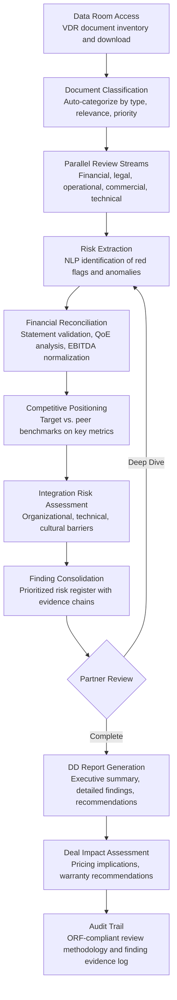

# Due Diligence Automation Suite

Frankmax

NAICS 541611-541618

> **Consulting Firms & System Integrators** — Consulting Delivery Intelligence Module

## Objective & Purpose

M&A due diligence is a high-stakes, time-compressed process where consulting teams manually review thousands of documents under extreme deadlines. A typical commercial due diligence engagement requires reviewing 2,000-10,000 documents in a virtual data room within 3-6 weeks: financial statements, contracts, customer agreements, employee records, IP filings, regulatory correspondence, litigation files, and operational reports. Each document must be reviewed for risk indicators, inconsistencies, and material findings. Teams of 5-15 analysts work 60-80 hour weeks to meet deal timelines, at billing rates of $200-$500/hour. Total due diligence costs for a mid-market deal ($100M-$1B) run $500K-$2M in consulting fees alone. Despite this investment, critical risks are missed in 20-30% of deals -- risks that materialize post-close and destroy anticipated value.

The Due Diligence Automation Suite applies AI to every phase of the DD process: document classification (automatically categorizing data room contents by type and relevance), risk extraction (NLP identification of red flags, unusual clauses, and inconsistencies across documents), financial analysis (automated reconciliation of financial statements, identification of accounting anomalies, and quality of earnings validation), competitive positioning (benchmarking the target company against industry peers), and integration risk assessment (identifying post-merger integration challenges from organizational, technical, and cultural factors). The engine reduces document review time by 60-70% while improving risk detection rates by surfacing patterns that human reviewers miss when fatigued.

Within the $3,000-$6,000/month Consulting Intelligence Pack, the Due Diligence Suite serves transaction advisory practices, strategy consulting firms supporting M&A, and SI firms evaluating technology assets in acquisitions. The governance layer (document review audit trail, risk classification methodology, finding evidence chain) attaches at near-100% because due diligence findings must be defensible -- they form the basis for deal pricing, representations and warranties, and post-close indemnification claims.

## Business Context

| Attribute | Value |
|---|---|
| **Business Process** | M&A and strategy due diligence |
| **Business Function** | Analysis |
| **Category** | Client Service |
| **Target Audience** | 12. Consulting Firms & System Integrators |
| **Bundle** | Consulting Intelligence Pack ($3,000-$6,000/mo) |
| **Monthly Cost of Inaction** | $20K-$60K (analyst hours, missed risks, deal timeline pressure) |

## BPMN Workflow

## Features

1. **Automated Document Classification** — Processes the entire VDR (Virtual Data Room) contents and classifies each document by category (financial, legal, operational, HR, IP, regulatory, commercial), sub-type (e.g., financial: income statement, balance sheet, tax return, audit report), time period, and relevance priority (critical, important, background, irrelevant). Classification reduces the time analysts spend navigating data rooms by 40-50% and ensures no critical documents are overlooked in poorly organized VDRs.

2. **Red Flag Detection Engine** — NLP models scan every document for risk indicators across eight categories: financial (revenue recognition anomalies, unusual accruals, related-party transactions), legal (pending litigation, regulatory violations, non-compliance notices), contractual (change of control provisions, key customer concentration, unusual termination clauses), operational (equipment condition concerns, capacity constraints, environmental liabilities), HR (key person dependency, compensation above market, pending labor actions), IP (patent expiration timing, infringement claims, trade secret vulnerabilities), regulatory (compliance gaps, pending investigations, required permits), and technology (technical debt, security vulnerabilities, end-of-life systems).

3. **Quality of Earnings Automation** — Automates the core financial DD workstream: reconciles financial statements across periods, identifies non-recurring items (one-time costs or revenues that inflate/deflate normalized earnings), validates EBITDA adjustments proposed by the seller, flags accounting policy changes that affect period-to-period comparability, and benchmarks financial metrics against industry norms. Output: a preliminary QoE analysis that the financial DD team can refine rather than build from scratch.

4. **Contract Analytics Module** — Reviews the target's contract portfolio (customer agreements, supplier contracts, leases, partnership agreements, employment contracts) extracting key terms: duration, renewal provisions, pricing mechanisms, termination clauses, change-of-control triggers, exclusivity provisions, and liability limitations. Identifies contracts with terms that could create post-close risk: above-market customer contracts that may not renew, supplier agreements with price escalation clauses, or key employee contracts without non-compete provisions.

5. **Competitive Positioning Report** — Benchmarks the target company against industry peers using the Benchmarking-as-a-Service engine. Validates the investment thesis: is the target's growth above or below market? Are margins sustainable or inflated? Is market share growing or declining? Competitive positioning informs valuation and identifies whether the target's performance reflects company-specific strength or industry tailwinds.

6. **Integration Risk Profiler** — Assesses post-merger integration complexity across four dimensions: organizational (overlapping roles, culture clashes, management retention risk), technical (system compatibility, data migration complexity, architecture conflicts), commercial (customer overlap, channel conflicts, pricing harmonization), and regulatory (approval requirements, license transfers, compliance harmonization). Each risk dimension is scored and accompanied by integration timeline and cost estimates.

7. **Finding Evidence Chain** — Every due diligence finding is linked to its supporting evidence: the specific document(s) where the risk was identified, the relevant page and paragraph, the NLP confidence score, and the analyst who validated the finding. Evidence chains enable partners to drill from any finding to its source documentation in one click -- critical during management presentations and deal negotiations.

## Workflow & Automation

**Step 1: Data Room Ingestion** — The DD team connects the engine to the Virtual Data Room. All documents are downloaded, OCR-processed (for scanned documents), and classified. The engine produces a data room inventory showing document counts by category, completeness assessment (expected document types not present), and recommended review priority.

**Step 2: Parallel Review Execution** — The engine initiates parallel review streams: financial analysis, legal review, operational assessment, commercial analysis, and technology assessment. Each stream runs its specialized extraction and analysis models. Human analysts are assigned to each stream with AI-generated review guides highlighting documents requiring attention and preliminary findings requiring validation.

**Step 3: Risk Detection & Validation** — As NLP models extract red flags, findings are queued for analyst validation. Each finding includes: the risk description, source document and location, confidence score, severity assessment, and recommended follow-up action. Analysts confirm, modify, or dismiss each finding, with all decisions logged.

**Step 4: Financial Deep Dive** — The QoE automation module produces preliminary financial analysis: normalized EBITDA bridge, working capital analysis, capital expenditure assessment, and debt-like item identification. Financial analysts review and refine, adding judgment on items the automation identifies but cannot conclusively classify (e.g., whether a legal settlement is truly non-recurring).

**Step 5: Finding Consolidation** — All validated findings across review streams are consolidated into a prioritized risk register. Findings are classified by severity (deal-breaker, material, moderate, minor), category, and recommended action (negotiate price adjustment, require warranty coverage, address in integration plan, accept as known risk).

**Step 6: Report Generation** — The engine generates the DD report: executive summary (key findings and deal recommendation), detailed findings by category (with evidence chains), financial analysis (QoE, working capital, capex), competitive positioning, integration risk assessment, and recommended negotiation positions (price adjustments, warranty provisions, indemnification requirements).

## Input/Output Specifications

| Direction | Data | Format | Description |
|---|---|---|---|
| Input | Virtual Data Room contents | PDF / DOCX / XLSX / Scanned images | Target company documents across all categories |
| Input | Deal parameters | JSON / Web form | Transaction structure, valuation range, investment thesis |
| Input | Industry peer data | API / Database | Benchmark data for competitive positioning |
| Input | DD checklist | JSON / Template | Firm-specific due diligence requirements by deal type |
| Input | Analyst validations | Web form / API | Human review decisions on AI-extracted findings |
| Output | Document classification index | Dashboard / CSV | Categorized inventory of all VDR documents |
| Output | Red flag register | Dashboard / Excel / PDF | Prioritized findings with evidence chains |
| Output | QoE analysis | Excel / PDF | Normalized EBITDA, working capital, capex assessment |
| Output | DD report | DOCX / PDF / PPTX | Complete due diligence report with recommendations |
| Output | Audit trail | JSON (immutable log) | ORF-compliant review methodology and finding evidence chain |

## Integration Points

| System | Integration Type | Data Flow |
|---|---|---|
| **Benchmarking-as-a-Service** | Inbound data | Peer benchmarks for target competitive positioning |
| **Knowledge Reuse Engine** | Bidirectional | Prior DD analyses inform current reviews; current findings enrich knowledge base |
| **Engagement Scoping Optimizer** | Inbound parameters | DD scope and effort estimates from engagement scoping |
| **Implementation Risk Predictor** | Outbound data | Integration risks feed post-deal implementation planning |
| **Multi-Model AI Orchestrator** | Infrastructure | Routes NLP extraction, classification, and financial analysis tasks |
| **Audit Trail & Traceability Engine** | Outbound log stream | Complete review methodology and finding evidence audit trail |
| **Virtual Data Room Providers** | Inbound API | Document access from Intralinks, Datasite, Box, etc. |

## Pricing & Revenue Model

| Component | Pricing | Notes |
|---|---|---|
| **Consulting Intelligence Pack** | $3,000-$6,000/month | DD Automation + delivery tools + 2M AI tokens |
| **Standalone Subscription** | $2,500/month | Up to 5 active DD engagements |
| **Enterprise transaction advisory** | $5,000/month | Unlimited engagements, full financial analysis suite |
| **Contract analytics module** | +$500/month | Automated contract term extraction and risk identification |
| **QoE automation** | +$600/month | Automated quality of earnings preliminary analysis |
| **AI token consumption** | Included at 80% discount | 2M tokens/month in bundle; overage at marketplace rates |

**Revenue model**: The Due Diligence Suite delivers ROI through speed and risk reduction. Reducing DD timelines from 6 weeks to 3-4 weeks enables firms to handle more deal flow. Improving risk detection prevents post-close value destruction that damages client relationships and firm reputation. The governance layer (review audit trail, finding evidence chains, methodology documentation) attaches at near-100% because DD findings must be defensible in deal negotiations, purchase agreement negotiations, and potential post-close litigation. Target: 90%+ governance attachment.

## NAICS/SIC Mapping

| NAICS Code | SIC Code | Industry | Relevance |
|---|---|---|---|
| 541611 | 8742 | Administrative Management Consulting | Primary: strategy and transaction advisory consulting |
| 541618 | 8748 | Other Management Consulting | M&A advisory and integration consulting |
| 541512 | 7371 | Computer Systems Design Services | Technology due diligence for SI firms |
| 541519 | 7379 | Other Computer Related Services | IT asset due diligence |
| 541614 | 8742 | Process, Physical Distribution, and Logistics Consulting | Operations due diligence |
