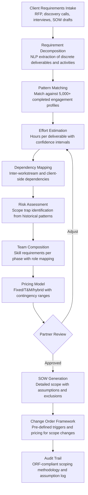

# Engagement Scoping Optimizer

Frankmax

NAICS 541611-541618

> **Consulting Firms & System Integrators** — Consulting Delivery Intelligence Module

## Objective & Purpose

Scope creep is the single largest margin destroyer in consulting and system integration. Industry data shows that 60-70% of professional services engagements exceed their original scope by 20-40%, and 30% of fixed-price projects lose money. The root cause is consistent: scoping is done by senior partners during the sales process under time pressure, using rough analogies to past projects and "gut feel" for effort estimation. Critical requirements are missed during scoping conversations, dependencies between workstreams are underestimated, client organizational complexity (stakeholder politics, approval processes, data availability) is not factored into effort models, and change order processes are too informal to recover margin once scope expands.

The Engagement Scoping Optimizer applies AI to transform scoping from art to science. The engine ingests the prospective client's requirements (from RFP documents, discovery call transcripts, and preliminary interviews), matches them against a pattern library of 5,000+ completed engagements, and produces data-driven scope estimates: work breakdown structure with effort estimates per deliverable, risk-adjusted timeline with dependency mapping, team composition with skill requirements per phase, and a pricing model that accounts for scope uncertainty through contingency ranges rather than single-point estimates. The engine identifies the "scope traps" that partners consistently miss: requirements that sound simple but historically require 3x the estimated effort, client dependencies that create blocking delays, and technical integration points where effort estimates are most volatile.

Within the $3,000-$6,000/month Consulting Intelligence Pack, the Engagement Scoping Optimizer directly protects project margins. For a firm with $50M in annual revenue and 15% of projects losing money due to scoping failures, eliminating even half of those losses adds $3.75M to the bottom line. The governance layer (scoping methodology documentation, assumption audit trail, change order tracking) attaches because clients increasingly demand transparency in how consulting estimates are developed, and firms need defensible records when scope disputes escalate.

## Business Context

| Attribute | Value |
|---|---|
| **Business Process** | Project scoping and estimation |
| **Business Function** | Sales/Delivery |
| **Category** | Pre-Sales |
| **Target Audience** | 12. Consulting Firms & System Integrators |
| **Bundle** | Consulting Intelligence Pack ($3,000-$6,000/mo) |
| **Monthly Cost of Inaction** | $15K-$50K (scope creep, margin erosion, project overruns) |

## BPMN Workflow

## Features

1. **Requirement Extraction Engine** — Processes RFP documents, discovery call transcripts, client emails, and preliminary interview notes using NLP to extract discrete requirements, constraints, assumptions, and success criteria. Requirements are classified by type (functional, technical, organizational, compliance) and mapped to standard consulting deliverable categories. Ambiguous requirements are flagged for clarification before scoping.

2. **Historical Pattern Matcher** — Compares extracted requirements against a library of 5,000+ completed engagement profiles. For each requirement cluster, the engine surfaces comparable past projects: actual effort vs. estimated effort, timeline variances, scope change frequency, and client satisfaction scores. Pattern matching reveals systematic estimation biases: requirements that consistently take 2-3x longer than partners estimate.

3. **Risk-Adjusted Effort Estimator** — Produces three-point estimates (optimistic, most likely, pessimistic) for each deliverable, informed by historical variance data. Estimates account for client-side factors that affect effort: organizational complexity (number of stakeholders, approval layers), data readiness (how much data cleanup the client needs before the engagement can proceed), technical environment maturity (legacy systems add integration effort), and change management resistance (cultural factors that slow adoption). Monte Carlo simulation aggregates individual estimates into project-level probability distributions.

4. **Scope Trap Detector** — Identifies specific requirements and project characteristics that historically lead to scope creep. Examples: "data migration" scoped as a single task but historically requiring 3-5 sub-tasks (mapping, cleansing, transformation, validation, reconciliation); "stakeholder alignment" scoped as 2 workshops but historically requiring 8-12 sessions; "system integration" with a third-party vendor scoped without accounting for vendor response time. Each trap includes the historical evidence and a recommended scope adjustment.

5. **Dynamic Team Builder** — Maps skill requirements to each engagement phase and recommends team composition: roles needed (analyst, consultant, senior consultant, manager, partner), skill profiles (industry expertise, technical skills, methodology certifications), and time allocation (full-time vs. fractional involvement). Team recommendations account for learning curve effects: a consultant new to the client's industry requires 20-30% more time than one with prior industry experience.

6. **Pricing Strategy Advisor** — Recommends pricing models based on engagement characteristics: fixed-price (appropriate for well-defined scope with low uncertainty), time-and-materials (appropriate for high-uncertainty or exploratory work), hybrid (fixed deliverables with T&M change orders), and value-based (where the engagement outcome justifies premium pricing). Each recommendation includes a pricing range, margin analysis, and competitive positioning assessment.

7. **SOW Generator** — Produces a detailed Statement of Work from the scoping analysis: scope description (inclusions and explicit exclusions), deliverables with acceptance criteria, timeline with milestones, team and governance structure, assumptions and dependencies, change order process, and pricing. SOW language is generated from templates refined across thousands of engagements, with firm-specific branding and legal terms.

## Workflow & Automation

**Step 1: Opportunity Intake** — When a new consulting opportunity enters the pipeline, the business development team uploads available information: RFP document, client background research, discovery call notes, and any preliminary requirements. The engine creates an opportunity profile and begins requirement extraction.

**Step 2: Requirement Structuring** — NLP models extract and structure requirements from uploaded documents. Requirements are organized into logical workstreams, and ambiguities or gaps are flagged. The scoping team reviews the structured requirements and adds clarifications from additional client conversations.

**Step 3: Historical Analysis** — The engine matches the structured requirements against the engagement pattern library. For each workstream, it surfaces the 5-10 most comparable past projects with their actual outcomes. Scoping team members review the matches to confirm relevance and calibrate the analogy.

**Step 4: Estimation & Risk Assessment** — Three-point effort estimates are generated per deliverable, with scope traps highlighted. The Monte Carlo simulation produces project-level estimates: 50th percentile (median expectation), 75th percentile (safe estimate with reasonable contingency), and 90th percentile (worst-case with high contingency). Partners choose the confidence level that matches their risk appetite for the opportunity.

**Step 5: Pricing & Team Design** — The pricing advisor recommends a model and range based on scope certainty, client preferences, and competitive dynamics. Team composition is mapped against available resources (integrating with the Resource-to-Engagement Matcher). The complete scope, price, and team recommendation is packaged for partner review.

**Step 6: SOW Finalization** — Following partner approval, the engine generates the SOW with detailed scope, timeline, team, pricing, and change management provisions. The SOW enters the client negotiation process with a documented scoping methodology -- every estimate traces back to historical evidence.

## Input/Output Specifications

| Direction | Data | Format | Description |
|---|---|---|---|
| Input | RFP documents | PDF / DOCX / HTML | Client requirements, evaluation criteria, timeline |
| Input | Discovery call transcripts | Text / Audio (transcribed) | Client conversations capturing requirements and context |
| Input | Historical engagement data | Database / CSV | Completed project profiles with actuals vs. estimates |
| Input | Client background research | PDF / HTML / API | Company profile, industry context, technology landscape |
| Input | Firm rate cards | CSV / JSON | Billing rates by role, geography, and skill level |
| Output | Work breakdown structure | Excel / PDF / JSON | Deliverables with effort estimates and dependencies |
| Output | Risk assessment | PDF / Dashboard | Scope trap identification with historical evidence |
| Output | Pricing recommendation | PDF / JSON | Model selection with range and margin analysis |
| Output | Statement of Work | DOCX / PDF | Complete SOW with scope, timeline, team, and pricing |
| Output | Audit trail | JSON (immutable log) | ORF-compliant scoping methodology and assumption documentation |

## Integration Points

| System | Integration Type | Data Flow |
|---|---|---|
| **Resource-to-Engagement Matcher** | Bidirectional | Skill requirements drive staffing; resource availability constrains timelines |
| **Knowledge Reuse Engine** | Inbound data | Past deliverables inform scope patterns and effort benchmarks |
| **Implementation Risk Predictor** | Outbound data | Scoping assumptions feed risk monitoring during delivery |
| **Margin & Utilization Optimizer** | Outbound data | Scope and pricing feed margin analysis and forecasting |
| **Proposal Generation Engine** | Outbound content | Scoping outputs feed proposal narratives and pricing sections |
| **Multi-Model AI Orchestrator** | Infrastructure | Routes NLP extraction, pattern matching, and simulation tasks |
| **Audit Trail & Traceability Engine** | Outbound log stream | Complete scoping methodology and assumption audit trail |

## Pricing & Revenue Model

| Component | Pricing | Notes |
|---|---|---|
| **Consulting Intelligence Pack** | $3,000-$6,000/month | Engagement Scoping + delivery tools + 2M AI tokens |
| **Standalone Subscription** | $2,000/month | Up to 20 active scoping analyses per quarter |
| **Enterprise SI tier** | $4,000/month | Unlimited scoping, cross-practice pattern library |
| **SOW generation module** | +$500/month | Automated SOW drafting with firm-specific templates |
| **Monte Carlo simulation** | +$300/month | Probabilistic estimation with confidence intervals |
| **AI token consumption** | Included at 80% discount | 2M tokens/month in bundle; overage at marketplace rates |

**Revenue model**: The Engagement Scoping Optimizer directly protects margins. A consulting firm reducing scope creep losses from 15% to 7% on $50M revenue saves $4M annually. The governance layer (scoping methodology documentation, assumption audit trail, change order tracking) attaches because scope disputes require defensible evidence of what was scoped, what assumptions were made, and when scope changed. Target: 70%+ governance attachment within 6 months.

## NAICS/SIC Mapping

| NAICS Code | SIC Code | Industry | Relevance |
|---|---|---|---|
| 541611 | 8742 | Administrative Management Consulting | Primary: management consulting firm scoping |
| 541612 | 8742 | Human Resources Consulting | HR consulting engagement estimation |
| 541613 | 8742 | Marketing Consulting | Marketing consulting project scoping |
| 541614 | 8742 | Process, Physical Distribution, and Logistics Consulting | Operations consulting scoping |
| 541512 | 7371 | Computer Systems Design Services | System integrator project estimation |
