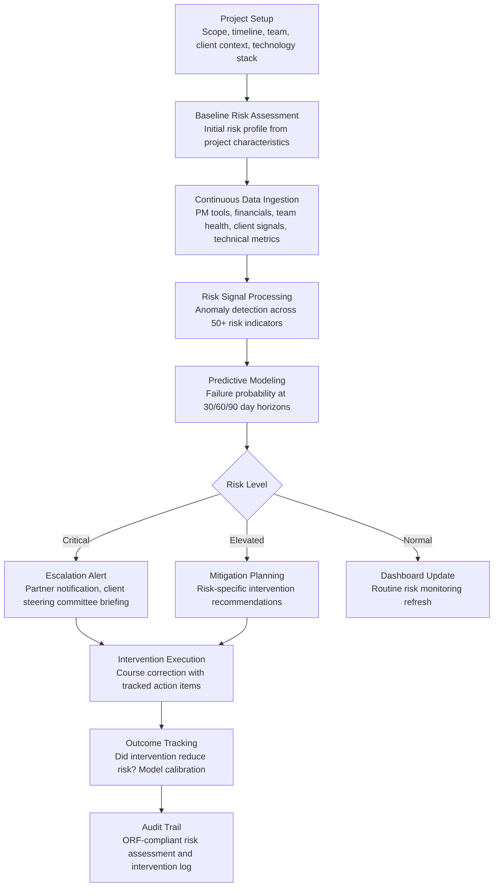

# Implementation Risk Predictor

Frankmax

NAICS 541512-541519

> **Consulting Firms & System Integrators** — Consulting Delivery Intelligence Module

## Objective & Purpose

Large-scale IT implementation and transformation projects fail at staggering rates. Industry research consistently shows that 50-70% of ERP implementations, CRM deployments, cloud migrations, and digital transformation programs exceed their budgets, miss their timelines, or fail to deliver the promised business outcomes. For system integrators, project failures are existential threats: a single failed $20M implementation can wipe out a year of firm profits, destroy client relationships, trigger litigation, and generate negative references that poison the pipeline for years. The root causes are well-known -- inadequate change management, insufficient stakeholder alignment, underestimated data migration complexity, integration failures with existing systems, and scope creep -- yet firms continue to encounter them because risk assessment is performed once at project kickoff and rarely updated as warning signals accumulate during delivery.

The Implementation Risk Predictor provides continuous, data-driven risk monitoring throughout the project lifecycle. The engine ingests project data from multiple sources: project management tools (milestone completion, task dependencies, resource allocation), financial systems (burn rate vs. budget, change order volume), team health indicators (overtime hours, turnover, sentiment from retrospectives), client engagement signals (meeting attendance, decision velocity, escalation frequency), and technical delivery metrics (sprint velocity, defect rates, integration test pass rates). Machine learning models trained on patterns from 10,000+ implementation projects predict the probability of adverse outcomes -- budget overrun, timeline delay, scope failure, stakeholder dissatisfaction -- at 30/60/90 day horizons. Early warning enables course correction before risks materialize into failures.

Within the $3,000-$6,000/month Consulting Intelligence Pack, the Implementation Risk Predictor protects the firm's most valuable asset: its delivery reputation. The governance layer (risk assessment methodology, prediction model transparency, intervention audit trail) attaches because clients demand visibility into risk management processes, and firm leadership needs defensible records when projects encounter difficulties.

## Business Context

| Attribute | Value |
|---|---|
| **Business Process** | Project risk management and delivery governance |
| **Business Function** | Delivery |
| **Category** | Risk |
| **Target Audience** | 12. Consulting Firms & System Integrators |
| **Bundle** | Consulting Intelligence Pack ($3,000-$6,000/mo) |
| **Monthly Cost of Inaction** | $25K-$75K (project overruns, failed implementations, client attrition) |

## BPMN Workflow

## Features

1. **Project Risk DNA Profiling** — At project initiation, the engine creates a "risk DNA" profile by analyzing 30+ project characteristics that correlate with failure: project size (dollar value, duration, team size), technology complexity (number of integrations, custom development percentage, data migration volume), organizational complexity (number of stakeholders, geographies, business units), change magnitude (process changes required, user adoption scope), and client readiness (sponsorship strength, prior implementation experience, data quality). Each characteristic is weighted by its historical correlation with adverse outcomes.

2. **50+ Risk Signal Monitor** — Continuously tracks risk indicators across five categories: delivery signals (milestone completion rate, task dependency health, critical path float), financial signals (burn rate vs. plan, change order volume and value, unbilled work accumulation), team signals (overtime percentage, staff turnover on the project, key person availability, retrospective sentiment scores), client signals (steering committee attendance, decision response time, escalation frequency, requirement change rate), and technical signals (sprint velocity trend, defect density, integration test pass rate, environment stability).

3. **Predictive Failure Modeling** — Machine learning models trained on 10,000+ project outcomes predict four types of adverse outcomes: budget overrun (probability of exceeding budget by 10%, 25%, 50%+), timeline delay (probability of missing milestones by 2 weeks, 1 month, 3 months+), scope failure (probability of de-scoping or failing to deliver committed functionality), and stakeholder dissatisfaction (probability of negative client feedback or relationship damage). Predictions are updated weekly with new project data.

4. **Root Cause Pattern Recognition** — When risk scores increase, the engine identifies the contributing factors by comparing current project patterns against historical failure profiles. Output: "This project's risk increase is driven by three factors: (1) sprint velocity has declined 25% over the last 3 sprints, matching the pattern seen in 72% of projects that ultimately exceeded timelines; (2) client decision response time has increased from 3 days to 12 days, matching the pattern of weak sponsor engagement; (3) the data migration workstream has consumed 140% of budgeted hours with 60% of migration complete."

5. **Intervention Recommendation Engine** — For each identified risk, the engine recommends specific interventions based on what has historically worked for similar risk patterns: staffing changes (add senior architect for technical risk, add change management resource for adoption risk), process changes (increase client touchpoint frequency for engagement risk, implement daily standups for delivery velocity risk), scope adjustments (defer low-priority features to de-risk timeline, negotiate milestone restructuring), and escalation actions (executive sponsor engagement, steering committee risk briefing).

6. **Project Health Dashboard** — Provides at-a-glance project health for delivery leadership: a portfolio view showing risk levels across all active projects, trend indicators showing which projects are improving or deteriorating, and drill-down capability from portfolio view to individual project risk details to specific risk signals. Enables delivery leaders to allocate attention to the projects that need it most rather than relying on status reports that often mask developing problems.

7. **Post-Project Analysis** — After project completion, the engine produces a retrospective risk analysis: which risks materialized, which were successfully mitigated, how accurate were the predictions, and what lessons apply to future projects. Post-project analyses feed the pattern library, continuously improving prediction accuracy.

## Workflow & Automation

**Step 1: Project Onboarding** — When a new implementation project kicks off, the delivery manager enters the project profile: scope, timeline, budget, team composition, technology stack, client organizational context, and known risks. The engine generates the initial risk DNA profile and baseline risk scores.

**Step 2: Data Source Connection** — The engine connects to project management tools (Jira, Azure DevOps, MS Project, Smartsheet), financial systems (time tracking, billing, expense), collaboration platforms (Slack, Teams -- sentiment analysis on team channels), and client engagement tools (meeting scheduling, decision log, escalation tracker). Data feeds are configured for daily or weekly refresh.

**Step 3: Continuous Monitoring** — The engine processes incoming data daily, updating risk signal scores and running predictive models. A weekly risk report is generated automatically: current risk level by category, significant signal changes since last report, and any new intervention recommendations. Reports are distributed to the delivery manager, engagement partner, and firm risk management.

**Step 4: Alert & Escalation** — When risk scores cross defined thresholds, the engine triggers alerts at the appropriate organizational level: elevated risks notify the delivery manager, high risks notify the engagement partner, and critical risks notify firm leadership and trigger a mandatory risk review meeting with the client steering committee.

**Step 5: Intervention Management** — The delivery team selects and implements recommended interventions. Each intervention is logged with expected impact, responsible party, and timeline. The engine tracks whether risk scores improve following intervention, providing feedback on intervention effectiveness.

**Step 6: Continuous Calibration** — Project outcomes (on-time, on-budget, full scope, client satisfaction) are recorded at project completion and used to retrain predictive models. The engine learns which risk signals are most predictive for the firm's specific project types and client base, improving accuracy over time.

## Input/Output Specifications

| Direction | Data | Format | Description |
|---|---|---|---|
| Input | Project profile | Web form / JSON | Scope, timeline, budget, team, technology, client context |
| Input | Project management data | API (Jira, ADO, MS Project) | Tasks, milestones, dependencies, sprint metrics |
| Input | Financial data | API / CSV | Time entries, budget vs. actual, change orders |
| Input | Team health data | API / Survey | Overtime, turnover, retrospective sentiment, availability |
| Input | Client engagement signals | API / Manual entry | Meeting attendance, decision velocity, escalation frequency |
| Output | Risk dashboard | Web portal / API | Project-level and portfolio-level risk visualization |
| Output | Weekly risk reports | PDF / Email | Risk scores, signal changes, intervention recommendations |
| Output | Alert notifications | Email / Slack / Teams | Threshold-triggered escalation alerts |
| Output | Post-project analysis | PDF | Retrospective risk assessment with lessons learned |
| Output | Audit trail | JSON (immutable log) | ORF-compliant risk assessment methodology and intervention log |

## Integration Points

| System | Integration Type | Data Flow |
|---|---|---|
| **Engagement Scoping Optimizer** | Inbound data | Scoping assumptions and risk assessments feed initial risk profile |
| **Resource-to-Engagement Matcher** | Bidirectional | Risk-driven staffing changes feed resource planning; resource constraints feed risk |
| **Margin & Utilization Optimizer** | Outbound data | Risk exposure informs financial forecasting and margin protection |
| **Client Relationship Intelligence** | Outbound signals | Project risk levels feed client health scoring |
| **Multi-Model AI Orchestrator** | Infrastructure | Routes prediction, pattern recognition, and recommendation tasks |
| **Audit Trail & Traceability Engine** | Outbound log stream | Complete risk assessment and intervention audit trail |
| **Project Management Tools** | Inbound API | Jira, Azure DevOps, MS Project, Smartsheet data feeds |

## Pricing & Revenue Model

| Component | Pricing | Notes |
|---|---|---|
| **Consulting Intelligence Pack** | $3,000-$6,000/month | Implementation Risk Predictor + delivery tools + 2M AI tokens |
| **Standalone Subscription** | $2,000/month | Up to 10 active projects monitored |
| **Enterprise SI tier** | $4,500/month | Unlimited projects, portfolio-level analytics |
| **Advanced prediction module** | +$500/month | 10,000+ project pattern library with firm-specific calibration |
| **Post-project analysis** | +$300/month | Automated retrospective reports with lessons learned |
| **AI token consumption** | Included at 80% discount | 2M tokens/month in bundle; overage at marketplace rates |

**Revenue model**: The Implementation Risk Predictor protects against the most expensive outcome in professional services: a failed project. Preventing one $20M project failure saves the firm $2M-$5M in direct costs (overrun absorption, rework, litigation) and $5M-$20M in indirect costs (reputation damage, lost follow-on work, competitive displacement). The governance layer (risk methodology, prediction model transparency, intervention documentation) attaches at near-100% because project risk management is inherently a governance function. Target: 90%+ governance attachment.

## NAICS/SIC Mapping

| NAICS Code | SIC Code | Industry | Relevance |
|---|---|---|---|
| 541512 | 7371 | Computer Systems Design Services | Primary: system integrators managing implementation risk |
| 541511 | 7372 | Custom Computer Programming Services | Custom development project risk |
| 541519 | 7379 | Other Computer Related Services | Technology consulting delivery risk |
| 541611 | 8742 | Administrative Management Consulting | Management consulting implementation projects |
| 541614 | 8742 | Process, Physical Distribution, and Logistics Consulting | Operations transformation risk |
