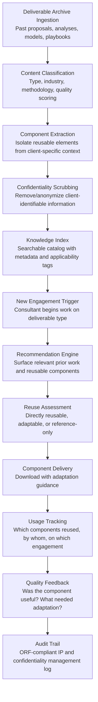

# Knowledge Reuse Engine

Frankmax

NAICS 541611-541618

> **Consulting Firms & System Integrators** — Consulting Delivery Intelligence Module

## Objective & Purpose

Consulting firms perform the same analyses, build the same frameworks, and create the same deliverable types across hundreds of client engagements -- yet each engagement starts from scratch. A consultant building a market entry analysis for a healthcare client is unaware that a colleague completed a nearly identical analysis for a different healthcare client six months earlier. The reusable components exist -- market sizing methodologies, competitive landscape frameworks, financial models, implementation playbooks, change management templates -- but they are buried in SharePoint folders, local drives, and departed consultants' email archives. Studies estimate that 30-40% of consulting effort is duplicated work: analyses that have been done before, frameworks that have been built before, and templates that have been created before.

The Knowledge Reuse Engine indexes, classifies, and surfaces reusable knowledge components from the firm's entire deliverable history. When a consultant begins work on a new engagement, the engine recommends relevant prior deliverables: "For this healthcare market entry analysis, here are 7 prior market entry analyses from the last 3 years (3 in healthcare, 4 in adjacent sectors), plus 4 reusable financial models and 2 implementation playbooks." Components are surfaced with metadata: original client (anonymized if required), engagement team, quality rating, and applicability score. The engine distinguishes between directly reusable components (frameworks, templates, methodologies), adaptable components (analyses requiring client-specific data refresh), and reference-only components (context that informs but cannot be directly reused).

Within the $3,000-$6,000/month Consulting Intelligence Pack, the Knowledge Reuse Engine attacks the largest efficiency opportunity in professional services. Reducing duplicated effort by 20-30% across a firm translates directly to margin improvement (same deliverable quality in fewer hours) or capacity increase (more engagements delivered with the same team). For a 500-consultant firm with $150M revenue, a 20% reduction in duplicated effort is worth $15M-$30M annually. The governance layer (IP classification, client confidentiality controls, usage licensing audit) attaches because reusing deliverables across clients creates confidentiality risks that must be systematically managed.

## Business Context

| Attribute | Value |
|---|---|
| **Business Process** | Deliverable reuse and knowledge management |
| **Business Function** | Knowledge Management |
| **Category** | Operations |
| **Target Audience** | 12. Consulting Firms & System Integrators |
| **Bundle** | Consulting Intelligence Pack ($3,000-$6,000/mo) |
| **Monthly Cost of Inaction** | $20K-$60K (duplicated effort, reinvention, lost institutional knowledge) |

## BPMN Workflow

## Features

1. **Automated Deliverable Indexing** — Ingests the firm's deliverable archive (SharePoint, Google Drive, project management systems, document repositories) and classifies each document by: deliverable type (market analysis, financial model, strategy framework, implementation plan, change management playbook, assessment report), industry sector, methodology employed, engagement size and complexity, and quality rating (based on client feedback and internal review scores). Supports 50+ deliverable types across 20+ industry sectors.

2. **Component Extraction Engine** — Goes beyond whole-document indexing to extract reusable sub-components: specific analytical frameworks, data tables, visualization templates, methodology descriptions, executive summary structures, and interview guides. A 200-page strategy document may contain 15-20 independently reusable components, each tagged and cataloged separately. Component boundaries are identified using document structure analysis and content type classification.

3. **Confidentiality Scrubber** — Automatically identifies and anonymizes client-identifiable information: company names, financial figures, employee names, proprietary data, and strategic details that could reveal client identity. Scrubbing levels are configurable: full anonymization (for broad internal sharing), partial anonymization (for same-practice sharing), and access-controlled (for direct team reference with appropriate clearance). The scrubber flags content requiring manual review when automated anonymization confidence is below threshold.

4. **Contextual Recommendation Engine** — When a consultant creates a new document or opens a blank template, the engine proactively recommends relevant prior work. Recommendations are triggered by: engagement metadata (client industry, project type, deliverable stage), document content (as the consultant begins writing, real-time recommendations surface based on emerging content), and explicit search (consultant describes what they need in natural language). Each recommendation includes an applicability score and adaptation guidance.

5. **Quality and Relevance Scoring** — Not all prior work is equally valuable. The engine scores each component on quality (client feedback, internal review rating, senior partner endorsement) and relevance (how closely the component matches the current engagement's characteristics). High-quality, high-relevance matches are surfaced first. Components from engagements that received negative client feedback are deprioritized or excluded.

6. **Adaptation Guidance** — For each recommended component, the engine provides specific adaptation guidance: "This market sizing model was built for the North American pharmaceutical market. For your European medical device engagement, you will need to: (1) replace market size data with European sources, (2) adjust regulatory timeline assumptions from FDA to MDR, (3) update competitive landscape for EU market participants." Guidance reduces the time consultants spend figuring out what needs to change.

7. **Institutional Knowledge Preservation** — When consultants leave the firm, their deliverable contributions remain indexed and accessible. The engine captures not just documents but the methodological approaches, client-specific insights, and analytical techniques embedded in them. Senior partner retirement no longer means loss of decades of institutional knowledge.

## Workflow & Automation

**Step 1: Archive Ingestion** — During initial setup, the engine connects to the firm's document repositories and ingests the deliverable archive. Historical documents are classified, components extracted, and confidentiality-scrubbed. Ongoing ingestion captures new deliverables as engagements close, with a 30-day delay to ensure documents are finalized.

**Step 2: Engagement Onboarding** — When a new engagement begins, the engagement manager enters the project profile: client industry, engagement type, deliverable list, and key topics. The engine immediately generates a knowledge package: recommended prior deliverables, reusable components, applicable templates, and reference materials for the team.

**Step 3: Active Assistance** — As consultants work on deliverables, the engine provides real-time recommendations. A consultant starting a competitive analysis receives recommendations of prior competitive analyses in the same industry. A consultant building a financial model receives recommended model templates with proven structures. Recommendations appear as sidebar suggestions within the firm's document workspace.

**Step 4: Component Reuse** — Consultants select recommended components, download them with adaptation guidance, and modify them for the current engagement. The engine tracks which components were downloaded and by whom, building a usage history that informs quality scoring (frequently reused components are likely high quality).

**Step 5: Quality Feedback** — After engagement completion, team members rate the usefulness of reused components: "directly applicable," "required significant adaptation," or "not useful." Feedback updates quality scores and refines future recommendations.

**Step 6: Continuous Learning** — The engine's recommendation algorithm improves over time as it learns which types of components are most frequently reused, which adaptation patterns are most common, and which engagement-to-component matches produce the highest consultant satisfaction.

## Input/Output Specifications

| Direction | Data | Format | Description |
|---|---|---|---|
| Input | Deliverable archive | DOCX / PPTX / XLSX / PDF | Historical engagement deliverables and work products |
| Input | Engagement metadata | JSON / CRM integration | Client industry, project type, team, timeline, outcomes |
| Input | Quality ratings | Web form / API | Client satisfaction scores, internal review ratings |
| Input | New engagement profiles | Web form / JSON | Current project characteristics for recommendation matching |
| Input | Consultant feedback | Web form | Reuse effectiveness ratings and adaptation notes |
| Output | Knowledge packages | Dashboard / Email | Engagement-specific recommended prior work and components |
| Output | Reusable components | DOCX / PPTX / XLSX | Anonymized, tagged components with adaptation guidance |
| Output | Usage analytics | Dashboard / PDF | Reuse rates, time savings, most valuable components |
| Output | Knowledge gap reports | PDF / Dashboard | Deliverable types with no reusable precedents |
| Output | Audit trail | JSON (immutable log) | ORF-compliant IP classification and confidentiality management log |

## Integration Points

| System | Integration Type | Data Flow |
|---|---|---|
| **Engagement Scoping Optimizer** | Outbound data | Prior deliverables inform scope and effort estimates |
| **Proposal Generation Engine** | Outbound content | Reusable case studies and methodology descriptions feed proposals |
| **Benchmarking-as-a-Service** | Bidirectional | Benchmark data enriches deliverables; deliverable analyses feed benchmark library |
| **Client Relationship Intelligence** | Inbound context | Client history and preferences contextualize recommendations |
| **Multi-Model AI Orchestrator** | Infrastructure | Routes NLP classification, recommendation, and anonymization tasks |
| **Audit Trail & Traceability Engine** | Outbound log stream | Complete IP and confidentiality management audit trail |
| **Document Management Systems** | Bidirectional API | Deliverables in; tagged components out |

## Pricing & Revenue Model

| Component | Pricing | Notes |
|---|---|---|
| **Consulting Intelligence Pack** | $3,000-$6,000/month | Knowledge Reuse + delivery tools + 2M AI tokens |
| **Standalone Subscription** | $2,000/month | Up to 10,000 indexed documents, 100 users |
| **Enterprise tier** | $4,500/month | Unlimited documents and users, multi-practice |
| **Confidentiality scrubber** | +$500/month | Automated client-identifiable information anonymization |
| **Real-time recommendation** | +$400/month | In-document sidebar suggestions during content creation |
| **AI token consumption** | Included at 80% discount | 2M tokens/month in bundle; overage at marketplace rates |

**Revenue model**: The Knowledge Reuse Engine delivers ROI through eliminated duplication. A 20% reduction in duplicated effort for a 500-consultant firm saves $15M-$30M annually in recovered capacity. The governance layer (IP classification, confidentiality controls, usage audit trail) attaches at near-100% because reusing deliverables across clients creates legal and ethical risks -- confidential client information leaking between engagements -- that require systematic management. Firms without confidentiality controls on knowledge reuse face significant malpractice and liability exposure. Target: 85%+ governance attachment.

## NAICS/SIC Mapping

| NAICS Code | SIC Code | Industry | Relevance |
|---|---|---|---|
| 541611 | 8742 | Administrative Management Consulting | Primary: management consulting knowledge management |
| 541612 | 8742 | Human Resources Consulting | HR consulting deliverable reuse |
| 541618 | 8748 | Other Management Consulting | Specialty consulting knowledge management |
| 541512 | 7371 | Computer Systems Design Services | System integrator deliverable reuse |
| 541519 | 7379 | Other Computer Related Services | Technology consulting knowledge management |
