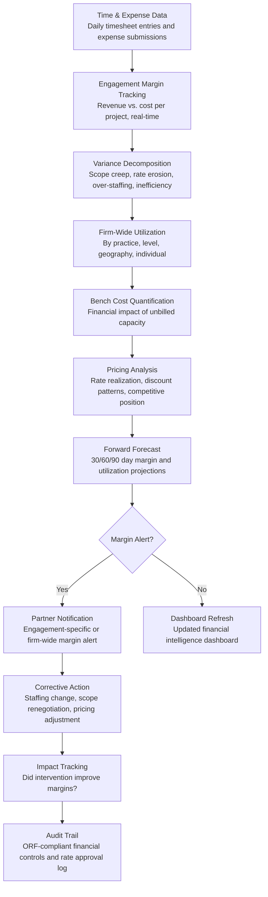

# Margin & Utilization Optimizer

Frankmax

NAICS 541611-541618

> **Consulting Firms & System Integrators** — SI Operations Intelligence Module

## Objective & Purpose

Professional services firms operate on razor-thin margins governed by two metrics: utilization (the percentage of available consultant hours that are billed to clients) and realization (the percentage of billed hours that are actually collected at target rates). A consulting firm with 70% utilization, 90% realization, and $200K average cost per consultant needs to bill at $317/hour just to break even. Every percentage point of utilization improvement adds $2K-$4K per consultant per year to the bottom line. Every percentage point of realization improvement adds another $2K-$3K. Yet most firms manage these metrics reactively -- discovering margin problems in monthly financial reviews after the damage is done. By the time a partner realizes an engagement is running at 35% margin instead of the planned 50%, the hours have been burned and the revenue shortfall is permanent.

The Margin & Utilization Optimizer provides real-time financial intelligence across the firm: per-engagement margin tracking (actual vs. planned, with variance decomposition by cause), firm-wide utilization monitoring (by practice, level, geography, with bench cost quantification), pricing optimization (rate analysis showing where the firm leaves money on the table or prices itself out of opportunities), and forward-looking forecasting (projected margin and utilization at 30/60/90 day horizons based on current pipeline and staffing). The engine transforms financial management from monthly rearview-mirror reporting to daily forward-looking intelligence that enables proactive margin protection.

Within the $3,000-$6,000/month Consulting Intelligence Pack, the Margin & Utilization Optimizer is the financial command center. For a 200-consultant firm with $60M revenue, a 3-point utilization improvement ($1.2M) combined with a 2-point realization improvement ($600K) adds $1.8M to EBITDA -- against a $36K-$72K annual tool cost. The governance layer (engagement financial controls, rate approval audit trail, revenue recognition compliance) attaches because professional services firms face SOX compliance (for public firms), partnership agreement financial transparency requirements, and client audit rights that demand defensible financial records.

## Business Context

| Attribute | Value |
|---|---|
| **Business Process** | Financial management and profitability optimization |
| **Business Function** | Finance |
| **Category** | Operations |
| **Target Audience** | 12. Consulting Firms & System Integrators |
| **Bundle** | Consulting Intelligence Pack ($3,000-$6,000/mo) |
| **Monthly Cost of Inaction** | $20K-$60K (margin erosion, utilization drag, pricing leakage) |

## BPMN Workflow

## Features

1. **Real-Time Engagement Margin Tracker** — Calculates per-engagement margin daily (not monthly) by comparing billed revenue against actual costs: consultant time (at fully loaded cost rates including salary, benefits, overhead allocation), expenses, subcontractor costs, and technology costs. Shows planned margin vs. actual margin with variance explanation: how much of the variance is due to scope creep (more hours than planned), rate erosion (billing at lower rates than planned), over-staffing (more senior resources than needed), and efficiency (more hours per deliverable than estimated).

2. **Utilization Intelligence** — Tracks billable utilization across every dimension: by practice (which practices are running hot or cold), by level (are senior consultants underutilized while juniors are overworked?), by geography (are certain offices chronically low?), by individual (who is consistently on the bench?), and by time period (seasonal patterns, pipeline-driven cycles). Each dimension includes benchmarks: the firm's target, industry average, and top-quartile performance.

3. **Bench Cost Quantifier** — Calculates the real-time financial impact of unbilled capacity. Every consultant-day on the bench has a quantified cost: fully loaded daily rate that the firm is absorbing without revenue offset. The dashboard shows: total bench cost per week, bench by practice and level, days-on-bench per consultant (with trend), and the revenue gap needed to bring utilization to target. This quantification creates urgency around bench reduction that abstract "utilization percentage" does not.

4. **Rate Realization Analyzer** — Tracks the firm's actual billing rates against standard rates, identifying where discounting erodes margins. Analysis dimensions include: discount frequency and depth by client, practice, and partner (which partners consistently discount?), rate trends over time (is the firm's average realized rate improving or declining?), competitive rate intelligence (how do the firm's rates compare to market?), and discount justification (was the discount strategic or reactive?).

5. **Pricing Optimization Engine** — Recommends rate adjustments based on supply-demand dynamics: skills in high demand command premium rates, clients with strong relationships and high wallet share can absorb rate increases, competitive situations may justify strategic discounts, and long-term engagements may warrant volume pricing. Recommendations include the estimated revenue impact of each proposed adjustment.

6. **Forward-Looking Financial Forecast** — Projects firm-wide and per-engagement financials at 30/60/90 day horizons: revenue forecast (from committed engagements, probable wins, and pipeline), cost forecast (from staffing plans, bench projections, and overhead), margin forecast (per-engagement and aggregate), and utilization forecast (from resource allocations and availability projections). Forecasts highlight emerging risks: engagements trending toward margin thresholds, utilization dips from engagement endings, and revenue gaps from pipeline shortfalls.

7. **Financial Alert System** — Configurable alerts notify partners and firm leadership when financial thresholds are crossed: engagement margin falls below minimum (e.g., under 30%), firm utilization drops below target (e.g., under 70%), individual consultant bench time exceeds threshold (e.g., over 3 weeks), or write-off rate exceeds acceptable levels. Alerts include root cause analysis and recommended corrective actions.

## Workflow & Automation

**Step 1: Data Integration** — The engine connects to the firm's time tracking system, billing system, HRIS (for fully loaded cost rates), CRM (for pipeline data), and project management tools (for engagement scope and staffing plans). Daily data feeds ensure real-time financial visibility.

**Step 2: Daily Financial Processing** — Each business day, the engine processes new time entries and expenses, updates per-engagement margin calculations, refreshes utilization metrics, and recalculates financial forecasts. Processing completes before the start of the next business day, ensuring leadership sees current data.

**Step 3: Variance Analysis** — For engagements showing margin deviation from plan, the engine decomposes the variance into contributing factors: was it more hours than planned (scope creep)? Lower rates than planned (discount)? More senior staffing than planned (over-staffing)? Or more hours per deliverable than estimated (efficiency)? Variance decomposition directs corrective action to the actual problem.

**Step 4: Partner Dashboards** — Practice leaders and engagement partners access dashboards showing their portfolio financial health: engagements ranked by margin (highlighting those below threshold), utilization for their team, pipeline revenue forecast, and bench exposure. Dashboards are accessible on mobile for partner review between meetings.

**Step 5: Firm-Wide Reporting** — Weekly, the engine generates firm-wide financial intelligence reports for the management committee: aggregate utilization and margin, trend analysis, top-risk engagements, bench cost, and revenue forecast. Monthly reports add year-over-year comparisons, partner-level performance, and practice-level profitability.

**Step 6: Strategic Planning Input** — Quarterly, the engine provides data for strategic planning: pricing trend analysis, practice-level profitability comparison, utilization optimization opportunities (practices that could share resources), and hiring vs. contracting decisions (when bench risk justifies contractor use over full-time hiring).

## Input/Output Specifications

| Direction | Data | Format | Description |
|---|---|---|---|
| Input | Time entries | API (time tracking system) | Hours by consultant, engagement, task, and billing status |
| Input | Billing data | API (billing system) | Invoiced amounts, collections, write-offs, adjustments |
| Input | Employee cost data | API (HRIS) | Fully loaded cost rates by consultant |
| Input | Pipeline data | API (CRM) | Proposals, probabilities, expected start dates, sizes |
| Input | Engagement plans | API / CSV | Budgeted hours, staffing plans, milestone schedules |
| Output | Engagement margin dashboards | Web portal / API | Per-engagement financials with variance decomposition |
| Output | Utilization dashboards | Web portal / API | Firm-wide, practice, level, and individual utilization |
| Output | Financial forecasts | Dashboard / PDF / Excel | 30/60/90 day revenue, margin, and utilization projections |
| Output | Financial alerts | Email / Slack / Dashboard | Threshold-triggered margin and utilization notifications |
| Output | Audit trail | JSON (immutable log) | ORF-compliant financial controls, rate approvals, and write-off documentation |

## Integration Points

| System | Integration Type | Data Flow |
|---|---|---|
| **Engagement Scoping Optimizer** | Inbound data | Budget and staffing plans establish margin baselines |
| **Resource-to-Engagement Matcher** | Bidirectional | Utilization targets inform staffing; staffing decisions affect margins |
| **Implementation Risk Predictor** | Inbound signals | Project risk flags that predict margin deterioration |
| **Client Relationship Intelligence** | Outbound data | Revenue concentration and pricing trends feed client health |
| **Proposal Generation Engine** | Inbound data | Pricing decisions in proposals feed margin projections for wins |
| **Multi-Model AI Orchestrator** | Infrastructure | Routes forecasting, variance analysis, and optimization tasks |
| **Audit Trail & Traceability Engine** | Outbound log stream | Complete financial controls and rate approval audit trail |

## Pricing & Revenue Model

| Component | Pricing | Notes |
|---|---|---|
| **Consulting Intelligence Pack** | $3,000-$6,000/month | Margin Optimizer + delivery tools + 2M AI tokens |
| **Standalone Subscription** | $2,000/month | Up to 200 consultants, basic margin and utilization tracking |
| **Enterprise tier** | $4,000/month | Unlimited consultants, forecasting, pricing optimization |
| **Pricing optimization module** | +$500/month | Rate analysis, discount tracking, competitive positioning |
| **Financial forecasting** | +$400/month | 30/60/90 day revenue, margin, and utilization projections |
| **AI token consumption** | Included at 80% discount | 2M tokens/month in bundle; overage at marketplace rates |

**Revenue model**: The Margin & Utilization Optimizer delivers the most directly measurable ROI in the consulting pack. A 3-point utilization improvement and 2-point realization improvement for a 200-consultant firm adds $1.8M to EBITDA annually against a $24K-$72K tool cost -- a 25-75x return. The governance layer (financial controls, rate approval audit, revenue recognition compliance) attaches because professional services financial management is inherently a governance function. Public firms require SOX-compliant financial controls; partnerships require transparent financial reporting; and clients exercise audit rights on T&M engagements. Target: 80%+ governance attachment.

## NAICS/SIC Mapping

| NAICS Code | SIC Code | Industry | Relevance |
|---|---|---|---|
| 541611 | 8742 | Administrative Management Consulting | Primary: management consulting financial management |
| 541512 | 7371 | Computer Systems Design Services | System integrator margin and utilization optimization |
| 541618 | 8748 | Other Management Consulting | Specialty consulting financial management |
| 541519 | 7379 | Other Computer Related Services | Technology consulting profitability |
| 541614 | 8742 | Process, Physical Distribution, and Logistics Consulting | Operations consulting financial management |
