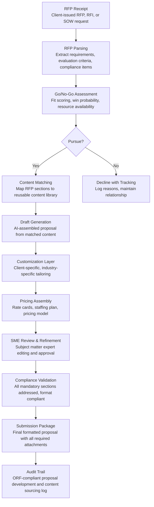

# Proposal Generation Engine

Frankmax

NAICS 541611-541618

> **Consulting Firms & System Integrators** — SI Operations Intelligence Module

## Objective & Purpose

Consulting firms and system integrators respond to 50-200+ RFPs per year. Each response requires 80-200 person-hours of effort across subject matter experts, proposal writers, pricing analysts, and firm leadership. At an average fully loaded cost of $150/hour, that is $12K-$30K per proposal -- and win rates average 15-25%, meaning 75-85% of that investment is lost. The process is manual and repetitive: teams search for past proposal content that might be reusable, rewrite capability descriptions for the 50th time, manually customize case studies for the client's industry, build staffing plans from scratch, and create pricing models on blank spreadsheets. A mid-size consulting firm investing $1M-$3M annually in proposal effort recovers only $250K-$750K through wins.

The Proposal Generation Engine automates 60-70% of the proposal response process. The engine ingests the RFP requirements (automatically parsing evaluation criteria, mandatory response sections, and compliance requirements), matches them against the firm's content library (past proposals, capability statements, case studies, staff bios, methodology descriptions), and generates a structured first draft that addresses each RFP requirement with relevant content. The engine customizes content for the specific client and industry -- not generic boilerplate, but targeted narratives that reference the client's known challenges, the firm's relevant experience, and industry-specific language. Partners and subject matter experts refine the AI-generated draft rather than starting from blank pages, reducing total proposal effort by 60-70% while improving response quality through better content matching.

Within the $3,000-$6,000/month Consulting Intelligence Pack, the Proposal Generation Engine addresses the highest-volume sales cost in professional services. Reducing per-proposal costs from $20K to $7K while improving win rates by 5-10% (through better content quality and more proposals responded to) transforms the firm's business development economics. The governance layer (content compliance validation, pricing methodology audit, proposal version control) attaches because RFP responses are contractually binding documents where errors create legal exposure.

## Business Context

| Attribute | Value |
|---|---|
| **Business Process** | RFP response and proposal management |
| **Business Function** | Business Development |
| **Category** | Sales |
| **Target Audience** | 12. Consulting Firms & System Integrators |
| **Bundle** | Consulting Intelligence Pack ($3,000-$6,000/mo) |
| **Monthly Cost of Inaction** | $15K-$40K (proposal labor, lost deals, poor win rates) |

## BPMN Workflow

## Features

1. **RFP Intelligence Parser** — Automatically processes RFP documents (PDF, DOCX, HTML) to extract: mandatory response sections with page/word limits, evaluation criteria with point allocations, compliance requirements (certifications, insurance, references), submission format and deadline, and implicit evaluation factors (language and emphasis that reveal what the client prioritizes). Parsed requirements are structured into a response framework that guides the entire proposal.

2. **Go/No-Go Decision Support** — Scores each opportunity against configurable criteria: strategic fit (client industry, service alignment, geographic match), competitive position (incumbent advantage, relationship strength, relevant experience), resource availability (can the firm staff the engagement if won?), financial attractiveness (deal size, margin potential, payment terms), and win probability (based on historical win rates for similar RFPs). Prevents firms from investing proposal effort in opportunities they are unlikely to win.

3. **Intelligent Content Matching** — Maps each RFP section to relevant content from the firm's library: capability statements, methodology descriptions, case studies, past proposal responses, staff biographies, certifications, and corporate qualifications. Matching considers not just topic similarity but client-industry relevance, recency, and quality rating. For each section, the engine surfaces the top 3-5 content options with applicability scores.

4. **Automated Draft Assembly** — Generates a complete first draft by assembling the best-matched content for each section, with AI-generated transitions and client-specific customization. The draft is not generic boilerplate -- the engine inserts the client's name, references their known challenges (from CRM data and public information), uses their industry terminology, and structures the narrative around their stated evaluation criteria. Draft quality is sufficient for partner review, not just placeholder text.

5. **Pricing Model Builder** — Constructs the pricing section from the firm's rate cards, the scoped staffing plan (from Engagement Scoping Optimizer integration), and the client's pricing format requirements (fixed-price, T&M, hybrid, rate card comparison). Handles complex pricing scenarios: multi-year deals with escalation clauses, volume discounts, performance-based pricing, and gainsharing models. Pricing is validated against the firm's margin thresholds and competitive positioning intelligence.

6. **Compliance Checker** — Before submission, the engine validates the proposal against all RFP compliance requirements: every mandatory section addressed, page/word limits respected, required certifications and references included, correct formatting applied, and all attachments present. Compliance failures in government contracting can result in automatic disqualification -- this feature prevents technical rejections that waste the entire proposal investment.

7. **Win/Loss Analytics** — After deal decisions are communicated, the engine records the outcome (won, lost, no decision) and, where available, the evaluation feedback. Over time, the analytics module identifies patterns: which content elements correlate with wins, which pricing strategies succeed in different contexts, which evaluation criteria are most decisive, and which opportunity characteristics predict wins vs. losses. Insights feed continuous improvement of both content and go/no-go decisions.

## Workflow & Automation

**Step 1: RFP Intake & Parsing** — When an RFP arrives, it is uploaded to the engine. NLP parsing extracts all requirements, evaluation criteria, and compliance items within 15-30 minutes. The parsed framework is presented to the business development team for validation and prioritization.

**Step 2: Go/No-Go Decision** — The engine produces a go/no-go scorecard within 1 hour of parsing. The scorecard shows opportunity attractiveness, win probability, resource availability, and competitive position. Partners make the pursuit decision based on data rather than instinct.

**Step 3: Content Assembly** — For pursued opportunities, the engine matches RFP sections to library content and generates a first draft within 24-48 hours. The draft includes section-by-section content with source attribution (which past proposal or capability statement each paragraph draws from) and customization notes (what needs client-specific tailoring by SMEs).

**Step 4: SME Refinement** — Subject matter experts receive their assigned sections with AI-generated drafts and editing guidance. SMEs refine technical content, add engagement-specific insights, and validate approach descriptions. The engine tracks editing progress and sends deadline reminders.

**Step 5: Pricing & Staffing** — The pricing module assembles the commercial section from rate cards, staffing plans, and the client's pricing format requirements. Pricing is reviewed against margin thresholds and competitive intelligence. The engagement partner approves final pricing.

**Step 6: Compliance Review & Submission** — The compliance checker validates the complete proposal against all RFP requirements. Any gaps are flagged for immediate resolution. The finalized proposal is packaged in the required format and submitted through the specified channel (email, procurement portal, physical delivery).

## Input/Output Specifications

| Direction | Data | Format | Description |
|---|---|---|---|
| Input | RFP documents | PDF / DOCX / HTML | Client-issued requirements, evaluation criteria, compliance items |
| Input | Firm content library | DOCX / PPTX / PDF / Database | Past proposals, capabilities, case studies, bios, certifications |
| Input | CRM client data | API (CRM integration) | Client profile, relationship history, known challenges |
| Input | Rate cards and pricing rules | CSV / JSON | Billing rates, discount policies, margin thresholds |
| Input | Win/loss outcomes | Web form / API | Deal decisions with evaluation feedback when available |
| Output | Go/no-go scorecards | Dashboard / PDF | Opportunity assessment with win probability |
| Output | Proposal drafts | DOCX / PDF | Section-by-section first draft with customization notes |
| Output | Pricing models | Excel / PDF | Client-formatted pricing with staffing plan |
| Output | Compliance validation reports | Dashboard / PDF | RFP requirement coverage with gap identification |
| Output | Audit trail | JSON (immutable log) | ORF-compliant content sourcing and proposal development log |

## Integration Points

| System | Integration Type | Data Flow |
|---|---|---|
| **Engagement Scoping Optimizer** | Inbound data | Scope and effort estimates feed proposal pricing section |
| **Knowledge Reuse Engine** | Inbound content | Reusable deliverable descriptions and case studies |
| **Client Relationship Intelligence** | Inbound context | Client history and preferences inform proposal customization |
| **Benchmarking-as-a-Service** | Inbound data | Industry benchmarks strengthen client-specific value propositions |
| **Resource-to-Engagement Matcher** | Inbound data | Staff availability informs proposed team composition |
| **Multi-Model AI Orchestrator** | Infrastructure | Routes NLP parsing, content matching, and draft generation tasks |
| **Audit Trail & Traceability Engine** | Outbound log stream | Complete proposal development and content sourcing audit trail |

## Pricing & Revenue Model

| Component | Pricing | Notes |
|---|---|---|
| **Consulting Intelligence Pack** | $3,000-$6,000/month | Proposal Generation + delivery tools + 2M AI tokens |
| **Standalone Subscription** | $1,800/month | Up to 10 proposals/quarter, basic content matching |
| **Enterprise tier** | $3,500/month | Unlimited proposals, full content library, win/loss analytics |
| **Go/no-go decision support** | +$300/month | Opportunity scoring with historical win rate modeling |
| **Pricing model builder** | +$400/month | Automated pricing assembly with margin validation |
| **AI token consumption** | Included at 80% discount | 2M tokens/month in bundle; overage at marketplace rates |

**Revenue model**: The Proposal Generation Engine transforms the highest-volume cost in consulting business development. Reducing per-proposal cost from $20K to $7K saves $650K-$2.6M annually for a firm responding to 50-200 RFPs. A 5% improvement in win rates on $500K average deal size generates $1.25M-$5M in additional wins. The governance layer (content compliance, pricing methodology audit, proposal version control) attaches because proposals are contractually binding -- errors create legal liability, and non-compliance causes disqualification. Target: 70%+ governance attachment within 6 months.

## NAICS/SIC Mapping

| NAICS Code | SIC Code | Industry | Relevance |
|---|---|---|---|
| 541611 | 8742 | Administrative Management Consulting | Primary: management consulting proposal automation |
| 541512 | 7371 | Computer Systems Design Services | System integrator RFP response |
| 541618 | 8748 | Other Management Consulting | Specialty consulting proposal generation |
| 541519 | 7379 | Other Computer Related Services | Technology consulting proposal management |
| 541614 | 8742 | Process, Physical Distribution, and Logistics Consulting | Operations consulting proposals |
