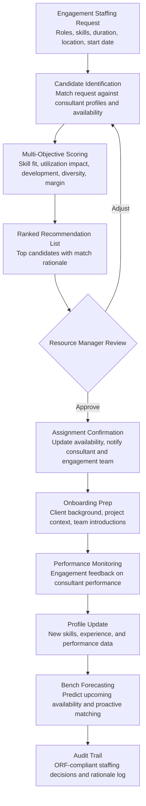

# Resource-to-Engagement Matcher

Frankmax

NAICS 541611-541519

> **Consulting Firms & System Integrators** — SI Operations Intelligence Module

## Objective & Purpose

Staffing is the operational heartbeat of every consulting firm and system integrator. A 500-consultant firm must continuously match people to projects across dozens of active engagements, each requiring different combinations of industry expertise, technical skills, methodology certifications, seniority levels, and availability windows. The staffing process is typically managed by a small resource management team using spreadsheets, email requests, and partner lobbying. The results are predictably suboptimal: 30-40% of staffing decisions are based on availability rather than fit, bench time (consultants between engagements) runs 15-25% of capacity, and mismatched staffing degrades both project quality and consultant satisfaction. Every week a senior consultant sits on the bench costs the firm $5K-$15K in unbilled capacity. Every mismatch between consultant skills and project requirements adds 20-30% to delivery effort.

The Resource-to-Engagement Matcher applies AI to optimize staffing decisions across the entire firm. The engine maintains rich consultant profiles (skills, certifications, industry experience, client history, performance ratings, development goals, geographic preferences, and availability forecasts) and matches them against engagement requirements (role specifications, skill needs, duration, location, start date, and client constraints). The matching algorithm optimizes for multiple objectives simultaneously: skill fit (consultant capabilities match project needs), utilization (minimize bench time across the firm), development (allocate stretch assignments that grow consultant skills), diversity (team composition reflects firm diversity goals), and margin (appropriate seniority mix to meet project budget).

Within the $3,000-$6,000/month Consulting Intelligence Pack, the Resource-to-Engagement Matcher directly improves the two metrics that drive professional services profitability: utilization rate and realization rate. Increasing utilization from 70% to 78% for a 500-consultant firm at $200K average annual revenue per consultant adds $8M to the top line. The governance layer (staffing decision audit trail, skill validation, diversity compliance documentation) attaches because firms face increasing scrutiny on how staffing decisions are made -- from equal opportunity compliance to client-facing diversity commitments.

## Business Context

| Attribute | Value |
|---|---|
| **Business Process** | Consultant staffing and resource allocation |
| **Business Function** | HR/Operations |
| **Category** | Operations |
| **Target Audience** | 12. Consulting Firms & System Integrators |
| **Bundle** | Consulting Intelligence Pack ($3,000-$6,000/mo) |
| **Monthly Cost of Inaction** | $20K-$50K (bench costs, mismatched staffing, utilization drag) |

## BPMN Workflow

## Features

1. **Rich Consultant Profiles** — Maintains comprehensive profiles for every consultant: technical skills (programming languages, platforms, tools), industry expertise (sectors served, domain knowledge depth), methodology certifications (Agile, PMP, ITIL, Six Sigma, SAP, Salesforce), client history (which clients served, roles played, client feedback scores), performance ratings (delivery quality, client satisfaction, teamwork), development goals (skills they want to build, industries they want to explore), geographic preferences (willingness to travel, relocation, remote work), and availability forecast (current assignment end date, planned PTO, training commitments).

2. **Multi-Objective Matching Algorithm** — Optimizes staffing across five objectives simultaneously: (a) skill fit -- how well the consultant's capabilities match the role requirements, (b) utilization optimization -- selecting from available consultants to minimize aggregate bench time, (c) professional development -- allocating stretch assignments that align with consultant growth plans, (d) diversity -- ensuring team composition reflects firm diversity commitments, (e) margin protection -- selecting the right seniority level to deliver quality within the engagement budget. Weights across objectives are configurable by firm leadership.

3. **Availability Forecasting** — Projects consultant availability 30/60/90/180 days forward based on current assignment end dates, extension probabilities (modeled from historical engagement patterns), planned PTO, training commitments, and internal project allocations. Enables proactive matching: identifying upcoming bench risks and pre-assigning consultants to future engagements before they become idle.

4. **Skills Gap Alerting** — When engagements require skills that no available consultant possesses, the engine identifies the gap and recommends options: (a) consultants with adjacent skills who could upskill quickly, (b) contractors or subcontractors with the required expertise, (c) training investments that would close the gap for future demand, (d) engagement scope adjustments that reduce the skill requirement. Skills gap alerts also feed the firm's training and hiring strategy.

5. **Bench Management Dashboard** — Provides real-time visibility into the firm's bench: who is currently unassigned, how long they have been on the bench, what skills they offer, and what upcoming engagements could absorb them. The dashboard calculates the financial impact of bench time in real-time: "Current bench represents $85K/week in unbilled capacity; 3 consultants could be matched to pending engagement requests if approved."

6. **Performance-Based Matching** — Integrates engagement performance data (client feedback, delivery quality ratings, peer reviews) into the matching algorithm. Consultants with strong performance records on similar engagements receive higher match scores. Conversely, consultants who have struggled in specific engagement types (flagged by performance data, not by personal bias) receive lower scores for similar requests, with recommendations for support or alternative assignments.

7. **Client Constraint Handler** — Accounts for client-specific staffing constraints: security clearance requirements, background check levels, non-compete restrictions (consultants who recently served competitors), client-requested team stability (keeping the same team across engagement phases), and contractual staffing commitments (named key personnel in SOWs).

## Workflow & Automation

**Step 1: Staffing Request Intake** — Engagement managers submit staffing requests specifying: role title, required skills (must-have vs. nice-to-have), seniority level, start date, duration, location requirements, billable rate target, and any client-specific constraints. The engine validates the request against the firm's resource pool and flags requests that may be difficult to fill.

**Step 2: Candidate Scoring** — The matching algorithm scores every available or soon-to-be-available consultant against the request. Scores are decomposed by objective (skill fit, utilization impact, development alignment, diversity contribution, margin fit) so resource managers can see exactly why each candidate is recommended.

**Step 3: Recommendation Review** — The resource manager receives a ranked list of 5-10 candidates with match rationale. For each candidate: skill fit breakdown, availability timeline, development alignment (is this a stretch assignment?), and any risk factors (e.g., "consultant expressed desire to avoid travel; this engagement requires 4 days/week on-site"). The manager can adjust weighting and re-run matching if needed.

**Step 4: Assignment Confirmation** — Once approved, the system updates the consultant's availability, notifies them with engagement context (client background, project scope, team composition), and triggers onboarding workflows. The engagement manager receives the confirmed team roster with skill profiles and availability dates.

**Step 5: Ongoing Optimization** — As engagements evolve (scope changes, timeline shifts, team rotations), the engine continuously re-optimizes: identifying consultants who could backfill departing team members, flagging upcoming role transitions that need replacement planning, and proactively matching at-risk bench consultants to emerging needs.

**Step 6: Performance Feedback Loop** — Engagement feedback on consultant performance (collected through project retrospectives and client surveys) updates consultant profiles. Strong performance in a new domain adds validated experience. Recurring issues in specific engagement types inform future matching decisions.

## Input/Output Specifications

| Direction | Data | Format | Description |
|---|---|---|---|
| Input | Consultant profiles | API / CSV / HRIS integration | Skills, experience, certifications, availability, preferences |
| Input | Staffing requests | Web form / API | Role requirements, timeline, location, client constraints |
| Input | Engagement data | API (PM tools) | Current assignments, end dates, extension probabilities |
| Input | Performance data | API / Survey | Client feedback, delivery quality ratings, peer reviews |
| Input | PTO and training schedules | API (HR system) | Planned absences and training commitments |
| Output | Staffing recommendations | Dashboard / Email / API | Ranked candidates with multi-objective match rationale |
| Output | Bench management dashboard | Web portal | Real-time bench visibility with financial impact |
| Output | Availability forecasts | Dashboard / CSV | 30/60/90/180 day resource availability projections |
| Output | Skills gap alerts | Email / Dashboard | Unfillable requests with recommended alternatives |
| Output | Audit trail | JSON (immutable log) | ORF-compliant staffing decisions and rationale documentation |

## Integration Points

| System | Integration Type | Data Flow |
|---|---|---|
| **Engagement Scoping Optimizer** | Inbound requirements | Scoped team compositions drive staffing requests |
| **Implementation Risk Predictor** | Bidirectional | Risk-driven staffing changes; resource constraints as risk factors |
| **Margin & Utilization Optimizer** | Bidirectional | Utilization targets inform matching; staffing decisions affect margin forecasts |
| **Training & Certification Tracker** | Bidirectional | Skills data feeds profiles; skills gaps drive training recommendations |
| **Client Relationship Intelligence** | Inbound context | Client history and preferences inform staffing constraints |
| **Multi-Model AI Orchestrator** | Infrastructure | Routes matching, forecasting, and optimization tasks |
| **Audit Trail & Traceability Engine** | Outbound log stream | Complete staffing decision and rationale audit trail |

## Pricing & Revenue Model

| Component | Pricing | Notes |
|---|---|---|
| **Consulting Intelligence Pack** | $3,000-$6,000/month | Resource Matcher + delivery tools + 2M AI tokens |
| **Standalone Subscription** | $1,800/month | Up to 200 consultant profiles, basic matching |
| **Enterprise tier** | $3,500/month | Unlimited profiles, multi-objective optimization, bench management |
| **Availability forecasting** | +$400/month | 180-day forward projection with extension probability modeling |
| **Performance-based matching** | +$300/month | Engagement feedback integration into matching scores |
| **AI token consumption** | Included at 80% discount | 2M tokens/month in bundle; overage at marketplace rates |

**Revenue model**: The Resource-to-Engagement Matcher improves the two metrics that drive professional services profitability. An 8-point utilization improvement (70% to 78%) for a 500-consultant firm adds $8M in annual revenue. Reduced mismatch costs (20-30% effort overhead per mismatched assignment) save an additional $3M-$5M. The governance layer (staffing decision audit trail, diversity compliance, skill validation) attaches because firms face regulatory and client scrutiny on how staffing decisions are made. Target: 70%+ governance attachment within 6 months.

## NAICS/SIC Mapping

| NAICS Code | SIC Code | Industry | Relevance |
|---|---|---|---|
| 541611 | 8742 | Administrative Management Consulting | Primary: management consulting firm staffing |
| 541512 | 7371 | Computer Systems Design Services | System integrator resource management |
| 541519 | 7379 | Other Computer Related Services | Technology consulting staffing |
| 541612 | 8742 | Human Resources Consulting | HR consulting resource allocation |
| 541618 | 8748 | Other Management Consulting | Specialty consulting staffing optimization |
