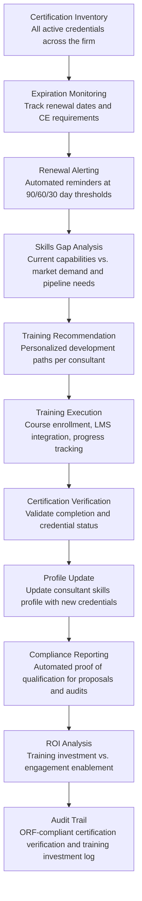

# Training & Certification Tracker

Frankmax

NAICS 541611-541519

> **Consulting Firms & System Integrators** — SI Operations Intelligence Module

## Objective & Purpose

Consulting firms and system integrators sell expertise -- but that expertise has a shelf life. Technology certifications expire (AWS, Azure, and GCP certifications require renewal every 2-3 years), methodology credentials need continuing education (PMP requires 60 PDUs per 3-year cycle, ITIL requires recertification), industry-specific knowledge becomes outdated as regulations and best practices evolve, and new technologies create demand for skills that did not exist 18 months ago. A mid-size firm with 300 consultants holds 1,500-3,000 active certifications, each with its own expiration date, renewal requirements, and continuing education obligations. Managing this manually -- typically through spreadsheets maintained by individual practice managers -- results in expired certifications (discovered when a client audits the team), missed continuing education deadlines (requiring full re-examination), and misaligned training investments (training for certifications the market no longer values while ignoring emerging ones).

The Training & Certification Tracker provides comprehensive professional development lifecycle management: certification inventory (every consultant's active certifications with expiration tracking), renewal management (automated reminders, continuing education progress tracking, renewal process initiation), skills gap analysis (comparing current firm capabilities against market demand and engagement requirements), training recommendation engine (personalized development paths based on career goals, firm needs, and market trends), and compliance reporting (automated proof of qualification for client proposals, audits, and regulatory requirements). The engine ensures the firm's expertise inventory never falls behind market demand.

Within the $3,000-$6,000/month Consulting Intelligence Pack, the Training & Certification Tracker maintains the firm's most valuable asset: the credibility of its consultants' expertise. A single expired certification discovered during a client audit can disqualify the firm from a multi-million-dollar engagement. A systematic skills gap leading to lost competitive positions in emerging technology areas can cost $5M-$20M in missed revenue over 2-3 years. The governance layer (certification verification, compliance reporting, training investment audit trail) attaches at near-100% because professional qualifications are contractually warranted in proposals and SOWs -- the firm must be able to prove its people hold the certifications it claims.

## Business Context

| Attribute | Value |
|---|---|
| **Business Process** | Professional development and certification lifecycle management |
| **Business Function** | HR/Learning |
| **Category** | HR |
| **Target Audience** | 12. Consulting Firms & System Integrators |
| **Bundle** | Consulting Intelligence Pack ($3,000-$6,000/mo) |
| **Monthly Cost of Inaction** | $10K-$30K (expired certifications, training misalignment, compliance risk) |

## BPMN Workflow

## Features

1. **Comprehensive Certification Inventory** — Maintains a firm-wide database of every consultant's professional credentials: technology certifications (AWS Solutions Architect, Azure Administrator, GCP Professional, Salesforce, SAP, Oracle, ServiceNow), methodology certifications (PMP, Agile/Scrum, ITIL, Six Sigma, TOGAF), industry credentials (CPA, CFA, CISSP, CISM, HIPAA), and academic qualifications (degrees, specialized training). Each certification record includes: issuing body, date earned, expiration date, renewal requirements, and verification URL/number.

2. **Proactive Renewal Management** — Tracks expiration dates for every certification and initiates renewal workflows at configurable lead times (typically 90, 60, and 30 days before expiration). For certifications requiring continuing education credits, the engine tracks progress against requirements: "PMP renewal requires 60 PDUs by March 2027. Jane has earned 42 PDUs with 11 months remaining. On track." For certifications at risk of lapsing, escalation alerts go to the consultant's manager and the staffing team.

3. **Demand-Driven Skills Gap Analyzer** — Compares the firm's current certification inventory against three demand signals: client proposal requirements (what certifications are clients requesting in RFPs?), engagement pipeline (what skills will upcoming projects need?), and market trends (what certifications are growing in market demand based on job posting analysis?). Identifies gaps: "Firm holds 12 active AWS Solutions Architect certifications but pipeline analysis shows need for 22 within 6 months."

4. **Personalized Development Paths** — Generates individual training recommendations balancing three factors: consultant career goals (what skills do they want to develop?), firm strategic needs (where does the firm need to build capability?), and market value (which certifications command the highest billing rate premiums?). Development paths include specific courses, estimated time investment, cost, and expected ROI (billing rate increase or engagement eligibility improvement).

5. **Training Investment Optimizer** — Analyzes the firm's training budget allocation against returns. Calculates per-certification ROI: cost of training and examination vs. incremental revenue enabled (higher billing rates, engagement qualification, proposal win rate improvement). Identifies: high-ROI certifications (cheap to obtain, significant revenue impact), low-ROI certifications (expensive to maintain, declining market value), and strategic investments (certifications that open new market segments).

6. **Compliance Reporting Engine** — Generates certification proof packages for: proposal submissions (listing team certifications that meet RFP requirements), client audits (verifying that assigned consultants hold claimed qualifications), regulatory compliance (industry-specific certification requirements for regulated work), and partner agreements (technology vendor partner status maintenance requiring minimum certification counts).

7. **Vendor Partner Status Tracker** — Many SI firms maintain partner status with technology vendors (Microsoft Gold Partner, AWS Advanced Consulting Partner, Salesforce Platinum Partner). These partnerships require maintaining minimum certification counts across specific credential types. The engine tracks partner status requirements, current certification counts against thresholds, and at-risk partnerships where the firm is approaching minimum thresholds due to certification expirations or consultant departures.

## Workflow & Automation

**Step 1: Baseline Inventory** — During onboarding, the engine imports the firm's existing certification data from HR systems, consultant self-reported profiles, and verification against issuing body databases. Each certification is validated for currency and added to the firm-wide inventory with expiration tracking activated.

**Step 2: Continuous Monitoring** — Daily, the engine checks for approaching expirations and continuing education progress. Renewal alerts are sent according to the configured lead-time schedule. Certifications that expire without renewal are flagged and removed from the active inventory, with notifications to the consultant, their manager, and the staffing team (since the consultant may no longer qualify for certain engagements).

**Step 3: Gap Analysis** — Monthly, the engine runs the skills gap analysis: comparing the active certification inventory against demand signals from proposals, pipeline, and market trends. Gap reports are distributed to practice leaders and the HR/learning team with recommended training investments.

**Step 4: Training Recommendation** — Personalized development paths are generated quarterly for each consultant, aligned with annual performance review cycles. Consultants review and discuss recommendations with their managers, selecting which certifications to pursue in the next quarter. Approved training is logged with budget allocation and expected completion dates.

**Step 5: Execution & Tracking** — As consultants begin training, the engine tracks progress: course enrollment (integrated with LMS platforms), study hour logging, practice exam scores, and examination scheduling. For certifications with continuing education requirements, CE credit accumulation is tracked against renewal deadlines.

**Step 6: Verification & Profile Update** — Upon certification completion, the engine verifies the new credential against the issuing body's registry and updates the consultant's profile. New certifications immediately become available for proposal staffing and engagement matching through the Resource-to-Engagement Matcher integration.

## Input/Output Specifications

| Direction | Data | Format | Description |
|---|---|---|---|
| Input | Consultant certification records | CSV / API (HRIS) | Current certifications with dates, numbers, and verification data |
| Input | Certification body registries | API / Web verification | Real-time certification status verification |
| Input | RFP certification requirements | JSON / API (from Proposal Engine) | Certifications requested in active and recent proposals |
| Input | Market demand signals | API / Web scrape | Certification mention frequency in job postings and RFPs |
| Input | Training course catalogs | API / CSV | Available courses, costs, duration, and delivery format |
| Output | Certification inventory dashboard | Web portal / API | Firm-wide certification status with expiration tracking |
| Output | Renewal alerts | Email / Slack / Dashboard | Proactive notifications at configured lead times |
| Output | Skills gap reports | PDF / Dashboard | Current vs. required certifications with training recommendations |
| Output | Compliance packages | PDF / JSON | Certification proof for proposals, audits, and partner status |
| Output | Audit trail | JSON (immutable log) | ORF-compliant certification verification and training investment log |

## Integration Points

| System | Integration Type | Data Flow |
|---|---|---|
| **Resource-to-Engagement Matcher** | Bidirectional | Certifications are key matching criteria; staffing needs drive certification priorities |
| **Proposal Generation Engine** | Bidirectional | Team certifications feed proposal content; RFP requirements feed gap analysis |
| **Engagement Scoping Optimizer** | Inbound requirements | Engagement skill requirements identify certification needs |
| **Implementation Risk Predictor** | Outbound data | Certification gaps on project teams as a risk factor |
| **Multi-Model AI Orchestrator** | Infrastructure | Routes gap analysis, recommendation, and verification tasks |
| **Audit Trail & Traceability Engine** | Outbound log stream | Complete certification verification and training audit trail |
| **LMS and Training Platforms** | Bidirectional API | Course enrollment and completion data exchange |

## Pricing & Revenue Model

| Component | Pricing | Notes |
|---|---|---|
| **Consulting Intelligence Pack** | $3,000-$6,000/month | Training Tracker + delivery tools + 2M AI tokens |
| **Standalone Subscription** | $800/month | Up to 200 consultant profiles, basic expiration tracking |
| **Enterprise tier** | $1,800/month | Unlimited profiles, gap analysis, ROI tracking |
| **Vendor partner status tracker** | +$300/month | Technology partner certification threshold monitoring |
| **Training investment optimizer** | +$400/month | Per-certification ROI analysis and budget allocation recommendations |
| **AI token consumption** | Included at 80% discount | 2M tokens/month in bundle; overage at marketplace rates |

**Revenue model**: The Training & Certification Tracker protects the firm's qualification to compete. A single expired certification that disqualifies the firm from a $5M engagement costs 250-500x the annual tool subscription. Systematically maintaining certifications prevents qualification gaps that competitors exploit. The governance layer (certification verification, compliance reporting, training investment audit trail) attaches at near-100% because professional qualifications are contractually warranted -- the firm legally represents that its people hold specific credentials. False certification claims create fraud liability. Target: 90%+ governance attachment.

## NAICS/SIC Mapping

| NAICS Code | SIC Code | Industry | Relevance |
|---|---|---|---|
| 541611 | 8742 | Administrative Management Consulting | Primary: management consulting professional development |
| 541512 | 7371 | Computer Systems Design Services | System integrator certification management |
| 541519 | 7379 | Other Computer Related Services | Technology consulting credential tracking |
| 541612 | 8742 | Human Resources Consulting | HR consulting professional qualifications |
| 611430 | 8243 | Professional and Management Development Training | Training providers supporting certification preparation |
