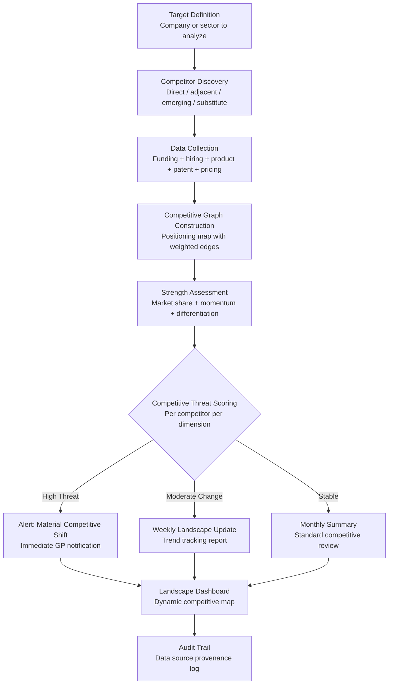

# Competitive Landscape Mapper

Frankmax

NAICS 523910-523999

> **Investors / VCs / Syndicates** — Research Module

## Objective & Purpose

Every investment thesis depends on competitive dynamics, yet most competitive analysis in venture capital is a static exercise: a 2x2 matrix in a pitch deck, a quick Google search before a partner meeting, or a brief section in an investment memo that is never updated. The problem is not awareness but bandwidth. Tracking competitive movements across dozens of portfolio companies and hundreds of prospective deals requires continuous monitoring that no analyst team can sustain manually. Competitors launch products, raise funding, hire key talent, file patents, and shift positioning daily -- and each change alters the investment calculus.

The Competitive Landscape Mapper provides continuous, AI-driven competitive intelligence for both deal evaluation and portfolio management. For prospective investments, it maps the full competitive landscape: direct competitors, adjacent players, potential entrants, and substitute solutions. For portfolio companies, it monitors competitive movements in real-time and alerts when material competitive shifts occur. The system synthesizes data from funding announcements, job postings, patent filings, product launches, pricing changes, customer reviews, and web traffic patterns into a dynamic competitive graph.

The compound value is the cross-portfolio competitive intelligence layer. When multiple portfolio companies operate in adjacent markets, the system identifies competitive overlaps, potential conflicts, and collaboration opportunities that are invisible when analyzing companies in isolation. Over time, the competitive graph becomes a proprietary market structure database that enhances every investment decision.

## Business Context

| Attribute | Value |
|---|---|
| **Business Process** | Market analysis and competitive intelligence |
| **Business Function** | Research |
| **Category** | Analytics |
| **Target Audience** | 13. Investors / VCs / Syndicates |
| **Bundle** | Custom VC/PE Intelligence Pack ($5,000-$10,000/mo) |
| **Monthly Cost of Inaction** | $50K-$200K (blind spot in deal evaluation and portfolio monitoring) |

## BPMN Workflow

## Features

1. **Automated Competitor Discovery** — Identifies competitors beyond the obvious: direct feature competitors, adjacent market players expanding into the space, large incumbents with relevant capabilities, and substitute solutions that address the same buyer pain. Discovery uses patent classification, job posting overlap, keyword co-occurrence, and customer review analysis.

2. **Multi-Signal Competitive Monitoring** — Tracks over 50 competitive signals per company: funding rounds, executive hires, job posting patterns, patent filings, product launches, pricing changes, partnership announcements, customer reviews, web traffic trends, app store rankings, and social media presence changes.

3. **Dynamic Positioning Maps** — Generates and maintains competitive positioning maps that update automatically as market conditions change. Maps can be configured across any two dimensions: price vs. capability, horizontal vs. vertical, SMB vs. enterprise, or custom axes relevant to the specific market.

4. **Competitive Momentum Scoring** — Computes a momentum score for each competitor based on rate of change across key metrics. A company with flat revenue but accelerating hiring, increasing patent filings, and growing web traffic has high momentum despite current financials.

5. **Portfolio Conflict Detection** — Identifies competitive overlaps across portfolio companies: shared target customers, overlapping product roadmaps, competing positioning claims, and talent poaching patterns. Flags conflicts early enough for GP intervention.

6. **Acquirer-Target Matching** — Cross-references the competitive landscape with potential acquirer profiles. Identifies which competitive movements suggest acquisition interest and which competitors are positioning themselves as acquisition targets.

7. **White Space Identification** — Analyzes competitive density across market segments to identify underserved areas. Maps where the competitive landscape is crowded (high risk for new entrants) and where gaps exist (opportunity zones for portfolio companies or new investments).

## Workflow & Automation

**Step 1: Landscape Initialization** — Define the target company or sector for competitive analysis. The system performs initial competitor discovery, identifying 20-100 relevant players depending on market maturity and scope.

**Step 2: Continuous Signal Collection** — Multi-source monitoring begins immediately: funding databases, job boards, patent offices, app stores, review platforms, news aggregators, and web analytics. Each signal is timestamped and attributed to its source.

**Step 3: Competitive Graph Updates** — New signals update the competitive graph: new entrants are added, positioning shifts are reflected, and strength assessments are recalculated. Material changes trigger alerts; incremental changes accumulate in trend reports.

**Step 4: Threat Assessment** — Weekly threat assessments evaluate which competitors pose increasing risk and which are weakening. Assessment considers funding momentum, product velocity, market share trajectory, and talent acquisition patterns.

**Step 5: Portfolio Cross-Reference** — Monthly cross-portfolio analysis identifies competitive dynamics between portfolio companies, shared competitive threats, and collaborative opportunities. Results are packaged for partner review.

**Step 6: Investment Decision Support** — Competitive landscape analysis is packaged as a component of deal evaluation (for new investments) and board preparation (for portfolio companies). Maps and reports are formatted for investment committee and board consumption.

## Input/Output Specifications

| Direction | Data | Format | Description |
|---|---|---|---|
| Input | Company identifiers | JSON / UI | Target companies and sectors for competitive analysis |
| Input | Funding data | API (Crunchbase / PitchBook) | Competitor funding history and investor network |
| Input | Job posting data | API (LinkedIn / Indeed) | Hiring patterns indicating strategic direction |
| Input | Product and pricing data | Web scraping / API | Feature sets, pricing tiers, positioning claims |
| Output | Competitive landscape maps | JSON + UI | Dynamic positioning visualizations with trend arrows |
| Output | Competitor profiles | PDF / Markdown | Detailed profiles with strength assessment and momentum scores |
| Output | Alert notifications | Email / Slack / API | Material competitive shift alerts |
| Output | Audit trail | JSON (immutable log) | Signal provenance and analysis methodology |

## Integration Points

| System | Integration Type | Data Flow |
|---|---|---|
| **Deal Flow Scoring Engine** | Outbound enrichment | Competitive density scores inform deal evaluation |
| **Portfolio Company Health Monitor** | Bidirectional | Portfolio data contextualizes competitive position; competitive threats inform health scores |
| **Exit Scenario Modeler** | Outbound reference | Competitive dynamics inform acquirer universe and exit timing |
| **Founder Assessment Engine** | Outbound context | Competitive landscape context for team evaluation |
| **Crunchbase / PitchBook** | Inbound API | Funding and company data |
| **LinkedIn / Indeed** | Inbound API | Hiring signal data |
| **Failure Intelligence Library** | Outbound anonymized | Competitive patterns feed cross-industry intelligence |

## Pricing & Revenue Model

| Component | Pricing | Notes |
|---|---|---|
| **VC/PE Intelligence Pack** | $5,000-$10,000/month | Includes Competitive Mapper + Deal Flow + Portfolio Health |
| **Standalone — Single Sector** | $2,000/month | One sector, up to 50 companies monitored |
| **Standalone — Multi-Sector** | $4,500/month | Multiple sectors, up to 200 companies, portfolio cross-reference |
| **Institutional** | Custom pricing | Unlimited scope, custom taxonomies, API access |
| **Governance add-on** | +$800/month | IC-auditable competitive methodology, compliance export |

**Revenue model**: Competitive Landscape Mapper provides the market context that every investment decision requires. The compound value of the competitive graph increases with every company monitored, creating a proprietary market structure database. The "fries" attach through portfolio conflict detection, custom taxonomy development, and cross-fund competitive benchmarking at 75-85% margin.

## NAICS/SIC Mapping

| NAICS Code | SIC Code | Industry | Relevance |
|---|---|---|---|
| 523910 | 6726 | Miscellaneous Financial Investment Activities | VC/PE competitive due diligence |
| 523920 | 6199 | Portfolio Management and Investment Advice | Investment research and market analysis |
| 523999 | 6199 | Miscellaneous Financial Investment Activities | Syndicate competitive intelligence sharing |
| 525910 | 6726 | Open-End Investment Funds | Fund-level competitive landscape tracking |
| 541910 | 7323 | Marketing Research and Public Opinion Polling | Market research and competitive analysis |
| 519130 | 7375 | Internet Publishing and Broadcasting | Digital competitive signal monitoring |
