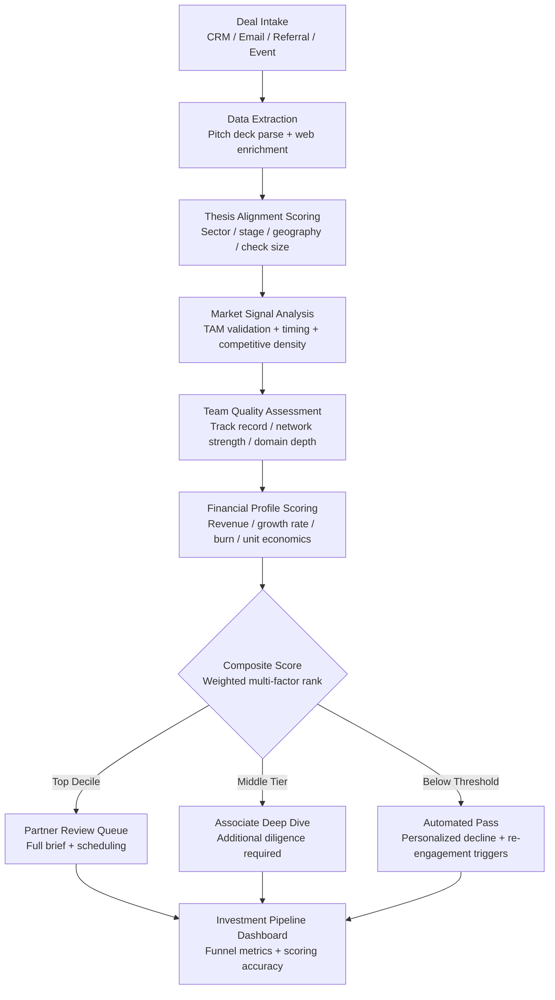

# Deal Flow Scoring Engine

Frankmax

NAICS 523910-523999

> **Investors / VCs / Syndicates** — Deal Sourcing Module

## Objective & Purpose

Venture capital and private equity firms review thousands of inbound deals annually, yet data consistently shows that fewer than 1% result in a term sheet. The challenge is not volume -- it is signal extraction. Partners spend 60-80% of their sourcing time on deals that will never progress past initial screening. Meanwhile, the best opportunities often arrive through weak-signal channels (warm intros, founder referrals, co-investor tips) and get buried in the same inbox as cold pitches. The cost of a missed outlier deal dwarfs the cost of any screening tool by orders of magnitude.

The Deal Flow Scoring Engine applies multi-dimensional AI scoring across every inbound opportunity, combining thesis alignment, market timing, team quality, financial profile, and competitive landscape into a single composite deal score. The system ingests data from CRM pipelines, pitch decks, data rooms, and external market signals to produce a ranked, filterable deal queue with full scoring transparency. Every scoring dimension is configurable to the fund's specific thesis, stage focus, and sector preferences.

This tool eliminates the two most expensive failure modes in deal sourcing: false positives (spending partner time on non-viable deals) and false negatives (missing high-potential deals that did not pattern-match on surface criteria). The scoring engine continuously learns from the fund's own investment decisions -- deals that advanced, deals that were passed, and portfolio outcomes -- creating a proprietary scoring model that compounds in accuracy with every investment cycle.

## Business Context

| Attribute | Value |
|---|---|
| **Business Process** | Investment sourcing and screening |
| **Business Function** | Deal Sourcing |
| **Category** | Analytics |
| **Target Audience** | 13. Investors / VCs / Syndicates |
| **Bundle** | Custom VC/PE Intelligence Pack ($5,000-$10,000/mo) |
| **Monthly Cost of Inaction** | $50K-$250K (missed deals + partner time waste) |

## BPMN Workflow

## Features

1. **Multi-Source Deal Ingestion** — Automatically captures inbound deals from CRM systems (Affinity, DealCloud, Salesforce), email (pitch deck attachments), referral tracking platforms, and event pipelines. Normalizes all deal data into a standardized opportunity profile within minutes of receipt.

2. **Thesis Alignment Engine** — Configurable scoring across fund-specific dimensions: target sectors, preferred stages (pre-seed through growth), geographic focus, check size range, and co-investor preferences. Each dimension carries adjustable weight, allowing the scoring model to reflect the fund's actual investment thesis rather than generic criteria.

3. **Market Timing Signal Layer** — Analyzes macro and micro market signals relevant to each deal: sector funding velocity, public market comparables, regulatory tailwinds or headwinds, and technology adoption curves. Flags deals where market timing is either optimal or deteriorating.

4. **Automated Pitch Deck Analysis** — Extracts structured data from pitch decks using document intelligence: team bios, financial projections, market sizing claims, competitive positioning, and go-to-market strategy. Cross-references claims against external data sources for validation.

5. **Founder and Team Scoring** — Evaluates founding team quality across measurable dimensions: prior exit history, domain expertise duration, network connectivity (LinkedIn, co-investor graph), technical depth, and team composition balance. Produces a team score independent of the deal itself.

6. **Pattern Learning from Fund History** — Trains on the fund's own deal history: which scored deals advanced, which were passed, and which portfolio companies outperformed. The model adapts scoring weights based on demonstrated fund preferences and outcome data.

7. **Automated Pass with Re-engagement** — Deals scoring below threshold receive personalized, partner-branded decline communications. The system tracks passed deals and re-surfaces them if scoring inputs change materially (new funding round, team addition, market shift).

8. **Pipeline Analytics Dashboard** — Real-time visibility into deal funnel metrics: deals reviewed per week, average time-to-decision, conversion rates by source channel, scoring accuracy (predicted vs. actual advancement), and partner workload distribution.

## Workflow & Automation

**Step 1: Deal Capture** — New opportunities enter the system from connected sources: CRM entries, forwarded emails with pitch decks, referral links, and event follow-up forms. Each deal is assigned a unique identifier and enters the scoring pipeline immediately.

**Step 2: Data Enrichment** — The system extracts structured data from pitch materials and enriches it with external signals: Crunchbase funding history, LinkedIn team profiles, web traffic trends, patent filings, and news mentions. Enrichment completes within 15 minutes.

**Step 3: Multi-Dimensional Scoring** — Each deal is scored across 6-10 configurable dimensions with fund-specific weights. Scores are transparent -- every dimension shows its input data, scoring logic, and contribution to the composite score.

**Step 4: Ranking and Routing** — Scored deals are ranked and automatically routed: top-decile deals go to partner review queues with full briefing packages, mid-tier deals go to associate deep-dive lists, and below-threshold deals enter the automated pass workflow.

**Step 5: Partner Review and Feedback** — Partners review scored deals and provide disposition feedback (advance / pass / hold). Every decision is captured and fed back into the scoring model for continuous calibration.

**Step 6: Pipeline Reporting** — Weekly and monthly pipeline reports are generated automatically: deal volume by source, scoring distribution, conversion funnel, and time-to-decision metrics. Reports are formatted for LP updates and partner meetings.

## Input/Output Specifications

| Direction | Data | Format | Description |
|---|---|---|---|
| Input | Pitch decks and executive summaries | PDF / PPTX / Google Slides | Primary deal materials for data extraction |
| Input | CRM deal records | API (Affinity / DealCloud / SFDC) | Pipeline stage, notes, contact history |
| Input | Market data signals | REST API / CSV | Sector funding velocity, public comps, news feeds |
| Input | Fund investment history | CSV / API | Historical deals, outcomes, partner preferences |
| Output | Scored deal queue | JSON + UI dashboard | Ranked deals with composite and dimensional scores |
| Output | Deal briefing packages | PDF / Markdown | Partner-ready summaries for top-scored opportunities |
| Output | Pipeline analytics | REST API / UI | Funnel metrics, conversion rates, scoring accuracy |
| Output | Audit trail | JSON (immutable log) | Scoring rationale, decision history, model updates |

## Integration Points

| System | Integration Type | Data Flow |
|---|---|---|
| **Portfolio Company Health Monitor** | Outbound reference | Historical portfolio data informs scoring calibration |
| **Competitive Landscape Mapper** | Inbound enrichment | Market and competitive data feeds deal scoring |
| **Founder Assessment Engine** | Bidirectional | Team scores contribute to deal score; deal context enriches team assessment |
| **Term Sheet Analyzer** | Downstream trigger | Top-scored deals advance to term sheet analysis workflow |
| **Affinity / DealCloud / Salesforce** | Bidirectional API | Deal records in; scores and dispositions out |
| **Crunchbase / PitchBook** | Inbound API | Funding history, valuation comps, investor network data |
| **Failure Intelligence Library** | Outbound anonymized | Scoring patterns and miss rates feed cross-fund intelligence |

## Pricing & Revenue Model

| Component | Pricing | Notes |
|---|---|---|
| **VC/PE Intelligence Pack** | $5,000-$10,000/month | Includes Deal Flow Scoring + Portfolio Health + Exit Modeler |
| **Standalone — Emerging Fund** | $3,500/month | Up to 500 deals/quarter scored |
| **Standalone — Growth Fund** | $7,500/month | Up to 2,000 deals/quarter, custom thesis models |
| **Mega Fund / PE** | Custom pricing | Dedicated instance, multi-fund support, API access |
| **Governance add-on** | +$1,500/month | LP-auditable scoring rationale, compliance export |

**Revenue model**: Deal Flow Scoring is the entry point for VC/PE intelligence. The immediate value proposition is partner time recovery -- a single partner hour costs $500-$1,000 in opportunity cost. Reducing screening time by 60% across 10+ partners generates immediate, measurable ROI. The "fries" attach through governance and compliance layers: LP-auditable scoring trails, regulatory documentation, and cross-fund benchmarking at 75-90% margin.

## NAICS/SIC Mapping

| NAICS Code | SIC Code | Industry | Relevance |
|---|---|---|---|
| 523910 | 6726 | Miscellaneous Financial Investment Activities | VC/PE fund deal sourcing and screening |
| 523920 | 6199 | Portfolio Management and Investment Advice | Investment advisory deal evaluation |
| 523991 | 6726 | Trust, Fiduciary, and Custody Activities | Fiduciary investment screening |
| 523999 | 6199 | Miscellaneous Financial Investment Activities | Syndicate and angel deal coordination |
| 525910 | 6726 | Open-End Investment Funds | Fund-level deal pipeline management |
| 541611 | 7371 | Administrative Management Consulting | Investment strategy consulting integration |
