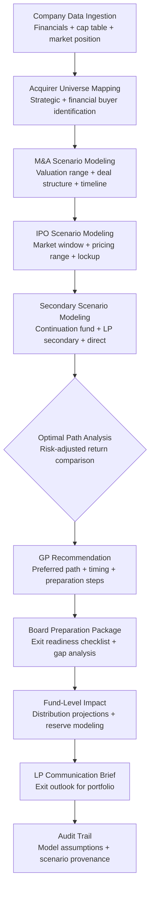

# Exit Scenario Modeler

Frankmax

NAICS 523910-523999

> **Investors / VCs / Syndicates** — Investment Strategy Module

## Objective & Purpose

Exit planning is where fund returns are made or lost. A portfolio company can grow 20x in value, but if the exit is mistimed, mispriced, or misstructured, investors capture a fraction of the value created. Most VCs treat exits reactively -- waiting for inbound acquisition interest or following the IPO market window -- rather than systematically modeling and optimizing exit paths years in advance. The result: suboptimal exit timing, missed acquirer matches, and liquidation preferences that erode returns at the worst possible moment.

The Exit Scenario Modeler provides forward-looking exit analysis for every portfolio company across three primary paths: M&A (strategic and financial acquirers), IPO (traditional and direct listing), and secondary sale (LP secondaries and continuation vehicles). For each path, the system models expected valuation ranges, probability-weighted returns, timeline estimates, and structural considerations (liquidation preferences, anti-dilution provisions, drag-along triggers). Models update continuously as company performance, market conditions, and acquirer landscape change.

The strategic value lies in converting exit planning from an episodic, intuition-driven process into a continuous, data-driven discipline. By modeling exit scenarios at every board meeting cadence, GPs can make earlier, better-informed decisions about follow-on investment, board composition, strategic positioning, and timing. For fund-level portfolio construction, exit models inform reserve management, distribution projections, and LP return expectations.

## Business Context

| Attribute | Value |
|---|---|
| **Business Process** | Exit planning and optimization |
| **Business Function** | Investment Strategy |
| **Category** | Planning |
| **Target Audience** | 13. Investors / VCs / Syndicates |
| **Bundle** | Custom VC/PE Intelligence Pack ($5,000-$10,000/mo) |
| **Monthly Cost of Inaction** | $200K-$2M (suboptimal exit timing and structuring) |

## BPMN Workflow

## Features

1. **Multi-Path Exit Modeling** — Simultaneously models M&A (strategic acquisition, financial buyout, acqui-hire), IPO (traditional underwritten, direct listing, SPAC), and secondary (LP secondary, continuation vehicle, direct secondary) paths with probability-weighted expected returns for each.

2. **Dynamic Acquirer Universe** — Maintains a continuously updated map of potential acquirers for each portfolio company based on strategic fit, acquisition history, balance sheet capacity, and market positioning. Tracks acquirer activity signals: hiring in relevant domains, partnership announcements, and public statements about M&A appetite.

3. **Cap Table Waterfall Simulation** — Models exit proceeds distribution across the full cap table: liquidation preferences (participating vs. non-participating), anti-dilution adjustments, option pool allocation, and warrant exercise. Shows GP carry and LP distributions at every exit valuation.

4. **Market Window Analysis** — Identifies optimal timing windows for each exit path based on market conditions: IPO window openness (filing volume, pricing performance, sector appetite), M&A cycle position, and secondary market liquidity. Integrates with Market Timing Analyzer data.

5. **Exit Readiness Scoring** — Evaluates each portfolio company's exit readiness across operational, financial, legal, and governance dimensions. Identifies gaps that must be closed before pursuing each exit path: audited financials for IPO, clean IP ownership for M&A, governance maturity for public company transition.

6. **Comparable Transaction Analysis** — Analyzes relevant precedent transactions: M&A multiples by sector and size, IPO pricing relative to private rounds, and secondary discount/premium trends. Comparable sets are curated automatically and updated as new transactions close.

7. **Fund-Level Distribution Modeling** — Aggregates exit models across the portfolio to project fund-level distributions, DPI trajectory, and carry timing. Enables GP planning for recycling provisions, reserve allocation, and LP distribution scheduling.

## Workflow & Automation

**Step 1: Portfolio Company Profiling** — Each company is profiled for exit modeling: financial performance, growth trajectory, market position, cap table structure, and governance readiness. Profiles update automatically as new data flows from the Portfolio Company Health Monitor.

**Step 2: Acquirer and Market Mapping** — The system builds and maintains an acquirer universe for each company and monitors market conditions relevant to each exit path. Mapping updates weekly with new transaction data and market signal changes.

**Step 3: Scenario Generation** — Exit scenarios are generated for each viable path with probability distributions on valuation, timing, and structural terms. Scenarios incorporate cap table waterfall analysis to show actual dollar returns to each stakeholder.

**Step 4: Optimization Analysis** — The system compares scenarios on a risk-adjusted basis, considering not just expected return but also probability of completion, time to close, execution risk, and impact on GP reputation and LP relationships.

**Step 5: Board and GP Briefing** — Exit analysis is packaged into board-ready presentations with scenario comparisons, readiness gaps, and recommended next steps. Updated before each board meeting with current market data.

**Step 6: Fund-Level Aggregation** — Individual company exit models roll up into fund-level projections: anticipated distribution schedule, DPI trajectory, carry timing, and reserve requirements. LP communication materials are updated accordingly.

## Input/Output Specifications

| Direction | Data | Format | Description |
|---|---|---|---|
| Input | Company financials | API / CSV | Revenue, growth, margins, unit economics |
| Input | Cap table data | API (Carta / Pulley) | Full cap table with preferences, options, warrants |
| Input | M&A transaction data | API (PitchBook / Capital IQ) | Comparable transactions, multiples, deal terms |
| Input | IPO market data | API / CSV | Filing pipeline, pricing performance, sector appetite |
| Output | Exit scenario models | JSON + PDF | Multi-path scenarios with probability-weighted returns |
| Output | Waterfall analysis | XLSX / PDF | Proceeds distribution across cap table at each valuation |
| Output | Fund distribution projections | JSON + UI | Portfolio-level DPI trajectory and distribution schedule |
| Output | Audit trail | JSON (immutable log) | Model assumptions, data sources, scenario provenance |

## Integration Points

| System | Integration Type | Data Flow |
|---|---|---|
| **Portfolio Company Health Monitor** | Inbound feed | Company performance data drives exit readiness scoring |
| **Market Timing Analyzer** | Inbound enrichment | Market conditions inform exit window analysis |
| **LP Reporting Automator** | Outbound feed | Exit outlook included in LP quarterly reports |
| **Fund Performance Attribution** | Bidirectional | Exit outcomes calibrate attribution; attribution informs exit priorities |
| **Term Sheet Analyzer** | Outbound reference | Exit scenarios inform deal structuring for new investments |
| **Carta / Pulley** | Inbound API | Cap table data for waterfall modeling |
| **PitchBook / Capital IQ** | Inbound API | Comparable transaction and market data |

## Pricing & Revenue Model

| Component | Pricing | Notes |
|---|---|---|
| **VC/PE Intelligence Pack** | $5,000-$10,000/month | Includes Exit Modeler + Deal Flow + Portfolio Health |
| **Standalone — Single Fund** | $3,500/month | Up to 20 portfolio companies modeled |
| **Standalone — Multi-Fund** | $7,000/month | Unlimited companies, cross-fund optimization |
| **PE / Growth Equity** | Custom pricing | Complex waterfall modeling, LBO integration |
| **Governance add-on** | +$1,200/month | LP-auditable exit methodology, compliance export |

**Revenue model**: Exit Scenario Modeler targets the moment of maximum value in the fund lifecycle. The difference between a well-timed, well-structured exit and a reactive one can exceed 2-3x in return difference per company. The "fries" attach through governance (LP-auditable exit methodology), complex waterfall computations, and cross-portfolio optimization at 80-90% margin.

## NAICS/SIC Mapping

| NAICS Code | SIC Code | Industry | Relevance |
|---|---|---|---|
| 523910 | 6726 | Miscellaneous Financial Investment Activities | VC/PE exit planning |
| 523920 | 6199 | Portfolio Management and Investment Advice | Exit advisory and optimization |
| 523991 | 6726 | Trust, Fiduciary, and Custody Activities | Fiduciary exit obligations |
| 523999 | 6199 | Miscellaneous Financial Investment Activities | Syndicate exit coordination |
| 525910 | 6726 | Open-End Investment Funds | Fund distribution planning |
| 523110 | 6211 | Investment Banking and Securities Dealing | M&A and IPO execution support |
