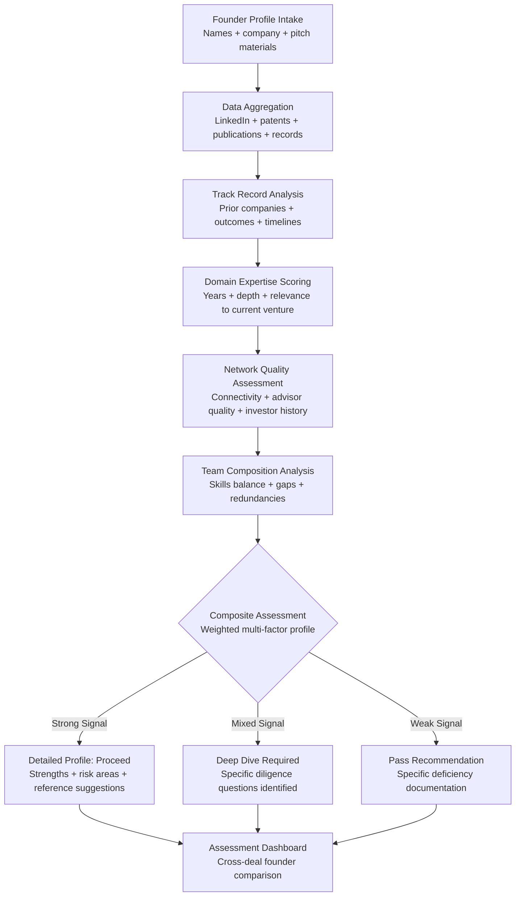

# Founder Assessment Engine

Frankmax

NAICS 523910-523999

> **Investors / VCs / Syndicates** — Due Diligence Module

## Objective & Purpose

The single greatest predictor of startup success is team quality, yet founder evaluation remains the most subjective element of the investment process. Partners rely on pattern matching from personal experience: "reminds me of a founder I backed before" or "good energy in the room." This leads to well-documented biases -- toward founders from elite schools, from known networks, who match demographic patterns of prior successes, and who are skilled at narrative presentation rather than execution. The result: systematically undervaluing non-obvious founders while overvaluing polished presenters.

The Founder Assessment Engine provides structured, data-driven evaluation of founding teams across measurable dimensions: prior exit history and outcomes, domain expertise depth and duration, network quality and connectivity, technical capability, team composition balance, leadership style indicators, and execution track record. The system aggregates data from public records, professional networks, publication history, patent filings, and reference networks to build a comprehensive founder profile that complements (not replaces) partner judgment.

The tool explicitly addresses bias by separating signal from noise. It does not evaluate presentation quality, school pedigree, or demographic characteristics. It measures what founders have done, what they know, who they know, and how their team is composed relative to the specific challenge they are pursuing. Over time, the system calibrates against actual portfolio outcomes, learning which founder attributes correlate with success in specific sectors and stages.

## Business Context

| Attribute | Value |
|---|---|
| **Business Process** | Team evaluation and due diligence |
| **Business Function** | Due Diligence |
| **Category** | HR/Analytics |
| **Target Audience** | 13. Investors / VCs / Syndicates |
| **Bundle** | Custom VC/PE Intelligence Pack ($5,000-$10,000/mo) |
| **Monthly Cost of Inaction** | $100K-$500K (bad team bets + missed non-obvious founders) |

## BPMN Workflow

## Features

1. **Multi-Source Profile Construction** — Aggregates founder data from LinkedIn professional history, Crunchbase funding records, patent databases (USPTO, EPO), academic publications, media mentions, corporate filings, and social network graphs. Constructs a comprehensive profile without requiring founder cooperation.

2. **Track Record Quantification** — Analyzes prior company outcomes: revenue achieved, funding raised, exit value, time to key milestones, team retention rates, and post-exit reputation. Distinguishes between founders who drove outcomes and those who participated in outcomes driven by others.

3. **Domain Expertise Depth Scoring** — Measures how deeply a founder knows their target domain: years of direct experience, publication depth, patent portfolio, industry role history, and professional network composition. Scores domain expertise against the specific challenges of the current venture, not in the abstract.

4. **Network Quality and Accessibility** — Maps the founder's professional network for quality (who they know), diversity (breadth of domains), and accessibility (active vs. dormant connections). Evaluates advisor and board member quality for existing portfolio companies. Assesses investor network depth for future fundraising.

5. **Team Composition Gap Analysis** — Evaluates the founding team as a unit: coverage of critical functions (technical, commercial, operational), skill overlap and redundancy, seniority balance, and working history together. Identifies specific skill gaps that will need to be filled through early hires.

6. **Bias Mitigation Framework** — Explicitly excludes non-predictive variables: educational institution prestige, age, gender, ethnicity, accent, and presentation style. Scoring is based solely on measurable attributes with demonstrated correlation to startup outcomes.

7. **Reference Network Mapping** — Identifies the optimal reference network: former co-workers, former investors, former employees, and industry contacts who can provide informed perspectives. Prioritizes references by relevance and objectivity, flagging potential biases in reference relationships.

8. **Outcome Calibration** — Continuously calibrates assessment weights against actual portfolio outcomes. When assessed founders succeed or fail, the system adjusts which attributes matter most in which contexts, building a proprietary founder success model.

## Workflow & Automation

**Step 1: Profile Initialization** — Enter founder names and company context. The system begins automated data collection from all connected sources within minutes. Initial profiles are available within 2-4 hours.

**Step 2: Data Enrichment** — Automated enrichment continues for 24-48 hours, pulling deeper data: patent details, publication analysis, corporate filing review, and extended network mapping. Each data point is sourced and timestamped.

**Step 3: Multi-Dimensional Scoring** — Founders are scored across each assessment dimension with transparent methodology. Every score shows its input data, scoring logic, and confidence level. Dimensions are weighted based on the specific sector and stage of the investment.

**Step 4: Team-Level Assessment** — Individual founder profiles are combined into a team-level assessment: collective strengths, aggregate gaps, complementarity analysis, and collaboration indicators (prior working relationships, shared professional history).

**Step 5: Comparative Analysis** — The current founding team is compared against the fund's historical assessments and outcomes. Similar founder profiles from past deals (both successful and unsuccessful) are surfaced as reference points.

**Step 6: Diligence Question Generation** — Based on the assessment, the system generates specific diligence questions to explore identified strengths and risk areas. Questions are designed to be asked in partner meetings or reference calls.

## Input/Output Specifications

| Direction | Data | Format | Description |
|---|---|---|---|
| Input | Founder names and company | JSON / UI | Target individuals and venture context |
| Input | Pitch materials | PDF / PPTX | Team section extraction for cross-reference |
| Input | Professional network data | API (LinkedIn) | Work history, connections, endorsements |
| Input | Patent and publication data | API (USPTO / Google Scholar) | IP portfolio and research depth |
| Output | Founder profiles | JSON + PDF | Multi-dimensional assessment with transparency |
| Output | Team composition report | PDF / Markdown | Gap analysis, complementarity, and risk areas |
| Output | Diligence question set | Markdown / PDF | Targeted questions for partner meetings and references |
| Output | Audit trail | JSON (immutable log) | Data sources, scoring methodology, bias safeguards |

## Integration Points

| System | Integration Type | Data Flow |
|---|---|---|
| **Deal Flow Scoring Engine** | Bidirectional | Team scores feed deal scoring; deal context enriches team assessment |
| **Portfolio Company Health Monitor** | Outbound reference | Founder assessment quality correlated with portfolio outcomes |
| **Competitive Landscape Mapper** | Inbound context | Competitive intensity informs team capability requirements |
| **Term Sheet Analyzer** | Outbound reference | Founder assessment informs governance provision recommendations |
| **LinkedIn** | Inbound API | Professional history and network data |
| **USPTO / Google Scholar** | Inbound API | Patent and publication records |
| **Failure Intelligence Library** | Outbound anonymized | Founder patterns feed cross-fund assessment intelligence |

## Pricing & Revenue Model

| Component | Pricing | Notes |
|---|---|---|
| **VC/PE Intelligence Pack** | $5,000-$10,000/month | Includes Founder Assessment + Deal Flow + Portfolio Health |
| **Standalone — Per Assessment** | $500/assessment | Individual founder deep-dive profiles |
| **Standalone — Unlimited** | $3,000/month | Unlimited assessments, historical calibration |
| **Institutional** | Custom pricing | Custom scoring models, API access, bulk processing |
| **Governance add-on** | +$800/month | Bias audit trail, LP-auditable methodology |

**Revenue model**: Founder Assessment Engine addresses the highest-leverage decision in venture: team evaluation. A single avoided bad team bet saves $1M-$10M in invested capital. The "fries" attach through bias mitigation frameworks (increasingly required by LP ESG mandates), outcome calibration (proprietary model), and cross-fund benchmarking at 80-90% margin.

## NAICS/SIC Mapping

| NAICS Code | SIC Code | Industry | Relevance |
|---|---|---|---|
| 523910 | 6726 | Miscellaneous Financial Investment Activities | VC/PE founder due diligence |
| 523920 | 6199 | Portfolio Management and Investment Advice | Investment advisory team evaluation |
| 523999 | 6199 | Miscellaneous Financial Investment Activities | Syndicate co-investment team assessment |
| 525910 | 6726 | Open-End Investment Funds | Fund-level diligence standards |
| 541612 | 7361 | Human Resources Consulting Services | Executive assessment methodology |
| 541720 | 8732 | Research and Development in Social Sciences | Behavioral and performance research |
