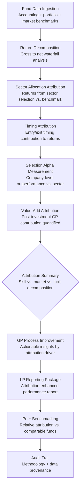

# Fund Performance Attribution

Frankmax

NAICS 523910-523999

> **Investors / VCs / Syndicates** — Fund Management Module

## Objective & Purpose

Fund returns are a single number that obscures the most important question: why did the fund perform the way it did? Was outperformance driven by sector selection, entry timing, deal sourcing quality, post-investment support, or exit execution? Was underperformance caused by market headwinds, concentrated losses, poor follow-on decisions, or governance failures? Without rigorous attribution, GPs cannot improve their process, LPs cannot distinguish skill from luck, and the industry lacks the feedback loops necessary for systematic performance improvement.

The Fund Performance Attribution engine decomposes fund returns into their constituent drivers: sector allocation effect, timing effect, deal selection alpha, follow-on capital deployment, value-add contribution, and exit execution quality. Each component is measured against appropriate benchmarks -- public market equivalents for overall performance, sector indices for allocation, and peer fund data for relative positioning. The system provides the analytical rigor that transforms fund management from an art into a measurable, improvable discipline.

The strategic value extends beyond individual fund analysis. Cross-fund attribution reveals which capabilities drive persistent alpha and which outcomes are attributable to market conditions. For LPs evaluating re-ups and new commitments, attribution data provides the evidence base for allocation decisions. For GPs, it identifies which parts of the investment process to double down on and which to restructure.

## Business Context

| Attribute | Value |
|---|---|
| **Business Process** | Performance analytics and fund management |
| **Business Function** | Fund Management |
| **Category** | Finance |
| **Target Audience** | 13. Investors / VCs / Syndicates |
| **Bundle** | Custom VC/PE Intelligence Pack ($5,000-$10,000/mo) |
| **Monthly Cost of Inaction** | $50K-$200K (inability to improve process or justify LP re-ups) |

## BPMN Workflow

## Features

1. **Multi-Level Return Decomposition** — Decomposes returns from gross fund level down to individual deal level. Shows the waterfall from gross returns through management fees, carried interest, and fund expenses to net LP returns. Each level reveals different attribution insights.

2. **Sector Allocation Effect** — Measures the return contribution from sector selection decisions. Isolates whether the fund's sector weights (overweight AI, underweight consumer, etc.) added or subtracted value relative to a diversified benchmark. Separates intentional thesis-driven allocation from opportunistic deal flow.

3. **Entry Timing Attribution** — Quantifies the return impact of when capital was deployed within each sector cycle. Compares actual deployment timing against hypothetical scenarios: investing at sector average entry multiples, investing at the start of the fund, or dollar-cost averaging. Reveals whether timing skill exists or returns are driven by market beta.

4. **Selection Alpha Isolation** — Measures company-level outperformance relative to sector peers. A company returning 10x in a sector where the median return is 8x has 2x of selection alpha; in a sector where the median is 15x, it has negative selection alpha. Isolates GP skill in picking winners within chosen sectors.

5. **Follow-On Capital Analysis** — Evaluates the return on follow-on investment decisions: did additional capital deployed in existing portfolio companies generate positive incremental returns, or did it dilute fund performance? Separates signal-following from loss-chasing.

6. **Value-Add Contribution Scoring** — Attempts to quantify the GP's post-investment contribution: board involvement correlation with performance, operational support impact, hiring assistance effectiveness, and customer introduction value. Uses counterfactual analysis where possible.

7. **Peer Fund Benchmarking** — Compares attribution components against peer funds of similar vintage, stage, and sector focus. Identifies whether the GP's strengths and weaknesses are unique or shared across the peer group. Uses anonymized benchmark data from the marketplace's cross-fund dataset.

## Workflow & Automation

**Step 1: Fund Data Integration** — Connect fund accounting systems, portfolio valuation data, and benchmark indices. Historical data is ingested to enable full-lifecycle attribution from fund inception.

**Step 2: Return Waterfall Construction** — Build the complete return waterfall from gross portfolio returns through fees, carry, and expenses to net LP returns. Identify the largest return drag categories and compare fee structure impact against peer benchmarks.

**Step 3: Attribution Model Execution** — Run attribution models across all dimensions: sector allocation, timing, selection, follow-on, and value-add. Each model uses appropriate benchmarks and produces confidence intervals reflecting data quality and methodology limitations.

**Step 4: Cross-Dimension Analysis** — Analyze interactions between attribution dimensions: do timing and selection effects correlate, or are they independent? Is strong selection alpha in some sectors offset by poor timing in others? Identify the GP's true competitive advantages.

**Step 5: Longitudinal Trend Analysis** — Compare attribution across fund vintages for established GPs. Identify persistent capabilities (selection alpha that repeats across funds) vs. one-time factors (a single large exit driving an entire fund's returns).

**Step 6: Report Generation** — Generate attribution reports formatted for multiple audiences: GP internal review (detailed, process-focused), LP quarterly updates (summary with key drivers), and fundraising materials (persistent alpha evidence). All reports include methodology transparency.

## Input/Output Specifications

| Direction | Data | Format | Description |
|---|---|---|---|
| Input | Fund accounting data | API (Allvue / Investran / eFront) | Capital calls, distributions, NAV, fees, carry |
| Input | Portfolio valuations | JSON / CSV | Company-level fair values with methodology |
| Input | Benchmark indices | API (Cambridge / Preqin / Bloomberg) | Public market equivalents and peer fund data |
| Input | Deal-level data | JSON / CSV | Entry/exit dates, valuations, sector classifications |
| Output | Attribution report | PDF / JSON | Multi-dimensional return decomposition |
| Output | Performance dashboard | REST API / UI | Interactive attribution exploration with drill-down |
| Output | Peer benchmarking | PDF / UI | Relative positioning across attribution dimensions |
| Output | Audit trail | JSON (immutable log) | Methodology, benchmark selection, data provenance |

## Integration Points

| System | Integration Type | Data Flow |
|---|---|---|
| **Portfolio Company Health Monitor** | Inbound feed | Company performance data drives return attribution |
| **LP Reporting Automator** | Outbound feed | Attribution analysis enhances LP quarterly reports |
| **Exit Scenario Modeler** | Inbound reference | Exit outcomes are the terminal data points for attribution |
| **Market Timing Analyzer** | Inbound benchmarks | Market cycle data provides timing attribution context |
| **Deal Flow Scoring Engine** | Outbound calibration | Attribution results calibrate deal scoring model accuracy |
| **Allvue / Investran / eFront** | Inbound API | Fund accounting data |
| **Cambridge Associates / Preqin** | Inbound API | Peer benchmark data |

## Pricing & Revenue Model

| Component | Pricing | Notes |
|---|---|---|
| **VC/PE Intelligence Pack** | $5,000-$10,000/month | Includes Fund Attribution + Deal Flow + Portfolio Health |
| **Standalone — Single Fund** | $3,000/month | One fund with full attribution analysis |
| **Standalone — Multi-Fund GP** | $6,000/month | Cross-fund attribution, persistent alpha analysis |
| **LP / Fund-of-Funds** | Custom pricing | Multi-GP attribution comparison, allocation support |
| **Governance add-on** | +$1,000/month | LP-auditable methodology, GIPS-aligned reporting |

**Revenue model**: Fund Performance Attribution serves both GPs (process improvement) and LPs (allocation decisions), creating a two-sided revenue opportunity. The "fries" attach through peer benchmarking access (requires anonymized cross-fund data), GIPS-aligned reporting compliance, and persistent alpha analysis across fund vintages at 80-90% margin.

## NAICS/SIC Mapping

| NAICS Code | SIC Code | Industry | Relevance |
|---|---|---|---|
| 523910 | 6726 | Miscellaneous Financial Investment Activities | VC/PE fund performance analysis |
| 523920 | 6199 | Portfolio Management and Investment Advice | Investment performance advisory |
| 523991 | 6726 | Trust, Fiduciary, and Custody Activities | Fiduciary performance reporting |
| 525910 | 6726 | Open-End Investment Funds | Fund-level performance attribution |
| 541211 | 8721 | Offices of Certified Public Accountants | Fund accounting and audit support |
| 541219 | 8721 | Other Accounting Services | Performance measurement services |
