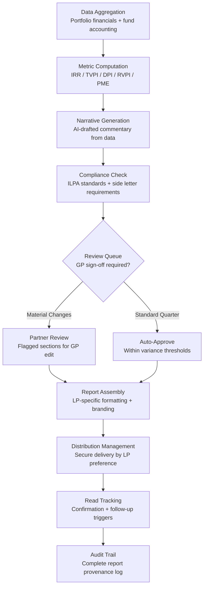

# LP Reporting Automator

Frankmax

NAICS 523910-523999

> **Investors / VCs / Syndicates** — Fund Operations Module

## Objective & Purpose

LP reporting is the most time-consuming administrative burden in fund management. A typical quarterly LP report requires 40-80 hours of work across the investment team, finance, and operations: gathering data from portfolio companies, reconciling financials, computing fund-level metrics (IRR, TVPI, DPI, RVPI), drafting narrative commentary, formatting documents to LP specifications, and managing the distribution process. For funds with multiple LP classes, side letters, and co-investment vehicles, the complexity multiplies. The opportunity cost is staggering -- senior partners spend days reviewing and editing reports instead of sourcing and supporting deals.

The LP Reporting Automator generates institutional-quality LP reports directly from portfolio data, fund accounting systems, and market intelligence. It computes all standard fund metrics in real-time, generates narrative commentary from portfolio health data, and formats output to each LP's specific reporting requirements. The system handles the full reporting lifecycle: data aggregation, metric computation, narrative generation, compliance checking, and distribution management.

The tool transforms LP reporting from a quarterly fire drill into a continuous process. Because all underlying data flows in real-time, LP reports can be generated on-demand at any point in the quarter. This enables proactive LP communication during market dislocations, portfolio events, or fundraising conversations, strengthening LP relationships and reducing information asymmetry that erodes trust.

## Business Context

| Attribute | Value |
|---|---|
| **Business Process** | Investor relations reporting |
| **Business Function** | Fund Operations |
| **Category** | Finance |
| **Target Audience** | 13. Investors / VCs / Syndicates |
| **Bundle** | Custom VC/PE Intelligence Pack ($5,000-$10,000/mo) |
| **Monthly Cost of Inaction** | $30K-$80K (staff time + LP relationship risk) |

## BPMN Workflow

## Features

1. **Real-Time Fund Metric Engine** — Computes IRR (gross and net), TVPI, DPI, RVPI, public market equivalent (PME), and custom benchmarks continuously from connected fund accounting data. Metrics update as portfolio valuations change, eliminating end-of-quarter computation scrambles.

2. **AI-Generated Narrative Commentary** — Drafts portfolio commentary from health data: which companies outperformed, which face challenges, market context for sector performance, and outlook. Narrative style is calibrated to the GP's voice based on historical reports, requiring only light editorial review.

3. **ILPA-Compliant Formatting** — Reports conform to Institutional Limited Partners Association (ILPA) reporting standards. Fee and expense disclosure, portfolio company detail tables, and performance presentation follow ILPA best practices by default.

4. **Side Letter Accommodation** — Manages LP-specific reporting requirements defined in side letters: custom metrics, additional disclosures, specific formatting, different reporting frequencies, and co-investment vehicle breakouts. Each LP receives a report tailored to their contractual requirements.

5. **Multi-Currency and Multi-Vehicle Support** — Handles fund structures with multiple currencies, parallel vehicles, co-investment SPVs, and continuation funds. Currency conversion, cross-vehicle aggregation, and waterfall computations are automated with full audit trails.

6. **Secure Distribution Management** — Distributes reports through LP-preferred channels: encrypted email, LP portal upload, data room posting, or API delivery. Tracks delivery confirmation and read receipts. Manages distribution schedules and reminder workflows.

7. **Historical Comparison Engine** — Every report includes automated quarter-over-quarter and year-over-year comparisons with variance explanations. LPs see not just current performance but trajectory and deviation analysis.

8. **On-Demand Interim Reports** — Enables ad hoc LP communication with current data. When a portfolio event, market dislocation, or fundraising conversation requires updated information, the system generates an interim report in minutes rather than days.

## Workflow & Automation

**Step 1: Continuous Data Aggregation** — Portfolio company financials, fund accounting entries, and market data flow into the system continuously. Data quality checks flag missing or inconsistent inputs. The system maintains a running current-state view of all fund metrics.

**Step 2: Quarter-End Valuation Freeze** — At the GP's designated quarter-end date, the system freezes portfolio valuations and computes official quarterly metrics. Draft reports are generated within 24 hours of the valuation freeze.

**Step 3: Narrative Drafting** — AI generates narrative commentary for each portfolio company and the fund overall. Commentary references specific data points, compares to prior quarters, and provides market context. The GP can edit, approve, or regenerate any section.

**Step 4: Compliance and Side Letter Review** — The system validates each LP-specific report against ILPA standards and side letter requirements. Missing disclosures, formatting deviations, or metric gaps are flagged for resolution before distribution.

**Step 5: GP Review and Approval** — Partners review flagged sections and provide final approval. Standard quarters with metrics within expected variance thresholds can be auto-approved. Material changes always require GP sign-off.

**Step 6: Distribution and Tracking** — Approved reports are distributed to each LP through their preferred channel. The system tracks delivery, read confirmation, and LP follow-up questions, routing inquiries to the appropriate team member.

## Input/Output Specifications

| Direction | Data | Format | Description |
|---|---|---|---|
| Input | Fund accounting data | API (Allvue / Investran / eFront) | NAV, capital calls, distributions, fee computations |
| Input | Portfolio company financials | API / CSV | Revenue, expenses, headcount, KPIs per company |
| Input | Portfolio valuations | JSON / API | Current fair value, valuation methodology, supporting data |
| Input | Side letter requirements | JSON / Manual | LP-specific reporting obligations and formatting rules |
| Output | LP quarterly reports | PDF / XLSX | ILPA-compliant reports formatted per LP requirements |
| Output | Fund performance dashboard | REST API / UI | Real-time fund metrics with drill-down capability |
| Output | Distribution tracking | JSON + UI | Delivery status, read receipts, follow-up queue |
| Output | Audit trail | JSON (immutable log) | Report generation, review, approval, and distribution log |

## Integration Points

| System | Integration Type | Data Flow |
|---|---|---|
| **Portfolio Company Health Monitor** | Inbound feed | Company health data drives narrative commentary |
| **Fund Performance Attribution** | Bidirectional | Attribution analysis included in LP reports; LP feedback calibrates attribution |
| **Exit Scenario Modeler** | Inbound reference | Exit projections included in forward-looking sections |
| **Syndicate Coordination Platform** | Inbound data | Co-investor activity included in syndicate LP reports |
| **Allvue / Investran / eFront** | Bidirectional API | Fund accounting data in; report data out |
| **LP Portal (custom)** | Outbound delivery | Report upload, notification, and tracking |
| **Failure Intelligence Library** | Outbound anonymized | Reporting patterns feed cross-fund operations intelligence |

## Pricing & Revenue Model

| Component | Pricing | Notes |
|---|---|---|
| **VC/PE Intelligence Pack** | $5,000-$10,000/month | Includes LP Reporting + Portfolio Health + Deal Flow |
| **Standalone — Emerging Manager** | $2,000/month | Single fund, up to 20 LPs |
| **Standalone — Established Fund** | $4,500/month | Multi-vehicle, up to 75 LPs, side letter management |
| **Platform / Multi-Fund** | Custom pricing | Unlimited funds, custom branding, API access |
| **Governance add-on** | +$800/month | ILPA audit certification, regulatory compliance export |

**Revenue model**: LP Reporting Automator eliminates the highest-cost operational bottleneck in fund management. At 40-80 hours per quarter across multiple team members, the annual cost of manual reporting often exceeds $200K for mid-size funds. The "fries" attach through compliance layers (ILPA certification, regulatory export), side letter management complexity, and on-demand interim reporting at 75-90% margin.

## NAICS/SIC Mapping

| NAICS Code | SIC Code | Industry | Relevance |
|---|---|---|---|
| 523910 | 6726 | Miscellaneous Financial Investment Activities | VC/PE investor relations |
| 523920 | 6199 | Portfolio Management and Investment Advice | Fund reporting and advisory |
| 523991 | 6726 | Trust, Fiduciary, and Custody Activities | Fiduciary reporting obligations |
| 525910 | 6726 | Open-End Investment Funds | Fund-level LP communications |
| 541219 | 8721 | Other Accounting Services | Fund accounting and reporting support |
| 541611 | 7371 | Administrative Management Consulting | Fund operations consulting |
